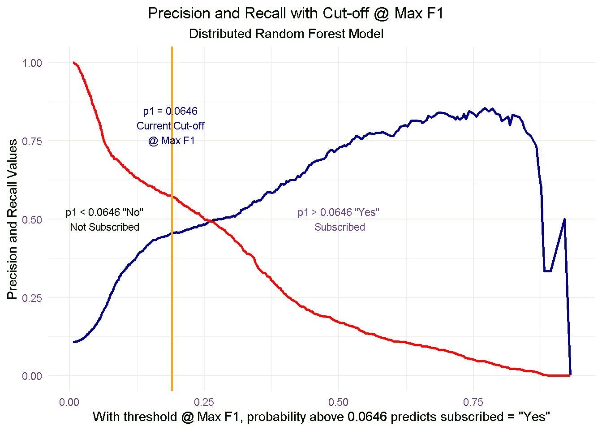
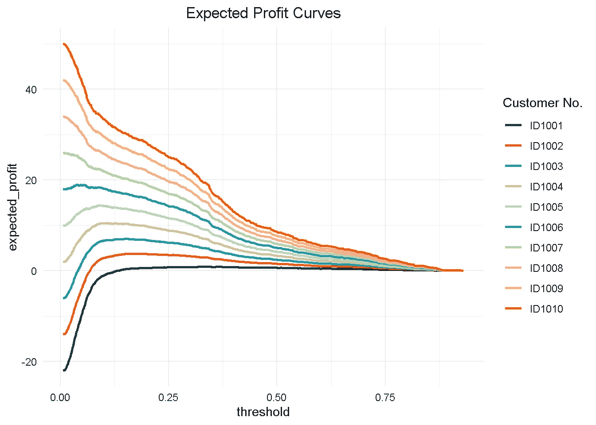
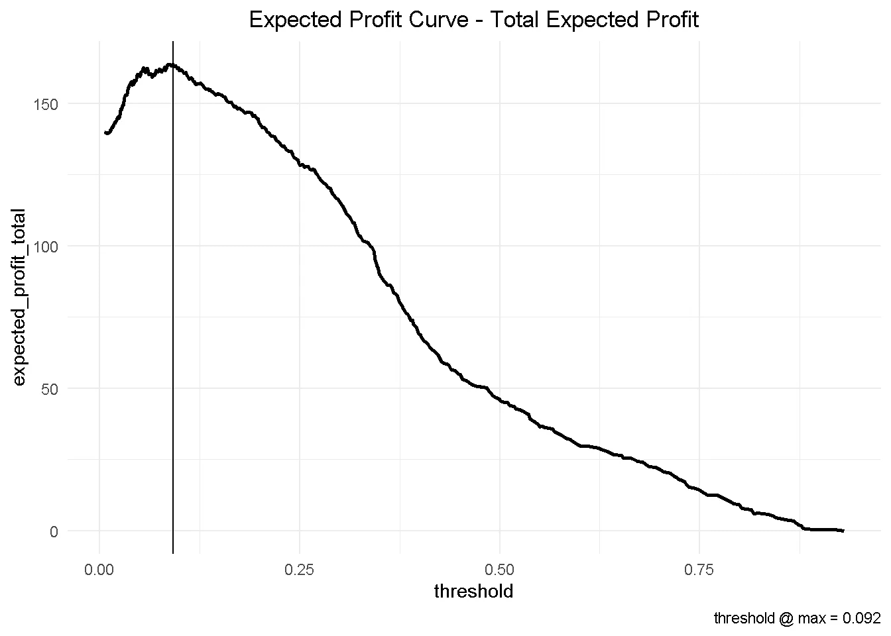

# 利用预期价值框架优化利润

> 原文：<https://medium.datadriveninvestor.com/optimise-profit-with-the-expected-value-framework-7378ead9089e?source=collection_archive---------2----------------------->

或者不坚持默认阈值@ Max F1 有多重要


Photo by [David Sury](https://unsplash.com/@suricattaontheway) on [Unsplash](https://unsplash.com/@dmey503?utm_source=unsplash&utm_medium=referral&utm_content=creditCopyText)

> 在这篇文章中，我采用了一个随机森林模型，并运行了一个多客户利润优化模型，该模型揭示了一个潜在的额外预期利润，即每个客户有近 1.7%的额外利润。

此外，我介绍了关键概念，如**截止值和 F1 分数**以及**精确回忆权衡**，并展示了**不坚持许多机器学习建模平台默认选择的阈值@ Max F1** 的重要性。

# 概观

在当今时代，利用数据了解客户行为驱动因素的企业拥有真正的竞争优势。通过有效地分析客户层面的数据，组织可以显著提高其在市场中的表现，并将精力集中在那些更有可能参与的客户身上。

梳理这种洞察力的一种经过试验和测试的方法是 [**倾向建模**](https://en.wikipedia.org/wiki/Predictive_modelling) ，它结合了**客户的人口统计数据**(年龄、种族、宗教、性别、家庭规模、种族、收入、教育水平)**心理图**(社会阶层、生活方式和性格特征)**参与度**(打开的电子邮件、点击的电子邮件、移动应用上的搜索、网页停留时间等)。)、**用户体验**(客户服务电话和电子邮件等待时间、退款次数、平均运送时间)**用户行为**(不同时间尺度上的购买价值、最近一次购买后的天数、报价和转换之间的时间等)。)来估计某个客户档案执行某类行为(例如购买产品)的可能性。

[](https://www.datadriveninvestor.com/2020/02/19/five-data-science-and-machine-learning-trends-that-will-define-job-prospects-in-2020/) [## 将定义 2020 年就业前景的五大数据科学和机器学习趋势|数据驱动…

### 数据科学和 ML 是 2019 年最受关注的趋势之一，毫无疑问，它们将继续发展…

www.datadriveninvestor.com](https://www.datadriveninvestor.com/2020/02/19/five-data-science-and-machine-learning-trends-that-will-define-job-prospects-in-2020/) 

一旦你了解了某个客户*与你的品牌*、*互动、购买产品*或*注册服务*的可能性，你就可以利用这些信息创造情景，无论是最小化**营销支出**，最大化**收购目标**，还是优化**电子邮件发送频率**或**折扣深度**。

# 优化预期利润

在我开始之前，有几个**内务任务**需要“设置工作场景”,还有几个**重要概念**需要介绍:

*   **阈值和 F1 分数**
*   **精确和召回**以及它们的**权衡**

# 一些家务

首先，这是我分析所需的库

```
library(tidyverse)
library(h2o)
library(skimr)
library(knitr)
```

然后，我加载在[探索性分析](https://diegousai.io/2020/01/propensity-modelling-data-preparation/)结束时保存的清理后的数据

```
# Loading clensed data
data_final <- 
readRDS(file = "https://raw.githubusercontent.com/DiegoUsaiUK/Propensity_Modelling/master/01_data/data_final.rds")
```

由此，我用`rsample`创建了一个随机的训练和验证集，并将它们保存为`train_tbl`和`test_tbl`。

```
set.seed(seed = 1975) train_test_split <-
  rsample::initial_split(
    data = data_final,     
    prop = 0.80   
  ) train_tbl <- train_test_split %>% rsample::training() 
test_tbl  <- train_test_split %>% rsample::testing()
```

我还需要启动一个 **h2o 集群**，关闭进度条并加载最终的随机森林模型

```
# initialize h2o session and switch off progress bar
h2o.no_progress() 
h2o.init(max_mem_size = "16G") ## H2O is not running yet, starting it now...
## 
## Note:  In case of errors look at the following log files:
##     C:\Users\LENOVO\AppData\Local   \Temp\RtmpkRk5j9/h2o_LENOVO_started_from_r.out
##     C:\Users\LENOVO\AppData\Local\Temp\RtmpkRk5j9/h2o_LENOVO_started_from_r.err
## 
## 
## Starting H2O JVM and connecting:  Connection successful!
## 
## R is connected to the H2O cluster: 
##     H2O cluster uptime:         3 seconds 172 milliseconds 
##     H2O cluster timezone:       Europe/Berlin 
##     H2O data parsing timezone:  UTC 
##     H2O cluster version:        3.28.0.4 
##     H2O cluster version age:    2 months and 4 days  
##     H2O cluster name:           H2O_started_from_R_LENOVO_frm928 
##     H2O cluster total nodes:    1 
##     H2O cluster total memory:   14.21 GB 
##     H2O cluster total cores:    4 
##     H2O cluster allowed cores:  4 
##     H2O cluster healthy:        TRUE 
##     H2O Connection ip:          localhost 
##     H2O Connection port:        54321 
##     H2O Connection proxy:       NA 
##     H2O Internal Security:      FALSE 
##     H2O API Extensions:         Amazon S3, Algos, AutoML, Core V3, TargetEncoder, Core V4 
##     R Version:                  R version 3.6.3 (2020-02-29)drf_final <- 
   h2o.loadModel(path = "https://raw.githubusercontent.com
                        /DiegoUsaiUK/Propensity_Modelling/
                         master/03_models/drf_grid_final_model_1")
```

要了解我是如何得到这个特别的模型的，你可以参考我网页上的这篇文章

# 阈值和 F1 分数

该模型试图回答的问题是"*该客户是否在直接营销活动后注册了定期存款？*”而截止值(也称为阈值)是将模型预测分为`Yes`和`No`的值。

为了说明这一点，我首先通过将`test_tbl`数据集传递给`h2o.performance`函数来计算一些预测。

```
perf_drf_final <- 
     h2o.performance(drf_final, newdata = test_tbl %>% as.h2o()) 
perf_drf_final@metrics$max_criteria_and_metric_scores## Maximum Metrics: Maximum metrics at their respective thresholds
##                         metric threshold       value idx
## 1                       max f1  0.189521    0.508408 216
## 2                       max f2  0.108236    0.560213 263
## 3                 max f0point5  0.342855    0.507884 143
## 4                 max accuracy  0.483760    0.903848  87
## 5                max precision  0.770798    0.854167  22
## 6                   max recall  0.006315    1.000000 399
## 7              max specificity  0.930294    0.999864   0
## 8             max absolute_mcc  0.189521    0.444547 216
## 9   max min_per_class_accuracy  0.071639    0.721231 300
## 10 max mean_per_class_accuracy  0.108236    0.755047 263
## 11                     max tns  0.930294 7342.000000   0
## 12                     max fns  0.930294  894.000000   0
## 13                     max fps  0.006315 7343.000000 399
## 14                     max tps  0.006315  894.000000 399
## 15                     max tnr  0.930294    0.999864   0
## 16                     max fnr  0.930294    1.000000   0
## 17                     max fpr  0.006315    1.000000 399
## 18                     max tpr  0.006315    1.000000 399
```

与许多其他机器学习建模平台一样， **h2o** 使用与最大 [F1 分数](https://en.wikipedia.org/wiki/F1_score)相关联的阈值，它只不过是精确度和召回率之间的加权平均值。在这种情况下，最大 F1 的阈值为 **0.190** 。

现在，我使用`h2o.predict`函数通过测试集进行预测。预测输出有三列:实际模型预测(`predict`)和与该预测相关的概率(`p0`和`p1`，分别对应于`No`和`Yes`)。如您所见，与当前截止相关的`p1`概率大约为 **0.0646** 。

```
drf_predict <- 
     h2o.predict(drf_final, newdata = test_tbl %>% as.h2o()) 
# I converte to a tibble for ease of use
as_tibble(drf_predict) %>%
  arrange(p0) %>% 
  slice(3088:3093) %>%
  kable()predict      p0            p1 
   1     0.9352865     0.0647135 
   1     0.9352865     0.0647135 
   1     0.9352865     0.0647135 
   0     0.9354453     0.0645547 
   0     0.9354453     0.0645547 
   0     0.9354453     0.0645547
```

然而， *F1 分数*只是识别截止值的一种方式。根据我们的目标，我们也可以决定使用一个阈值，例如，最大化精度或召回率。在商业设置中，预先选择的阈值@ Max F1 不一定是最佳选择:输入**精度并调用**！

# 精确度和召回率

**Precision** 显示模型对误报的敏感程度(即预测客户正在*订购*，而他/她实际上没有订购】,而 **Recall** 查看模型对误报的敏感程度(即预测客户没有订购*而他/她实际上将要订购*)。

这些指标**与商业环境**非常相关，因为组织对准确预测哪些客户真正有可能`subscribe` **(高精度)**特别感兴趣，以便他们可以针对这些客户制定广告策略和其他激励措施。同时，他们希望尽量减少对被错误归类为`subscribing` **(高召回)**的客户的努力，这些客户反而不太可能注册。

然而，从下面的图表中可以看出，当精度变高时，召回率变低，反之亦然。这通常被称为**精确-召回权衡**。

```
perf_drf_final %>%
    h2o.metric() %>%
    as_tibble() %>% ggplot(aes(x = threshold)) +
    geom_line(aes(y = precision), colour = "darkblue", size = 1) +
    geom_line(aes(y = recall), colour = "red", size = 1) +
    geom_vline(xintercept = 
         h2o.find_threshold_by_max_metric(perf_drf_final, "f1")) +
    theme_minimal() +
    labs(
         title    = 'Precision and Recall with Cut-off @ Max F1',
         subtitle = 'Distributed Random Forest Model',
         x        = 'With threshold @ Max F1, probability above
                      0.0646 predicts subscribed = "Yes"',
         y        = 'Precision and Recall Values'
         ) +
    theme(plot.title    = element_text(hjust = 0.4),
          plot.subtitle = element_text(hjust = 0.4)) +

  # p < 0.0646
   annotate("text", 
            x      = 0.065, 
            y      = 0.50, 
            size   = 3, 
            colour = "darkgreen", 
            label  = 'p1 < 0.0646 "No"\nNot Subscribed') +

  # p = 0.0646
   geom_vline(xintercept = 0.190, 
              size       = 0.8, 
              colour     = "orange") +
   annotate("text", 
            x      = 0.19, 
            y      = 0.80, 
            size   = 3, 
            colour = "darkblue",
            label  = 'p1 = 0.0646 \nCurrent Cut-off \n@ Max F1') +

  # p> 0.0646
   annotate("text", 
            x      = 0.5, 
            y      = 0.50, 
            size   = 3, 
            colour = "purple",
            label  = 'p1 > 0.0646 "Yes"\n Subscribed')
```



为了充分理解这种动态及其含义，让我们先来看看**截止零点**和**截止一点**，然后看看当您开始在两个位置之间移动阈值时会发生什么:

*   在**阈值为零** ( *最低精度，最高召回*)时，模型将每个客户分类为`subscribed = Yes`。在这种情况下，你会**通过直接营销活动联系每一个客户**，但也会浪费宝贵的资源，包括那些不太可能订阅的客户。很明显，这不是一个最佳策略，因为你会招致更高的总体采购成本
*   相反，在**阈值一** ( *最高精度，最低召回*)模型告诉你没有人可能订阅，所以你应该**不联系任何人**。这将为你节省大量的营销成本，但如果你通过直接营销将定期存款通知了那些已经订阅的客户，你将错过他们带来的额外收入。同样，这不是一个最优策略

当移动到一个更高的阈值时，该模型对它归类为`subscribed = Yes`的人变得更加“挑剔”。因此，你在联系谁的问题上变得更加保守(**精确度更高**)并降低了你的采购成本，但同时你也增加了你接触不到潜在订户的机会(**召回率更低**)，错过了潜在的收入。

这里的关键问题是**你停在哪里？是否存在“最佳点”,如果有，你如何找到它？嗯，那完全取决于你想达到的目标。在下一部分，我将运行一个小优化，目标是**最大化利润**。**

# 寻找最佳阈值

对于这个小优化，我正在实施一个**简单的利润最大化**基于与获取新客户相关的一般成本和从所述获取中获得的利益。这可以发展到包括更复杂的场景，但这超出了本练习的范围。

为了理解使用哪个临界值是最佳的，我们需要模拟与每个临界点相关的成本效益。这是一个源自**期望值框架**的概念，参见 [*商业数据科学*](https://www.goodreads.com/book/show/17912916-data-science-for-business)

为此，我需要两件东西:

*   **每个阈值的预期比率** —这些可以从混淆矩阵中检索
*   **每位客户的成本/收益** —我需要根据假设进行模拟

# 预期利率

使用`h2o.metric`可以方便地检索所有分界点的预期利率。

```
# Get expected rates by cutoff
expected_rates <- 
    h2o.metric(perf_drf_final) %>%
    as.tibble() %>%
    select(threshold, tpr, fpr, fnr, tnr)expected_rates## # A tibble: 400 x 5
##    threshold     tpr      fpr   fnr   tnr
##        <dbl>   <dbl>    <dbl> <dbl> <dbl>
##  1     0.930 0       0.000136 1     1.00 
##  2     0.919 0.00112 0.000136 0.999 1.00 
##  3     0.893 0.00112 0.000272 0.999 1.00 
##  4     0.882 0.00224 0.000545 0.998 0.999
##  5     0.879 0.00336 0.000545 0.997 0.999
##  6     0.876 0.00671 0.000545 0.993 0.999
##  7     0.873 0.00783 0.000545 0.992 0.999
##  8     0.867 0.0123  0.000545 0.988 0.999
##  9     0.857 0.0145  0.000545 0.985 0.999
## 10     0.849 0.0157  0.000545 0.984 0.999
## # ... with 390 more rows
```

# 成本/收益信息

成本效益矩阵是对四个潜在结果的成本和效益的商业评估。为了创建这样一个矩阵，我必须对一个组织在开展**以广告为导向的采购活动**时应该考虑的**费用和优势**做出一些假设。

让我们假设每名客户出售定期存款的**成本为 **30 英镑。这包括执行直接营销活动(培训呼叫中心代表，为主动呼叫留出时间，等等。)和激励措施，如为另一种金融产品提供折扣，或加入提供福利和津贴的会员计划。一个银行组织在两种情况下会产生这种成本:当他们正确预测到一个客户会订阅时(**真阳性**，TP)，以及当他们错误预测到一个客户会订阅时(**假阳性**，FP)。****

我们还假设向现有客户出售定期存款的**收入是每个客户**80**。当模型预测客户会订阅并且他们确实订阅时，组织将保证这一收入流(**真正**，TP)。**

最后，还有**真否定** (TN)场景，我们正确预测客户不会订阅。在这种情况下，我们不会花任何钱，但也不会获得任何收入。

以下是场景的快速回顾:

*   **真正** (TP) — predict 会订阅，他们确实这么做了:COST:-30；第 80 版
*   **误报** (FP) — predict 会订阅，而实际不会:COST:-30；版本 0
*   **真阴性** (TN) — predict 不会订阅，他们实际上也没有:COST:0；版本 0
*   **假阴性** (FN) — predict 不会订阅，但他们确实订阅了:COST:0；版本 0

我创建了一个函数，使用*阳性案例* (p1)的概率以及与*真阳性* (cb_tp)和*假阳性* (cb_fp)相关的成本/收益来计算预期利润。这里不需要包括*真阴性*或*假阴性*，因为它们都是零。

我还包括之前创建的 **expected_rates** 数据帧，其中包含每个阈值的预期速率(400 个阈值，范围从 0 到 1)。

```
# Function to calculate expected profit
expected_profit_func <- function(p1, cb_tp, cb_fp) {

    tibble(
        p1    = p1,
        cb_tp = cb_tp,
        cb_fp = cb_fp
        ) %>%

        # add expected rates
        mutate(expected_rates = list(expected_rates)) %>%
               unnest() %>%

        # calculate the expected profit
        mutate(
            expected_profit =   p1    * (tpr * cb_tp) + 
                             (1 - p1) * (fpr * cb_fp)
        ) %>%
        select(threshold, expected_profit)
}
```

# 多客户优化

现在为了理解多客户动态是如何工作的，我创建了一个**假设的 10 个客户群**来测试我的功能。这是一个**简化的**视图，因为我将**相同的成本和收入结构应用于所有客户**，但是成本/收益框架可以针对单个客户进行定制，以反映他们单独的产品和服务水平设置，并且可以轻松调整流程，以针对不同的 KPI 进行优化(如*净利润*、 *CLV* 、*订阅数量*等)。)

```
# Ten Hypothetical Customers 
ten_cust <- tribble(
    ~"cust",   ~"p1",  ~"cb_tp",  ~"cb_fp",
    'ID1001',   0.1,    80 - 30,     -30,
    'ID1002',   0.2,    80 - 30,     -30,
    'ID1003',   0.3,    80 - 30,     -30,
    'ID1004',   0.4,    80 - 30,     -30,
    'ID1005',   0.5,    80 - 30,     -30,
    'ID1006',   0.6,    80 - 30,     -30,
    'ID1007',   0.7,    80 - 30,     -30,
    'ID1008',   0.8,    80 - 30,     -30,
    'ID1009',   0.9,    80 - 30,     -30,
    'ID1010',   1.0,    80 - 30,     -30
)
```

我使用`purrr`将`expected_profit_func()`映射到每个客户，通过阈值返回每个客户的预期利润的数据框架。这个操作创建了一个嵌套 tibble，我必须通过`unnest()`将数据帧扩展到一个级别。

```
# calculate expected profit for each at each threshold
expected_profit_ten_cust <- 
  ten_cust %>%
      # pmap to map expected_profit_func() to each item
    mutate(expected_profit = pmap(.l = list(p1, cb_tp, cb_fp), 
                                  .f = expected_profit_func)) %>%
    unnest() %>%
    select(cust, p1, threshold, expected_profit)
```

然后，我可以想象每个客户的预期利润曲线。

```
# Visualising Expected Profit 
expected_profit_ten_cust %>%
    ggplot(aes(threshold, 
               expected_profit, 
               colour = factor(cust)), 
               group  = cust) +
    geom_line(size = 1) +
    theme_minimal()  +
    tidyquant::scale_color_tq() +
    labs(title  = "Expected Profit Curves",
         colour = "Customer No." ) +
    theme(plot.title = element_text(hjust = 0.5))
```



最后，我可以合计预期利润，可视化最终曲线，并突出显示最佳阈值。

```
# Aggregate expected profit by threshold 
total_expected_profit_ten_cust <- 
  expected_profit_ten_cust %>%
    group_by(threshold) %>%
    summarise(expected_profit_total = sum(expected_profit)) # Get maximum optimal threshold 
max_expected_profit <- 
  total_expected_profit_ten_cust %>%
    filter(expected_profit_total == max(expected_profit_total))# Visualize the total expected profit curve
total_expected_profit_ten_cust %>%
    ggplot(aes(threshold, 
               expected_profit_total)) +
    geom_line(size = 1) +
    geom_vline(xintercept = max_expected_profit$threshold) +
    theme_minimal() +
    labs(title = "Expected Profit Curve - Total Expected Profit",
         caption  = paste0('threshold @ max = ', 
                          max_expected_profit$threshold %>% 
                            round(3))) +
    theme(plot.title = element_text(hjust = 0.5))
```



这有一些重要的商业含义。基于我们假设的 10 个客户群，选择优化的阈值`0.092`将产生近 **164** 的总利润，相比之下，与自动选择的截止点`0.190`相关联的近 **147** 。

这将导致每位客户的预期利润增加**近 1.7**。假设我们有大约 **500，000** 的客户群，转换到优化型号可以产生额外的**850，000**的预期利润！

```
total_expected_profit_ten_cust %>% 
  slice(184, 121) %>%
  round(3) %>%
  mutate(diff = expected_profit_total -  
             lag(expected_profit_total))## # A tibble: 2 x 3
##   threshold    expected_profit_total    diff
##       <dbl>                    <dbl>   <dbl>
## 1     0.19                      147\.     NA  
## 2     0.092                     164\.    16.9
```

显而易见，根据企业的规模，潜在利润增长的幅度可能是显著的。

# 结束语

在这篇文章中，我采用了**一个随机森林模型**，它结合了探索性分析的结果和模型选择的洞察力，并实现了一个**多客户利润优化**，揭示了每个客户将近 1.7**的潜在额外预期利润(或者 **85 万**，如果你有 50 万客户群的话)。**

此外，我介绍了一些关键概念，如**阈值和 F1 分数**以及**精确回忆权衡**，并解释了为什么决定哪个截止值为是非常重要。

> 在探索、清理和格式化数据、拟合和比较多个模型并选择最佳模型之后，坚持使用默认阈值@ Max F1 将会是**达不到最终的“那又怎样？”这使得所有的努力都变成了预期的**。

最后一件事:完成后不要忘记关闭 h2o 实例！

```
h2o.shutdown(prompt = FALSE)
```

# 读者注意

我在本文中使用的*随机森林模型*结合了探索性分析的结果和模型评估和选择的洞察力。

如果你有兴趣看看我是如何得出我用来准备分析数据的结果的，你可以参考我网页上的这篇文章 [*(数据准备和探索性数据分析*](https://diegousai.io/2020/01/propensity-modelling-data-preparation/) *)* 。

为了更好地理解导致选择最终模型的决策过程，您可以参考我网页上的这篇文章 [*(使用模型不可知的方法估计几个模型并比较它们的性能*](https://diegousai.io/2020/02/propensity-modelling-estimate-compare-models/) *)* 。

# 代码库

完整的 R 代码和所有相关文件可以在我的 GitHub profile @ [**倾向建模**](https://github.com/DiegoUsaiUK/Propensity_Modelling) 中找到

# 参考

*   原始论文使用的数据集见: [**一种数据驱动的方法来预测银行电话营销的成功。决策支持系统**](http://repositorium.sdum.uminho.pt/bitstream/1822/30994/1/dss-v3.pdf) ，S. Moro，P. Cortez 和 P. Rita。
*   有关销售预测和产品延期交货优化的高级教程，请参见 Matt Dancho 的 [**预测销售分析:使用机器学习来预测和优化产品延期交货**](https://www.business-science.io/business/2017/10/16/sales_backorder_prediction.html)
*   **期望值框架**见: [*商业数据科学*](https://www.goodreads.com/book/show/17912916-data-science-for-business)

*原载于 2020 年 3 月 20 日*[*https://diegousai . io*](https://diegousai.io/2020/03/propensity-modelling-profit-optimisation/)*。*