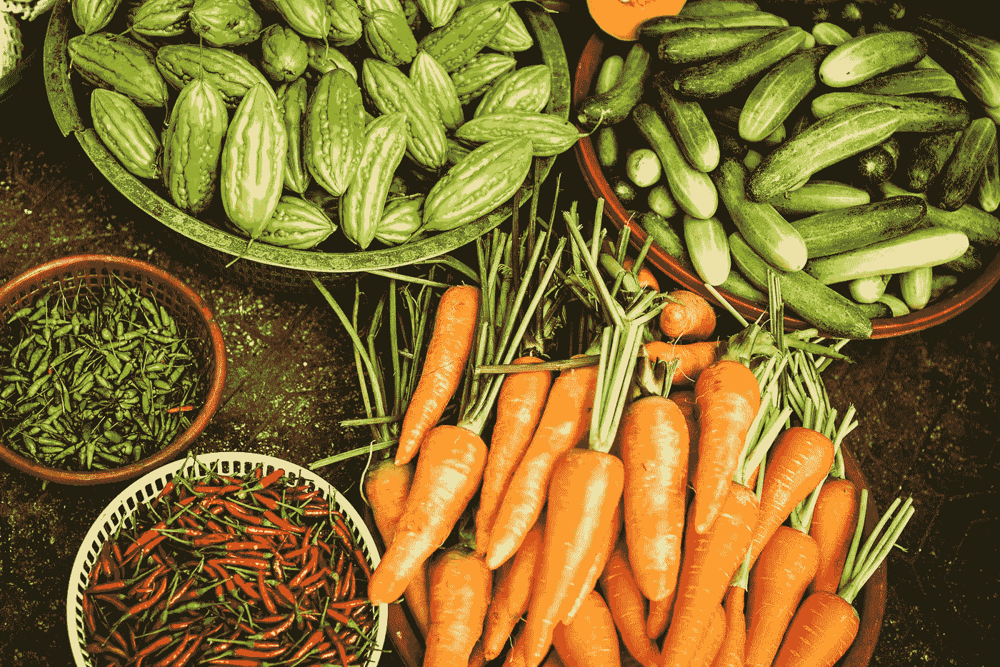

# 健康:今天通过间歇禁食来优化你的健康

> 原文：<https://medium.datadriveninvestor.com/optimize-your-health-today-through-intermittent-fasting-1bbb53190ac7?source=collection_archive---------12----------------------->

Picture By Megan Thomas From Unsplash

## 所以，现在是最大化你健康的时候了。那么，我们该怎么做呢？我们想最大化你的胰岛素。这意味着你一天中吃的所有东西都与你的活跃程度有关。

如果你有一个非常活跃的一天，那么在最重要的活动、运动、会议等周围吃饭。我们想确定。你的身体会消耗掉营养。

**运动前或运动后吃最丰盛的一餐**

例如，如果你要像上面的例子那样锻炼，比如说星期五你下班后做力量训练。然后吃你锻炼前后最重要的一餐。你的胰岛素调节血糖。为了有效利用所有的意大利面、比萨饼、巧克力，最好的策略是在你最重要的能量输出附近吃碳水化合物。

**提示:**早上先吃脂肪(鳄梨、橄榄油、坚果、黑巧克力)，一天中最后吃碳水化合物(意大利面、披萨、红薯、藜麦等)。)

> 当我每天早上锻炼的时候，我会在吃“高脂肪早餐”前 1 到 1.5 个小时离开(比如含有鳄梨、蛋白粉、椰奶、奇亚籽和菠菜的奶昔)。

你会睡得更好，也更有利于你的恢复和胰岛素。

**短暂的禁食周期净化你的身体:**倾听你的身体是第一要务。身体每天/尤其是晚上都经历着一个清洁的过程。这是一个必不可少的因素，我们需要在这个过程中帮助我们的身体。因此，我们将实行一种 12 到 16 小时的禁食。

 [## 健康品牌源于定位|数据驱动的投资者

### 品牌定位是 Phemelo Segoe 的激情之一。她是一名企业家、健康教练和米尔部落的创始人…

www.datadriveninvestor.com](https://www.datadriveninvestor.com/2019/01/11/healthy-brands-grow-from-positioning/) 

不要害怕。你几乎每天都做这个。这意味着你仍然可以吃晚餐或早餐。意思是在特定的窗口，你不会吃任何东西。

**间歇性禁食:**假设你晚上 11 点睡觉。你的最后一餐是在晚上 8 点至 9 点

> 注意:你的睡眠质量与你睡前多晚吃饭有关。我见过的最好的效果是睡前 3 小时左右停下来。

直到第二天，直到 9.00，理想情况下，直到 12.00 或下午 1.00(建议并遵循你的昼夜节律)，你不会吃任何东西。

如果你是一个早起的人，你可以把早餐推到办公室吃，或者在一天中早点停止吃。假设你想在上午 10 点吃早餐，那么你会一直吃到下午 6 点，从下午 6 点开始，你会吃任何东西，直到第二天上午 9 点。

# 有不同的间歇禁食周期

选项 1:16/8——你禁食 16 小时，只吃 8 小时

选项 2:18/6——你禁食 18 小时，只吃 6 小时

选项 3:12-14/12——你禁食 12-14 小时，进食 12 小时

也可以从少开始，比如禁食 6 小时，进食 18 小时，慢慢找到自己理想的中间。当你是女性时，听从你的身体，除非你觉得有益，否则不要进行额外长时间的禁食。

**清洁和排毒:**遵循这个方法有助于你的身体清理房间、肠道中的残羹剩饭、血液中漂浮的旧蛋白质、训练中受损的组织。当你不让身体停止进食时，它不得不持续工作，没有时间恢复活力和进入“抗衰老”过程。

禁食是衰老和抵抗癌症、老年痴呆症、漏肠综合征等疾病的最佳方法。通过这种方式，如果你过去有皮肤、消化或仅仅是虚弱无力的问题，你可以确信，通过这个简单的免费建议，你会很快恢复健康。

# 每天吃一大份绿色健康沙拉

多吃蔬菜对健康有很多好处。首先，我们肠道中的第二个大脑或你的消化系统。如果饭后持续感到腹胀，就观察自己吃了什么。更重要的是，你的胃需要所有有益的细菌来喂养，并创造一个健康和强健的肠道菌群。

> “最快的方法是用一大份绿色沙拉和健康脂肪，如橄榄油、鳄梨、沙丁鱼。”—菲特巴德

> 我每天的第一餐是沙拉；一份健康的沙拉包括菠菜、青菜、辣椒粉、鳄梨、一把坚果、蓝莓、五大勺初榨橄榄油、一两勺 MCT 油、一勺奇亚籽、一片姜。

把它们混合在一起，尝起来很美味。我对绿色食品略有不同，但是鳄梨、蓝莓、坚果和橄榄油我经常吃，除非我注意到不耐受。

# 获得最大的回报

当你每天吃一大份绿色沙拉时，你的健康会大大改善。很多箱子只要吃一个大沙拉就会被检查。所有的维生素、矿物质、健康脂肪和抗氧化剂都将供应给身体。这比补充压缩的多种维生素要好得多。

生活可以变得如此简单，这是令人惊讶的，通过保持一致并给予身体它所需要的东西——通过倾听它——你的生活质量就会提高。

> T2:这很简单，只要做好工作就行了

你将解决缺乏的问题，这样身体就能获得合适的矿物质和维生素。通过在这个过程中包括间歇性禁食，你将确保你的身体能够处理来自食物、环境的毒素积累，并将其清除。

最后，在锻炼过程中吃一顿大餐，或者吃一块巧克力之类的零食，可以极大地有益于你的健康和整体幸福，因为所有的卡路里都被利用了。