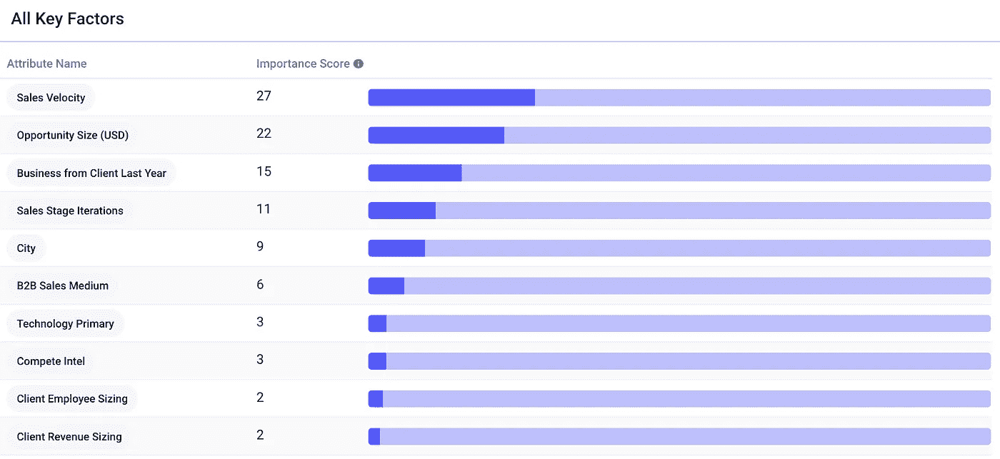
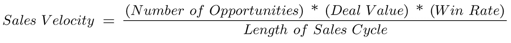
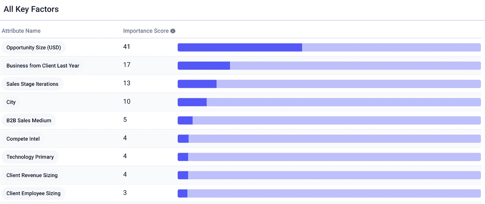
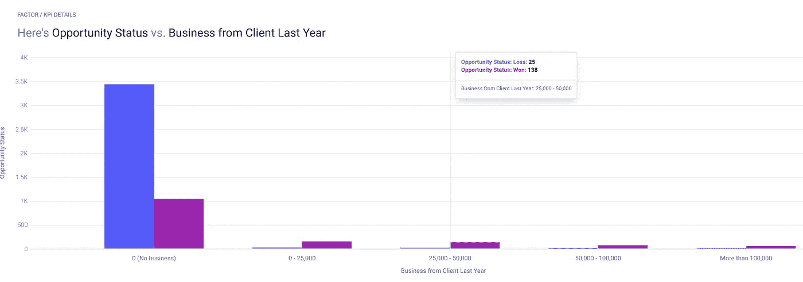
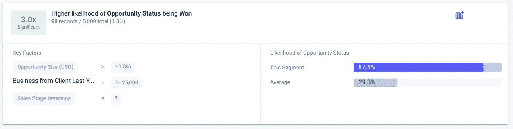

# 通过发现销售数据中的洞察力优化转化率

> 原文：<https://medium.datadriveninvestor.com/optimizing-conversions-by-finding-insights-in-sales-data-e018933cee57?source=collection_archive---------8----------------------->

## AI 代表 CRO。

Photo by [Felix Mittermeier](https://unsplash.com/@felix_mittermeier?utm_source=medium&utm_medium=referral) on [Unsplash](https://unsplash.com?utm_source=medium&utm_medium=referral)

有效地将销售线索转化为客户是一场永无止境的斗争。*转化*可以指在登录页面上获得访问者的注册，从社交媒体帖子获得链接点击，或者一百万个其他想要的动作。

很多事情会阻碍转换，比如填写表格时的摩擦，一个不美观的登录页面，缺乏证明，或者仅仅是一个令人倒胃口的提议。在本文中，我们将使用 [Apteo](http://apteo.co) 的预测洞察功能来优化 SaaS 销售[数据集](https://www.kaggle.com/gauravduttakiit/sales-pipeline-conversion-at-a-saas-startup)的转化率。

# 数据

数据集是一个包含 78，000 行销售数据的 Excel 表，其中每一行都是一个销售机会，具有城市、销售媒介、销售速度、机会大小和客户收入等属性。

我们可以将 Excel 表原样上传到 Apteo 进行分析。在下面，我们可以看到我们想要优化的列— Opportunity Status —它告诉我们 Opportunity 是赢了还是输了。

# 寻找洞见

通过告诉 Apteo“机会状态”是我们的 KPI，它会在后台自动创建发现洞察的机器学习模型。我们可以看到“销售速度”是最重要的属性。

举个例子，销售速度是指销售线索在渠道中流动和赚钱的速度。构成销售速度的四个因素是:机会的数量、交易价值、成功率和销售周期的长度。

我们以特斯拉为例。

在 [Q2](https://ir.tesla.com/static-files/f41f4254-f1cc-4929-a0b6-6623b00475a6) 2020 年，特斯拉交付了 90891 辆汽车，平均每月 30297 辆。这已经是机会数量和成功率的乘积(例如，机会数量可能是 60K，成功率可能是 50%)。

 [## 一瞬间学会数据科学！？数据驱动的投资者

### 在我之前的职业生涯中，我是一名训练有素的古典钢琴家。还记得那些声称你可以…

www.datadriveninvestor.com](https://www.datadriveninvestor.com/2020/07/23/learn-data-science-in-a-flash/) 

我们还知道，他们的季度收入为 60.36 亿美元，即每月 20.12 亿美元。现在，我们可以找到交易价值:20 亿美元/3 万美元= 66，409 美元。

典型的销售周期大约是 3 个月，但大多数特斯拉销售都是在网上进行的…我们谈论的是特斯拉，所以我们估计 2 个月的销售周期。这意味着**特斯拉的销售速度约为每月 33，204 美元**。

这意味着特斯拉预计每月将从产生的机会中获得 33，204 美元。这可以通过获得更多线索、销售更贵的汽车(或更多附加产品)或更好地成交(更快的交易或更高的成交百分比)来增加。

## 改进我们的模型

你可能已经意识到这不是很有帮助。*当然*销售速度决定输赢状态:销售速度包含胜率。因此，为了找到有意义的见解，我们需要去掉销售速度。

这非常简单，我们只需取消选择销售速度列，然后重新运行预测洞察功能。现在，我们可以清楚地看到，机会大小是我们最重要的属性，其次是我们是否有来自该客户的业务、销售阶段、城市以及其他。

特别是，更大的机会往往与成功更相关。请记住，这是一个合成数据集，根据您的具体产品和行业，您可能会看到完全不同的见解。在此数据集的情况下，关注更大的机会规模是有意义的。

我们还可以看到，之前是否与客户有业务往来也有很大影响。由于没有以前的业务，大多数机会都失去了。对于任何金额的业务，都赢得了大多数机会，尤其是在 25，000-50，000 美元的范围内。

我们还可以看到属性的组合如何独特地影响赢或输的概率。例如，超过约 10K 美元的交易，至少有一些过去的业务，以及 3 个或更多销售阶段迭代，比一般交易赢得的可能性大三倍*。*

**

*对于任何新的销售线索，我们还可以插入其属性来预测成功或失败的概率，从而实现数据驱动的销售线索优先级排序和营销策略优化。数据越多越好，但不需要“大数据”就能入门。*

*总之，分析销售数据是优化转化率的一个强有力的方法。我们可以深入了解影响转化率的每一个因素，然后相应地指导和优化资源。*

***访问专家视图—** [**订阅 DDI 英特尔**](https://datadriveninvestor.com/ddi-intel)*