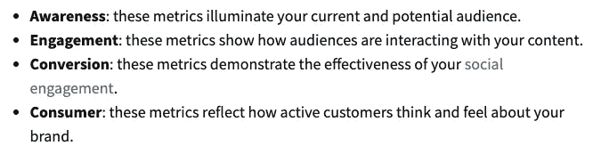

# 优化让你的社交媒体档案闪闪发光

> 原文：<https://medium.datadriveninvestor.com/optimizing-makes-your-social-profile-sparkle-150e5f031adb?source=collection_archive---------17----------------------->

## 尽你所能吸引更多的人来你的公司

Photo by Chris on Unsplash

最理想的是，所有的社交媒体网站都应该被优化以吸引顾客和不断爬行的搜索引擎的眼球。吸引的眼球越多，搜索排名就越高。排名越高，吸引的目光越多。这是一个生活的社交圈。

[艾默·达菲](https://twitter.com/FITsocialmedia_)没有绕圈子，而是开门见山。社交媒体网站的所有方面都必须做好准备，吸引新的业务。

达菲是社交媒体顾问和培训师，也是 [FIT 社交媒体](http://www.fitsocialmedia.ie/)的创始人。通过这种方式，她帮助专业人士、企业主、组织和学生在短时间内获得更好的在线形象。

与数字营销专家 Madalyn Sklar 一起，Duffy 解释了为什么一个优化的网站会让企业家在吸引选择性消费者的目光方面领先一步。

 [## 让你的整个个人资料成为你最好的一面

### 你的社交媒体档案是你的名片——第一印象为持续的关系定下基调…

blog.markgrowth.com](https://blog.markgrowth.com/make-your-entire-profile-your-best-side-ddf7ae75307a) 

优化之路始于度量标准，并知道哪些是重要的跟踪指标。

社交媒体管理公司 [Hootsuite](https://twitter.com/Hootsuite) 的全球参与主管[尼克·马丁](https://twitter.com/AtNickMartin)说:“对你来说重要的指标将取决于你的目标。“你是在寻找知名度、参与度、转化率还是消费者情绪？从商业角度来看，一般可以从点击量、浏览量、关注者增长和参与度入手。

他说:“从你的个人页面，追踪诸如被提及次数、热门推文和转发次数等信息。”“你参与得越多，你在开始对话和与新朋友联系方面就做得越好。”

优化因社交媒体平台而异。例如，Twitter 就有特定的需求。

达菲说:“优化意味着用清晰相关的封面图片来突出你所提供的东西，从而完整地完成你的账户。”“您的个人资料图像可以是您的头像，也可以是徽标。

“你的生意或你的名字都在账户上，”她说。"你有一个相关的 Twitter 账号，不错的传记，销售漏斗链接，并给出你的位置."

# **聪明吸引聪明**

结果是揭示和诱人的。

“优化你的 Twitter 账户将帮助你脱颖而出，并最大限度地利用你在平台上的存在，”Sklar 说。“你应该聪明地建立自己的个人资料，这样你才能吸引到合适的人。

“我建议定期对你的账户进行审计——至少每季度一次——确保你的个人资料得到最充分的优化，”她说。

设置一个合适的封面形象对企业来说尤为重要。

达菲说:“你的推特封面形象是有价值的不动产，你应该在上面展示你是谁，你帮助了谁，你能为他们做些什么。”"使用文本覆盖和形状突出."

 [## 个人品牌:每个人都知道你的名字

### 无论在网上还是网下，你的个人品牌定义了你是谁。这是你的全貌。很少有人比…更清楚这一点

blog.markgrowth.com](https://blog.markgrowth.com/personal-brand-where-everyone-knows-your-name-4c2c9499d60a) 

借助 Canva T1 这样的软件，她可以创建大小为 1，500 像素 X 1，500 像素的图像，并向观众展示。

Sklar 说:“一张好的封面照片应该引人注目，这样当人们访问你的个人资料时，它就能抓住注意力。”“你也应该把它看作是你简历的一个延伸，来传达你的全部。

“例如，我的封面图片告诉人们，我是一个博客写手、播客和#TwitterSmarter 聊天的主持人，”她说。“它让人们知道我分享的内容会带来什么。”

个人资料图片的重要性几乎不言自明。

“这是人们首先看到的，”达菲说。“如果你是公司的形象代言人，你应该选择一张高质量的头像。如果使用标志，确保它是高质量的。无论您选择哪个，请确保它适合 400px X 400px 的配置文件图像。

“最好是展示一张清晰的大头照，”她说。“还是那句话，要看你的业务。”

# **脸上没有蛋**

越有个性越好。

“人们想看你的脸，而不是那个推特蛋，”Sklar 说。“这有助于他们觉得与你更有联系，并展示你的品牌。使用高质量的照片，人们可以清楚地看到你的脸。根据你的照片，我应该能认出你本人。

“如果不在你的预算之内，你就不需要雇佣专业摄影师，”她说。“用你的智能手机。你可以随时找朋友帮忙，或者用三脚架和自拍器拍出令人惊艳的照片。”

 [## 视频快照图片-完美的内容|数据驱动的投资者

### 提到“内容”，首先想到的是文字和图片。错过了一个…

www.datadriveninvestor.com](https://www.datadriveninvestor.com/2019/10/06/video-snaps-picture-perfect-content/) 

其他重要的配置文件元素包括帐户名和 Twitter 句柄。

达菲说:“你的 Twitter 账户名——50 个字符——应该与你的企业名称或你的姓名、网站域名和其他社交账户相匹配。”“你的 Twitter 账号——15 个字符——应该是一样的。如果您无法获得想要的确切句柄，请尝试使用下划线，比如我的下划线:FITsocialmedia_。

再多的聪明才智也无法克服一个无关紧要的把柄。

“如果它不能成为你的名字，那么选择与你的品牌或你所做的工作相关的东西，”Sklar 说。另一个重要的提示是考虑你的名字和账号的字符限制。确保它容易拼写，这样人们就可以毫不费力地找到你。

“对于你的帐户名称，你可以添加表情符号，并说不仅仅是你的名字，”她说。“例如，我的 Twitter 名字是这样写的:‘Madalyn Sklar——自 1996 年以来的数字营销。’你的 50 个字符可以走很长的路。"

# **打上行动号召的烙印**

理想的 Twitter 传记有几个要求。

“你有 160 个字符脱颖而出，给人留下良好的第一印象，”达菲说。

“要有正确的关键词，”她说。“突出你是谁，你帮助了谁，你做了什么，如果你有自己的品牌标签，添加进去，并号召行动。使用表情符号来吸引眼球。炫耀你的个性。”

根据 Sklar 的说法，理想的 Twitter 传记“传达你是谁，你做什么，你在这里为谁服务。清楚地陈述人们可以从你的内容中期待什么。给他们一个追随你的理由。”

传记只允许一个链接。用户必须明智。

达菲说:“让这个链接转到一个指定的网站页面或登录页面，并选择色彩鲜艳的行动号召按钮。”“这些链接提供给你的访客选择，点击并找到更多关于你、你的企业以及你如何帮助他们的信息。”

Sklar 说这个简介应该链接到一个主网站。

“在你 160 个字符的简历中，你可以用一个链接突出你目前想要关注的内容，”她说。“它可以展示你最新的博客文章或播客片段，也可以把人们引向你的销售线索磁铁。”

 [## 铅磁铁:吸引人的入门方式

### 要为您的企业获得销售线索，最简单的方法是将他们吸引到您身边，这就是销售线索磁铁发挥作用的地方…

blog.markgrowth.com](https://blog.markgrowth.com/lead-magnets-attractive-ways-to-get-your-foot-in-the-door-2005d8be6f96) 

# **世界上哪里……**

指定特定的地理位置可以根据需要而变化。

Sklar 说:“当谈到位置设置时，这真的取决于你应该宽泛还是具体。”“面对面的实体企业需要具体，这样人们才能找到它们。如果对你来说不是这样，你可能想要更广泛的隐私。

“然而，对于像我这样的个人品牌，你应该使用你的位置，这样你就可以在搜索中被找到，”她说。“许多年前，有人编制了一份休斯顿地区社交媒体营销人员的名单。最后在休斯顿排名№1。如果我没有列出我的城市呢？”

就像图片和句柄一样，位置应该是相关的。

达菲说:“如果你是在美国纽约或爱尔兰都柏林做生意，要具体说明。”。“如果您的企业有多个地址，请选择您所在的国家。如果你在许多国家工作，或者在任何地方工作，那么选择全球范围。”

 [## 有效的营销始于一条推文

### Twitter 应该是整个社交媒体战略的重要组成部分。一种策略应该无缝地与…

blog.markgrowth.com](https://blog.markgrowth.com/effective-marketing-starts-with-a-tweet-9fdde98d6d04) 

固定推文也算作个人资料的一部分。

“对于固定的推文，考虑你在 Twitter 上的目标，”Sklar 说。“你想达到什么目标，你的微博如何帮助实现这个目标？这是人们访问你的个人资料时看到的第一条推文。让它有价值。

“例如，如果你想要更多的订户，就让人们去关注你的潜在客户，”她说。“如果你想增加你网站的流量，像我一样用你的微博来推广你的新博客。你可以随时改变它，这取决于你的目标。”

新鲜感增强了火花。

“定期更新你的微博，”达菲说。“不要把一个留在那里好几年。这包括最新的新闻，一个新的博客，一个提议，如果你支持一个慈善机构等等。

“有一个相关的标签，一个简短的工作链接，一个好的图片或视频和表情符号，”她说。"如果可能的话，标记相关账户."

**关于作者**

吉姆·卡扎曼是[拉戈金融服务公司](http://largofinancialservices.com/)的经理，曾在空军和联邦政府的公共事务部门工作。你可以在[推特](https://twitter.com/JKatzaman)、[脸书](https://www.facebook.com/jim.katzaman)和 [LinkedIn](https://www.linkedin.com/in/jim-katzaman-33641b21/) 上和他联系。