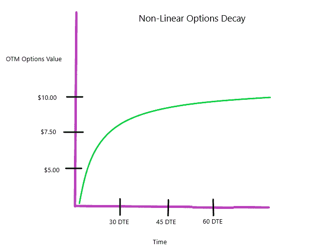
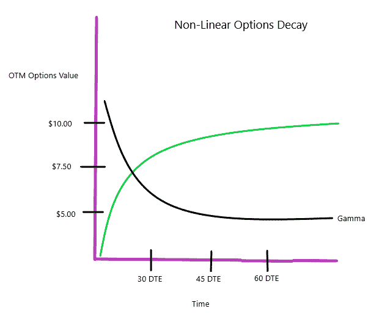
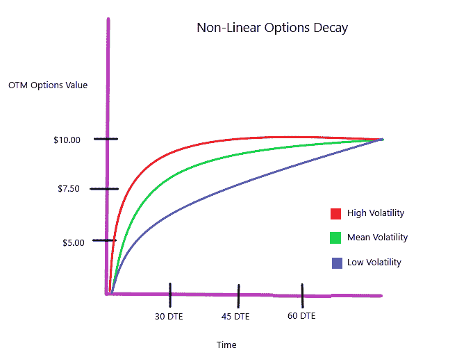
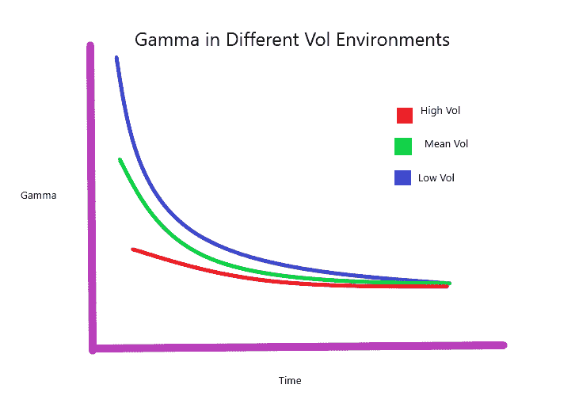

# 希腊超级书呆子的选择

> 原文：<https://medium.datadriveninvestor.com/option-greeks-super-nerd-out-1d07777b753c?source=collection_archive---------13----------------------->

Photo by [timJ](https://unsplash.com/@the_roaming_platypus?utm_source=unsplash&utm_medium=referral&utm_content=creditCopyText) on [Unsplash](https://unsplash.com/s/photos/interaction?utm_source=unsplash&utm_medium=referral&utm_content=creditCopyText)

当我第一次开始学习期权市场时，视觉化给了我很大的帮助。我这样做的目的是丰富你对希腊期权如何运作的心理模型。

 [## 影响者在聚光灯下表演|数据驱动的投资者

### 影响者营销是一个脱颖而出的游戏。结果是一个令人难忘的-和可信的-连接到一个产品或…

www.datadriveninvestor.com](https://www.datadriveninvestor.com/2020/01/15/influencers-perform-in-the-spotlight/) 

以下所有例子都适用于主要市场指数的轻微 OTM 期权，如 SPX。所有的图表最好从右到左阅读。

有 3 个因素会影响期权的价值。

*   时间
*   价格
*   波动性

**首先出场，时间**

希腊语:西塔

保持价格和波动性不变，这就是轻微 OTM 期权的衰减方式。在遥远的时间，衰减缓慢，但随着到期日的临近，衰减越来越快，直到期权的价值达到零。

**二、价格**

希腊语:伽玛

随着期权衰减加速，gamma(方向风险)也在加速。这意味着期权越接近到期，它对潜在市场的变动就越敏感。

**最后，波动**

希腊语:织女星

波动性就像一个时间扭曲机器，加速或减慢时间。

这张图表展示了波动对时间的影响。

波动水平会改变期权衰减曲线的形状。在低波动性时，衰减将更加线性，而在高波动性时，衰减将更加指数化。

波动性以类似的方式影响伽玛。

波动性越高，伽马值将变得越平坦。

期权交易是时间、价格和波动性的平衡。将正确的混合搭配到正确的环境中，就能创造出优秀的战略。