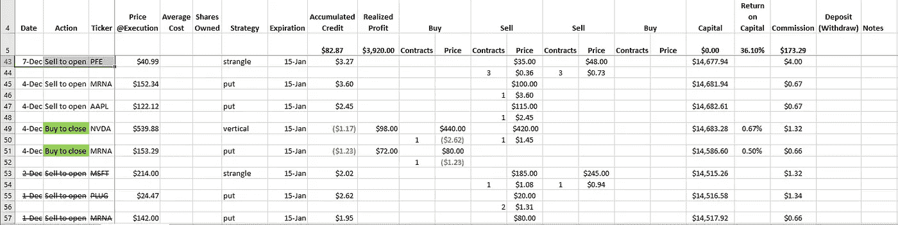
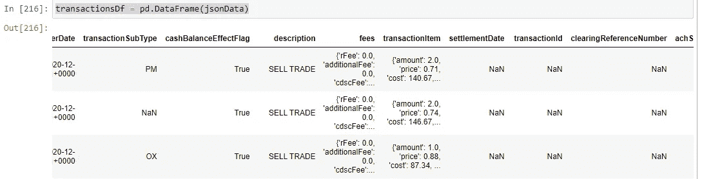
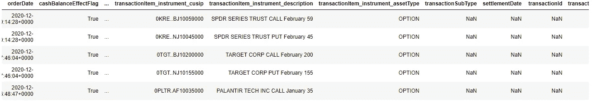

# 期权交易数据分析—第 1 部分—简介

> 原文：<https://medium.datadriveninvestor.com/options-trading-data-analysis-part-1-an-introduction-c6dcdc5d9a2f?source=collection_archive---------8----------------------->

作为期权交易者，能够监控你的表现，至少知道你的策略是否有效，你是否盈利，这很重要。一开始，我用 Excel 跟踪我的交易，基本上是记录每一笔开仓和平仓交易。参见图 1。这些数字显然只是为了举例，但请注意它们之间的关系。



Figure 1 — Tracking with Excel

对于开仓交易，我们记录价格和合约数量，其中价格被记录为买入的借方(负数)和卖出的贷方(正数)。在平仓相应的开仓头寸时，我们将再次对借方和贷方进行求和，并计算平仓金额和开仓金额的总和。这成为我们的利润(负值表示亏损)。每笔交易的运行资金、佣金和费用都会被跟踪。然后，资本回报率的计算方法是利润除以收盘时的资本(注意，这不同于跟踪购买力和根据使用的购买力计算回报率)。颜色用于结算交易，作为个人盈利或亏损的快速指标。已结束的期初交易将以删除线显示。总利润和资本回报率也计算为相应列的总和并显示出来。

这当然是可行的，但是，它是高度手工的，因此既费时又乏味。作为一名软件开发人员，我倾向于寻找更好(更懒)的方法。

我想做的第一件事是能够直接从代理获得交易数据，以避免手动输入每个数据。大多数经纪人允许用户通过 CSV 文件下载账户交易。如果他们提供 API 来获取 JSON 格式的事务就更好了。在写这篇文章的时候，我知道 TD Ameritrade 有一个开发者 API 来做这件事:[https://developer.tdameritrade.com/apis](https://developer.tdameritrade.com/apis)。在这里，我不会使用任何单独的代理工具集来获取事务数据，但是我将使用 TD Ameritrade 提供的 JSON。

一旦我们能够获得事务数据，下一步就是设置我们的开发环境。这只做一次。我们将为`Python`使用`Pandas` 库，这在数据分析中非常流行。你可以建立自己的 Python 环境，并使用`pip`安装 Pandas。Jupyter 笔记本也很方便，所以也可以安装它(也可以使用 pip)。更好的是，如果你准备好了，去[合作实验室](https://colab.research.google.com/)吧，一切都已经准备好了。方便。

既然我们的笔记本启动了，让我们开始写吧。显然，我们要做的第一件事是包含必要的库，然后加载事务数据文件。

```
import json
import pandas as pd
from pandas.io.json import json_normalizewith open('transactions.json') as f:
    jsonData = json.load(f)#by default normalization uses the '.' as the seperator 
# we're going to use the '_' instead
transactionsDf = pd.json_normalize(jsonData, sep='_')
transactionsDf = transactionsDf.iloc[::-1]
```

我们将`import json`反序列化为`jsonData`，然后转换为 Pandas 数据帧。如果我们简单地使用`transactionsDf = pd.DataFrame(jsonData)`，我们将得到一个类似这样的数据帧:



Figure 2

请注意某些列系列的嵌套对象。当我们想利用 Pandas 执行数据操作时，这不是很方便。因此，我们导入`json_normalize` 来“展平”数据。TD Ameritrade 还提供了按日期-时间降序排列的数据(从过去开始)，我们还将颠倒数据帧的顺序。现在我们有了这样的东西:



Figure 3

## 流动资本和本金

现在数据框架已经准备好了，我们首先要计算的感兴趣的基本信息是流动资本和本金，这将是任何给定点的累积总和。我们定义资本和本金的方式是:

*   资本——给定时刻的现金等价物总额
*   本金——在给定时刻投入的现金等值总额

资本本质上将是本金+收益。对于 TD Ameritrade，资本的变化记录在每笔交易的`netAmount`字段中。但是，我们确实希望排除与他们的现金转移计划相关的交易。Pandas 有一个内置的函数来计算我们可以利用的累计总和。

```
transactionsDf= transactionsDf.assign(capital = transactionsDf.apply(
    lambda row : row['netAmount'] 
    if (str.upper(row['type']) != 'JOURNAL' and str.upper(row['description']) != 'CASH ALTERNATIVES PURCHASE') else 0, axis=1).cumsum())
```

首先，我们在 DataFrame 上使用`apply`函数，遍历每一行(`axis=1`)来过滤掉我们想要排除的提到的事务，对于那些事务返回`0`，否则返回`netAmount`。这导致数据帧中只有一列是净额。然后我们通过`cumsum`函数运行它，并使用`assign`函数将其作为`capital`列添加到`transactionDf`数据帧。

至于本金，我们对存款和取款交易感兴趣。这些可以用`ELECTRONIC_FUND`来标识为`FI`和`FO`的`type`和`transactionSubType`。存款很简单，因为它们直接增加了当前本金。然而，我们需要对提款小心一点。如果有收益，提取需要在应用于本金之前应用于收益。正因为如此，本金的计算对资本有依赖性。如果我们只是简单地添加所有内容，我们可能会得到不理想的结果，如这个简化的示例所示:

```
 Type    Amount  Capital Principal
0   D       10      10      10
1   D       10      20      20
2   W       -5      15      15
3   D       10      25      25
4   G       5       30      25
5   G       5       35      25
6   G       5       40      25
7   L       -5      35      25
8   W       -10     25      15   <- should stays at 25
9   G       10      35      15   <- now wrong because of above
10  W       -25     10      -10  <- error escalades
11  G       25      35      -10
12  L       -30     5       -10
```

我们必须注意警告，通过迭代每一行来计算本金。

```
#calculate the running principal
# for withdrawals, we only subtract from the principal only when capital will fall below principal
# this is because if capital is above principal, then the withdrawals would be taking out of the "gains"transactionsDf['principal'] = np.nan
currentPrincipal = 0for index, row in transactionsDf.iterrows():
    if (row['type'] == 'ELECTRONIC_FUND'):
        if (row['capital'] <= currentPrincipal):
            transactionsDf.loc[index, 'principal'] = row['capital']
        else:
            transactionsDf.loc[index, 'principal'] = currentPrincipal + row['netAmount']
    else:
        transactionsDf.loc[index, 'principal'] = currentPrincipal currentPrincipal = transactionsDf.loc[index, 'principal']
```

注意，为此我们使用`loc`一次“分配”一行主体。最后，在笔记本中，我们可以再次使用`loc`选择查看本金和资本:`transsactionDf.loc[:0,[‘capital’, ‘principal’]]`。

至此，通过比较本金和资本，我们能够初步了解我们的业绩。本质上，资本和本金之间的差值就是我们实现的利润。在本系列的后面部分，我们将扩展计算每笔收盘交易的利润和损失的内容，并探索将这些数据分组以提供相关分析视图的技术。

[第 2 部分——视觉效果](https://phandinhlan.medium.com/options-trading-data-analysis-part-2-visuals-36e659233f)