# 期权交易数据分析—第 4 部分—收盘

> 原文：<https://medium.datadriveninvestor.com/options-trading-data-analysis-part-4-the-closings-d31e6051f8b3?source=collection_archive---------8----------------------->

在某个时候，每一个开始都有一个结束。我们能看到利润吗？我们期望赢得全部还是输掉一些战斗？赢与输的影响有多大？我们的结束策略是什么？让我们继续旅程，看看能透露些什么。

从[开仓](https://medium.com/datadriveninvestor/options-trading-data-analysis-part-3-the-openings-73c2129d2fd2)，我们能够提取特定于期权的交易并检索开仓。稍微调整一下，我们可以提取所有的闭合，如下所示:

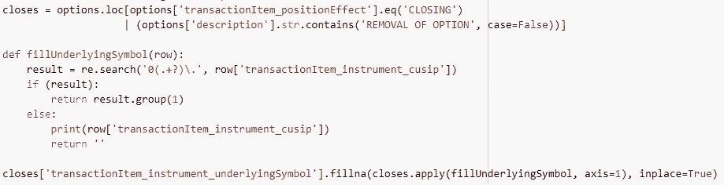

Filter for closing option transactions

注意，我们提取了活跃交易的`CLOSING`和非活跃交易的`REMOVAL OF OPTION`，例如转让和行权。移除选项后，TD Ameritrade 数据不会填充`underlyingSymbol`，因此我们也在此时填充它。

现在为了计算利润(或损失)，我们将期末和期初进行对比，找出贷方或借方的差额。在这个过程中，我们遍历每个结束交易，并找到匹配的开始交易。由于订单上潜在的部分填充，这可能不是每笔交易一对一。我们通过利用由`cusip`定义的特定交易的合同数量来处理这个问题。代码如下所示:

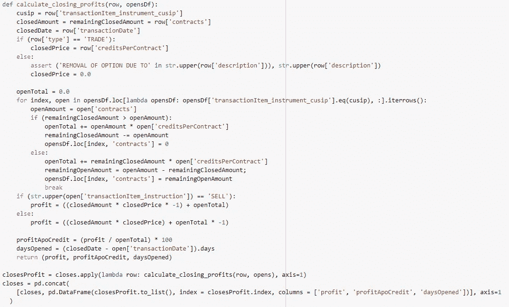

Calculating profit, profitApoCredit, and daysOpened

为了利用迭代过程，我们还将利润计算为信用的百分比，以及开仓的天数。回想一下，信贷是我们在这笔交易中可以获得的最大利润。我们可以再次使用`describe`方法来了解收盘情况。

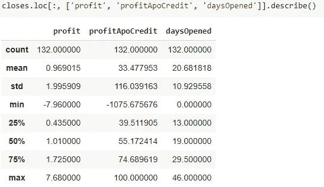

describe() on closes

这本身已经揭示了一些有趣的。

*   在给定的时间段内，我们已经完成了 132 笔交易。
*   平均利润显示为 0.96(注意乘以 100 得到实际的美元金额)
*   我们通常以最大利润的 33%成交
*   头寸未平仓的平均天数(或我们获利或亏损前的天数)约为 20 天

这些都是很好的数据点，但它们也可能误导我们。当我们把利润和亏损放在一起考虑时，平均值可能会有偏差。让我们试着把两者分开，看看我们有什么。

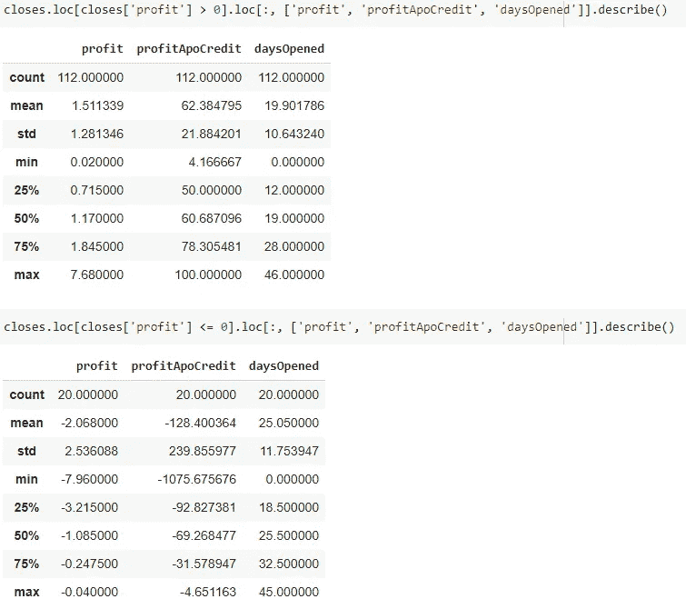

describe() on profit and loss

现在我们可以稍微不同地看这幅图。

*   盈利交易的平均利润为 1.51，平均收盘价为最大利润的 62.38%，平均发生在 19.9 天左右。
*   亏损交易的平均亏损是 2.06，平均亏损是最大利润的 128%，平均发生在 25 天左右。
*   盈亏比是 112:20
*   我们赢了大约 84% (112/132)的交易。但是，如果我们认为一个加权的胜利是失败的，因为我们在失败时比在胜利时损失更多，我们可以计算加权的胜利百分比为(112 * 1.51)/(112 * 1.51+20 * 2.068)= 80%

也许我们的交易很幸运，但是 80%的胜率并不坏，一点也不坏。

虽然赢是好事，但知道我们赢了多少也很重要。一个合理的衡量标准是将其与我们利用的资本和原则的数量进行比较。我们将以资本和本金的百分比来计算利润。还有，我们来看一些剧情。

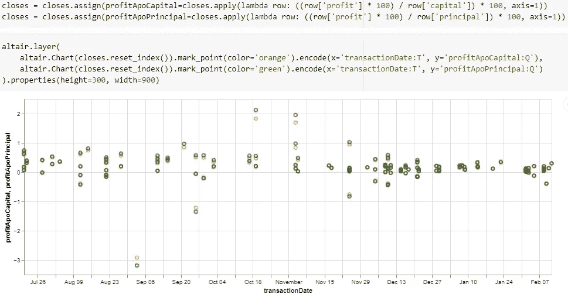

profitApoCapital and profitApoPrincipal

这是一些统计数据，我会让你根据这些数据做出自己的分析。

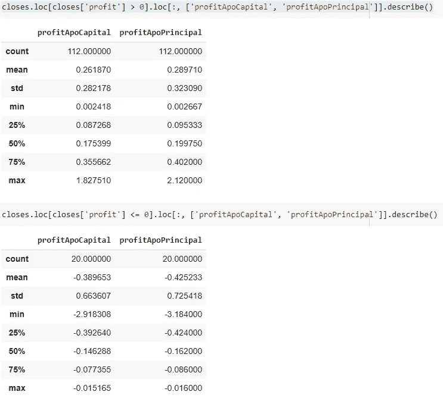

describe() on profitApoCapital and profitApoPrincipal

我们可以再次利用累计和来分析总利润。

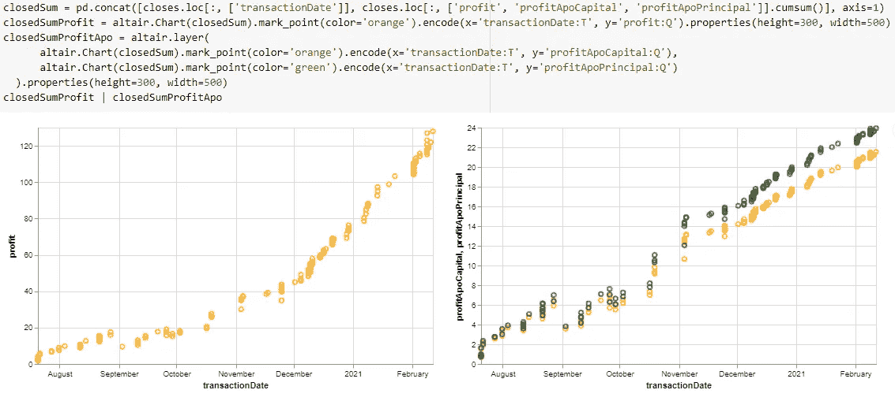

the cumulative sum on profit

现在，让我们利用重采样技术来了解每周的收盘数据。我们将`period`设置为‘W ’,执行重采样，并连接感兴趣的信息，如下所示:

Resampling closed

并使用 Altair 生成绘图代码:

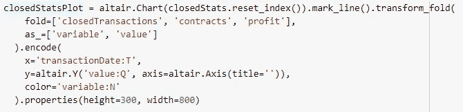

Closed plot

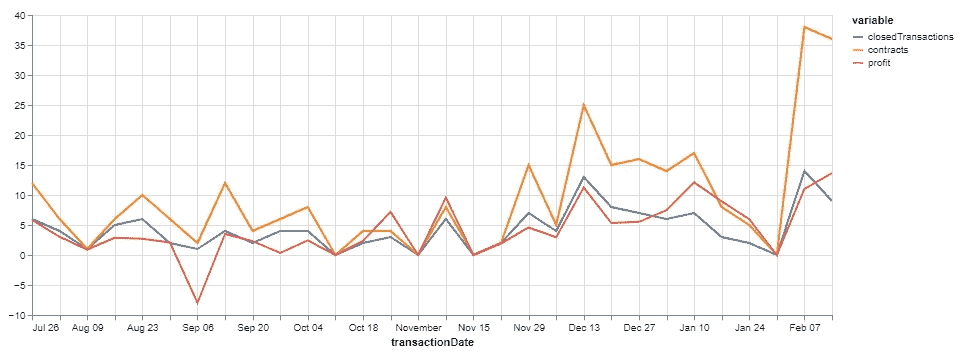

Weekly closing plot

又一次有用的`describe`:

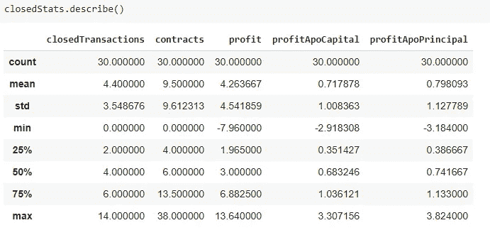

Weekly closed — describe

正如我们所看到的，平均每周约有 9.5 份合约成交，这很有趣，但与平均 9.4 份的每周开盘合约相比，这是意料之中的。0.71 的平均周资本回报率(`profitApoCapital`)还不错，因为这可以预测 36%的年资本回报率。

我们可以对收盘进行的另一个有趣的分析是，看看交易了什么，以及与每种工具相关的盈利能力如何。我们可以在`transactionItem_instrument_underlyingSymbol`上使用 DataFrame 的`groupby`函数来完成这项工作，然后汇总我们需要的信息。

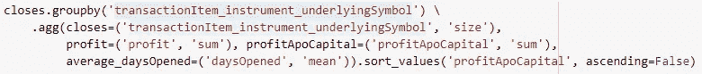

Aggregating profit, profitApoCapital, and daysOpened by underlyingSymbol

注意`profit`和`profitApoCapital`相加，`daysOpened`取平均值。这是数据，由于房地产有限而被截断。

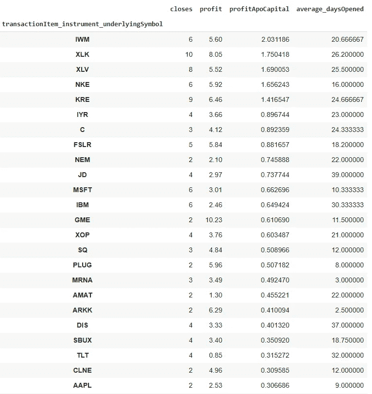

Aggregating profit, profitApoCapital, and daysOpened by underlyingSymbol

我们找到了。结合分析开盘和收盘交易的信息，我们可以建立一个关于特定期权交易策略的交易活动的像样的故事。多亏了可用的工具，我们能够轻松地进行分析。结合一点创造力和好奇心，我们可以从数据中提取许多见解。我们很想知道如何利用这些见解来不断学习和反馈，以完善我们的交易策略。

免责声明，请不要使用这里的任何信息作为财务建议。感谢阅读。

[第 5 部分——现金和权益资本](/options-trading-data-analysis-part-5-cash-and-equity-capital-b3439a3df3dc)