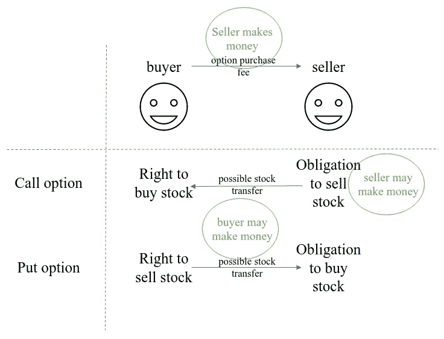
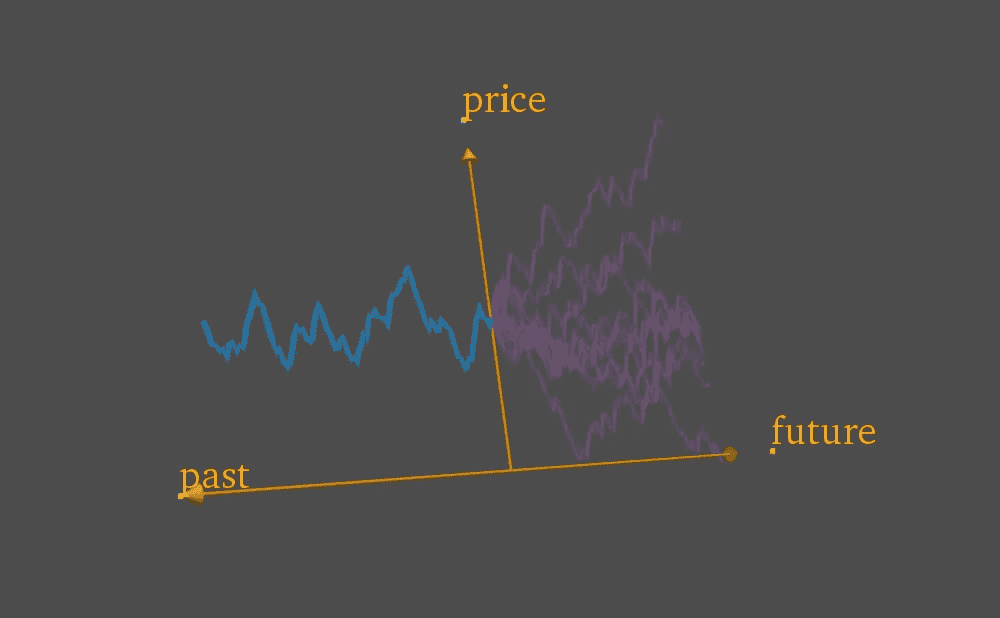
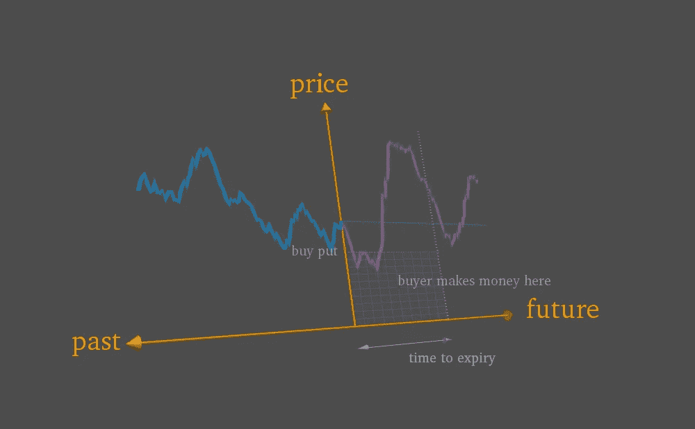
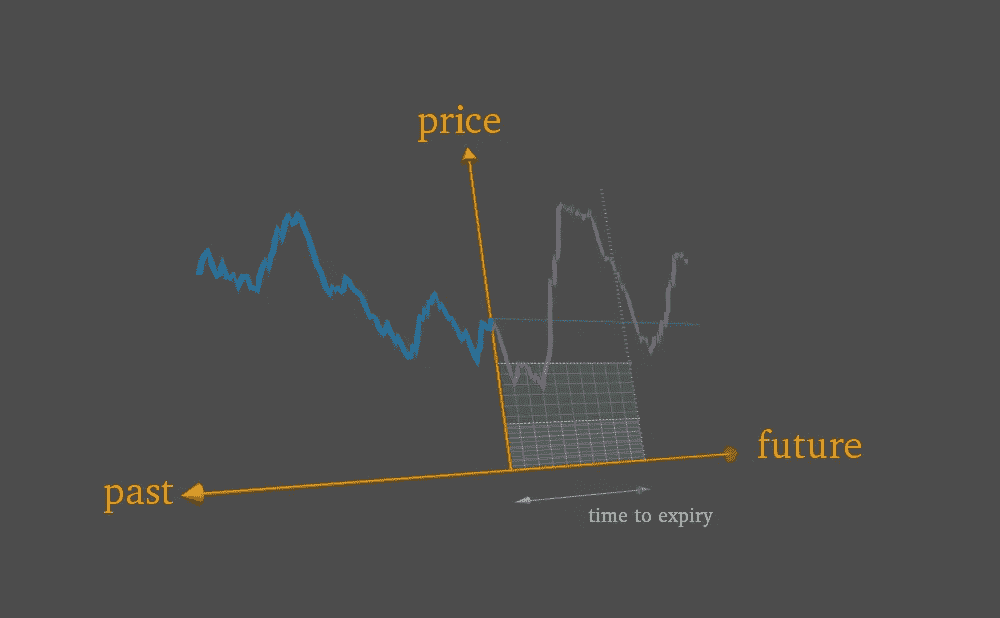
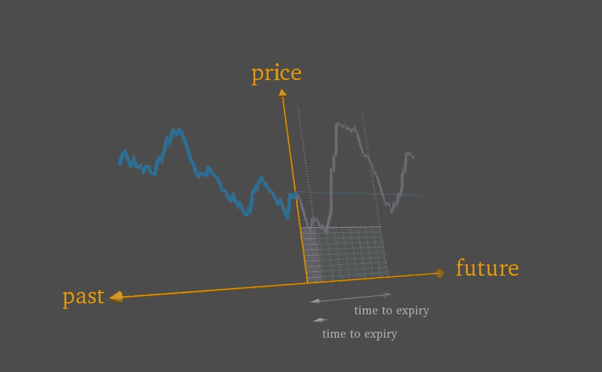
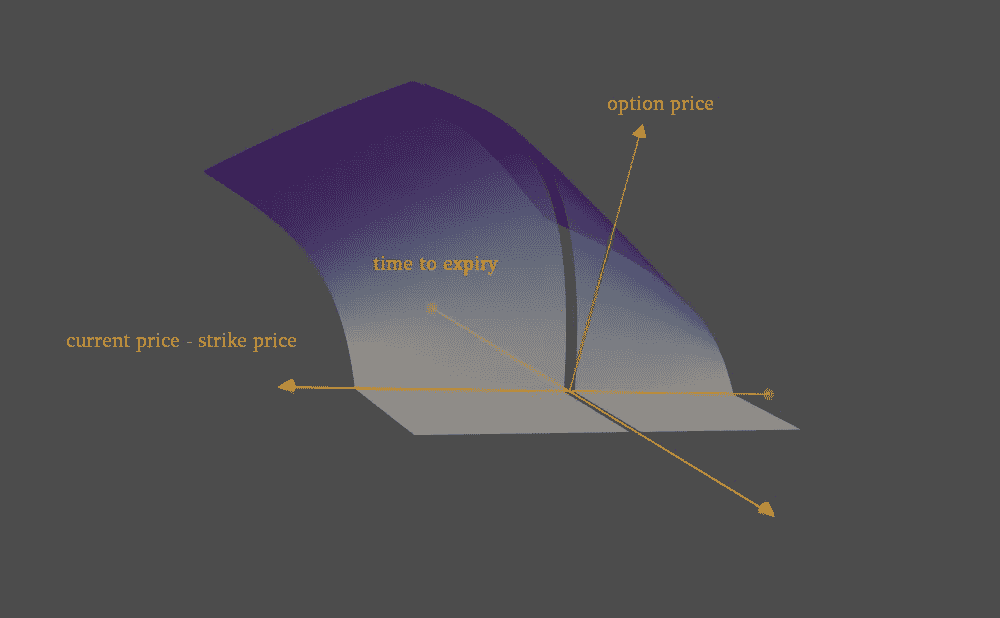
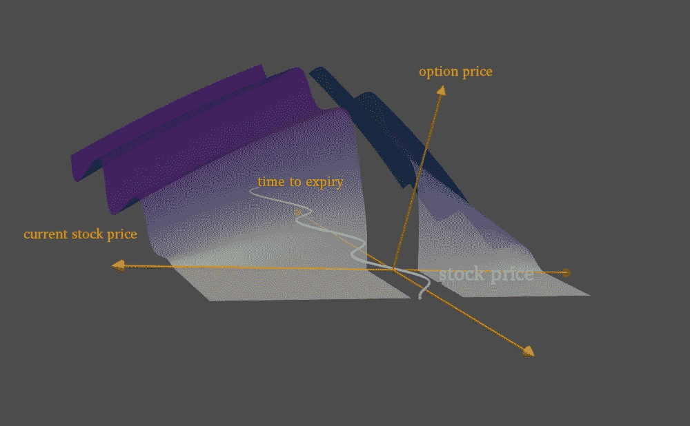
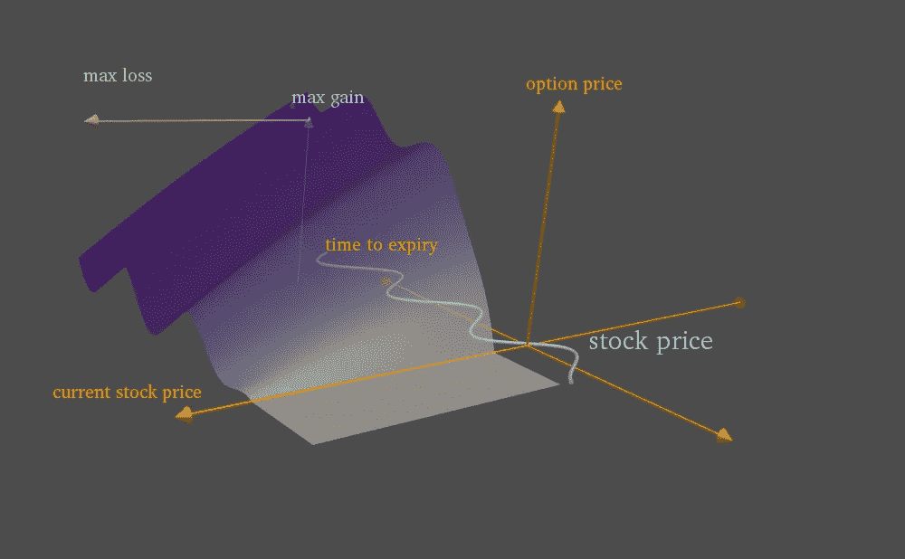

# 新手期权交易——创造你自己的策略

> 原文：<https://medium.datadriveninvestor.com/options-trading-for-beginners-creating-your-own-strategies-50da1d060c95?source=collection_archive---------2----------------------->

# 介绍

有人告诉我，生命中只有两件事是确定的——死亡和纳税。然而，在金融领域，有两件事是确定无疑的:技术术语和 T2 战略。

金融界(包括期权界)深陷技术术语的泥潭，这些术语对我们其他人来说可能是希腊语或拉丁语。然而，当一个人抛开行话，剩下的是一套相当直接的规则。

它还充斥着各种策略，却很少解释这些策略是如何产生的。如果你试图了解期权，你肯定会遇到过多的这种策略。每个策略都解释了你需要遵循的步骤——仅此而已。你是否通读过这些策略之一，并问自己*为什么*？*为什么是这些确切的步骤*？*还有其他更好的步骤吗*？作为一名科学家和工程师，这些战略指南给了我很大的启发！

在这篇文章中，我将用通俗的语言解释期权。更重要的是，我将解释是什么推动了期权的价格。这是必要的知识，也正是这些知识让你能够设计出自己的策略。

我不会提供让你成为百万富翁的新策略。然而，在解释了驱动期权价格的因素之后，我将再次用通俗的语言解释一些流行的策略是什么，以及如果你知道你可以玩什么*旋钮*的话，你是如何自己想出这些策略的。

最后，这篇文章是写给对期权有一点了解的人的。尽管我已经解释了什么是选项的基础知识，但本文并没有涵盖关于选项的所有知识。然而，如果你已经尝试了一两种策略，并想了解更多，请继续阅读。

# 1.什么是选项？

*如果你知道什么是选项，可以跳过这一节。*

比如你去汽车经销商那里，看到一辆你非常喜欢的车。然而，那种特殊牌子的汽车只剩下一辆了。你想在周末做出购买决定。此外，你还有 FOMO。经销商感觉到了你的烦恼，并建议你付给他/她一些钱，这样他/她可以“以当前价格为你保留到下周一。”现在，你有 ***选项*** 在周一结束前的任何时候购买。你签署一份 ***合同*** 并为其付款。经销商现在*有义务*等到周二，他/她才能将车卖给其他任何人*，不管其他人愿意在此期间为车支付多少钱*。当经销商出售他/她的机会成本时，你支付以减轻你的 FOMO。

在股票市场中，那份**合约*就是*期权**。合同上有两项——**成交价格**(经销商将持有该车的价格)和**到期日**(经销商将为您持有该车多长时间)。

## 1.1.选项的类型

期权只有两种——购买股票的期权(**看涨期权**)和出售股票的期权(**看跌期权**)。就像汽车经销商的情况一样，任何时候你付了钱，你就有权利——或者买或者卖股票。任何时候你从卖出期权中得到钱，你就有义务买/卖股票。

在证券交易所，你可以是交易者，也可以是客户。或者两者都有。在接下来的讨论中，买方将是购买期权的人，卖方是出售期权的人。

下图描述了不同的期权类型和买卖双方赚钱的条件:

Fig. 1\. When so buyers and sellers make money?

值得注意的是,(期权的)卖方总是收取期权购买费。如果期权以有利的价格行使，买方可能会赚钱。否则买方会因期权购买费而赔钱。估价需要这种洞察力。

# 2.估价

期权有两种类型的价值——内在的和外在的。内在的意思是，它可以立即行使，以立即获利。通常你不会在这种体制下工作。你通常只会选择有赚钱潜力的期权(即有外在价值)。

我们如何确定期权的价格呢？如果你看到图 1 中的图表。你会注意到买家希望他/她能在未来条件有利的时候赚到钱。事实上，这是买家赚钱的唯一途径。什么会使条件变得有利？当然是股票的价格变动！

Fig. 2.(a) The probabilistic nature of future prices

在上图中，股票的过去价格(以及股票所属的特定公司的所有其他方面)是已知的。这由上面的蓝线表示。股票未来价值的价格是未知的。无论是股票还是期权，你都利用过去的信息来预测*可能的*未来。这在上图中用发散的紫色线条表示。

让我们考虑一下看跌期权为买方赚钱的情况。在下图中，个人希望股票价格在未来下跌，因此以略低于当前市价的价格买入看跌期权。下图中的蓝色虚线显示了当前的市场价格。这个人只有在股票价格达到下图中网格划分的区域时才能赚钱。 ***这个事件发生的可能性越小，期权就越便宜。***

看涨期权完全相同，只是价格轴的方向颠倒了。

Fig. 2.(b). When do option buyers make money

在任何时候行使期权的概率(以及期权的价格)由三个因素决定

1.  股票的执行价格和当前价格之间的差额
2.  到期时间
3.  股票价格的波动

现在，让我们来看看为什么这些因素会影响期权价格，以及它们是如何…

## 2.1.执行价格和期权价格之间的差额

如下图所示，随着股票的执行价格和当前价格之间的差异增加，价格达到这一新低的概率降低。因此，执行价格离当前价格越远，期权价格越低。

Fig. 2.(c). The relationship between the strike price and the probability of the option being exercised.

## 2.2.到期时间

同样，如果期权到期的时间非常短，股票价格达到执行价格的可能性也明显较低。因此，随着到期时间的减少，期权的价格也会减少。当到期时间为零时，期权的价格为零。

Fig. 2.(d). The relationship between the time to expiry and the probability of the option being exercised.

## 2.3.股票的波动性

标的股票的波动性越低，就越不可能达到执行价。下图显示了原始可能股票价格(显示为紫色)与波动性明显较低的股票价格的比较。这也意味着这个选项的价格会更低。

Fig. 2.(e). The relationship between the volatility of the stock price and the probability of the option being exercised.

波动有两个来源。股票所固有的。另一个是与市场相关的。

## 2.4.摘要

总的来说，以下几点基本成立:

1.  股票价格和执行价格之间的差额较高=成本较低
2.  到期时间越长=成本越高
3.  波动性越高=成本越高

# 3.您的策略可用的旋钮

那么，你需要用什么旋钮来弹奏呢？如果你仔细想想，你真正能控制的只有两件事——执行价格和到期时间。你不会选择波动性。你可能会选择一家在特定时间波动性高/低的公司，但你并不真正知道未来市场何时会变得波动性更大/更小。

随着时间的推移，执行价格和股票价格之间的差额会发生变化。这会立刻改变期权的价格。然而，与此同时，随着到期时间的缩短，价值也会随之损失。这是众所周知的。下图显示了两个不同的变量

Fig. 3.(a). The price of an option based upon the difference between the current price of the stock and the strike price, and the time to expiry

在这个图中，期权价格垂直向上。左边的价格(即紫色表面)反映了执行价格通常低于当前价格的看跌期权的价格。执行价格高于当前价格的蓝色表面是看涨期权的价格。中间的波段是期权的价格。“到期时间”在图中进一步增加，与增加时间的方向相反。在这个轴上，0 是期权到期的点。超过这一点，所有选项都没有价值。

重要的是要认识到，上面显示的期权价格不是相对于股票价格的实际价格显示的，而是相对于当前股票价格和执行价格之间的差异显示的。假设某一特定股票价格在买入期权和卖出期权的执行价格之间像正弦波一样波动，如果要观察期权价格如何随时间变化，那么结果将如下所示

Fig. 3.(b). The same as 3.(a). except that in this case we look at the price of the option

# 4.一些众所周知的策略

期权主要是为对冲而发明的。然而，有许多策略可以让你通过各种选择策略来赚钱。在这一节，我们将研究如何通过期权赚钱。

许多基于期权的赚钱策略都围绕着卖出期权和收取溢价。主要是卖出看跌期权或看涨期权。

## 4.1.裸卖出和买入卖出

最简单的策略是直接卖出看跌期权和看涨期权，以获得溢价。如果你在卖看跌期权，你预期股价会上涨(这是典型的情况)。如果你卖出看涨期权，你预计价格会下跌(通常情况下不会如此)。

如果价格走势对你不利，卖出看跌期权或看涨期权可能会变得危险。卖出看跌期权时，你可能会损失金额(执行价格×100 ⁻溢价)。如果你卖出一个看涨期权，你的潜在损失是∞。请记住，为了简单起见，我将交易费用折现。

如果你卖出看跌期权，记得在你的账户里持有(执行价格×100)以防你需要买入那些股票。万一你卖出看涨期权，我甚至不知道该持有多少。

对于看跌期权，下面是一个例子…

Fig. 4.(a). The max gain and loss for a put option.

## 4.2.[垂直价差](https://www.investopedia.com/articles/active-trading/032614/which-vertical-option-spread-should-you-use.asp)

在图 3 中。(二)。，以看跌期权为例(紫色面)。请注意，当您远离定义股票价格的轴时，期权的价格会降低。还要注意的是，只要股票价格高于执行价格，这种差异就保持不变，与股票价格无关。

然后你可以以更高的价格卖出看跌期权，以更低的价格买入看跌期权。你将不再需要持有(执行价格×100)，而是((较高的执行价格-较低的执行价格)×100)。这可以根据需要而定。你只能得到期权费，即对应于两个执行价格的期权价格之间的差额。(这种特定的策略被称为**看涨看跌**)。

## 4.2.1.[铁鹰](https://www.investopedia.com/terms/i/ironcondor.asp)

如果你知道某只股票是看跌还是看涨，那么前面的策略是不错的。然而，如果股票的波动性很低，你能“从两边都撇去”吗？

绝对的。欢迎来到铁鹰战略。你把**牛放**策略和**熊叫**策略组合成**铁秃鹰**策略。

在垂直价差中，我们用一个方向(记住平面的方向垂直于其表面)与时间轴方向相同的平面来切割代表期权价格的表面。我们能用其他方法切割这些表面吗？

## 4.3.[水平](https://www.investopedia.com/terms/h/horizontalspread.asp)和[对角扩展](https://www.investopedia.com/terms/d/diagonalspread.asp)

是的，绝对的。你可以用面向任何方向的平面来切割代表期权价格的曲面。如果你用一个或多个平行于时间轴的平面来切割这个表面，那么你就得到与水平展宽相关的策略。结合水平分布和垂直分布，可以得到对角线分布。

那么，你还在等什么？开始分割期权的价格面，结合多个面，想出自己的策略。

这篇文章已经是一个相当沉重的阅读。所以我就讲到这里。如果有兴趣的话，我会写另一篇文章来展示这些选择策略。

# 5.警告

如你所知，期权策略敏锐地处理价格变动和期权的可能行使。这也意味着你将不得不额外努力去尝试预测未来的股票价格。

做你的研究。股票价格会上涨还是下跌？它们都取决于宏观经济、微观经济、公司生存能力和人气。如果你想深入研究期权，你应该理想地知道如何分析上述所有内容。如果没有，至少，你应该知道尽可能多的公司估值指标，以确定其未来前景。这将减少你错误购买/出售的机会。

> 注意:在上面的文档中有许多简化的假设。例如，我完全忽略了经纪价格和其他服务费。另外，期权不仅适用于股票，还适用于商品、债券、利率、货币等。如果你能思考它，你可能会得到它的一个选项。这是为了提供对期权策略的整体理解，而不是一个详尽的论点。