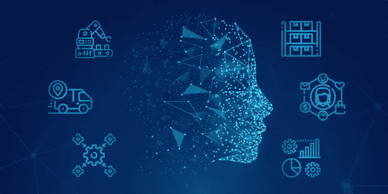

# Oracle NetSuite ERP 软件模块:面向中小型企业的最佳云 ERP[系列 2]

> 原文：<https://medium.datadriveninvestor.com/oracle-netsuite-erp-software-modules-best-cloud-erp-for-small-and-mid-size-businesses-series-2-1d2f553fbc57?source=collection_archive---------8----------------------->

作为我们之前关于 NetSuite ERP 的[最佳模块的文章的延续，我们写这篇文章是为了列出 NetSuite ERP 的其他最佳模块。Oracle 的 NetSuite 凭借其一流的特性，在为客户和最终用户提供最佳体验方面一直处于领先地位。无论规模和行业如何，NetSuite 的模块都能满足每个努力超越挑战的行业的需求。](https://medium.com/datadriveninvestor/netsuite-erp-software-modules-the-best-cloud-erp-solution-for-growing-businesses-series-1-af548cd9cea)

NetSuite ERP 将使企业主专注于业务增长和价值，而不是专注于繁琐的任务。它被认为是中小型企业拥有竞争优势的最佳云 ERP 软件解决方案之一。除了定制功能之外，NetSuite 还提供了数据分析功能，允许您根据行业标准预测生产计划、销售、库存管理和增长。

相当重要的是，NetSuite 每年向客户提供两次定期更新，不收取额外费用。与其他 ERP 软件用户相比，它有助于客户保持更新、竞争力和安全性。一个合适且经验丰富的 [NetSuite 实施合作伙伴](https://amzur.com/netsuite/)将帮助您定制 ERP 软件，以应对您独特的业务挑战。

**合同续签模块:**

如果你拥有一家软件公司，续约是生命线。NetSuite 合同续订模块将根据预定义的窗口自动执行续订过程。它帮助云计算供应商和传统软件提供商节省时间。此外，你可以向现有客户提供特别折扣。NetSuite 的财务模块将帮助您调整和自动化成本。

**固定资产管理:**

这是一个单一窗口集成模块，使您能够管理资产的折旧、重估、维护计划、租赁和保险。为了提高效率，NetSuite ERP 软件的固定资产管理模块与财务模块集成在一起。

**项目成本核算:**

NetSuite 项目成本模块提供了对规划周期的可见性；从估算到预算，在项目和任务级别预测成本和开单预算。它有助于开展成本效益分析，以确定项目是否在财务上步入正轨。

**WIP(在制品)和工艺路线管理:**

NetSuite WIP 和路由管理模块帮助制造商优化复杂的工作订单，这些订单是产品在制造过程中必须经过的。它有助于在整个周期中跟踪工作进度。

**寰宇一家:**

NetSuite Oneworld 模块为中型企业提供实时、统一的全球业务管理解决方案。它帮助跨国公司简化多子公司运营，如货币、税收和法律合规性，实现无缝工作流程。

**优质客户中心:**

NetSuite 通过 SuiteCommerce 客户中心提供 24x7 自助记账管理功能。它通过在线自助服务资源和工具减少支持请求，提高了购买效率，包括支持常规、重复和批量订购。它对 B2B 和 B2C 运营都很有用。

**高级数据中心层级:**

如果您的企业(B2B/ B2C)每天要处理数千笔交易，NetSuite 通过高级数据中心 3 层模块提供卓越的操作能力。每个 NetSuite 高级数据中心层都提供专用的数据库存储实例，使您的业务信息与其他 NetSuite 客户分开存储。它提供了更多的灵活性和可伸缩性。

**项目管理:**

NetSuite 项目管理模块使您能够管理从底线到顶线的运营，以提高效率。这与 NetSuite 会计系统集成在一起。除了项目管理，您还可以跟踪费用、创建和开具发票、跟踪收入确认和预算比较操作。

**资源分配:**

NetSuite 资源分配模块可以优化资源，并将它们部署在正确的位置，以获得有效的结果。本模块通过最大限度地减少您的工作量来帮助优化您的人员配备和利用率，并确保合格的资源用于正确的项目。

**收入确认:**

NetSuite 收入确认模块与多账簿会计无缝协作，以跟踪每笔交易并提供准确的财务报表。其实时收入情报功能将量化数据，帮助做出明智的决策。

**suite 分析连接:**

对于任何企业来说，数据都是做出决策的巨大资产。NetSuite 分析连接模块(ODBC)提供跨各种进程的集中式实时数据。您可以快速安全地将各种常见的商业智能工具直接连接到 NetSuite。NetSuite ERP 配备了人工智能(AI)和机器学习(ML ),可以无缝地进行数据采集、处理和预测。

**多账簿核算:**

NetSuite ERP 软件的多账簿会计利用其处理同一家公司财务运营的能力，该公司位于多个地点，采用不同的会计标准。与 QuickBooks 和电子表格相比， [NetSuite 会计软件](https://amzur.com/blog/netsuite-erp-accounting-software-how-it-outperforms-spreadsheets-and-quickbooks/)更快更高效。它可以根据您的业务需求进行扩展。

ERP software with AI

**SuiteCommerce 高级:**

电子商务业务正在全球范围内迅猛增长。然而，对于遗留系统或过时的软件解决方案来说，应对其挑战相当困难。随着技术的快速采用和客户期望的动态变化，企业需要采用像 NetSuite ERP 这样的全面解决方案。

NetSuite 是第一个将电子商务与后台操作统一起来的提供商。无论您使用何种设备访问，NetSuite SuiteCommerce 模块都能增强您的在线业务增长和客户体验。此外，它与社交媒体的集成能力将为在线零售客户提供全渠道体验。因此，您可以通过实时更新和准确的库存供应来吸引客户。

**SuiteCommerce 网站生成器:**

NetSuite suite ecommerce site builder 是一个功能齐全的可定制网上商店，提供出色的网上购物体验。它通过一个基于云的商务平台来简化运营，从而提高运营效率。

**销售点(POS)模块:**

NetSuite 通过简化每笔交易的统一 POS 模块来满足多渠道和多地点零售商的要求。NetSuite POS 模块通过实时库存可见性建立强大的客户忠诚度。

您的遗留系统是否仍然困扰着您，使您无法应对挑战，并在市场竞争中落后？然后，这是使用现代云 ERP 软件解决方案升级您的遗留系统的最佳时机。Amzur 是一家领先的 NetSuite ERP 软件解决方案提供商，位于佛罗里达州坦帕市。我们在 NetSuite 实施和定制方面拥有专业知识，可以帮助您的企业以超出预期的速度发展。我们久经考验的行业经验已经帮助许多企业简化了他们的任务关键型运营，并超越了他们的挑战。

有关更多信息，请联系我们的 NetSuite 专家。#技术。