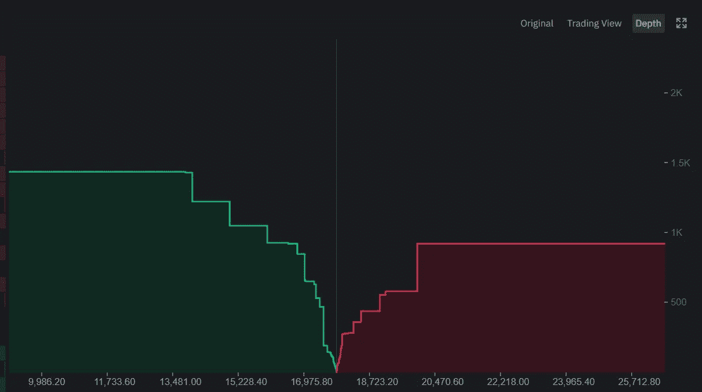
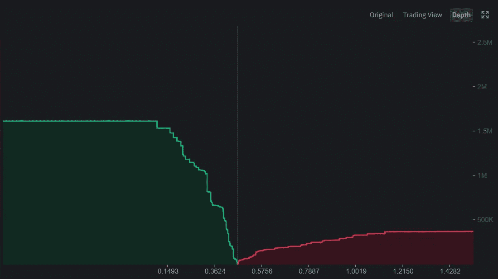
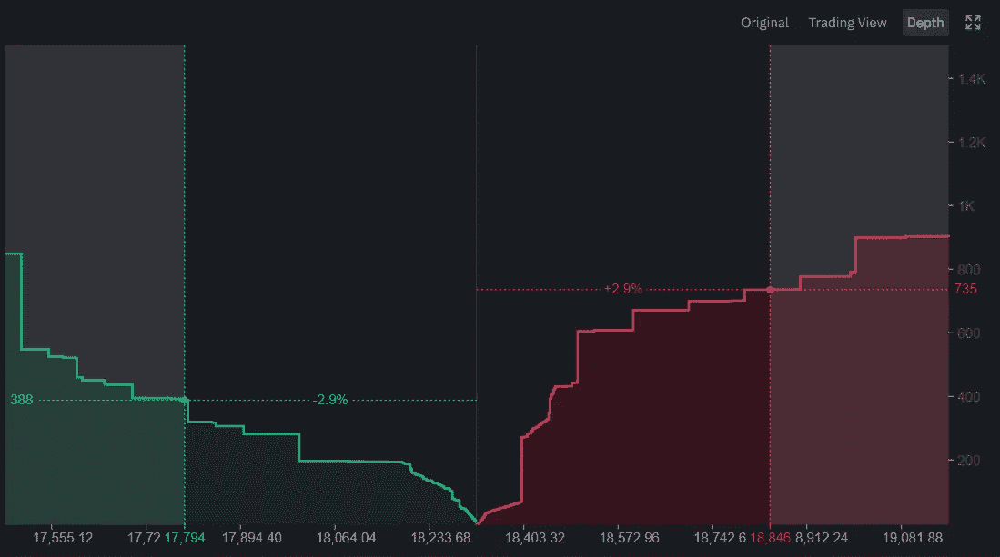

# 订单簿逻辑

> 原文：<https://medium.datadriveninvestor.com/orderbook-logic-a-la-crypto-2099fadeba9c?source=collection_archive---------3----------------------->

## 了解订单簿以及如何使用它们

交易要求有优势。现在有了这么多可用的信息，制定策略变得势不可挡。数以千计的信号被解释为市场的指标，数以千计的不同指标以各自独特的方式呈现数据。一个最普遍的，也可能是最少被谈论的，有争议的指标是订单簿。

> 订单数据几乎总是被误解。
> 订单数据非常松散&不应完全依赖。
> 订单簿数据非常容易被操纵。

订单簿是在任何给定时间某个场所/平台上某项资产的公开市场兴趣列表。基本上，它们是主动的买入/卖出订单。

订单簿中提供的信息可用于推断资产当前流动性的两个有价值的属性；1)滑点严重程度& 2)买卖价差。

滑点是在市场上销售的副作用。当存在大量头寸时，最终结算中会有差异。如果 BTC 是 20，000 美元&有人决定以 2，000，000 美元卖出 100 个 BTC，但是公开市场将能够应付一定数量的不同水平的交易。

投资组合价值
100 BTC @ 2 万美元= 2，000，000 美元

市场容量
50 BTC @ 20，000 美元= 100 万美元
25 BTC @ 19，900 美元= 497，500 美元
15 BTC @ 19，800 美元= 297，000 美元
10 BTC @ 19，700 美元= 197，000 美元
100 BTC @“…”= 1，991，500 美元

这里的失误会导致 8500 美元的损失。

买卖差价是市场上第一笔买入订单和第一笔卖出订单之间的差额。再次以 20，000 美元的比特币为例，可以安全地假设价差很小(在 0.3%的范围内)，第一笔买入订单为 19，940 美元，第一笔卖出订单为 20，060 美元。

> *旁注*
> 大多数加密&数字资产流动性很差&价格差异很大；有时高达 5%-8%。

订单簿直观地描述了不同价位的未平仓头寸的深度和规模。在任何给定的时刻，orderbook 的数据都是静态的，但是它的每个连续实例都描绘了一幅随时间变化的画面；帮助理解资产行为。

底部的横条显示价格，而右边的竖条显示大小。订单簿的左半部分(绿色)将显示购买压力，这转化为出售资产可以吸收多少。而右半部分(红色)显示的是卖出压力——这意味着在突破到更高水平之前可以吸收多少买入压力。两侧的大墙通常代表强有力的支撑/阻力。

这是一个可以通过模拟更好理解的概念。

项目 ABC 目前的交易价格为 0.44 美元。总共有 100，000，000 枚 ABC 代币可供流通。它的市值是 4400 万美元。蓝筹股 cryptos(BTC/瑞士联邦理工学院)存在许多不确定性，但 ABC 项目保持其价格不变。打开[订单簿](https://newcointimes.com/o-cryptannica/#1605173005794-61f86483-6c64)查看深度项目 ABC 共有 390，000 个代币待售(溢价>300%】&1，700，000 个代币准备购买，滑点高达(-80%)。

 [## 完美的加密交易策略|数据驱动的投资者

### 如果你在交易游戏中已经有一段时间了，你可能听说过“支点”和“VWAP”前者听起来像…

www.datadriveninvestor.com](https://www.datadriveninvestor.com/2020/08/31/the-perfect-crypto-trading-strategy/) 

以一种过于简单和基本的方式，这转化为:
390，000 @ 300%溢价@ $0.44 = $514，800 *买入*方集合
1，700，000 @ -80%滑点@ $0.44 = $149，600 *卖出*方集合

比方说，你想看看在一个特定的价格范围内，买入/卖出压力的差异。可以放大&在非常精细的级别上调整比例。

通过观察比特币的上述深度[～18，333 美元] *(通过* [*币安*](https://medium.com/u/57600910a883?source=post_page-----2099fadeba9c--------------------------------)*{ 2020 年 12 月 12 日大约上午 12:45 })*我们可以定量地确定，为了让比特币的价格上涨+2.9%*，必须购买大约* 735 BTC(这导致价格上涨到大约 18，846 美元)。另一方面，我们也可以看到，为了让比特币失去-2.9%的价格*，必须卖出大约* 388 BTC(这导致移动到约 17，794 美元)。

## 解释订单簿

正如开始提到的，订单簿是投资者/交易者工具包中最容易被误解的工具之一；这都是因为数据呈现的视觉方式是反直觉的&极其动态的。

无论何时调查订单，基于深度分布，3 个一般结果是可能的；购买/绿色主导，销售/红色主导&平均分配

> 买入压力(大绿墙&小红墙):
> *更多买入压力支撑价格*

巨大的绿色墙在一开始可能看起来是积极的，表明价格正在这些水平上得到捍卫&更多的资本致力于保护资产，而不是出售资产。然而，情况并非总是如此。大型绿色墙可能是一个指标，表明开放市场的受众不愿意在更高层次上参与。他们也可以表达操纵的形式，大玩家建立人工订单，使资产看起来“安全”&然后突然删除它们，导致解读突然转变，大幅降低价格。

> 卖出压力(更大的红墙):
> *更多的卖出压力否定价格*

就像他们的对手一样，大红墙在一开始可能看起来是负面的，这表明价格可能很难上涨，或者当前的利益相关者急于退出他们的头寸。然而，事实并非如此。巨大的卖出墙可能表明需求即将飙升，目前的交易员预计这将推动价格上涨&他们正在建立头寸以获利了结。同样，大的卖出墙可以作为欺骗手段出现，用来阻止参与者在更高的价位买入(希望压低价格)。

项目的大型利益相关者有动力长期压低价格，试图以较低的价格在网络上积累更大的影响力。他们的欺骗指令只是试图用虚假数据来阻止做市商的自动交易算法；通常情况下，巨大的订单永远不会被满足，一旦压力来临，就会消失，导致价格飙升。这可以通过查看较长时间范围内的加密资产蜡烛图来观察。灯芯(crypto 中很少有没有灯芯的蜡烛&由于波动性，crypto 中的蜡烛灯芯比传统市场中的要严重得多)。

> *平衡(Equilibrium):双方大致相等的分配*

订单簿就像跷跷板一样，双方不断地来回波动，平均分配；有时任何一方都不会占主导地位&在这种情况下，使用订单簿作为交易/投资决策的指标是没有用的。

## 总结一下

订单簿作为工具的定论:
**C- ||低**

订单要点:
***-*** *不利于雕刻长期投资论文。* ***-*-***需要其他形式的数据来支持；应与其他指标* ***-****串联使用，有利于对量规滑移&的理解。* ***-****变化剧烈&迅速。* ***——*——**——*轻易操纵。* ***-****有助于了解&何时在何处短期退出/进入头寸。*

现在你已经了解了订单簿&它们是如何工作的；祝你旅途愉快&我们月球上见。

## 访问专家视图— [订阅 DDI 英特尔](https://datadriveninvestor.com/ddi-intel)