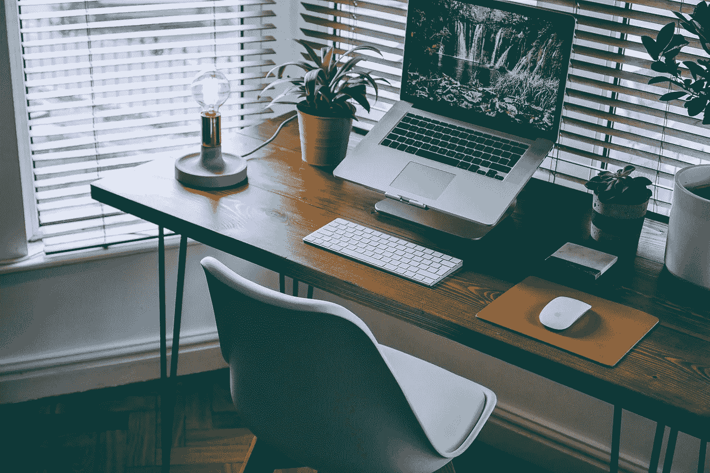
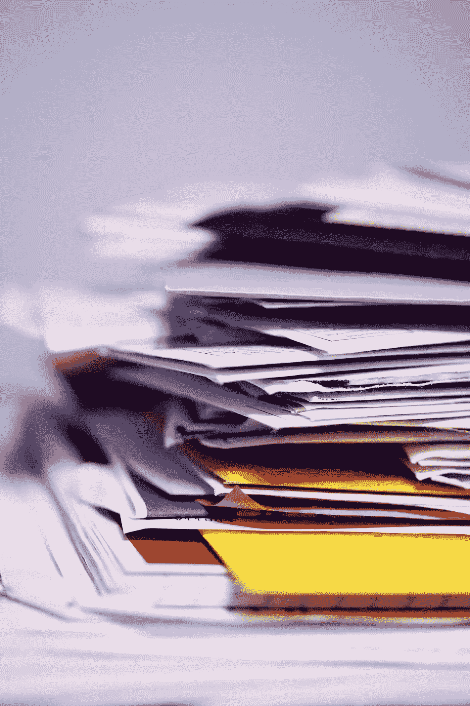

# 整理你的办公室

> 原文：<https://medium.datadriveninvestor.com/organize-your-office-cb2517bdba3f?source=collection_archive---------32----------------------->

## 不要沉溺于纸张

Photo by [Nathan Riley](https://unsplash.com/@nrly?utm_source=unsplash&utm_medium=referral&utm_content=creditCopyText) on [Unsplash](https://unsplash.com/s/photos/desk?utm_source=unsplash&utm_medium=referral&utm_content=creditCopyText)

你能看到你的桌面吗？重要的文件和档案是否被埋没在其他重要的文件和档案中，堆积在你办公室各处不断增长的书库中？你经常在文件中丢失你的钢笔吗？

或者也许你是那种圆滑世故的人，有一张漂亮的进口非洲樱桃木桌子，擦得很完美，除了你流线型的笔记本电脑之外，上面什么也没有，一间华丽的办公室，可以看到令人惊叹的水景，看不见一张纸。如果是这样，我就懒得看这篇文章了，(不过你可能要考虑写了！).

**如果没有定期、持续的关注，纸张就会像最新的病毒一样传播和繁殖，至少在我的家庭办公室是这样。**

我在网上支付所有账单，并将重要信息保存在我电脑的硬盘和磁盘上(这可能是一个错误，因此也堆积了一大堆报废的电脑。)是的，我知道，如果你要把文件存到电脑硬盘上，就把它备份到外置硬盘上。这些小玩意很棒，但是**你必须经常备份。更好的是，我正在学习信任云来存储文件，让死去的电脑和外部硬盘见鬼去吧。**

然而，威胁消耗我办公室和我家各种表面的纸张并不缺乏，如果不采取行动进行分类、归档、粉碎、回收或在壁炉中燃烧，比我关心处理所有这些还要频繁。

Photo by [Sharon McCutcheon](https://unsplash.com/@sharonmccutcheon?utm_source=unsplash&utm_medium=referral&utm_content=creditCopyText) on [Unsplash](https://unsplash.com/s/photos/messy-desk?utm_source=unsplash&utm_medium=referral&utm_content=creditCopyText)

我们的无纸社会可能还有很长的路要走(也许我们应该远离森林？)因为现在的纸堆似乎比以往任何时候都多。我必须承认，知道我有一份硬拷贝存档在某个地方，我感到某种程度的安慰。或者更多的时候，没有归档，而是放在一堆文件中等待我的关注。

当我不回避手头的任务，并幻想生活在纸发明之前的时代时，我发现下面的**系统**帮助我处理了永无止境的纸堆。

 [## 不见面就做交易？风投和企业家的 5 个指南|数据驱动…

### 自从 covid 六个月前登陆美国以来，全球的风险投资家和企业家都不得不适应新的现实…

www.datadriveninvestor.com](https://www.datadriveninvestor.com/2020/09/20/doing-deals-without-meeting-in-person-5-guidelines-for-vcs-and-entrepreneurs/) 

1.  使用彩色文件夹、文件标签、信封、盒子等。，它吸引你，并指定与某些类型的文件、票据、收据等相关的颜色。我用红色文件夹存放尚未支付的账单和时间敏感的物品。使用颜色协调的文件夹或信封可以防止这些文件在你的桌子上散开。
2.  **在你的桌子上划出一块区域，用来存放那些还不能归档、回收或粉碎的“待定”文件**。
3.  **一定要有一个*【阅读】*文件夹，存放你打算以后阅读的硬拷贝信息**。当你添加到这个文件夹中时，你可能会发现一些你想读但从未读过的东西，这些东西已经太旧或不再感兴趣了，你会很高兴地把它们扔进回收站而不去读它们。
4.  **尽量减少纸张处理量**。(但这不是我把它留在这堆东西里的最低限度)。付钱，归档，回收，粉碎。当你打开邮件时，把纸放在适当的文件夹或文件里，然后把信封扔进回收站。指定一个 *'* ***'待付'*文件夹或文件盒，按日期**分类，这样你的账单就会按时支付。为你的抵押贷款或租金、水电、电话账单等经常性账单设置自动支付系统。将消除不必要的文书工作，延迟付款，并可能创造一个幸福的幻觉，你没有很多账单要付。记住**也为任何不在自动支付上的东西设置提醒**,以避免被扣滞纳金。
5.  保管好支票、信封、回邮标签、邮票、订书钉等。一起放在一个地方，比如你的书桌抽屉或一个漂亮的盒子。到了支付账单的时候，你会手头有你需要的一切，(对于那些仍然通过蜗牛邮件支付账单的人来说)，对于我们这些濒临灭绝的人来说，他们仍然写着手写的信，通过你们的国家邮政服务传递给感激的接收者。
6.  **停止打印一切。你打印的大部分信息永远不会被再次阅读，你只是在为你自己的纸张过剩问题做贡献。如果你知道在哪里可以找到信息，并且用一个容易识别的标题保存信息，通过你的计算机检索信息通常会更快更容易。**
7.  对你从碎纸机和回收站里丢弃的东西变得无情。信息很容易在互联网上获得，并经常在杂志和期刊上重复使用。问问自己，*“我为什么要留着这个？”*
8.  每天花 5 到 10 分钟处理你桌上的所有文件。在工作日花几分钟处理文件会让你控制住自己。养成一天结束时清理办公桌的习惯。

Image by [Gerd Altmann](https://pixabay.com/users/geralt-9301/?utm_source=link-attribution&utm_medium=referral&utm_campaign=image&utm_content=2761159) from [Pixabay](https://pixabay.com/?utm_source=link-attribution&utm_medium=referral&utm_campaign=image&utm_content=2761159)

如果你没有经常注意你的文件，并且你有一个令人生畏的任务要处理堆积如山的文件，每周几次安排 30 到 45 分钟的时间，在每天 5 到 10 分钟的时间之外，直到你赶上。实际上，把你的文件放在你的文件柜里，而不是放在上面。**当你整理文件的时候，听你最喜欢的音乐可以让工作变得更加愉快。**

**纸张杂乱消耗能量。一旦你的桌子被清理干净，你可能会感到精力充沛，在办公室里也能更有效地工作。**

当你坐下来欣赏你桌子上的木纹时，记得为自己出色的工作给自己一个鼓励！

凯瑟琳·麦克雷

作为一名女性的捍卫者，凯瑟琳在火车、飞机和汽车等工业和非传统行业的不同职业生涯中，经历并挑战了性别歧视。凯瑟琳控告国防部在 80 年代的性别歧视政策，并赢得了一个开创先例的案件，打开了他们以前对女性关闭的大门。作为一名前执照飞机维修工程师，在艾伯塔省卡尔加里以独立承包商的身份维护商务飞机，凯瑟琳从未让他人的限制信念阻止她走上领导岗位。以前是《我们的家园》的出版商。Marie & Algoma 杂志、*Success biz Women Network*总裁、企业成功蔻驰和领导力培训师、 *Ride for the Cure* 摩托车募捐创始人&组织者、 *Sault Ste 前总裁。玛丽商会*和*雅典娜奖*获得者，凯瑟琳还担任*机场发展公司*的董事会董事和*索斯特市的前主席。玛丽多模态委员会*。作为一个终身学习者，凯瑟琳坚信女性有潜力为自己、社区和世界创造更美好的生活。凯瑟琳是热门 ***的主持人，做你自己的超级英雄！*成功系列电视**节目、 ***妇女领袖大会*** 、超级英雄*****午餐&学习系列、*** 还有正在写作的她 ***做自己的超级英雄！*** 本书启发了 ***超级英雄中的* *你！*****

## **访问专家视图— [订阅 DDI 英特尔](https://datadriveninvestor.com/ddi-intel)**