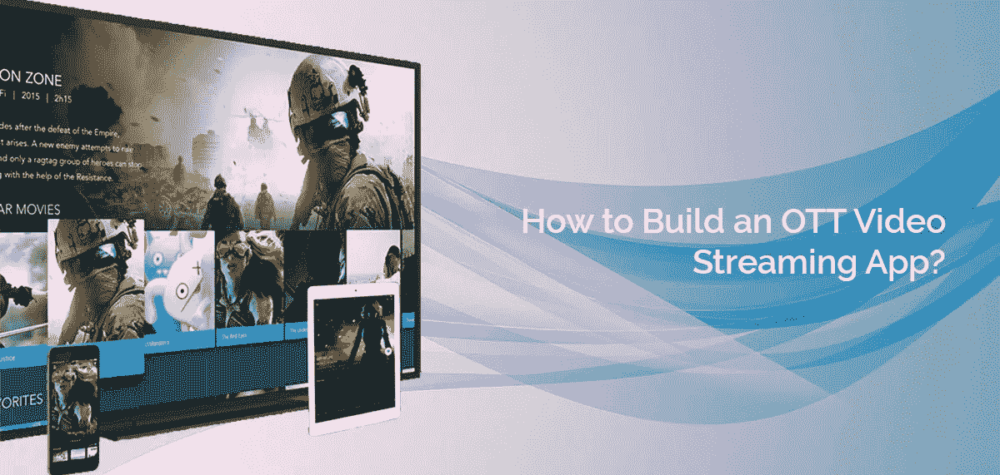
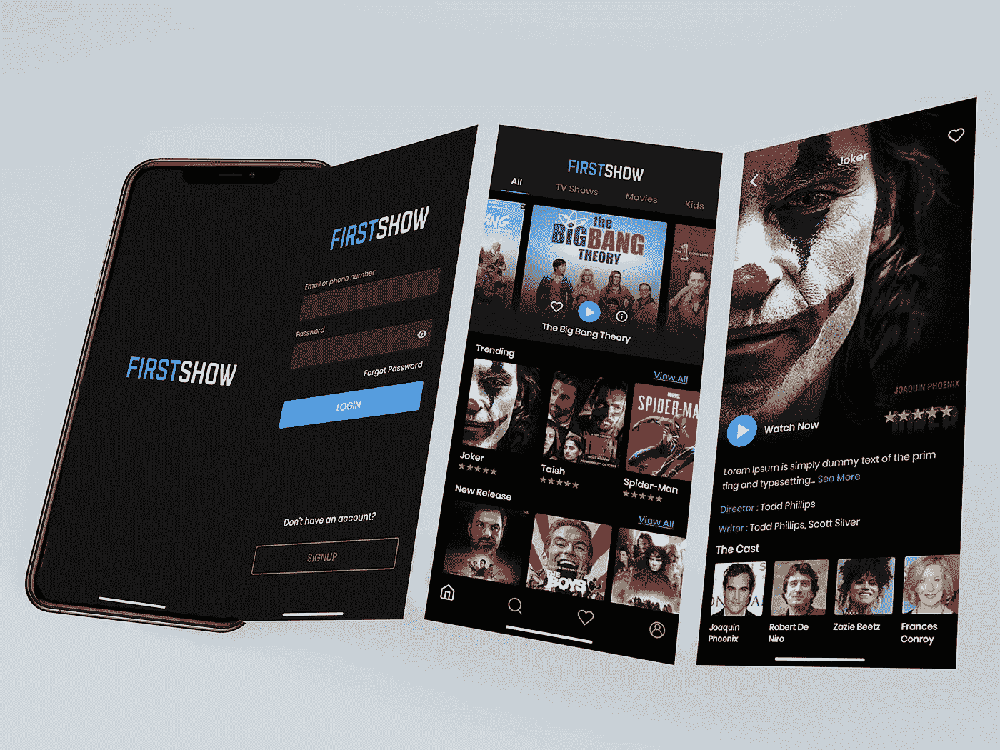

# OTT 应用开发-成本、特性、统计数据等！

> 原文：<https://medium.datadriveninvestor.com/ott-app-development-cost-features-statistics-and-more-aecc041da6a1?source=collection_archive---------1----------------------->

## 什么是 OTT 应用？

网飞和 Hulu 等 OTT (Over-the-top)应用程序已经颠覆了整个娱乐业。这些应用程序提供可以在电视、笔记本电脑、台式机和手机上访问的视频流服务。观看电影、电视节目和其他内容时的便利性和无广告体验是这些视频点播应用日益流行和需求背后的两个主要原因。

如果您正计划构建这样一个应用程序，那么本文就是为您准备的。在这里，我们提供了统计数据、关键特性、成本、盈利战略和其他信息，将有助于您开发 [OTT 应用。](https://www.quytech.com/ott-app-development-company.php)请查看以下内容:

## **视频流媒体应用——统计**

让我们看看这些统计数据，了解一下 OTT 应用的受欢迎程度:

*   *根据 Statista 的数据，预计到 2024 年，OTT 媒体收入将达到 1588.4 亿美元。这个数字在 2018 年是 678 亿美元。*
*   *另一份 Statista 报告显示，网飞是全球最大的 OTT 提供商，拥有超过 1.5 亿付费用户。*
*   *根据 Statista 的数据，到 2025 年，视频流的用户渗透率预计将达到 6.2%。*

## **视频流应用的主要特性**

查看以下 OTT (Over the top)应用的基本特性:

*   **报名并签到**

这个功能是必须的，让用户通过输入所需的信息进行注册。登录将帮助他们通过提供注册的凭据从任何设备登录到他们的帐户。注册后，用户将能够创建他们的个人资料，在那里他们可以检查他们的订阅细节和其他信息。

 [## 机器人-商业视角|数据驱动的投资者

### 一个晴朗的日子，你和你的小孩在公园散步，突然你注意到一个身体…

www.datadriveninvestor.com](https://www.datadriveninvestor.com/2020/08/19/robotics-a-business-perspective/) 

*   **多语言内容**

如果你想面向全球受众(大多数 OTT 平台都是这样)，确保平台上的内容是多语言的。简而言之，内容应该有不同的语言版本，这样用户就可以选择他们喜欢的语言。

*   **搜索**

搜索是帮助提供卓越客户体验的必备功能之一。该功能要求用户在平台上搜索不同的内容。他们可以通过在搜索栏中输入自己的名字来搜索电影、电视节目和其他视频。

*   **观察名单**

该功能将帮助用户添加视频、电影、电视节目和其他他们以后想看的内容。

*   **屏幕铸造**

该选项将帮助用户在他们的台式机、智能电视、笔记本电脑和其他兼容设备上播放内容。

*   **支付网关**

它需要允许用户按月或按年注册会员或订阅。确保你的应用。

*   **推送通知**

推送通知功能需要发送有关平台上新内容上传、订阅续订或到期详情等的通知。

你还可以添加其他基于人工智能的**功能，向用户推荐内容**(根据他们喜欢或看过的内容)。

# **如何创建 OTT app？**

要开发一个 OTT 应用或者视频流应用，你需要先决定技术栈。这包括选择正确的服务器、流媒体协议和安全系统。如果你是这个领域的新手，对 OTT 开发流程没有或了解不多，那么联系一家有经验的 OTT 应用开发公司，或者聘请有相关专业知识的专门开发人员。明智地做出选择，让你的钱物有所值。

# **OTT 平台开发的成本是多少？**

视频流应用开发的总成本取决于多种因素:

1.应用程序的功能和复杂性

2.移动应用开发公司或开发者的规模和地理位置

3.您要发布应用的平台

4.开发应用程序所需的技术堆栈

5.开发团队的经验

6.构建应用程序所需的时间

大致来说，你可能需要支付 25，000 到 45，000 美元来开发一个 OTT 应用。价格可能会根据您特定的应用程序要求而有所不同。

# **OTT 应用的盈利战略**

我们始终建议您提前设定盈利策略，以获得 OTT 应用的最大投资回报。大多数 OTT 平台通过订阅或会员计划赚钱。你可以选择相同的，或者向你的移动应用程序开发公司寻求其他建议。

> **立即开发 OTT 应用或视频流应用！**

**遗言**

如果您想开发一个 OTT 或过度媒体流应用程序，并想知道它的成本，那么这篇文章就是为您准备的。除了提到影响 OTT 应用程序开发总成本的因素，我们还提供了一些信息，如应用程序中应该有的基本功能、构建应用程序的推荐技术堆栈等。

从视频流应用程序开发开始，联系值得信赖的定制[移动应用程序开发公司](https://www.quytech.com/)或雇佣专门的开发人员。希望这篇文章有用！

## 访问专家视图— [订阅 DDI 英特尔](https://datadriveninvestor.com/ddi-intel)