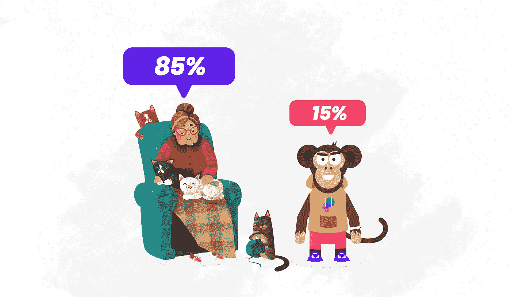

# 我们公司由 85%的奶奶和 15%的猴子组成

> 原文：<https://medium.datadriveninvestor.com/our-company-is-made-up-of-85-grandma-and-15-monkey-3c32ae48aa04?source=collection_archive---------24----------------------->

Our brand characters | Grandma one is a free illustration from the internet and the monkey illustration is created by us | Image provided by Author

你有没有想过你的品牌的核心？不，不是首席心脏官。

当你沉迷于品牌的主干(核心理念和价值观)和门面(主要是你的创始人或高管)时，很容易忘记这一点。

但是，在营销世界里，你的品牌核心不仅仅是必需品，而是至关重要的。

在我们公司编程英雄，我们有奶奶和猴子作为我们的品牌核心。

让我们一起探索如何找到你的另一半。

# 为什么需要一颗品牌的心？

心是各种情感的动力之源。因此它是人类彼此联系的地方和方式。对你的用户来说也一样。品牌的核心是让你独一无二的东西。这让你与众不同。这才是让你和用户产生联系的原因。这就是你的用户所能理解的。这就是让你的用户爱你的原因。

# 它应该与你的核心意识形态相关

心脏到处都与神经末梢相连，尤其是与脊柱相连。你的核心意识形态是你的脊梁，它也应该与你的品牌核心相连，因为它至关重要:[脊梁受伤甚至会导致更大的心脏风险](https://www.sciencedaily.com/releases/2011/10/111024084628.htm)，这意味着在你选择品牌核心之前，你的核心意识形态非常重要。

我们用有趣的方式教编程。那是我们的脊梁。因此我们的核心思想是**乐趣**。单词*猴子*或一只猴子的形象足以让任何人发笑(有趣)，单词*奶奶*在任何情况下都会因为惊喜感而照亮房间，此外，奶奶的睡前故事总是很有趣(有趣)。我们利用这一点。

 [## 抓住智能营销，获得巨大成果|数据驱动的投资者

### 网上的人都看过。每当人们在谷歌上搜索某样东西，他们最终都会与类似的广告互动…

www.datadriveninvestor.com](https://www.datadriveninvestor.com/2020/08/19/grab-on-to-intelligent-marketing-for-great-results/) 

# 在你的品牌中使用它

## 在您的应用程序/网站上

我们在应用程序中使用猴子插图来引导用户进行介绍，帮助用户进行一些查询，向用户显示下一条路径，等等。我们的用户是英雄，猴子是他们的支持者，他们的向导。

如果可能的话，也给它起一个名字。早些时候，当我们使用互联网上的免费插图时，我们称它为 Fibu，现在我们有了自己的角色 Mibu。

## 在你的社交媒体上

在我们的 YouTube 视频上，我们把奶奶当作我们的盾牌/钩子/心脏。我们通常从她开始录像。它总是根据视频变化。

**例 1:** “在进入细节之前，请喜欢这个视频否则奶奶会变成移民官，来到你家，你哪儿都不能动。”

**例二:**“如果你不喜欢这个视频，奶奶会偷偷给你闺蜜的女朋友发一条“我爱你”的信息，毁掉你们的友谊。如果你喜欢，把订阅按钮从红色变成白色，奶奶就准备和你亲热了。”

## 在你的任何营销中

当我们做游击营销活动时，我们在海报中使用了[一只猴子的形象](https://twitter.com/ProgrammingHero/status/1307813717917208578?s=19)，结果非常成功。

# 最后的想法

在这个竞争激烈的市场中，添加品牌核心不仅让你独一无二，而且令人难忘。你需要至少拥有其中之一。两个是加号。但是不要过度使用它们。

## 获得专家观点— [订阅 DDI 英特尔](https://datadriveninvestor.com/ddi-intel)