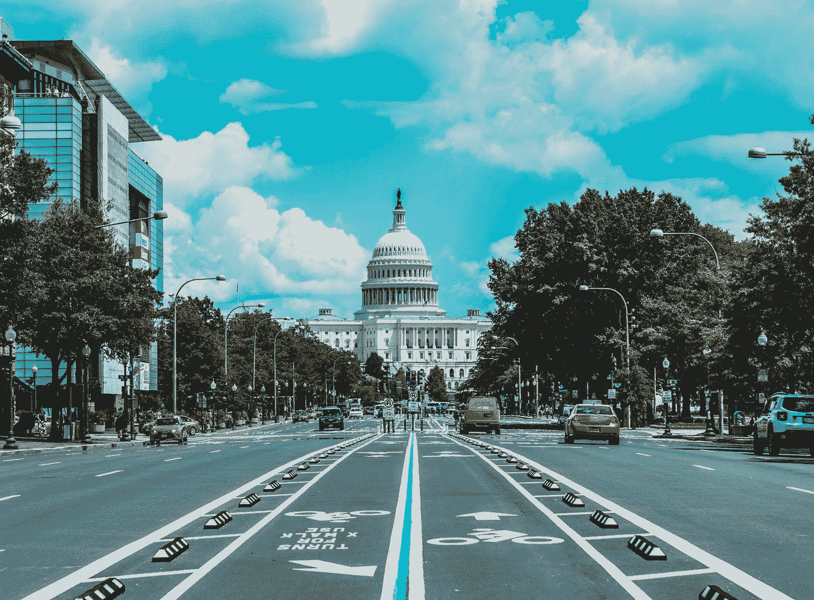

# 我们的冠状病毒救援工作做得非常好

> 原文：<https://medium.datadriveninvestor.com/our-coronavirus-relief-efforts-have-been-pretty-good-203e58b663c3?source=collection_archive---------26----------------------->

Photo by [Jorge Alcala](https://unsplash.com/@jorgeaalcala?utm_source=medium&utm_medium=referral) on [Unsplash](https://unsplash.com?utm_source=medium&utm_medium=referral)

一年的结束——也是新的一年的开始——常常给我们一个冷静思考的机会。在像 2020 年这样的一年之后，也许没有比这更好的时间来进行这样的心理训练了。随着最近的冠状病毒救助计划刚刚获得通过，特朗普也签署了，诚实地考虑国会和政府在解决今年的经济冲突方面如何应对疫情是值得的。

诚实的回答是，他们做得相当不错。

这有可能违背大众的共识。推特上和专家阶层的愤怒会让你知道，即使是民主党人也不关心你，600 美元的刺激支票一文不值，加拿大从 3 月开始每月向加拿大公民支付价值[2000 美元](https://twitter.com/_Jason_Dean_/status/1342540976196382720)的刺激支票(根据记录，他们没有)。

然而，与其他国家相比，假装国会的刺激计划完全没有帮助或者在某种程度上是可悲的是不诚实的。

正如新自由主义项目[所指出的](https://twitter.com/ne0liberal/status/1341694437349580800?s=10):迄今为止，政府的反应包括推出[1200 美元的刺激支票](https://www.nytimes.com/2020/03/19/us/politics/1200-dollar-stimulus-check-coronavirus.html)，另外一轮 600 美元的支票[刺激支票](https://www.nytimes.com/article/coronavirus-stimulus-package-questions-answers.html)每个孩子[延长](https://www.lawandtheworkplace.com/2020/04/cares-act-expands-unemployment-insurance-benefits/)失业保险期限(包括承包商的福利)[近一万亿](https://home.treasury.gov/policy-issues/cares/assistance-for-small-businesses)美元的购买力平价工资补贴[增加](https://fortune.com/2020/04/14/unemployment-benefits-file-claim-who-is-eligible-how-much-long-self-employed-independent-contractors-apply-states-credit-score-taxed-coronavirus-faq/)每周 600 美元的失业保险[补贴](https://www.clasp.org/publications/fact-sheet/paid-sick-days-and-paid-leave-provisions-ffcra-and-cares-act)  [暂停](https://www.forbes.com/sites/zackfriedman/2020/12/05/trump-pauses-student-loan-payments-through-january-31-2021/?sh=253702d246b1)学生贷款支付、[扩大](https://crsreports.congress.gov/product/pdf/IF/IF11497)佩尔助学金选择、[暂停驱逐](https://www.nytimes.com/2020/09/02/your-money/eviction-moratorium-covid.html)、对大部分旅游业的企业[救助](https://www.washingtonpost.com/business/2020/03/25/boeing-bailout-coronavirus/)、对学校、高等教育和艺术的[数十亿](https://www2.ed.gov/about/offices/list/ope/caresact.html)、SNAP 和食品援助项目的[延期](https://www.fns.usda.gov/disaster/pandemic/covid-19/snap-waivers-flexibilities)、疫苗资金的[数十亿](https://www.hhs.gov/coronavirus/explaining-operation-warp-speed/index.html)以及对 HBCUs 的[贷款豁免](https://qcitymetro.com/2020/12/22/whats-in-the-stimulus-package-for-hbcus-loan-forgiveness/)。

这还没有考虑最近[刚刚签署的](https://www.cnn.com/2020/12/27/politics/trump-relief-bill-christmas-eve/index.html)9000 亿美元救助方案的好处，其中[包括](https://www.cnn.com/2020/12/20/politics/second-covid-stimulus-package-details/index.html)，以及其他条款，另一轮刺激检查，延长失业救济至 3 月，以及延续《保健法案》中建立的许多救济福利的条款。

更引人注目的是，随着救助计划的实施，尽管国内生产总值下降了 10.6%，家庭收入却增加了。

总之，对佩洛西和民主党人或麦康奈尔的昧着良心的共和党人的愤怒更多的是戏剧，而不是现实的代表。美国发放救济和应对新冠肺炎疫情的方式存在一些合理的问题，这些问题值得讨论。然而，提供救济的意愿根本不是这些问题之一。

此外，不停地叫嚷我们收到的只是 600 美元是不诚信的营销——主要是由我们左倾公民中要么全有要么全无的社会主义者所做的——完全没有帮助。

事实上，对于那些面临驱逐的人来说，这几乎花费了数百万失业救济金和住房保障。当然，随着全国各地不断发生的停工事件，这将意味着那些无法合法工作的人的绝望——所有的刺激检查(顺便说一下，这在 3 月份之前并不是一种缓解形式的持续目标)。

有些人可能会说，这只是他们帮助美国工人的左翼热情的一种表现。其他人可能会认为这种适得其反的脾气足以让他们想起左翼是多么不认真地乐于助人。

我本人属于后一类人，但每个人都有自己的看法。

最终，关键的一点是:国会的反应并不完美，但它远不止“仅仅 600 美元”，我们应该停止假装不是这样的。来自两党协商的政治现实和限制是需要处理的项目，应该纳入我们对我国救灾工作的评估范围。

这种可怕的言论只是美国近期政治中的一个例子。希望今年天气会变好。

**进入专家视角—** [**订阅 DDI 英特尔**](https://datadriveninvestor.com/ddi-intel)