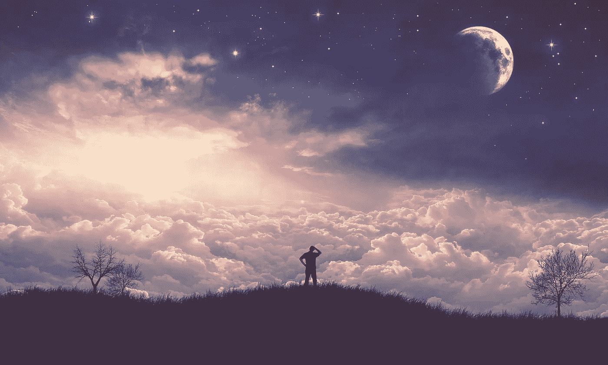
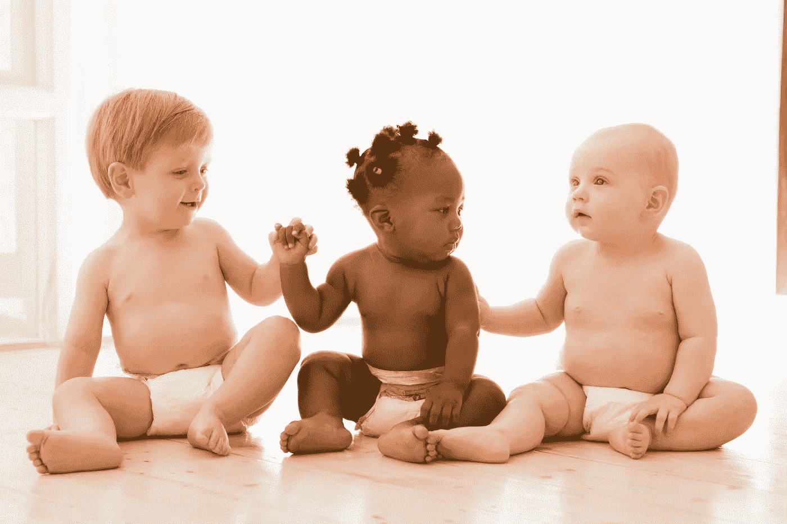

# 我们对彼此和自然的破坏性倾向

> 原文：<https://medium.datadriveninvestor.com/our-destructive-tendencies-to-each-other-and-nature-4128e575aa1b?source=collection_archive---------15----------------------->

我们很幸运能生活在这样一个异常完美的星球上！

空气正是我们肺部所需的化学物质的混合物。嗯，我们最近搞砸了…但仍有一些地方我们可以自由呼吸。

我们有很多水！在一些地方太多，而在另一些地方有时太多。

而且温度刚刚好——至少在某些时候某些地方是这样。

人类已经在地球表面行走了一眨眼的地质时间——大约 600 万年，也就是我们现在的 25 万年。如果我们的星球和我们的世界寿命更短——我们永远不会站起来，也不会有足够大的大脑来反映我们在这里活着是多么幸运。

人类是地球上最幸运的生物！

我们的大脑和身体使我们能够承受无数的挑战，创造出非凡的成就。

我们能够在世界各地不同的环境中生存，甚至是像南极洲这样最恶劣的环境。我们战胜了许多可怕的疾病和瘟疫，战胜了天灾人祸。我们创造了令人印象深刻的技术、设施、药物、交通、令人鼓舞和印象深刻的艺术作品、音乐、游戏……我们正在成长，似乎每天都有许多关于如何更快发展的新想法。

每天，我们砍伐森林，破坏其他自然区域，把其他人和其他物种赶到越来越小的空间，濒临灭绝和死亡。

最近，我们被骗去相信人类本质上是自私的这一普遍假设。如果只有最强的生存下来，我们不得不变得无情，不得不相互竞争资源，并在一生中尽可能多地积累权力和财产。

如果我们善待他人，通常是因为我们有一些动机。如果我们被认为是好的，那只是因为我们学会了控制和超越我们与生俱来的自私和残暴。

你可能会问，我们不总是野蛮和自私的吗？

很久以前的史前时代，世界人口非常稀少。我们可以假设资源对于狩猎采集群体来说是丰富的。有人估计，15000 年左右，欧洲人口只有 29000 人左右，全世界人口不到 50 万。

史前的狩猎采集群体似乎不太可能不得不相互竞争，或者有任何发展残酷和竞争的需要，此外还会发动战争…

如今许多人类学家都同意，战争是人类历史的晚期发展，起源于最初的农业定居点。

例如，南非的孔布希曼人在打猎前交换箭，当一只动物被杀死时，谁射出的箭并不重要，功劳归于箭的主人。如果一个人变得过于傲慢，群体中的其他成员就会排斥他们。

因此，似乎没有什么理由假设种族主义、男性统治和战争等特征是进化的产物——因为它们对我们没有什么好处。表现自私的个体不太可能生存下来，因为他们会被群体排斥。

更有意义的是，合作、利他主义和和平主义是人类的天性。这些特征在人类生活中已经普遍存在了几千年。

希望这些特征在今天的我们身上仍然很强…

几千年来，哲学家和普通人一直在争论我们是有被社会腐蚀的善良本性，还是有被社会控制的邪恶本性。他们还没有找到一个明确的答案。

所以，我们可能会看看可爱的婴儿，那些受文化影响绝对最小的人类，希望能解开这个谜……当他们想要更多的关注时，他们可能会有点控制欲，但是……他们会故意伤害某人或某物吗？美国耶鲁大学进行了实验，科学家们观察婴儿的思维。他们的研究结果表明，即使是最年轻的人类也有是非感，以及偏好善胜于恶的本能…

有没有可能干预我们不断发展的思维的本质，让每个人都建立更好的理解世界的能力？天真？也许…但是如果我们知道我们的基本本能是喜欢友好的意图而不是恶意的，那就有理由抱有希望。

如今，随着人口增长，社会面临着极端的环境挑战，应对这些挑战应该成为社会未来关注的中心。如果我们对自己善良的本性失去希望，很难想象我们能够克服任何障碍。

全世界大约有 4.76 亿土著人，分布在 90 多个国家。他们可能会被视为贫穷、文盲和弱势群体……然而，他们的生活方式、个人行为、消费模式和价值观在与自然环境的互动中成长和成熟。

他们努力与自然和谐相处，并有保护自然的丰富传统。我们能从他们身上学到的是对生态系统和维持生态系统的因素的非凡理解。

许多年过去了，但是他们遵循着旧的规则，那些至今仍然适用的规则。

中国古代夏(公元前 2070-1600 年)的环境法规定:

“在春天，不要放弃山林中的斧子，让树木生长；夏天，不要在河流和湖泊中撒网，以便让鱼和乌龟生长”

土著人民保护着世界上 80%的生物多样性，他们拥有如何适应、缓解和减少气候和灾害风险的专业知识。

不公平的是，最关心自然的人面临着气候变化影响的更大风险，因为他们往往生活在环境敏感的生态系统中——热带森林、草原、北极地区、山区或沙漠——并且依赖周围的生物多样性来维持他们的身体、物质、文化和精神福祉。

土著知识和环境管理实践可以为应对生态挑战、防止生物多样性丧失、减少土地退化和减轻气候变化的影响提供宝贵的见解和工具…

但是，世界其他地方能够倾听吗？

所有领域的革命和全球化的到来对我们的文化产生了影响。我们不崇拜太阳、风、土地、树木、植物和水，尽管它们仍然是人类生存的基础。

尽管经济增长和发展对任何国家的进步都至关重要，但这一过程大多是以环境退化为代价的。

人类正在努力向自然靠拢，这是令人振奋的。关于这个主题有大量的电影、绘画、展览和讨论。但是这些努力就足够了吗？它们会有助于培养对自然的真正同情吗？

环境文化的定义是

“一个社会在维护或保护其自然资源、生态系统和所有其他影响人类生活的外部条件方面的习得行为、态度、实践和知识的总和。”

“人道”这个词的特点是温柔、怜悯和对人和动物的同情，尤其是对遭受痛苦或悲伤的人。它还表明，人类表现出慷慨、同情、宽容、尊重、仁慈和正直等特征。

然而，没有一个人类社会能够完全避免仇恨行为和态度。就在今天，世界各地发生了数百起暴力事件和战争。

这意味着，虽然富有同情心和爱心，但人类有必要表达不人道的仇恨和暴力。

认为我们也能赢得这种信任是天真的吗？也许…

但是，许多令人鼓舞的研究表明，我们可以克服我们的破坏性倾向:好斗的孩子可以被教导成为和平、自私的——学会分享和合作，而今天的敌人可以学会相互同情。

我们的情绪可以是积极的，也可以是消极的。积极的会培养我们的承载天性，消极的会助长我们的仇恨和愤怒。难道不该由我们来选择吗？

显然，我们可以减少对彼此和自然的破坏性倾向。我们有头脑，现在我们需要意志！