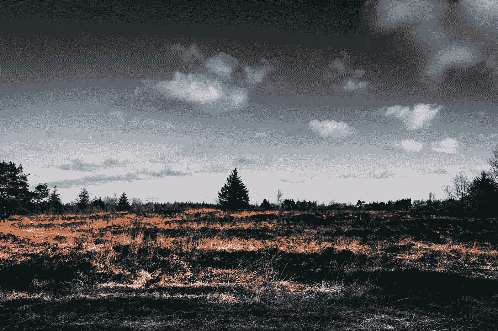

# 我们的生活无关紧要。

> 原文：<https://medium.datadriveninvestor.com/our-lives-dont-matter-d8e24be6e258?source=collection_archive---------12----------------------->

## 对于 90%的美国人来说，GDP 只是衡量总利润的一个指标。

Photo by [Matthis Volquardsen](https://www.pexels.com/@einfoto?utm_content=attributionCopyText&utm_medium=referral&utm_source=pexels) from [Pexels](https://www.pexels.com/photo/brown-open-field-2305169/?utm_content=attributionCopyText&utm_medium=referral&utm_source=pexels)

一位亿万富翁将她的在线零售业务转移到一个只有 9 个公民的贫穷小国，将会瞬间成倍地增加这个国家的经济财富。商业运作、生产、采购和投资将表明该国的国内生产总值(GDP)正在快速增长，但财富不会影响人民的生活，除非它得到分配。这位亿万富翁可能会创造服务岗位，但工资会很低，工作技能低，政府扣除的所得税会以“创造就业”的名义用于帮助亿万富翁的企业。

最终，亿万富翁的财富助长了权力，旨在误导公众的“信息”运动，以及禁止无限政治捐款的监管缺失，允许合法资助承诺限制最低工资、环境监管和劳工权利的政客。如果这个故事听起来太熟悉了，那是因为它确实如此。在过去的四十年里，美国的经济增长和 GDP 的增长并没有为 90%的美国人创造财富，而企业利润的份额却在飙升。所得税减免重新分配给大企业，而不是教育、医疗保健、公园、图书馆、环境和社区等公共产品和服务，为企业所有者带来了更大的利润，但剥夺了美国人的财富和时间，并建立了一个按劳付酬的结构。

政府、(一些)经济学家和金融投资者使用 GDP 作为经济健康的指标。在一国境内生产、购买、投资和/或销售商品和服务可以提高 GDP，但无偿的家务劳动、看护和志愿服务却被忽视了，因为它们是无价的……？或者它们被可怕地贬值，而财富差距、工资、歧视、人权、社会福利、就业机会/创造、债务、政治稳定、环境恶化、创新、教育、传染病控制、生活水平和公共服务对 GDP 没有贡献，因为它们不产生货币价值。美国的所得税不是给那些不想工作的懒惰的游戏玩家，而是给那些极度需要它的亿万富翁垄断者。

商品和服务的生产和销售，以及出口商品多于进口商品，是额外的 GDP 红利，但提供可维持生活的收入以购买必要的商品却没有被考虑。工资继续下降，因为就业机会、政府在公共产品上的支出和企业劳动力市场投资在 20 世纪 80 年代都消失了，但不要担心！随着工资暴跌，企业利润对 GDP 增长的贡献肯定了经济正朝着正确的方向发展，拥有 80%股票的 10%美国人从股市获得的两倍、三倍和四倍回报表明一切都很好。当股票市场为股东积累更多财富时，很明显每个人都很好。很好。

对于 90%的美国人来说，GDP 的增长和股市金字塔计划的回报毫无意义，因为收益并没有让他们受益，他们的财富已经下降了 40 年。美国人的财务健康状况取决于他们是否有能力在不使用信用卡购买食品杂货的情况下进入下一个支付周期。政府/高盛声称经济将迅速复苏，因为有弹性的服务业将有助于强劲的 GDP 增长，这排除了数百万美国人从杂货店偷食物，不吃饭，被赶出家门，受到收单员的骚扰，与公用事业脱节，依赖慈善机构生存，面临无望的就业市场。

> 欢迎来到美利坚合众国！世界上最大的经济体，最高的 GDP，G7 国家中收入最不平等的赢家。

Covid 之前，通过吹嘘国内生产总值的积极增长和繁荣的股票市场来激发消费者信心可能已经达到了目的，但 90%的美国人并不盲目。除非美国买一个更大的地毯，否则虚假的财富虚构无法扫除廉价破旧地毯下的巨大贫困山，但在美国人身上花钱偏离了他们的议程。掩盖这场灾难可能比修复它更昂贵，它被忽视的时间越长，它将变得越糟糕。最终，涓涓细流将会涓涓细流，而那 10%靠辛勤工作的美国人积累财富的美国人将会感受到压力。

伟大的美国经济不是由少数人建立的，政府很快就会意识到唯一“大到不能倒”的企业是 90%的美国人。美国人集体致力于经济的时间创造了世界上最高的 GDP、持续的经济增长和填满亿万富翁口袋的钱。如果没有大量的工蜂，美国和外国的亿万富翁就不可能积累起巨额财富，Covid 已经证明，即使是经济崩溃也不会对他们的钱包造成影响。当美国人站在或坐在车里等待食物捐赠时，美国亿万富翁们不仅保护了他们的财富，他们还在疫情期间增加了 1 万亿美元。

几个百万富翁和一个可靠的计划合作进行了大盗窃，收买被选举出来代表人民的政治家是最容易的部分，但是美国人并不是独自生活在这个地狱里。数十亿人正在忍受同一个噩梦的不同版本，但他们无能为力，因为协调大规模的人口流动几乎是不可能的，等待另一个 40 年的政府推翻对他们有利的系统，是一个缓慢，痛苦的死亡。