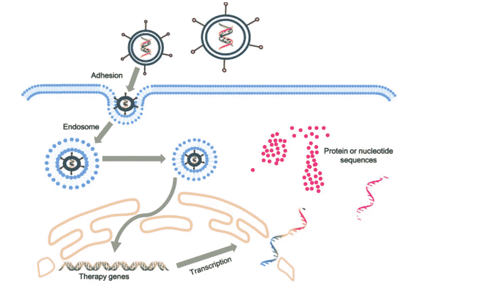

# 我们对抗 COVID19 的新武器——基因疗法。

> 原文：<https://medium.datadriveninvestor.com/our-new-weapon-in-the-war-against-covid19-gene-therapy-d70a9762ca1a?source=collection_archive---------18----------------------->

COVID19 战争中最安全的疫苗策略之一也曾用于培育设计婴儿。

[Volodymyr Hryshchenko](https://unsplash.com/@lunarts)- Unsplash

在这场针对 COVID19 的战争中，大约有 90 种疫苗正在开发中。游戏中的一个大人物是基因疗法。基因疗法是使用生物技术的最古老和最有效的治疗形式之一。

宾夕法尼亚大学的一组科学家——由基因疗法先驱詹姆士·威尔森和他的研究生卢克·范登堡(Luk Vandenberghe)领导，后者二十年前曾在威尔逊的实验室工作。Vandenberghe 很想知道他与 Wilson 合作的研究(涉及开发基因治疗载体)是否可以用作针对 COVID19 的潜在疫苗。

在我们谈论 COVID19 和疫苗之前。

# 什么是基因治疗？

顾名思义，基因疗法是将某些基因或短 DNA 序列引入你的身体或细胞，以产生某种变化。无论是为了触发你的免疫力，进行基因改变以帮助你对抗遗传疾病，可能是镰状细胞贫血症或肌肉萎缩症或任何其他疾病。

有几种基因疗法，其中最受欢迎的一种是 CRISPR/Cas9，它因被用于创造设计婴儿而闻名。是的，科学确实可以做到这一点，我们可以在实验室里为婴儿定制你想要的每一个特征。当然，这是非法的，但这意味着任何人都可以定制他们婴儿的基因特征。

> 但是，这里讨论的这种特殊的基因疗法是使用病毒。特别是腺病毒。

在正常情况下，病毒进入生物体，将它们的遗传物质引入宿主细胞，并欺骗它认为它的宿主 DNA。然后 DNA 在宿主体内复制，病毒繁殖。

这也是科学家们将要用来治疗 COVID19 的技术。

 [## 冠状病毒；惊慌失措；字里行间的 z |数据驱动的投资者

### 围绕冠状病毒的话题；更准确地说，新冠肺炎几乎占据了整个新闻预报的头条…

www.datadriveninvestor.com](https://www.datadriveninvestor.com/2020/03/23/coronavirus-a-to-panic-z-between-the-lines/) 

# 这将如何对抗 COVID19？

腺病毒会携带冠状病毒的 DNA，而不是自身的 DNA。唯一的问题是，将腺病毒引入人类进行基因治疗有时并不安全，会导致危险的免疫反应。这是一种特殊形式的腺病毒，叫做 AAV-来自猴子的腺相关病毒。这种 AAV 一旦进入细胞，就会引发特殊的免疫反应。根据 Wilson 的说法，AAV 的一大优势是它的“安全性”。

[https://www.sciencedirect.com/science/article/pii/S2352304217300272](https://www.sciencedirect.com/science/article/pii/S2352304217300272)

科学家们将要使用的精确方法。首先以 AAV 腺相关病毒为例，引入一段 COVID19 DNA，特别是帮助它感染我们细胞的部分，如其表面的刺突蛋白或任何其他感染区域。

腺病毒然后将 DNA 释放到细胞核中。这种病毒和 DNA 一起被认为是外来实体或传染性病原体。通过激活免疫球蛋白、细胞因子和许多其他负责保护身体的蛋白质分子等一系列免疫反应，立即导致我们的身体做出反应。

这种免疫反应将是针对 COVID19 的疫苗。

一旦我们的身体熟悉冠状病毒，它将能够利用现有的抗体做出相应的反应，并在我们被感染的情况下对抗病毒。

目前，这项研究还处于初级阶段。它已经在老鼠身上试验过了，并取得了成功。一个月内将在猴子身上进行试验。他们的七种基因疗法中的两种已经准备好进行人体试验，并将很快进行。

# 和其他疫苗有什么不同？

随着近 90 种疫苗被开发用于对抗 COVID19，一个主要问题是这种疫苗与其他正在开发的疫苗相比有什么不同，因为它已经晚了。

在接受 STAT 采访时，范登堡说，

> “是的，与一些先行者相比，我们落后了大约六个月，但最终我们将需要一种高度安全、高效且高度可扩展的产品。我们相信，我们在这三个类别中都勾选了复选框。”

在《纽约时报》的另一篇文章中，他说“我们呈现的是一个与众不同的角度。”

因为 AAV 或腺相关病毒载体已经是一种被批准的基因治疗形式，以前用于脊髓性肌萎缩症，甚至用于治疗血友病。这是人类最广泛使用的基因疗法之一。

由于这种安全水平是大多数基因疗法治疗中的区分因素，这很可能成为针对 COVID19 的有效疫苗选择，但只有时间和大量研究才能确定这一点。

**进入专家视角—** [**订阅 DDI 英特尔**](https://datadriveninvestor.com/ddi-intel)