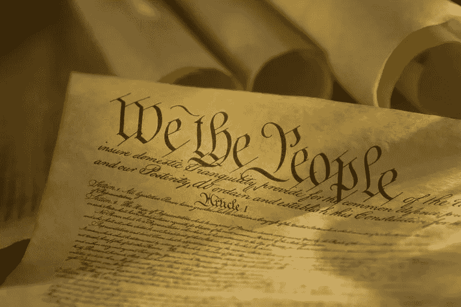

# 我们在疫情的社会契约

> 原文：<https://medium.datadriveninvestor.com/our-social-contract-in-a-pandemic-1327b63467d1?source=collection_archive---------14----------------------->

2020 年 4 月 10 日

当我写这篇文章的时候，新冠肺炎已经夺走了比我有生之年“看到”的更多的人的生命，死亡人数和恐惧人数持续上升。

当我们努力寻找生活中的常态时，我们发现自己受到本能的支配。但是在这样做的过程中，我们感觉自己就像一只奔跑的仓鼠，却永远也到不了任何地方。在我们注定要失败的尝试中，我们生活的荒谬带着微笑怒视着我们。我们看着它，不忍心面对它。

我们问自己“我们是如何走到这一步的？”“谁/什么该对此负责？”

在提问的过程中，我们得到了答案:新冠肺炎。

俗话说“有求必应”，这句话常常是对的，但得到的答案又有多少是“真的”呢例如，我们试图证明新冠肺炎是如何剥夺我们的自由、安宁和物质享受的。我们想到这个疫情是如何杀死了成千上万的人，停止了我们的经济，并在系统中引入了混乱。我们相信我们的正常生活被夺走了。但是难道我们没有听到我们内心的声音说“ ***从来就没有正常的生活*** ”

“正常是我们被动物猎杀，正常是我们生活在小部落，正常是人们死于你一无所知的疾病，正常是生活在对每一个实例的恐惧中，正常是' ***自然状态*** 。”在人类试图逃离“自然状态”的过程中，我们用我们的 ***社会契约*** 的束缚缝成了一层薄薄的面纱，将自己包裹起来。但随着时间的推移，我们学会了不去看到保护我们的面纱，而认为这是生活中固有的一部分。我们忘记了把它撕成碎片或烧成灰烬是多么容易。也许这就是为什么我们含蓄地认为新冠肺炎夺走了我们的常态:一些从来不属于我们的东西。

我发现研究社会系统在危急时刻如何运作很有趣。因为你可以清楚地看到国家和人民是如何在无政府状态和威权主义之间周旋，以保持“社会契约”的完整。人性的多样性通过不同人群的行为表现出来。

 [## 释放结果的简单哲学|数据驱动的投资者

### 这是我们播客中帕迪·布鲁斯南的一段话。帕迪是一个正念和冥想老师，一个…

www.datadriveninvestor.com](https://www.datadriveninvestor.com/2020/03/16/a-simple-philosophy-to-unlock-results/) 

有些人认为有总比没有好，并最终依赖于他们认为强大、可靠和永恒的东西，即使这会以牺牲他们的公民自由为代价。他们成为自己非理性恐惧的牺牲品，屈服于绝对实体做出的承诺。一些人找到宗教，而一些人向他们的政治家“祈祷”,不管是什么安慰他们。你会发现这些人在争论政府如何正确地行使他们的权力。你会发现，这些人喜欢他们的领导在做“一些事情”:不管在“正常”的情况下多么不可容忍。事实上，拯救我们的方法可能是严厉废除我们的公民自由，但他们没有意识到独裁主义在这条路上等着他们。难道他们不明白他们给领导人的权力可能会玷污他们吗？难道他们没有听说过“绝对的权力导致绝对的腐败”这句话吗也许他们有。也许他们知道他们选择的道路可能会通向地狱，但对他们来说，这将是一个“有序”的地狱。也许他们会随时随地选择那条路，而不是回到“自然状态”的路。

然后还有另一群人，他们真的很愚蠢，根本看不到更大的图景。他们执着于自己的个人欲望，要求世界围着他们转。他们是你发现的主动违反推荐的社交协议的人，只是为了他们可以在阳光下度过一天。他们就像电影中的人，我们对他们大喊大叫，他们的完全缺乏能力和傲慢继续让我们所有人震惊。对这群人来说，再多合理的愤怒也不够。

还有一群人认为社会已经崩溃。他们已经看到和听到社会契约痛苦的死亡，并正在准备。因为他们不会不战而降，他们心里知道“自然状态”将成为新的常态。他们中的一些人一直在积极等待世界末日的到来，因为他们想回归“自然”。也许这就是人们购买枪支、弹药和武器的原因，如果使用它们的时机到来的话。但是难道他们没有意识到“自然状态”是无处可去的吗？难道他们没有意识到，当大自然冰冷的目光向他们袭来时，他们会多么快地怀念我们社会的温暖吗？难道他们没有听说过这样一句老生常谈的话:“大自然的牙齿和爪子都是红色的。”

还有一些人相信社会契约的力量，并会在它破裂的地方努力修补它。当他们愚蠢地修补社会契约时，他们接受了荒谬的目光。他们是带着最大的快乐和幸福度过每一天和每一刻的人，即使他们做的事情可能无关紧要。他们是相信我们会用爱和同情度过任何危机的人。他们是冒着生命危险去拯救他人的人。他们会为一个无名的人哭泣，为别人的孩子捐款，无私地为大众的利益奉献自己。

从某种意义上说，它们很愚蠢，不会在“自然状态”下生存。但我们不都知道我们所拥有的社会和我们所穿的毯子都归功于他们吗？也许我们知道这一点，并希望我们足够明智地感谢他们将我们从“自然状态”中拯救出来。因为这些人是霍布斯忘记包括在他的“自然状态”中的。

据说一个东西的强度是在它断裂的时候衡量的。所以这个新冠肺炎是对我们社会契约的一个考验。离崩溃还有多久？还是会土崩瓦解？