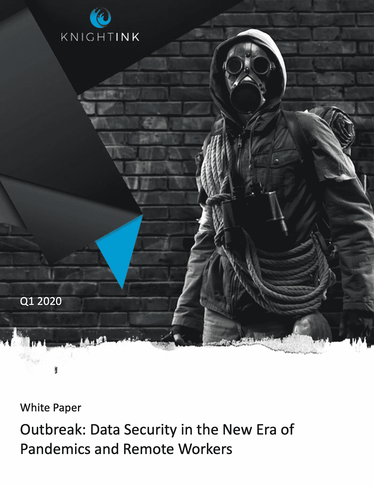
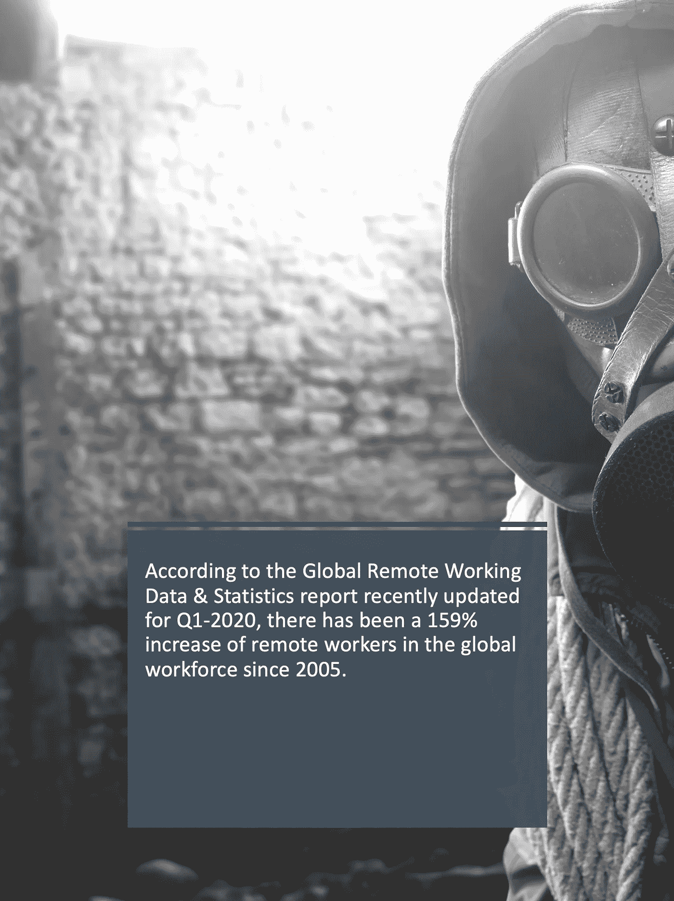
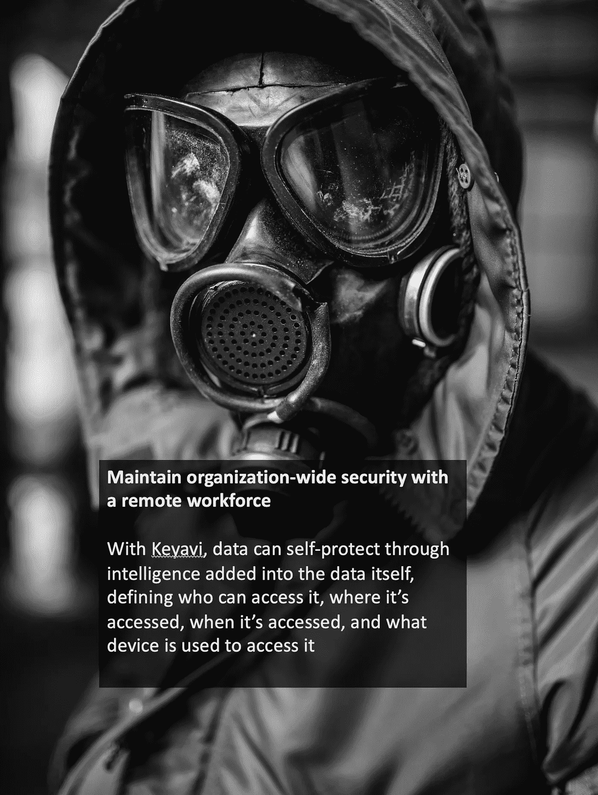

# 爆发:流行病新时代的数据安全

> 原文：<https://medium.datadriveninvestor.com/outbreak-data-security-in-the-new-era-of-pandemics-741500a3b482?source=collection_archive---------5----------------------->

# **摘要**

本白皮书讨论了新一代数据安全解决方案，这些解决方案解决了传统数据丢失防护(DLP)解决方案在保护敏感数据方面的不足，在当今云优先和软件即服务(SaaS)的经济中，这些解决方案已不再有效。数据现在是移动的，能够在内部网络、云工作负载和 SaaS 提供商之间移动。事实是，网络和端点 DLP 解决方案已经变得无效，因为随着网络边缘的解体，数据不再停留在企业内部网络的范围内。

在一个流行病肆虐、远程工作人员不断增加的新世界中，数据必须能够流向任何需要的地方，并且仍然能够保护自己。

试图控制其数据的组织会损害企业在当今的“即服务”经济中充分有效地运营的能力。

 [## 为什么加密对日常生活至关重要？数据驱动的投资者

### 你几乎每天都要输入密码，这是你生活中最基本的加密方式。然而问题是…

www.datadriveninvestor.com](https://www.datadriveninvestor.com/2020/02/10/why-encryption-is-critical-to-everyday-life/) 

由于预计未来几个月美国新冠肺炎病例的数量和严重性将继续上升，疾病控制中心(CDC)发布了针对企业和雇主的官方指导，以准备工具和资源，使出现在家工作所需的疾病症状的员工能够在症状消失前工作，并指出“对于能够远程工作的员工，主管应鼓励员工远程工作，而不是到工作场所工作，直到症状完全消除。确保您拥有必要的信息技术和基础设施来支持可能在家工作的多名员工。”(疾病控制中心，2020 年)

# **简介**

流行性感冒是指在人群中传播的传染病数量突然增加，超过该地区的正常预期，而疫情是指在一个大区域内蔓延的流行病，通常是跨国的。随着全球新型冠状病毒(新冠肺炎)感染人数超过 109，965 例，相关死亡人数超过 3，824 人(约翰霍普金斯大学系统科学与工程中心，2020 年)，在撰写本文时，公司正在迅速采取行动，试图通过要求员工在家工作来保护员工及其家人的安全。华盛顿金县，大西雅图地区，现在是美国最大的感染中心。作为对员工安全问题的回应，总部位于西雅图地区的微软加入了最近宣布要求员工在家工作的公司行列。Twitter，Amazon，甚至 NASA 最近也宣布要求员工远程办公。

随着该国不同地区感染率的上升，作为一种预防措施，在家工作的员工数量也将增加。随着数据从内部网络和云工作负载转移到员工家中，这些措施导致组织对公司商业秘密和知识产权的数据安全性感到担忧。

**M** 与此同时，随着我们日常工作生活的变化，网络安全领域的不同垂直技术也在发生变化。首先，随着签名转移到机器学习模型，从防病毒到端点检测和响应(EDR)解决方案，从网络入侵检测到网络检测和响应(NDR)的演变开始，现在，从数据丢失防护(DLP)到数据安全解决方案。传统的 DLP 解决方案正在成为保护数据的传统解决方案，因为数据现在可以在由内部、云和 BYOD 资产组成的多孔基础架构中移动，因此必须允许在任何地方传输、处理和存储。

无可争议的事实是，在当今的云和软件即服务(SaaS)经济中，不能再期望数据停留在一个地方。

解决方案已经开始进入市场，例如 Keyavi 的技术，它使数据能够做到不可避免的事情，被共享、移动或丢失。

有史以来第一次，市场上出现了一种从根本上改变数据的解决方案，使数据能够自我保护和自我感知。

Keyavi 没有试图在端点和网络层提供数据安全性，而是开发了一种方法，使数据本身能够实时决策，例如是否应该允许试图访问数据的人，或者是否试图在未经授权的资产上或在不允许的地理区域打开数据。

# **远程办公**

**远程工作人员的成本节约**

允许远程工作对公司底线的积极影响是不存在的。

13%的远程员工总体工作效率更高，因病假而错过的工作更少，休息时间更少，到 2030 年，由于提高了工作效率并降低了管理费用，这将节省大约 4.5 万亿美元。

然而，随着远程工作带来的生产率提高和成本削减，如何让远程工作人员能够安全地远程访问公司敏感数据，同时保持数据的机密性、完整性和可用性，这一挑战已成为当务之急。

# **数据安全的兴起**

作为一种解决方案，数据丢失预防并未预见到如今如此迅猛的数据增长和使用量。

事实证明，DLP 无法确保通过技术和管理控制来适当保护业务关键数据，例如需要由法定和监管合规法律保护的知识产权、商业秘密和受监管数据。

DLP 可确保访问数据的人员获得授权，敏感数据不会被错误或故意泄露给无权访问数据的人员，并且数据的位置对处于静止、动态和使用状态的企业都是已知的。

数据安全解决方案必须解决的三个最关键的能力是:它是否可以用于结构化或非结构化数据；如果它支持本地、云和 SaaS 部署；支持企业支持的众多操作系统；如果传输中的数据、使用中的数据和移动中的数据受到保护。

# **DLP 的淘汰**

传统的 DLP 方法假设数据只存在于它提供保护的区域，例如员工所在的本地或用户当前使用的终端，例如公司发放的笔记本电脑。

然而，在 2020 年，企业商业秘密、敏感数据、知识产权和其他敏感数据可以存在于第三方 SaaS 平台上，如 SalesForce 或 Workday，或者 AWS 或 Microsoft Azure 上的云工作负载中。

这使得本地 DLP 解决方案效率低下。一个新时代的数据安全解决方案需要应对当今随时随地的动态数据。

就像它对 DLP 市场的未来有自己的水晶球一样，Gartner 在 2018 年宣布，它将不再发布企业 DLP 魔力象限，而是将其转移到一个市场指南，该指南认为由于市场成熟度、收购和市场退出，市场停滞不前，同比变化很小。(柯尼希，2019 年)

当今的企业领导者必须能够识别和处理与远程员工相关的风险，尤其是在当今流行病肆虐的时代，全体员工可能几周甚至几个月都无法回到办公室。

# **进入自我意识**

对于传统的 DLP，敏感数据的安全性取决于其存放位置和传输方式。

有史以来第一次，数据可以脱离数据所有者的掌控，并保持安全。

通过将自我意识和自我保护嵌入数据本身，DLP 现在在这个数据不断变化的新世界中的数据保护方式上已经过时。

Keyavi 将智能嵌入数据本身，使数据能够询问试图访问它的人“你是谁，我在哪里，我何时被访问？”

如果这些答案中没有一个与数据所有者定义的策略相匹配，它可以阻止试图访问它的个人的访问，或者可以自毁(如果由策略定义的话)。

# **结论**

仅在过去二十年中，我就见证了不同网络和终端安全控制的几次演变，这是人类对知识的渴求在网络安全中推动的。

我们的想象力已经将技术产品化，这些技术在与民族国家和非国家支持的行为者的持续战斗中继续发展，这些行为者利用不对称作为对抗美国军事优势的唯一可行策略。今天，国家和非国家资助的行动者知道他们无法在陆地、海洋和空中与美国进行军事竞争，因此已经转移到网络空间，在那里任务成功的几率在攻击者和防御者之间更加平均地分布。

网络战线上的对手在战术、技术和程序上与我们的技术创新同步发展，这些技术旨在检测和阻止他们继续资助这一目前价值数十亿美元的非法经济，这一经济除其他外还资助跨国犯罪，如人口贩运、恐怖主义和国际毒品贸易。

如今，数据比石油更有价值，吸引着一心想要窃取数据并将其货币化的对手。随着每天创建超过 2.5 万亿字节的数据，这留下了大量可供争夺的资金。

尽管我们尽了最大努力，但这种试图使用人工智能和机器学习来提升我们作为数据盗窃不和谐捍卫者的与对手的跳跃游戏让我们看到了新的希望。

最近，我对机器学习的进步和不断增长的数据湖所创造的技术和能力感到兴奋。但这些都没有比 Keyavi 推向市场的技术更让我感兴趣。

在我从事网络安全工作的 20 年里，我从未见过技术给数据本身注入生命，赋予它自我意识和保护自己免受威胁的能力，无论这种威胁是一种新的电晕病毒还是创造它的人类。