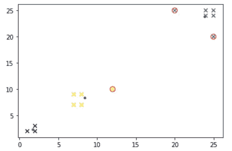
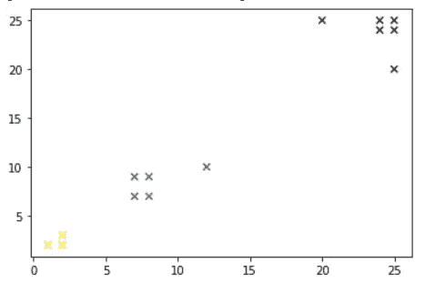
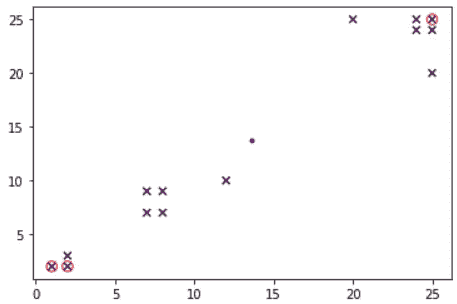

# Python 中基于 K-means 聚类的离群点检测

> 原文：<https://medium.datadriveninvestor.com/outlier-detection-with-k-means-clustering-in-python-ee3ac1826fb0?source=collection_archive---------2----------------------->

## 使用 k-means 聚类检测异常值以一种非常简单的形式解释。



Data with outliers detected by Author

当您想要将数据聚类到 k 个组中时，使用 K-means 聚类。我会告诉你如何捕捉远离这些群体的离群值。我们将通过确定一个阈值比率来实现。对于每个聚类，超出阈值比率的数据将被视为异常值。



Data to be used by Author

当你看剧情的时候，更容易看出我们旨在抓住哪些点。在黄色聚类中没有异常值，而在绿色和紫色聚类中分别有一个和两个异常值。因此，我们的目标是捕捉这个数据集中的三个异常值。

我们首先导入必要的库并组合数据。然后，通过设置 k = 3 来预测 k-均值聚类。最后，我们通过运行这段代码得到上面的图。

```
import numpy as np
import matplotlib.pyplot as plt
from sklearn.cluster import KMeans
from scipy.spatial.distance import cdist# composing data set
data = np.array([[1, 2], [2, 2], [2, 3], [8, 7], [8, 9], [7, 9], [7, 7], [12,10], [25, 24], [24, 24], [24, 25], [25, 25], [25,20], [20,25]])# kmeans model, setting k = 3
km = KMeans(n_clusters = 3)
clusters=km.fit_predict(data)# plotting data set
plt.scatter(*zip(*data),c=clusters,marker = “x”)
```

现在，我们将找到聚类的中心，然后计算每个点到其聚类中心的距离。

```
# obtaining the centers of the clusters
centroids = km.cluster_centers_# points array will be used to reach the index easy
points = np.empty((0,len(data[0])), float)# distances will be used to calculate outliers
distances = np.empty((0,len(data[0])), float)# getting points and distances
for i, center_elem in enumerate(centroids):
    # cdist is used to calculate the distance between center and other points
    distances = np.append(distances, cdist([center_elem],data[clusters == i], 'euclidean')) 
    points = np.append(points, data[clusters == i], axis=0)
```

你可能会问，我们使用哪种算法来计算距离，我们可以选择其他算法吗？正如您可能认识到的，在 *cdist* 函数中，我们将距离类型作为一个‘欧几里得’参数给出。你可以用 [*cdist 接受*](https://docs.scipy.org/doc/scipy/reference/generated/scipy.spatial.distance.cdist.html)*的其他任何一个来代替*

*在获得点的距离之后，现在，我们将决定一个阈值比率作为百分位数，并找出异常值。*

*当您决定阈值比率 *th* 时，您正在对所有点的所有距离(到它们自己的中心)进行排序，然后说我希望这些点是高于百分点 *th* 的异常值。我把它设置为 80，但你可以随意摆弄。*

```
*percentile = 80
# getting outliers whose distances are greater than some percentile
outliers = points[np.where(distances > np.percentile(distances, percentile))]*
```

*所以，我们完了！我们剩下的唯一一件事就是可视化我们检测到异常值的数据。*

```
*fig = plt.figure()# plotting initial data
plt.scatter(*zip(*data),c=clusters,marker = “x”) # plotting red ovals around outlier points
plt.scatter(*zip(*outliers),marker=”o”,facecolor=”None”,edgecolor=”r”,s=70);# plotting centers as blue dots
plt.scatter(*zip(*centroids),marker=”o”,facecolor=”b”,edgecolor=”b”,s=10);*
```

**

*Data with outliers detected by Author*

*图中的蓝点代表聚类的中心。簇的颜色已经改变，但这并不重要。异常值用红色椭圆标记。*

*如果您希望使用此算法来检测所有数据之外的异常值，而不是聚类，则需要选择 k = 1。*

```
*# setting k = 1
km = KMeans(n_clusters = 1)*
```

**

*Outliers caught after setting k = 1 by Author*

*在这种情况下，为该数据集选择 k = 1 没有多大意义，但当我们这样做时，我们会看到一个蓝点位于所有数据的中心，最远的点用红色椭圆圈出。*