# 2020 年外包开发者费率。如何选择软件外包国家？

> 原文：<https://medium.datadriveninvestor.com/outsource-developer-rates-in-2020-how-to-choose-a-software-outsourcing-country-c360da2a83a5?source=collection_archive---------5----------------------->

让我们记住那句古老的格言，“你得到你所付出的。”这句格言完全适用于 IT 外包的问题。

通过雇佣外包开发人员，公司可以将开发 web 或移动应用程序的成本降低高达 60%，而不会损失质量水平。例如，美国高级开发人员的平均价格约为每小时 75-125 美元，而乌克兰同等质量的开发人员每小时需要 35-40 美元。

市场分析和价格比较是任何明智的商人在选择 IT 外包合作伙伴之前要做的第一件事。在这篇文章中，我们收集了全球 IT 外包市场的最新实际数据，作为奖励，我们开发了一个指南“如何选择 IT 外包国家”。

# 在顶级外包地区雇佣离岸开发人员要花多少钱？外包软件开发比率比较。

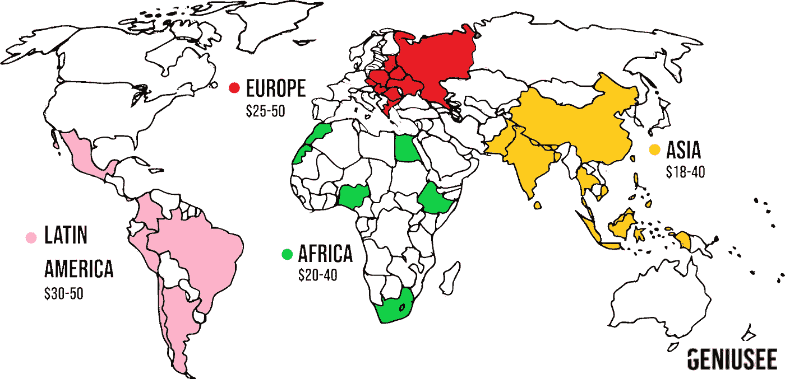

# IT 外包市场价格

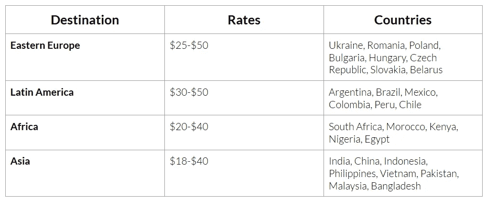

# 东欧的软件开发外包率

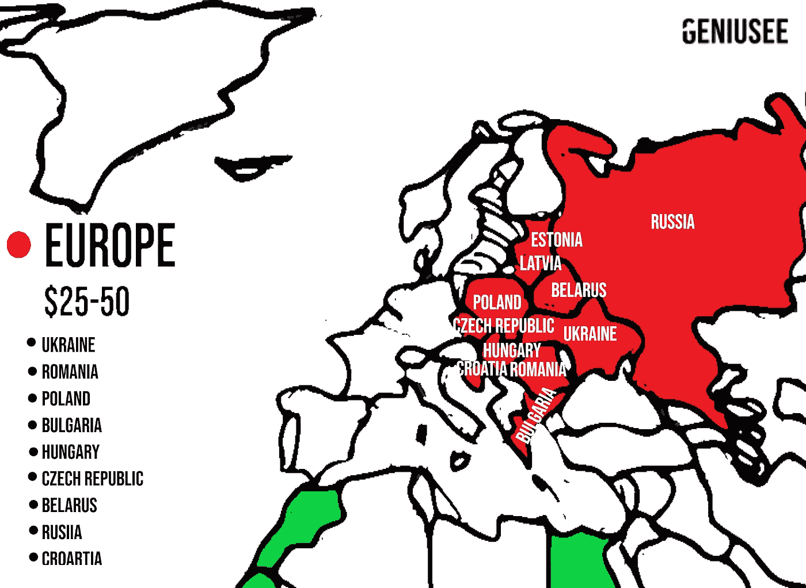

中欧和东欧 IT 外包行业的收入增长速度是全球平均水平的 4-5 倍:年增长率为 20-25 %,而不是 5%。

东欧的 IT 外包价格取决于国家。例如，乌克兰雇佣开发人员的费率将低于波兰或捷克共和国的费率。初级软件开发人员的平均市场价格约为 25 美元，高级软件工程师为 50 美元。

# 软件开发外包的最佳国家是:

*   乌克兰
*   罗马尼亚
*   波兰
*   保加利亚
*   匈牙利
*   捷克共和国
*   白俄罗斯
*   克罗地亚

从 IT 行业的增长率到庞大的 IT 人才库，东欧拥有软件开发增长最快的地区之一的所有特征。

大量的技术大学和有利的商业条件刺激了工业的繁荣。乌克兰基辅是该地区发展最快的城市之一。到 2020 年底，基辅技术市场预计将拥有 75，000 多名软件开发专家。

# 关于东欧主要 IT 外包国家的事实

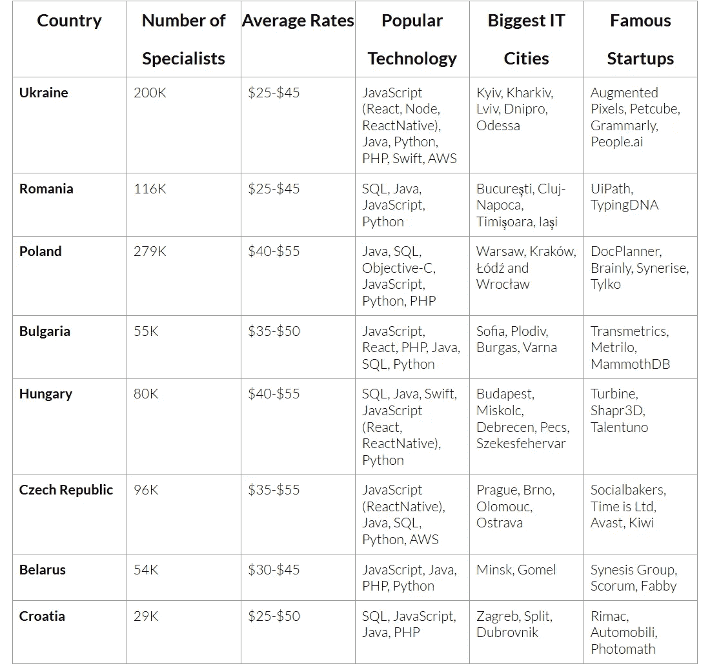

# 与东欧软件开发商合作的利与弊

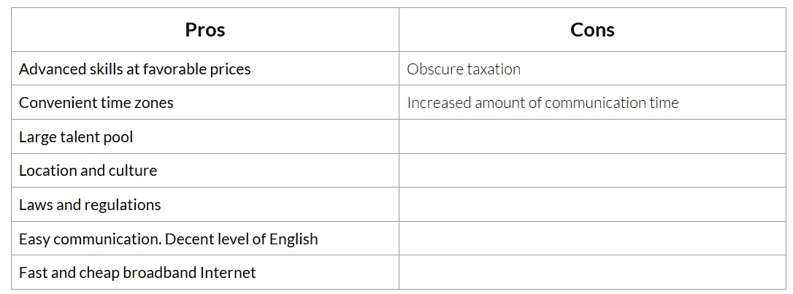

# 亚洲软件开发外包率

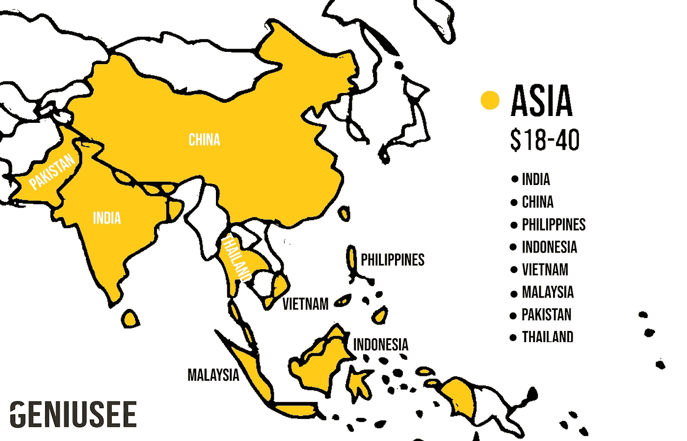

如果你正在考虑在亚洲寻找软件开发合作伙伴，在亚洲最大的科技城市，初级软件工程师的外包费用将达到 18 美元，高级开发人员将达到 40 美元。

印度和中国是主要的亚洲软件开发目的地，每个国家都有近 500 万名工程师。印度尼西亚、菲律宾、越南和巴基斯坦也是不断增长的市场，与之前的国家拥有相同类型的外包服务。正如我们上面提到的，价格的降低和快速的发展是以低质量的项目为代价的。除了文化差异之外，不利的工作条件和时区差异也会对专业团队和客户之间的沟通质量产生负面影响。

# 与亚洲软件开发商合作的利与弊

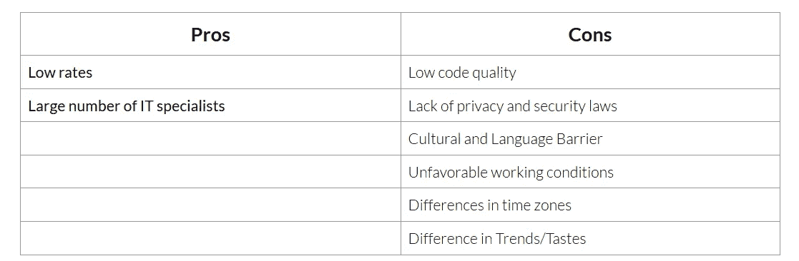

# 拉丁美洲的软件外包开发率

最近，拉丁美洲国家对来自美国的客户的软件开发需求有所增加，这是因为它们的位置相对较近，并且时区差异最小。

从巴西、阿根廷和墨西哥等拉美国家雇佣一名初级离岸软件工程师大约需要 30 美元，高级软件开发人员每小时需要 50 美元。你也可以在这个地区找到更低的价格，如每小时 7-15 美元，但请记住，结果可能并不总是高质量的。

# 与拉丁美洲软件开发商合作的利与弊

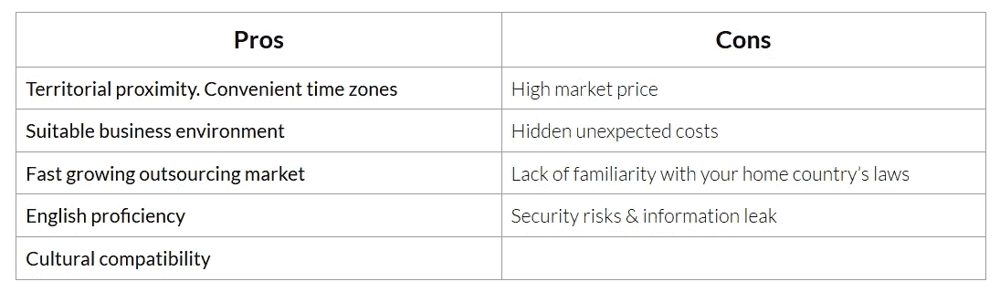

# 非洲软件开发的每小时速度

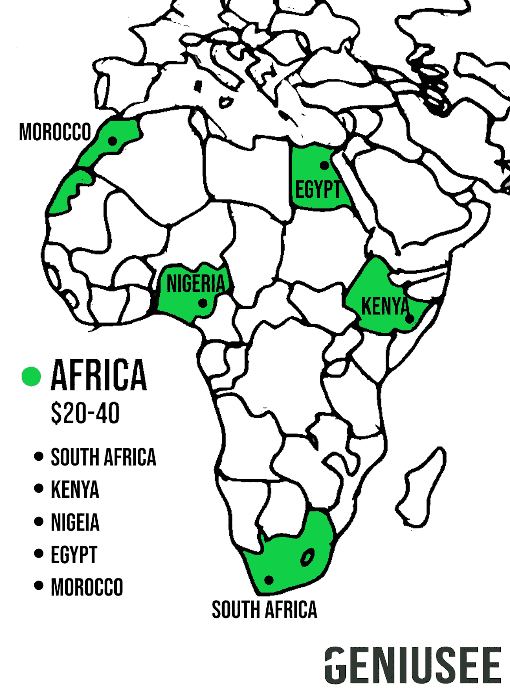

2020 年，非洲初级外包软件开发人员每小时的费用约为 20 美元。与世界其他地区相比，非洲国家的软件工程师人才较少，导致初级软件开发人员比率较高。在南非、摩洛哥和肯尼亚等国家，高级软件开发人员每小时的离岸开发费用平均约为 40 美元。

# 与非洲软件开发商合作的利弊

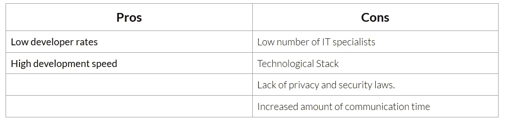

# 全球 IT 外包地区的软件开发人员比率

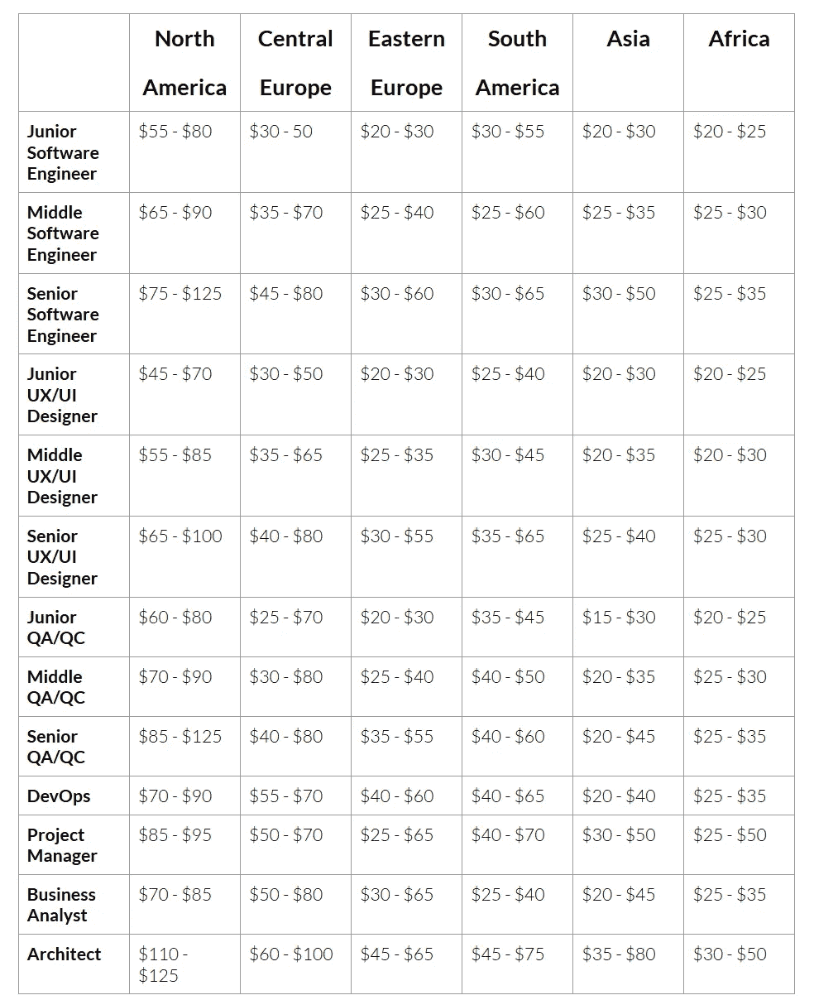

# 如何选择 IT 外包国家？

为了找到最高效、最适合软件开发协作的国家，你需要注意几个关键因素，比如:开发人员每小时的工作速度、技术行业发展水平、时区差异和文化相关性。

**1。分析和比较每小时的开发速度。**

外包软件开发的主要因素实际上是降低成本。59%的企业家在选择他们计划转移产品开发的地区时，以此为指导。还有一部分企业主是找人才的，国内没那么好找。尽管如此，你必须记住，你的项目的成功是由其质量决定的，而众所周知，质量是需要成本的。

当选择软件开发区域时，首先要做的是分析和比较平均开发人员比率。

幸运的是，我们已经准备了 2020 年各外包地区的详细费率，您可以在上面找到。

**2。研究不同地区的科技产业状况。**

市场研究的主要指标是开发人员毕业的技术大学的数量、市场上现有的人员数量以及开发您的项目所需的技术堆栈的受欢迎程度。

如果你感兴趣的国家拥有大量你需要的 IT 工程师和其他专家，高水平的技术教育，并在全球 IT 外包市场占据相当大的份额，这意味着你正朝着正确的方向前进。

如果您的项目需要一个拥有相当罕见的技术堆栈的专家，例如 Scala、Groovy、Q#、Elang 等，情况会稍微复杂一些。

**3。别忘了时差。**

有趣的是，认为 1-2 小时的时差对开发效率影响最大的观点往往并不完全客观。让我们考虑一下“追随太阳”模式(一种全球协作模式，在这种模式下，问题可以全天候解决，并在不同时区的办公室之间转移，从而提高响应速度并减少延迟。分布在世界各地的软件开发团队都在使用 Follow-the-sun。持续的工作流程增加了响应时间，缩短了上市时间。这种方法实际上是跟着太阳走，因此在世界任何地方的正常工作时间都可以工作。一个地方的客户获得的支持质量与任何其他地方的客户都一样。

然而，当与远程专用开发团队保持实时通信时，1-2 小时的差异是很方便的。如果两个团队需要更频繁地一起计划事情和分享知识，这种时间差异是合适的。

**4。了解你的文化契合度。**

人们认为文化兼容性很难衡量。但我们认为事实并非如此。

通过收集申请外包服务并有与特定国家合作经验的其他企业主和企业家的反馈，可以很容易地证实这一点。

您也可以联系目的地国家的其他所有者，询问您的所有问题，例如，关于法律制度、税收制度、任务管理方法等。

文化兼容性的问题很重要，因为它影响到在工作过程中创造一个舒适的氛围和你工作的最终结果。

# Geniusee 可以成为您的长期 IT 外包合作伙伴

我们是一家专门招聘软件工程师的公司，为我们在世界各地的客户提供各种技术支持。你有机会为你的项目雇佣一个单独的开发人员或者一个专门的开发团队。我们的每个开发人员都直接为您的项目工作，这让您可以更深入地了解项目的本质。由于您将管理项目，您将能够使用任何模型和工具来跟踪任务和项目整体的准备情况。

如果您有任何问题，请填写联系我们表格。