# 应用自然语言处理(Python)预测亚马逊股票的杰出表现

> 原文：<https://medium.datadriveninvestor.com/outstanding-performance-predicting-amazon-stock-applying-natural-language-processing-python-2636cdd59bbe?source=collection_archive---------1----------------------->

简单是关键。

# 目标

在本教程中，我们将制作一个机器学习管道，它输入新闻并应用 NLP 来生成[亚马逊股价](https://www.openblender.io/#/dataset/explore/5d4c39159516290b01c8246b/or/41)T4 的**预测。**


Image taken from Amazon.com

我们还将衡量**它在现实生活中的盈利能力**。

# 我们要做什么

*   步骤 1:设置技术**先决条件**
*   第二步:**获取 2017 年以来每日亚马逊蜡烛的数据**
*   步骤 3:定义并理解 ML 的**目标**
*   第 4 步:**将**商业新闻融入我们的数据并理解令牌
*   第五步:**准备**我方数据并应用 ML
*   第六步:测量和分析**结果**
*   第七步:打破数据和**训练/测试**穿越时间

# 第一步。先决条件

*   安装 Python 3.1(或更高版本)
*   安装熊猫、sklearn 和 openblender(带 pip)

```
$ pip install pandas OpenBlender scikit-learn
```

# 第二步。获取数据

我们将使用这个每日[亚马逊每日价格](https://www.openblender.io/#/dataset/explore/5d4c39159516290b01c8246b/or/41)数据集，


它有每天的最高价、最低价、开盘价和收盘价，以及当天的百分比变化。

所以让我们**通过 OpenBlender API **拉数据**。**打开一个 python 脚本，运行以下代码:

```
# Import the libraries
import OpenBlender
import pandas as pd
import numpy as np
import jsontoken = '**YOUR_TOKEN_HERE**'# Specify the action
action = 'API_getObservationsFromDataset'interval = 60 * 60 * 24 # One dayparameters = { 
 'token' : token,
    'id_dataset':'5d4c39159516290b01c8246b',
    'date_filter':{"start_date":"2017-01-01T06:00:00.000Z",
                   "end_date":"2020-10-01T06:00:00.000Z"},
    'aggregate_in_time_interval' : {
              'time_interval_size' : interval, 
              'output' : 'avg', 
              'empty_intervals' : 'impute'
      }
}

# Pull the data into a Pandas Dataframe
df = pd.read_json(json.dumps(OpenBlender.call(action, parameters)['sample']), convert_dates=False, convert_axes=False)
df.reset_index(drop=True, inplace=True)
df['date'] = [OpenBlender.unixToDate(ts, timezone = 'GMT') for ts in df.timestamp]
df = df.drop('timestamp', axis = 1)
```

**注意:**要获得您*需要的令牌*必须在 [openblender.io](https://www.openblender.io/#/welcome/or/41) (免费)上创建一个帐户，您可以在您个人资料图标的“帐户”选项卡中找到它。

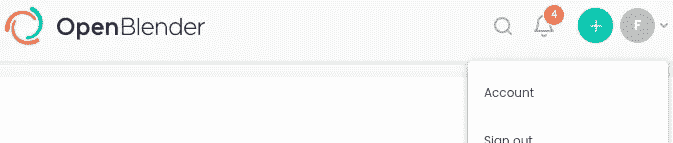

现在让我们来看看数据:

```
df.head()
```

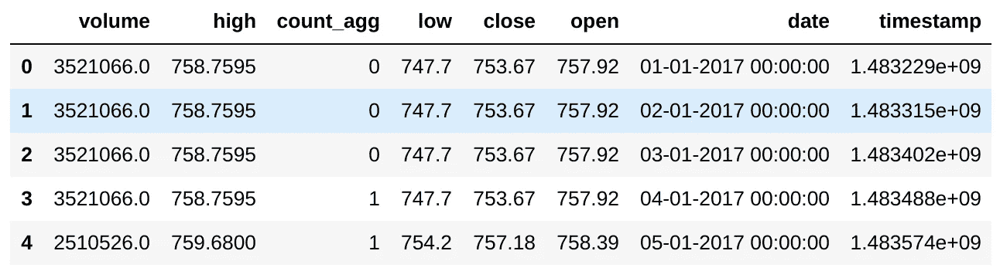

检查！

# 第三步。定义和理解目标

首先，我们要定义收盘价和开盘价之间的**变化百分比**，这样我们就可以得到当天的**表现。**

为了方便起见，让我们使用[对数差](https://faculty.fuqua.duke.edu/~rnau/Decision411_2007/411log.htm#:~:text=First%20difference%20of%20LOG%20%3D%20percentage%20change%3A%20When%20used%20in%20conjunction,Y%20from%20period%20to%20period.)(接近百分比变化，对于本教程来说实际上是等效的)。

```
df['change'] = np.log(df['close']) - np.log(df['open'])
```

让我们绘制收盘价和变化图。


“变化”变量是一天的收盘价相对于开盘价的百分比增量或减量。

让我们将我们的**目标变量**定义为大于 0.5%的增长(这样就不值得购买了):

**阳性 POC:** 其中“变化”增加超过 0.5%


Distribution of ‘change’ (x100)

这意味着绿线右侧的所有观察结果都将是我们的“成功”情景。

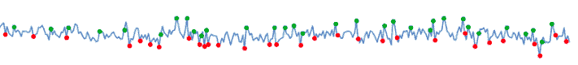

# 第四步。向量化和混合商业新闻

这是**非常** **简单**地执行，但是让我们试着理解在后台发生了什么。

我们想要的:

1.  我们需要**收集有用的新闻数据**，这些数据与我们的目标相关
2.  我们希望将它融入我们的数据中，使**新闻与第二天的价格**“变化”保持一致(这样模型就可以学习预测第二天的价格，我们就可以实际使用它)
3.  我们想把它转换成**数字特征**，这样它就可以遍历一个 ML 模型。

因此，让我们寻找时间重叠的商业新闻数据集:

```
# First we need to add the UNIX timestamp which is the number 
# of seconds since 1970 on UTC, it is a very convenient 
# format because it is the same in every time zone in the world!df['timestamp'] = OpenBlender.dateToUnix(df['date'], 
                                           date_format = '%d-%m-%Y %H:%M:%S', 
                                           timezone = 'GMT')# Now, let's search on OpenBlendersearch_keyword = '**business**'df = df.sort_values('timestamp').reset_index(drop = True)print('From : ' + OpenBlender.unixToDate(min(df.timestamp)))
print('Until: ' + OpenBlender.unixToDate(max(df.timestamp)))# We need to pass our timestamp column and 
# search keywords as parameters.OpenBlender.searchTimeBlends(token,
                             df.timestamp,
                             search_keyword)
```


我们可以看到时间重叠(交叉)数据集及其一些属性，甚至可以看到界面的 url。

因此，让我们挑选这个[华尔街日报新闻](https://www.openblender.io/#/dataset/explore/5e2ef74e9516294390e810a9/or/41)数据集:

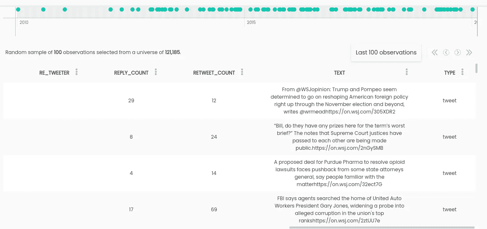

这条[今日美国](https://www.openblender.io/#/dataset/explore/5e32fd289516291e346c1726/or/41)推特新闻。


*   *注:*我选择这些是因为它们有意义，但你可以搜索数百个其他的。

我们可以通过搜索按时间聚合的新闻术语，将新的栏目融合到我们的数据集中。例如，我们可以创建一个“亚马逊”特性，其中包含来自“华尔街”数据集的新闻数量，这些新闻数量与我们自制的 ngrams 相匹配:

```
text_filter = {'name' : 'amazon', 
               'match_ngrams': ['amazon', 'bezos', 'audible', 'aws',
                                'diapers','goodreads','techstreet']}# We need to pass the 'id_dataset', the name of the
# column (which is 'text') and an optional filter.blend_source = {
                'id_dataset':'**5e2ef74e9516294390e810a9**',
                'feature' : '**text**',
                'filter_text' : **text_filter**
            }df_blend = OpenBlender.timeBlend( token = token,
                                  anchor_ts = df.timestamp,
                                  blend_source = blend_source,
                                  blend_type = 'agg_in_intervals',
                                  interval_size = 60 * 60 * 24,
                                  direction = 'time_prior',
                                  interval_output = 'list')df_anchor = pd.concat([df, df_blend.loc[:, df_blend.columns != 'timestamp']], axis = 1)
df_anchor
```

timeBlend 功能的参数(您可以在此处找到文档[):](https://www.openblender.io/#/api_documentation)

*   **anchor_ts** :我们只需要发送我们的时间戳列，这样它就可以作为一个锚来混合外部数据。
*   **blend_source** :关于我们想要的特性的信息。
*   **blend _ type**:‘agg _ in _ intervals’因为我们想要对我们的每个观察值进行 24 小时间隔聚合。
*   **inverval_size** :间隔的大小，以秒为单位(本例中为 24 小时)。
*   **方向**:‘time _ prior’因为我们希望间隔收集之前 24 小时的观察值，而不是向前。

输出是两个新的列，我们的“亚马逊”功能的“计数”和一个实际新闻的列表，以防有人想遍历每一个。

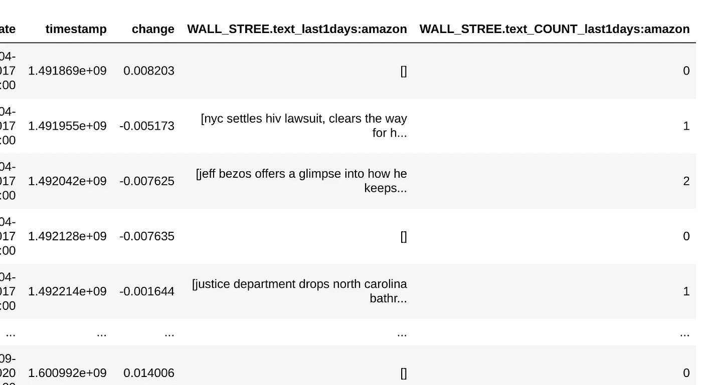

让我们来看看这一变化，以及过去 24 小时内我们的“亚马逊”功能被提及的次数。会是有用的关系吗？

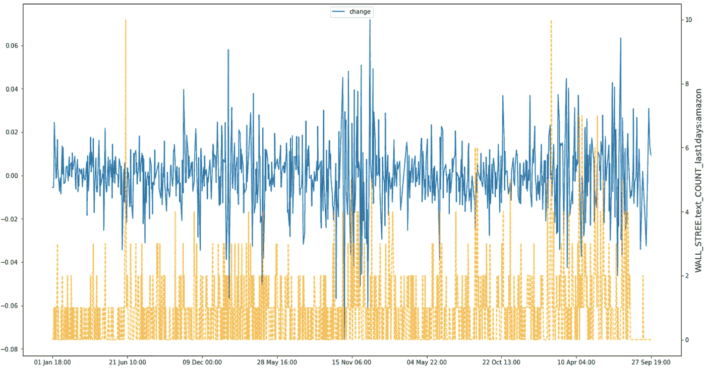

现在还很难说，我们可以探索几种不同的配置或变量，甚至可以在每次观察中遍历文本列表，并执行任何类型的处理。可能性是无限的。

现在让我们**创建一个文本矢量器**，它是 OpenBlender 上的一个模型，你可以从中提取数千个计算化的 ngrams 作为特征:

```
action = 'API_createTextVectorizerPlus'parameters = {
    'token' : token,
    'name' : 'Wall Street and USA Today Vectorizer',
    'sources':[
              {'id_dataset':"**5e2ef74e9516294390e810a9**", 
               'features' : ["**text**"]},
              {'id_dataset' : "**5e32fd289516291e346c1726**", 
               'features' : ["**text**"]}
    ],
    'ngram_range' : {'min' : 1, 'max' : 2},
    'language' : 'en',
    'remove_stop_words' : 'on',
    'min_count_limit' : 2
}response = OpenBlender.call(action, parameters)
response
```

根据上述内容，我们指定了以下内容:

*   **名称:**我们将其命名为“华尔街和今日美国矢量器”
*   **源**:作为源包含的数据集的 id 和源列(在本例中，两者都只有一个名为‘text’)
*   **ngram_range** :将被标记的单词集的最小和最大长度
*   语言:英语
*   **remove_stop_words** :这样就从源头上消除了停用词
*   **min_count_limit** :被认为是令牌的最小重复次数(出现一次很少有帮助)

现在，如果我们转到 OpenBlender 的仪表板，我们可以看到矢量器:


它生成了 4999 个 n-gram，这些 n-gram 是最多 2 个单词的令牌的**二进制特征**，如果提到了 **n-gram 则为“1”**否则为“0”。

现在**我们希望矢量化数据**在 24 小时内压缩，并与第二天的亚马逊股价保持一致。

你需要添加你的**矢量器的 id** (它是在你创建它的时候打印出来的，或者你可以在 OpenBlender 中得到它)。

```
blend_source = { 
                'id_textVectorizer':'**5f74fb7895162967ca2160fe**'
               }df_blend = OpenBlender.timeBlend( token = token,
                                  anchor_ts = df_anchor.timestamp,
                                  blend_source = blend_source,
                                  blend_type = 'agg_in_intervals',
                                  interval_size = 60 * 60 * 24,
                                  direction = 'time_prior_strict') .add_prefix('VEC.')df_anchor = pd.concat([df_anchor, df_blend.loc[:, df_blend.columns != 'timestamp']], axis = 1)
df_anchor.head()
```


现在我们有了 **1068** 个观测值和 **4887** 个特征。我们的原始数据集加上过去 24 小时的矢量化和聚合新闻。

# 第五步。准备数据并应用 ML

没有更多的争论或清理要做，我们只需要**创建我们的目标特性**正 POC 和负 POC(我们将使用‘正 POC’来实现前面定义的目的)。

```
# Where ‘change’ **decreased** more than 0.5%
df_anchor['negative_poc'] = [1 if log_diff < -0.005 else 0 for log_diff in df_anchor['change']]# Where ‘change’ **increased** more than 0.5%
df_anchor['positive_poc'] = [1 if log_diff > 0.005 else 0 for log_diff in df_anchor['change']]# We need to shift our target one day so that we predict 
# for what will happen 'tomorrow' with news and data from 'today'
df_anchor['target'] = df_anchor['positive_poc'].shift(-1)
df_anchor[['change', 'positive_poc', 'target']]
```

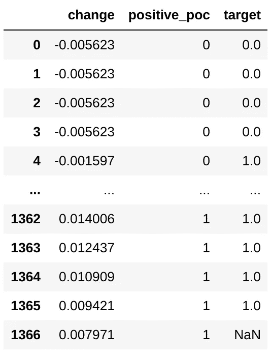

现在我们有了“**目标**”功能，它只需**将**的“变化”值与“**前一天的数据**对齐，这正是我们所需要的。最近的观察(最后一次)是 NaN，因为那是我们想要为“明天”预测的。

现在，让我们尝试一些 ML 来学习和预测**目标**。

```
# Import libraries
from sklearn.ensemble import RandomForestRegressor
from sklearn.metrics import roc_auc_score
from sklearn.metrics import accuracy_score
from sklearn import metrics
df_anchor = df_anchor[:-1] # Remove the last one with NaN# Define target
target = 'target'
df_positive = df_anchor[1:].select_dtypes(['number'])# Create train/test sets
X = df_positive.loc[:, df_positive.columns != target].values
y = df_positive.loc[:,[target]].values
div = int(round(len(X) * 0.71))X_train = X[:div]
y_train = y[:div]
X_test = X[div:]
y_test = y[div:]print('Train:')
print(X_train.shape)
print(y_train.shape)
print('Test:')
print(X_test.shape)
print(y_test.shape)
```

产出:

```
Train:
(970, 4888)
(970, 1)
Test:
(396, 4888)
(396, 1)
```

现在让我们训练模型并预测:

```
rf = RandomForestRegressor(n_estimators = 1000, random_state = 1)
rf.fit(X_train, y_train)
y_pred = rf.predict(X_test)
```

# 第六步。分析结果

现在公布结果。

```
print("AUC score:")
print(roc_auc_score(y_test, y_pred))
print('---')# Let's binarize and look at the confusion matrix
preds = [1 if val > 0.5 else 0 for val in y_pred]
print('Confusion Matrix:')
print(metrics.confusion_matrix(y_test, preds))
print('---')# Lets look at the accuracy score
print('Accuracy:')
print(accuracy_score(y_test, preds))
print('---')
```

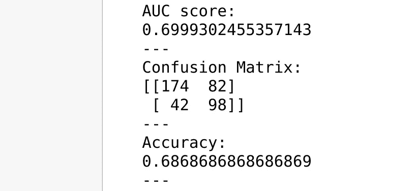

我们来分析一下结果。

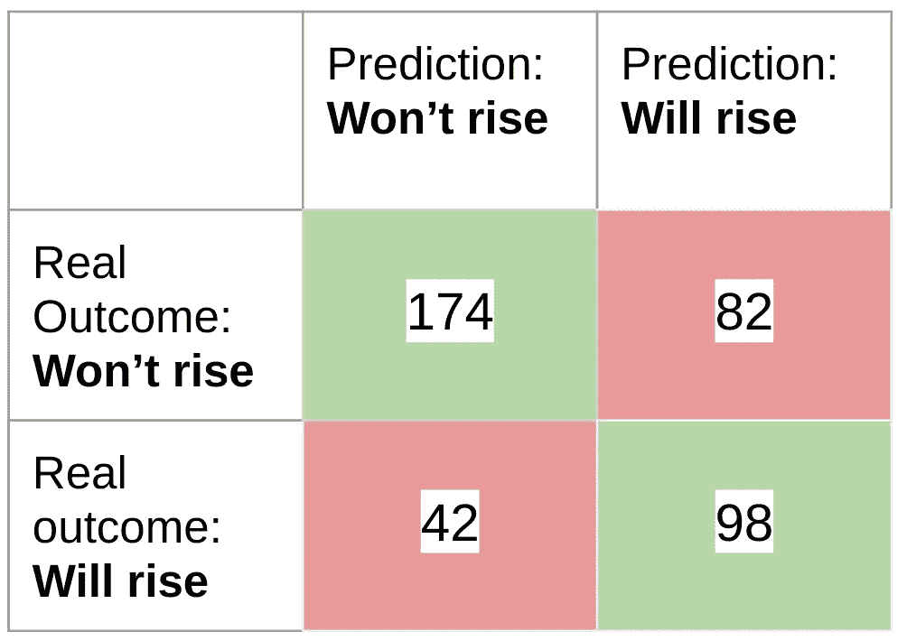

该模型正确地检测到了 98 次起义(总共 140 次),从 180 次“起义”预测中，它正确了 98 次。它还正确地过滤掉了 174 个“非起义”案例(共 216 个)。

如果我们在一天结束时运行模型，我们可以在第二天早上买入/做空，期待当天结束时的结果。

# 第七步。打破时间的数据

现在，我们需要一种方法，在这种方法中，数据经过训练和测试，以观察结果是否一致。

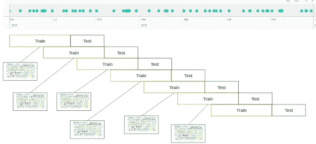

让我们运行我们刚刚做的，但是在这个循环中中断数据。

```
results = []
for i in range(0, 90, 5): 
    time_chunk = i/100
    print('time_chunk:' + str(time_chunk) + ' starts')
    df_ml = df_positive[:int(round(df_positive.shape[0] * (time_chunk + 0.4)))]
    X = df_ml.loc[:, df_ml.columns != target].values
    y = df_ml.loc[:,[target]].values
    div = int(round(len(X) * 0.71))
    X_train = X[:div]
    y_train = y[:div]
    X_test = X[div:]
    y_test = y[div:] rf = RandomForestRegressor(n_estimators = 1000, random_state = 1)
    rf.fit(X_train, y_train)
    y_pred = rf.predict(X_test)
    preds = [1 if val > 0.5 else 0 for val in y_pred]
    try:
        roc = roc_auc_score(y_test, y_pred)
    except:
        roc = 0
    conf_mat = metrics.confusion_matrix(y_test, preds)
    accuracy = accuracy_score(y_test, preds)
    results.append({
        'roc' : roc,
        'accuracy' : accuracy,
        'conf_mat' : conf_mat,
        'time_chunk' : time_chunk
    })
```

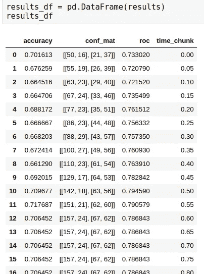

我们可以看到**指标增加**并稳定低谷时间！

