# 使用情绪分析预测 Alphabet(谷歌)股价的出色回报

> 原文：<https://medium.datadriveninvestor.com/outstanding-performance-using-sentiment-analysis-to-predict-alphabet-google-stock-price-c74ef86c82a6?source=collection_archive---------4----------------------->

## 简单是关键

简单是所有真正优雅的基调。

*亚伯拉罕·马斯洛*

**

*Photo of Google Headquarters from [source](http://shutterstock.com/).*

**免责声明:我假设任何有能力理解和执行本文内容的人都足够精明，能够在生产中实际运行之前，在交易管道的每个角落执行强大的回溯测试。然而，这篇文章没有考虑到一些因素(利差、滑点和交易成本等)，就此而言，这篇文章**不被视为财务建议**。这被认为是朝着更好的成绩迈出的教育一步。*

# *介绍*

*这篇文章的目标是利用前一天交易时段的**收盘时间(纽约证券交易所美国东部时间下午 4 点)到当天开市前(美国东部时间上午 9 点 30 分)的消息，预测 [Alphabet (GOOGL)](https://openblender.io/#/dataset/explore/5d4c38739516290b02fe15d7/or/44) 的股价在任何给定的一天结束时是会上涨还是下跌**。*****

***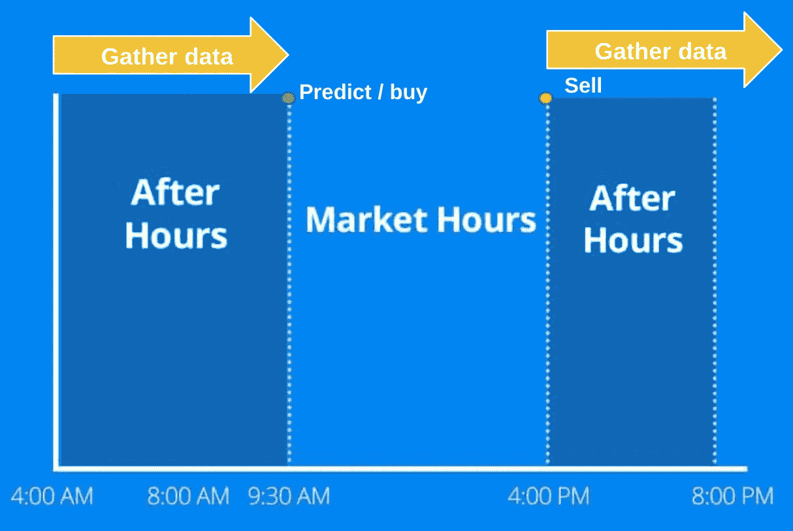***

***通过将**情感分析应用于新闻**报道，我们将创建数字特征，并通过使用[近似混合算法](https://www.academia.edu/44233887/PROXIMITY_BLEND_ALGORITHM_TO_IMPUTE_Discrete_VARIABLES_REFLECTED_IN_THE_RANGE_Of_AN_ANCHOR_VARIABLE_on_a_variable_from_a_different_axis_)将它们加入我们的股票数据。***

***我会在文章底部添加一个**链接到笔记本**，这样你就可以复制这个学习案例了。***

# ***目标***

***这是字母表(GOOGL) 股价的[日蜡烛线数据集。我们会用过去的两年。](https://openblender.io/#/dataset/explore/5d4c38739516290b02fe15d7/or/44)***

***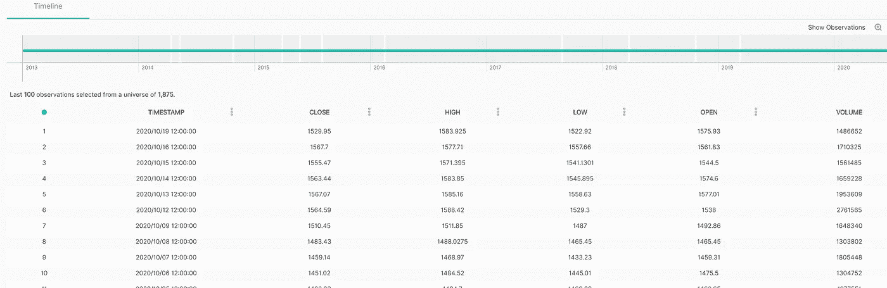***

***我们想要预测给定一天的收盘价相对于开盘价的的**百分比。*****

```
***df_alphabet['**change**'] = np.log(df_alphabet['**close**']) - np.log(df_alphabet['**open**'])***
```

***让我们来看看开盘价和收盘价与变化的关系。***

***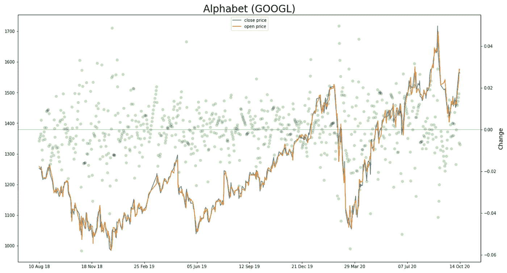***

***如果我们放大，我们可以看到当收盘价比开盘价高**比开盘价高**时，**绿点在“零变化”**线上方，反之亦然。这意味着线上方的绿点是**投资将在那天**产生 **正回报的地方。*****

***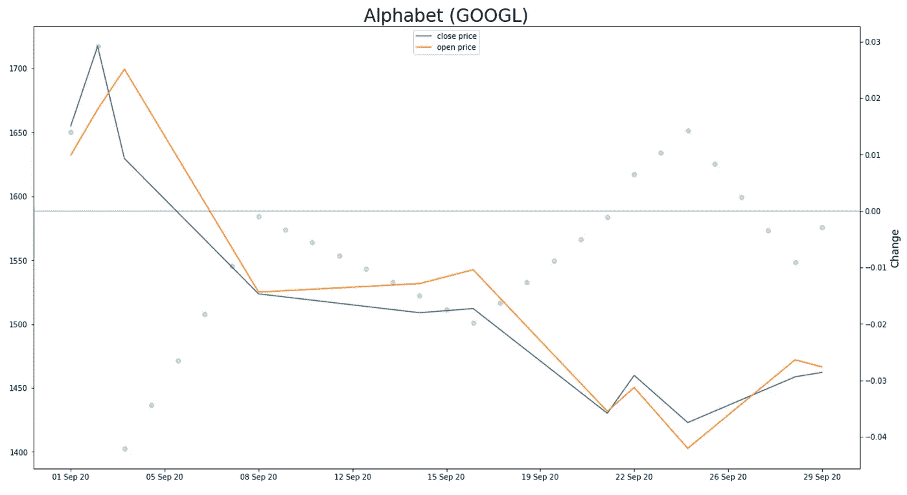***

***我们的目标是**使用在某一天**之前来自**的信息来预测某一天的变化是否会大于零**，以便我们可以决定在开盘时买入，在收盘时卖出。***

***这是**变化**分布的样子:***

***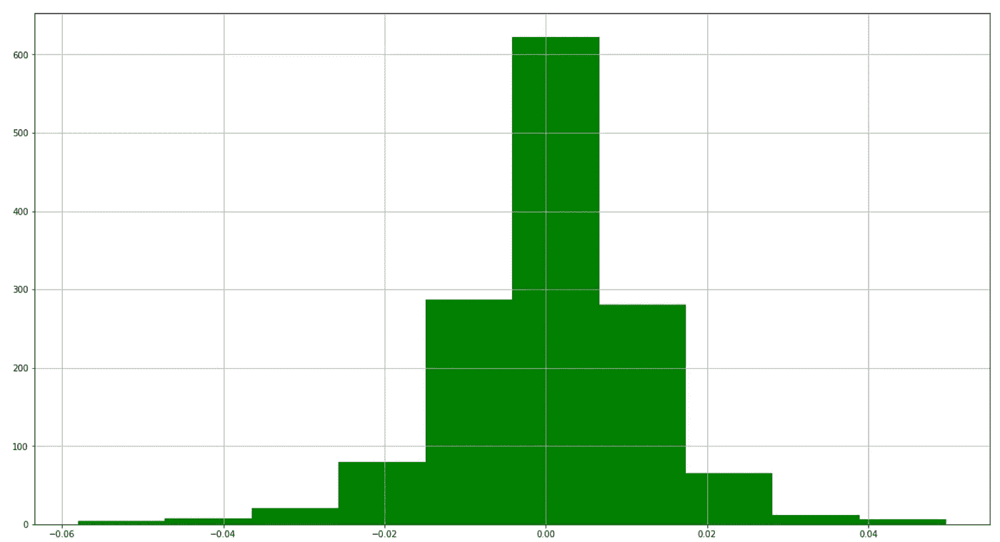***

*****change** distribution (mean = 0.00053)***

```
*****743** times change is **positive (53%)**
**639** times change is **negative (47%)*****
```

***所以硬币已经‘倾斜’在我们这边了。***

***让我们通过将**变化**二值化并添加一个小障碍(0.003)来补偿滑点、价差和交易成本，从而创建一个成功/失败**目标特征**。(以便投资产生正回报)。***

```
***df_alphabet['**target**'] = [1 if ch > 0.003 else 0 for ch in df_alphabet['change']]***
```

***现在我们有了一枚更加“不方便”的硬币。***

```
*****551** times target is **1 (39%)**
**832** times target is **0 (61%)*****
```

***我们的**目标**是在产生收入的比例上检测成功。我们希望筛选并找到更多天的正回报进行投资(precision > 0.5)。***

# ***情感分析***

***简单来说，一个有监督的 ML 模型可以看作是由自变量解释的因变量。在应用情感分析时，自变量来自文本。***

***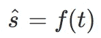***

*****ŝ** =sentiment **| t** = text***

***在我们的例子中(以及在许多情况下)，因变量' **ŝ '** 将为第二个“相关”模型提供情绪的特定用例(如股票预测)。***

***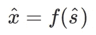***

*****x̂** = prediction of **x** | **ŝ** =sentiment***

***其中 **x** 是我们的**目标变量**。***

***因此，在我们建立一个相关模型来预测我们的目标之前，我们需要创建一个独立模型来对新闻**情感**进行分类，这样我们就可以**将结果用作输入**。***

***情感分析是量化主观信息的艺术。***

***“情绪”表示可以被看作是一个多维空间，其中充满了面向许多方向的向量(参见[“具有学习表示的多维情绪分析”](http://robotics.stanford.edu/~amaas/papers/multisent-techreport-2011.pdf))。***

***但是为了这篇文章的目的，我们将**简化**，将情感简化为每个新闻标题的一个**数字特征**。***

***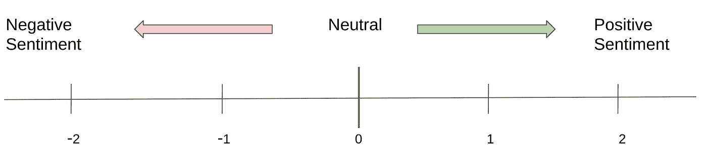***

***Range of ‘Sentiment’***

***每个标题都有一个“**情绪**特征，代表新闻对潜在的股票走势有多积极或消极。***

***现在，让我们来看看一些提到谷歌的新闻——按天汇总。***

***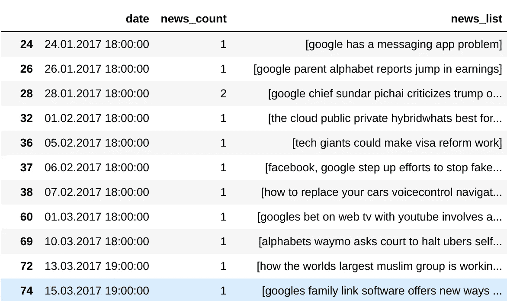***

***主观部分是我们对股价的**正面或负面**标题的看法。我们需要**手动标记**一组新闻，让模型用这些知识进行训练。***

***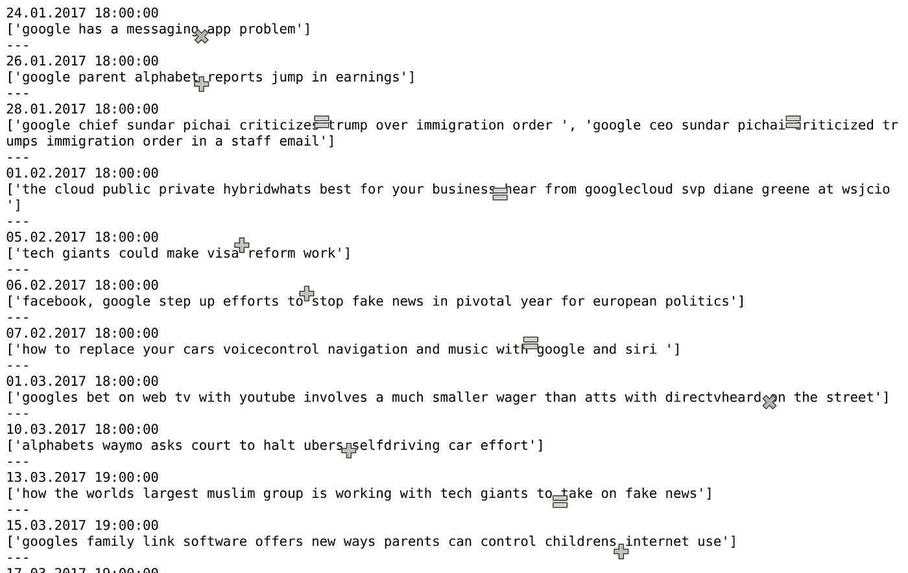***

***My interpretation of positive, negative and neutral.***

***我从 1300 多天的“谷歌”新闻中手动标记了 500 多个新闻标题(没错，我赢得了我的向上投票)，添加了 **-1** 、 **0** 或 **1** 的**情感**。***

***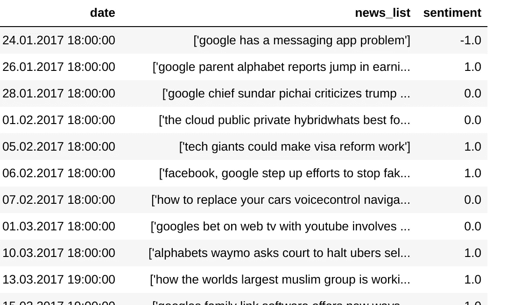***

***现在，我们需要想出一个模型，它可以训练**对新文本的情感进行分类**，这样我们就可以自动化这项工作，并立即将情感作为我们目标的 ML 燃料。***

***为此，我们需要将文本转换成数字格式，以便应用 ML。为此，我们需要对文本进行**符号化**和**矢量化**。***

*****标记化*****

***标记化是将单词或词组中的字符串分开(称为 n 元语法)。例如，让我们为一个文本的“1 个和 2 个单词”创建 n 元语法:***

***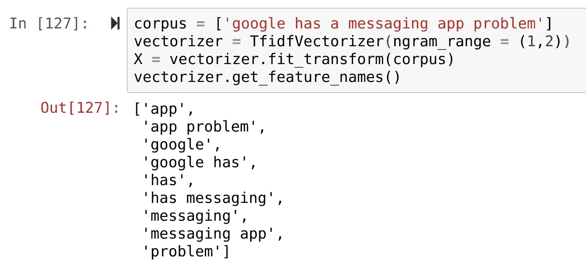***

***List of n-grams (1 and 2 words) created from text***

*****矢量化*****

***矢量化是从文本数组中创建一个稀疏矩阵，其中**列是 n 元语法**，而**行是每个文本上的提及**。***

***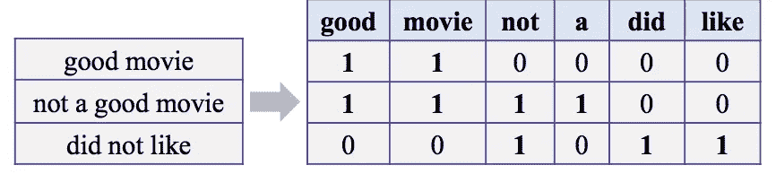***

***Simple representation of text vectorization.***

***让我们**将文本**符号化，并将其添加为数字特征:***

***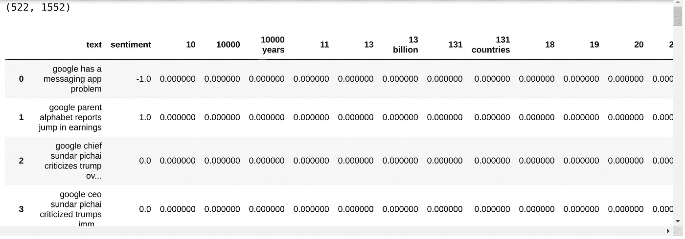***

***我们**增加了 1550 列**到我们的情感数据框架中。现在，让我们看看与“情绪”最相关的(负面和正面)标记。***

***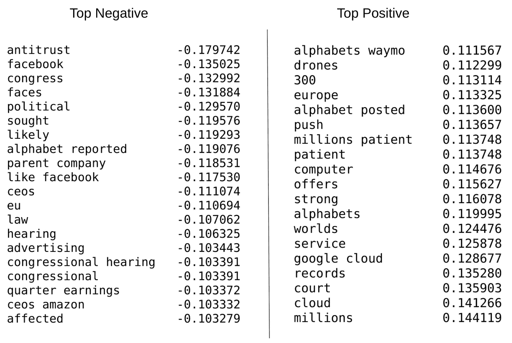***

***当然，这些本身并不意味着什么，所以让我们创建一个机器学习模型，将它们结合起来预测情绪。***

***首先，用一个简单的模型来检测**【正面】**新闻。培训用 365，测试用 157。***

***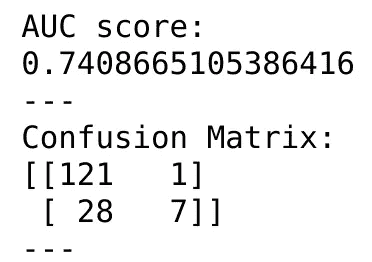***

***Confusion matrix for detecting ‘positive’ news***

***它正确检测出 **7** 正面消息，**错误标注 **1** 并遗漏 **28** 。它正确地丢弃了**121**‘不积极’的消息。*****

***现在完全相同的过程来检测这次'**负面的**消息。***

***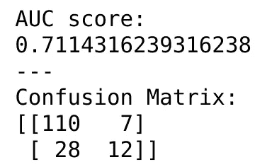***

***Confusion matrix for detecting ‘negative’ news***

***它正确地检测到了 **12** ，错误地将 **7** 标记为“负面”，并且错过了 **28** “负面”消息。它正确地过滤掉了**110**‘非负面’新闻。***

***两个模型之间的分类没有重叠**(没有新闻同时被标记为‘正面’和‘负面’)。*****

***尽管还有巨大的**改进空间**(通过预处理数据、模型/参数优化、词干化和词条化、添加更多数据进行训练、语义分析、通过神经网络运行等)..)这对于我们的主要目的来说**很好，也很简单**。***

# ***新闻价格预测***

***让我们一起来看看价格和人气。***

***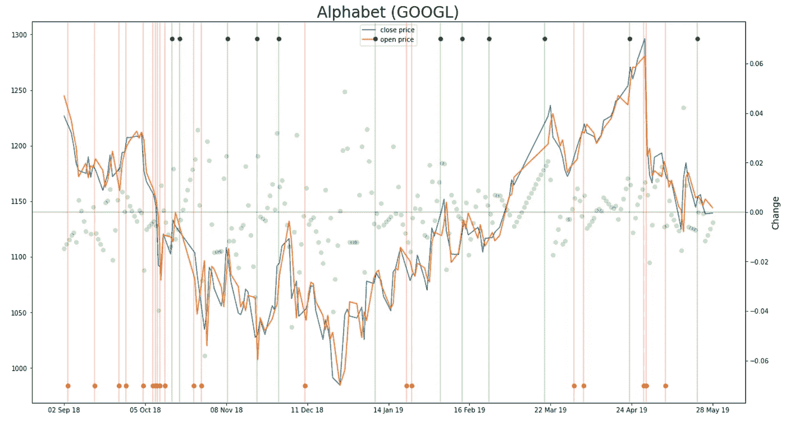***

***绿线是'**正**新闻，红线是'**负**。***

***让我们去掉价格曲线。***

***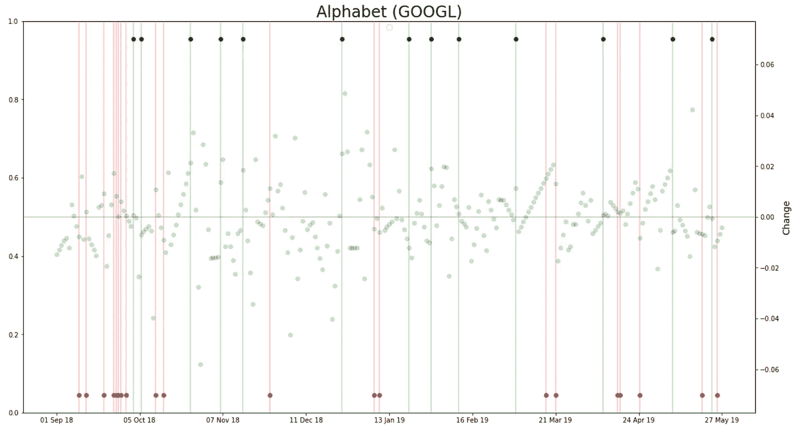***

***Sentiment from news with GOOGL change***

***乍看之下，很难看出其中的关系，因为有太多的“变化”点。***

***让我们再次混合新闻，并使用我们的“情绪”模型计算过去 24 小时的平均情绪。***

***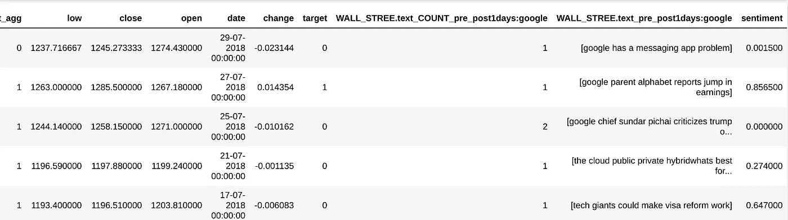***

***让我们试着**用**我们现在从**前一天开始的变量来预测“变化”是否会是正的**(高于我们的 0.003 差点)。***

***再次尝试一个简单的模型，用 1078 个观测值的先验(按时间顺序)训练集进行训练，用 304 个观测值的后验训练集进行测试。***

***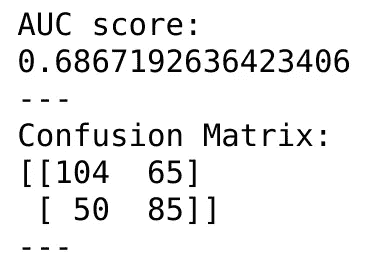***

***我们的模型正确地预测了 **85 次价格上涨**(变化> 0.003)，它错误地接受了 **65 '** 非上涨 **'** 的情况。它**遗漏了 50 个**增量，它**正确地过滤掉了 104 个**‘非增量’案例。***

***因此，考虑到影响股票价格的因素如此之多，仅凭新闻标题和蜡烛图中包含的信息来获得这些结果是非常出色的。***

***记住，世上没有免费的钱。每项投资都有风险。不仅要理解数学和模型，还要理解这些模型代表了什么，这一点总是很重要的。***

***你可以在这里下载笔记本来重现这一切[。](https://github.com/federico2001/google_stock_prediction/tree/master)***