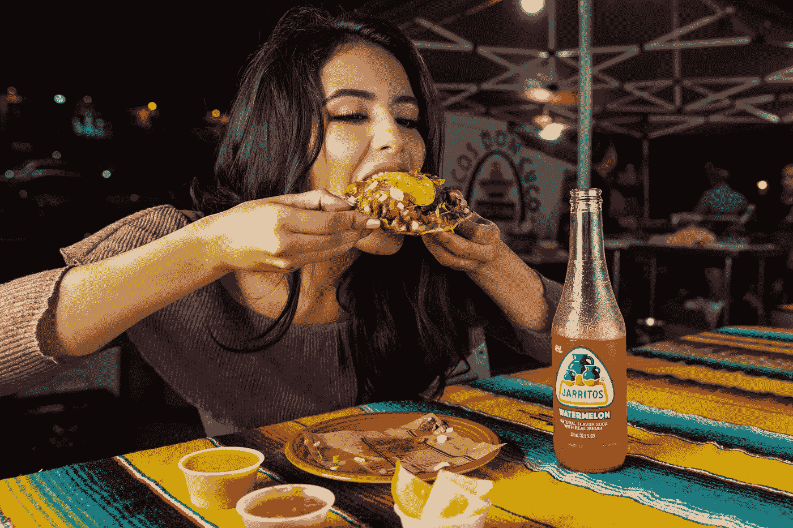

# 部署帮助我战胜了暴饮暴食

> 原文：<https://medium.datadriveninvestor.com/overeating-the-ways-deployment-has-helped-me-combat-a-bad-habit-aec350dae3dd?source=collection_archive---------11----------------------->

## 我有了更多的自制力和更好的心情去感恩。

Photo by [Jarritos Mexican Soda](https://unsplash.com/@jarritos?utm_source=unsplash&utm_medium=referral&utm_content=creditCopyText) on [Unsplash](https://unsplash.com/s/photos/eating-too-much?utm_source=unsplash&utm_medium=referral&utm_content=creditCopyText)

“我热爱食物，觉得这是应该享受的东西。我想吃什么就吃什么。我只是不会吃得太多”——提拉·班克斯。

## 食物是一种生活方式，会一直伴随我们，直到我们死去。每顿饭都让人兴奋。食物满足渴望，对抗饥饿。

回到家里，我会做出半健康的选择，吃更多对我有益的食物。唯一的问题是，我不会真的有任何限制，只是简单地吃，直到我臃肿。

吃到痛的想法可能不是最好的主意，但我暂时不会饿！

不管是妈妈做的菜还是墨西哥卷饼，我都会满足于多吃而不是少吃。仅仅因为我吃得过多，我会通过额外努力锻炼来补偿，以便尽可能平衡我的卡路里输入/输出。

# **我的部署顿悟**

在执行任务时，我经历过食物短缺和由 MRE 组成的时候，但我也经历过每顿饭都像自助餐的时候。

有时候我甚至一天吃四顿饭。

当食物有固定的时间表并且有所限制时，我的身体是最快乐和最健康的。在家里，我吃的食物量基本上是自我调节的，而在这里，我可以吃定量分配给我的食物。

不管我这辈子去过哪里，一个共同的主题就是压力大的时候暴饮暴食。一个月做一两次不是世界末日，但是每天都做是个问题。

> “你不想吃得太多，因为那样你就得加倍努力工作。”——拉马尔·伍德利。

在某种程度上，尝试吃更多的食物而不是更少需要更多的努力。

# **卡路里计数很有用**

从营养学的角度来看，一个很好理解的概念是热量不足。热量不足是指相对于维持当前体重所需的热量而言，摄入的热量不足。

**热量不足可以通过减少输入/消耗的热量来计算(减少食物摄入，也就是节食)。**

如果你在谷歌上搜索“卡路里计算器”，它会给你很多分析，告诉你一个有这种身材的人应该摄入多少卡路里，以及为了减肥应该摄入多少卡路里。

如果我在健身房或跑步时放松，我就不会在盘子里放太多食物。限制和坚持只喝水的饮食对我的健康有好处。

我想引用一句话来结束这篇文章，这句话的目的不是发出恐惧，而是一种思考。

> “在美国，死于食物过多的人比死于食物过少的人多。”——约翰·肯尼斯·加尔布雷思。