# 两个疏远的兄弟的故事。

> 原文：<https://medium.datadriveninvestor.com/overfitting-and-underfitting-the-story-of-two-estranged-brothers-384bcc8e5e28?source=collection_archive---------3----------------------->

嗯，在这篇博客中，我想解释机器学习和数据科学中最重要的概念之一，这是我们在训练我们的机器学习模型后遇到的。我很高兴从欠适和过适的概念开始。所以让我们先了解一下。

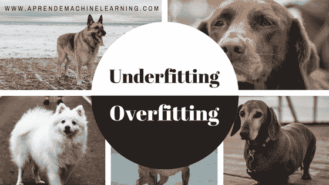

# 欠拟合

# 欠适是什么意思？

当机器学习模型不够复杂，无法准确捕捉数据集的特征和目标变量之间的关系时，就会发生欠拟合(与过拟合相对应)。不足的模型会在新数据或未经训练的数据上导致有问题或错误的结果，甚至在训练数据上也常常表现不佳。

下面是欠拟合的图形表示:

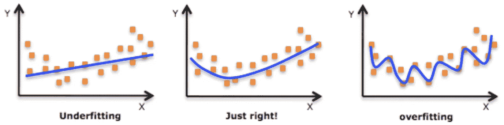

简单的直线是训练数据的良好表示，但它不能完全呈现变量 x 和 y 之间的基本曲线关系。因此，当您将它应用于新数据时，模型的结果将不会准确，尤其是当新数据中的 x 值比训练数据中的值大得多或小得多时。

# 为什么不合身很重要？

对企业来说，使用不完善的模型进行决策可能代价高昂。例如，一个不足的模型可能表明，你总是可以通过在营销上花费更多来实现更好的销售，而事实上该模型未能捕捉到饱和效应(在某种程度上，无论你在营销上花费多少，销售都会持平)。如果你的企业依靠这种模式来决定你的营销预算，你将会在营销上超支。

# 偏差误差

偏差是模型的预期预测值和真实值之间的差异。

这听起来可能很奇怪，因为你不应该“期望”你的预测接近真实值吗？嗯，这并不总是那么容易，因为一些算法太死板，无法从数据集中学习复杂的信号。

假设对具有非线性模式的数据集进行线性回归拟合:

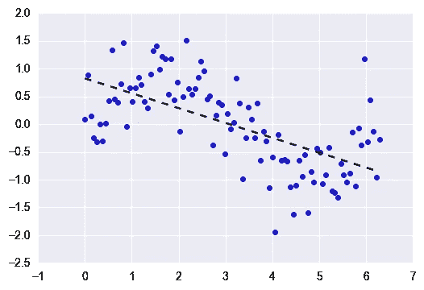

无论您收集多少更多的观察值，线性回归都无法模拟这些数据中的曲线！这被称为**欠装配**。

# 方差误差

方差是指算法对特定训练数据集的敏感度。

高方差算法将根据训练集产生完全不同的模型。

例如，想象一种算法，它将一个完全不受约束的、超级灵活的模型与上面的相同数据集相匹配:

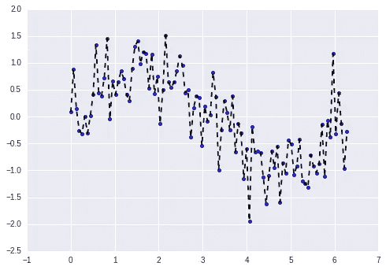

如你所见，这个无约束模型基本上记住了训练集，包括所有的噪音。这就是所谓的**过度拟合。**

在统计学和机器学习中，当统计模型描述随机误差或噪声而不是潜在关系时，就会发生过度拟合。过度拟合通常发生在模型过于复杂的情况下，例如相对于观察值的数量而言参数过多。过度拟合的模型通常具有较差的预测性能，因为它会夸大数据中的微小波动。使用某组训练样本来训练学习算法。如果学习算法具有过拟合训练样本的能力，则训练样本集的性能将会提高，而看不见的测试样本集的性能将会下降。过度拟合现象有三种主要解释:

1.  过于复杂的模型
2.  多重共线性
3.  高维度。

## 模型复杂性

相对于观察的数量，具有太多参数的复杂学习器可能会使训练数据集过拟合

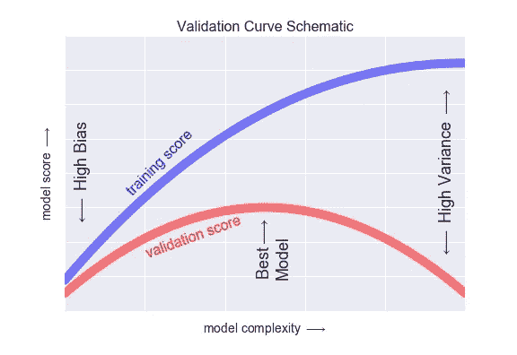

## 多重共线性

预测值高度相关，这意味着一个预测值可以通过其他预测值进行线性预测。在这种情况下，多元回归的系数估计值可能会随着模型或数据的微小变化而发生不规则的变化。多重共线性不会降低模型整体的预测能力或可靠性，至少在样本数据集内不会；它只影响关于单个预测值的计算。也就是说，具有相关预测因子的多元回归模型可以指示整个预测因子束对结果变量的预测程度，但它可能不会给出关于任何单个预测因子的有效结果，或者关于哪些预测因子相对于其他预测因子是多余的。在完全多重共线性的情况下，预测矩阵是奇异的，因此不能反转。在这些情况下，对于一般的线性模型 y = X𝛽 + 𝜀，普通的最小二乘估计量，

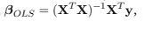

不存在。

## 处理多重共线性:

通过例如ℓ2 收缩进行正则化:通过使(𝑋𝑇𝑋)1 非奇异而在解中引入偏差。

功能选择:选择少量功能。

特征选择:使用ℓ1 收缩选择少量特征。

使用主成分分析(PCA)、偏最小二乘回归(PLS-R)或回归方法提取少量独立(不相关)特征，将预测因子的数量减少到一个较小的不相关成分集。

## 高维度

高维度意味着大量的输入特征。线性预测器将一个参数与每个输入特征相关联，因此具有相对少量样本𝑁的高维情形(𝑃，特征的数量很大)(所谓的大𝑃小𝑁情形)通常会导致训练数据的过度拟合。因此，向学习者添加许多输入特征通常不是一个好主意。这种现象被称为维数灾难。

# 过度拟合与欠拟合

我们可以通过观察相反的问题——欠拟合来更好地理解过拟合。

当模型过于简单(由太少的特征提供信息或太多的正则化信息)时，会发生欠拟合，这使得它在从数据集学习时不灵活。

简单的学习者倾向于在他们的预测中有较少的变化，但是更多偏向错误的结果。

另一方面，复杂的学习者倾向于在他们的预测中有更多的变化。

偏差和方差都是机器学习中预测误差的形式。

通常，我们可以减少偏差引起的误差，但结果可能会增加方差引起的误差，反之亦然。

这种过于简单(高偏差)与过于复杂(高方差)之间的权衡是统计学和机器学习中的一个关键概念，并且影响所有监督学习算法。

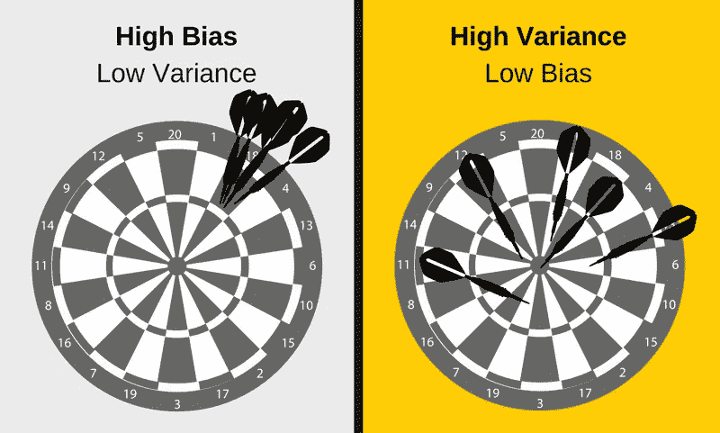

# 如何检测过度拟合

过度拟合和一般机器学习的一个关键挑战是，在我们实际测试之前，我们无法知道我们的模型在新数据上的表现如何。

为了解决这个问题，我们可以将初始数据集分成单独的*训练*和*测试*子集。

*列车测试分割*

这种方法可以估计我们的模型在新数据上的表现。

**如果我们的模型在训练集上比在测试集上表现得更好，那么我们很可能过度拟合了。**

例如，如果我们的模型在训练集上有 99%的准确率，但在测试集上只有 55%的准确率，这将是一个很大的危险信号。

**另一个技巧是从一个非常简单的模型开始，作为基准。**

然后，当您尝试更复杂的算法时，您将有一个参考点来看看额外的复杂性是否值得。

这就是[奥卡姆剃刀](https://simple.wikipedia.org/wiki/Occam%27s_razor)测试。如果两个型号的性能相当，那么通常应该选择较简单的一个。

# 如何防止过度拟合

检测过度拟合是有用的，但不能解决问题。幸运的是，您有几个选择可以尝试。

以下是一些最流行的过度拟合解决方案:

## 交叉验证

交叉验证是防止过度拟合的有力预防措施。

这个想法很聪明:使用你的初始训练数据来生成多个迷你训练测试分割。使用这些分割来调整您的模型。

在标准的 k 折叠交叉验证中，我们将数据分成 k 个子集，称为折叠。然后，我们在 k-1 个折叠上迭代地训练算法，同时使用剩余的折叠作为测试集(称为“保持折叠”)。

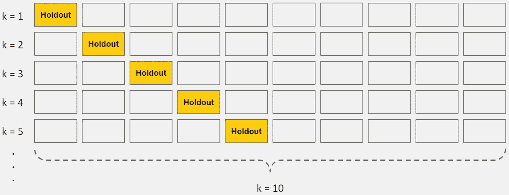

*K 倍交叉验证*

交叉验证允许您仅使用原始训练集来调整超参数。这允许您将您的测试集作为一个真正不可见的数据集来选择您的最终模型。

## 用更多数据训练

不是每次都有效，但是用更多的数据进行训练可以帮助算法更好地检测信号。在早期的儿童身高与年龄建模的例子中，很明显对更多学校进行采样将有助于您的模型。

当然，情况并不总是这样。如果我们只是添加更多的噪声数据，这种技术不会有帮助。这就是为什么您应该始终确保您的数据是干净的和相关的。

## 移除功能

一些算法具有内置的特征选择。

对于没有概化的要素，您可以通过移除不相关的输入要素来手动提高它们的概化能力。

一个有趣的方法是讲述一个关于每个特性如何适应模型的故事。这就像数据科学家在软件工程师的[橡皮鸭调试](https://en.wikipedia.org/wiki/Rubber_duck_debugging)技术上的旋转，他们通过一行一行地向橡皮鸭解释来调试他们的代码。

如果任何事情都没有意义，或者如果很难证明某些特征，这是识别它们的好方法。
此外，还有几个功能选择建议可供您参考。

## 提前停止

当你迭代地训练一个学习算法时，你可以测量模型的每次迭代的表现。

直到一定数量的迭代，新的迭代改进了模型。然而，在这一点之后，模型的概括能力会减弱，因为它开始过度拟合训练数据。

提前停止指的是在学习者通过该点之前停止训练过程。

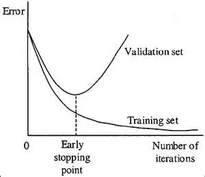

如今，这种技术主要用于深度学习，而其他技术(例如正则化)则更适合经典机器学习。

## 正规化

正则化指的是一系列技术，用于人为地使你的模型变得更简单。

这种方法取决于你所使用的学习者的类型。例如，您可以修剪决策树，在神经网络上使用 dropout，或者在回归中向成本函数添加惩罚参数。

通常，正则化方法也是一个超参数，这意味着它可以通过交叉验证进行调整。

## 组装

集成是用于组合来自多个独立模型的预测的机器学习方法。有几种不同的组装方法，但最常用的两种是:

*Bagging* 试图减少过度拟合复杂模型的机会。

*   它并行培养了大量的“强”学习者。
*   强学习者是一种相对不受约束的模式。
*   Bagging 然后将所有强学习者结合在一起，以便“平滑”他们的预测。

*Boosting* 试图提高简单模型的预测灵活性。

*   它按顺序训练出大量的“弱”学习者。
*   弱学习者是一个受约束的模型(也就是说，你可以限制每个决策树的最大深度)。
*   序列中的每一个都着重于从之前的错误中学习。
*   然后，Boosting 将所有弱学习者组合成一个强学习者。

虽然 bagging 和 boosting 都是整体方法，但它们从相反的方向处理问题。

Bagging 使用复杂的基础模型并试图“平滑”它们的预测，而 boosting 使用简单的基础模型并试图“提高”它们的总体复杂性。

# 偏差-方差权衡

低方差(高偏差)算法往往**不太复杂**，底层结构简单或僵化。

*   他们训练的模型是一致的，但平均起来不准确*。*
*   *这些包括线性或参数算法，如回归和朴素贝叶斯。*

*另一方面，低偏差(高方差)算法往往是**更复杂**，具有灵活的底层结构。*

*   *他们训练的模型平均来说很精确*，但是不一致。**
*   **这些算法包括非线性或非参数算法，如决策树和最近邻算法。**

**这种**复杂性的权衡**就是为什么在偏差和方差上有一个权衡，一个算法不能同时更复杂和更不复杂。**

# **总误差**

**要构建一个好的预测模型，您需要在偏差和方差之间找到一个平衡点，使总误差最小化。**

****总误差=偏差+方差+不可约误差****

**机器学习过程找到了最佳平衡:**

**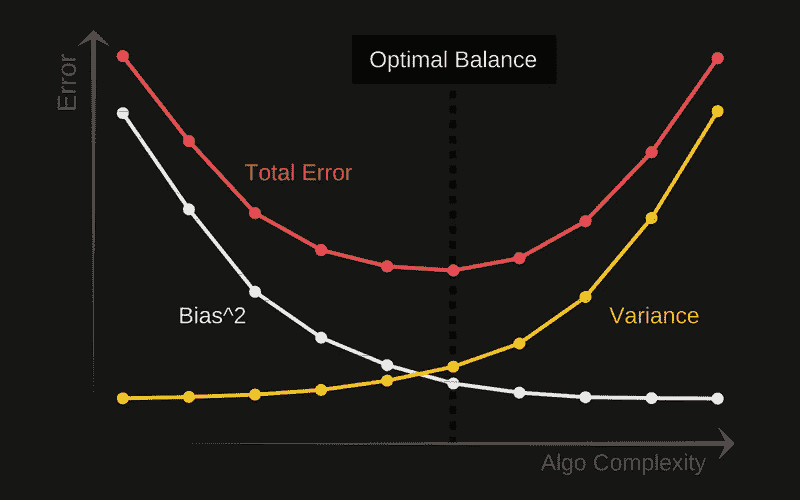**

**最后，正如您可能已经得出的结论，偏差和方差的最佳平衡会产生一个既不过拟合也不欠拟合的模型:**

**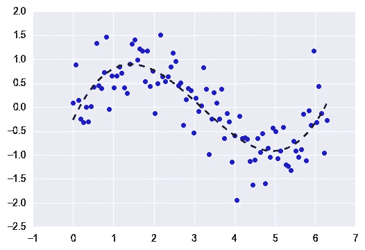**

**这是监督机器学习的最终目标——将**信号**从数据集中隔离出来，同时忽略噪声！。**

**感谢阅读！。将来我也会写更多初学者友好的帖子。请关注我，了解他们的情况。**

# **如果你喜欢这篇文章，请鼓掌！**