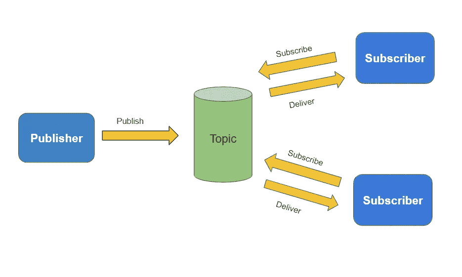
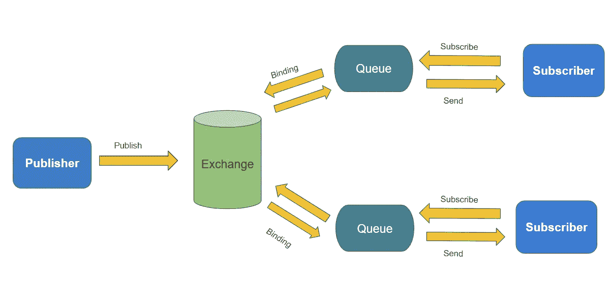
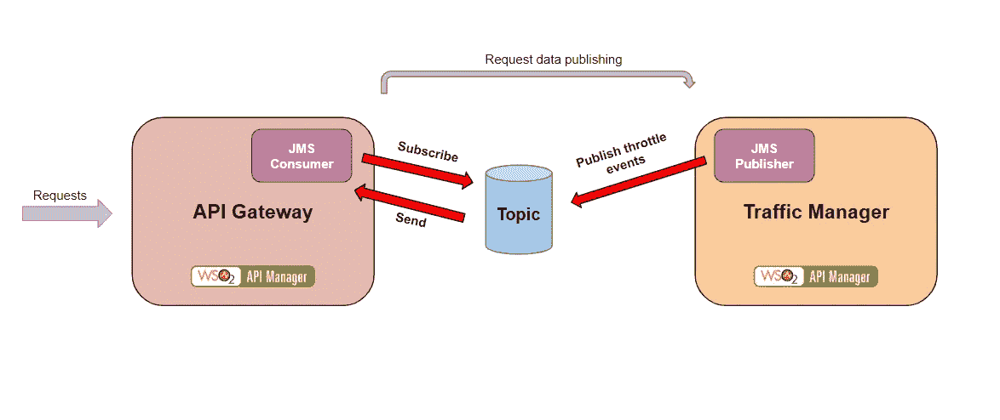
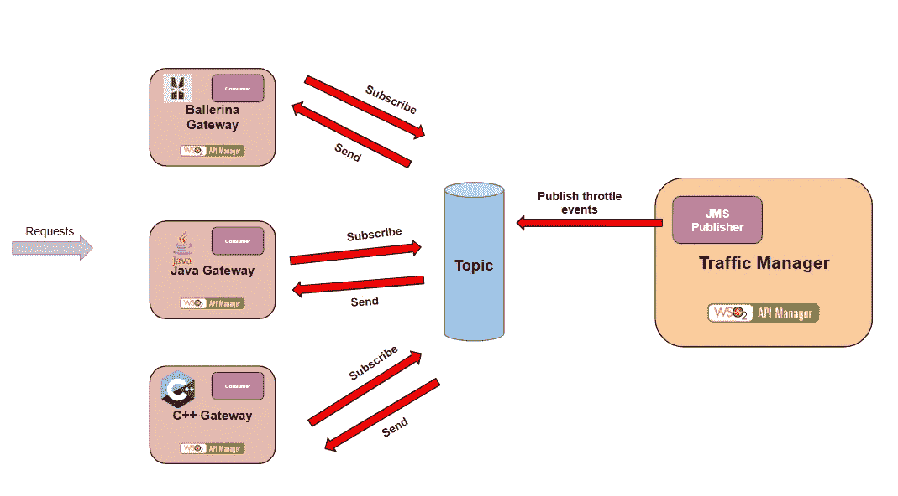

# JMS API 和 AMQP API 概述，包含真实使用案例

> 原文：<https://medium.datadriveninvestor.com/overview-of-jms-api-and-amqp-api-with-real-world-use-cases-c811ad18a11f?source=collection_archive---------1----------------------->

在本文中，我将解释 JMS 和 AMQP API，比较这两种机制，当然还有这些标准的真实用例。

# 什么是 JMS 和 AMQP？

首先，我们来了解一下这些专业术语是什么意思。JAVA 消息服务的 JMS 标准，它是一个面向消息的中间件 API，用于两个或更多服务之间的通信。JMS 是专门为 java 语言设计的，它基于 Java EE。

**AMQP** 标准为**高级消息队列协议**，是面向消息中间件的应用层协议。

# JMS vs AMQP

AMQP 是一个协议！！而 JMS 是一个 API 规范。

实现 JMS API 的 JMS 客户机可以使用它需要的任何协议。同样，JMS 可以使用 AMQP 作为与消息代理通信的协议。因此，比较 JMS 和 AMQP 没有任何意义。我们应该比较的是 JMS APIs 和 AMQP API。

这两种机制都用于两个或多个客户端之间的消息服务。但是这两种机制是有区别的。您可以找到很多关于 JMS 和 AMQP 比较的文章，所以这里我将只强调这两种机制之间的主要区别。

## 1.多语言支持

JMS 只能用于 java 应用程序，因为它基于 Java EE，但是对于 AMQP API，您可以找到多语言(c、c++、python、ruby、Java 等)API 实现。

## 2.消息传递模型

在消息解析中，JMS API publisher 可以直接将消息发送到队列/交换，而使用者可以直接订阅特定的队列/交换并使用消息。

Pub/Sub model in JMS

但是在 AMQP API 中，发布者应该用路由密钥将消息发送给交换。然后，AMQP 使用者应该首先创建一个队列，并需要将其绑定到特定的交换来使用消息。

AMQP messaging model

***JMS 消息传递模型***

在 JMS 中，支持两种消息传递模块。那些是**点对点消息传递**模型和**发布-订阅消息传递**模型。

*   **点对点消息传递**模式——一条消息只传递给一个消费者。
*   **发布-订阅消息传递**模型——一条消息被发送给所有订阅了特定主题的订阅者。

***AMQP API 消息模型***

AMQP 支持四种消息传递模块。生产者使用路由密钥将消息发布到交换，队列使用绑定密钥绑定到交换。以下四种消息传递模型取决于路由密钥和绑定密钥

*   **直接交换—** 发布者发布带有路由关键字的消息后，交换机将消息发送到队列中，队列为 r **outing key == binding key** 。
*   **扇出交换—** 简单地忽略路由键，将消息发送给所有已经订阅交换的队列。
*   **主题交换—** 允许部分匹配关键字。如果路由关键字是“动物”。* "并且绑定关键字是“animal.dog ”,交换仍然将消息发送到队列。
*   **报头交换—** 使用消息报头代替路由关键字。

到目前为止，我已经解释了你需要了解的关于 JMS 和 AMQP 的理论知识。但是我们为什么需要这种面向消息传递的中间件，以及真实世界的用例是什么。让我们来了解一下。

# 为什么我们需要 JMS 和 AMQP？

如果您使用过分布式系统，这种消息传递机制对于组件之间的通信非常有用。大多数 JMS 和 AMQP 代理提供可靠的性能，包括持久性、交付确认、发布者确认和高可用性。

# 真实世界的用例

让我们考虑一下 WSO2 API 管理器。它包括几个组件，分别是流量管理器、API 网关、密钥管理器、API 发布器、商店和管理仪表板。

WSO2 API 管理器使用 JMS 和 AMQP 机制来解析流量管理器和 API 网关之间的节流事件。我将使用下图对此进行进一步解释。

Traffic Manager and API Gateway

您可能对 API 网关有所了解。简单地说，它是一种中间层，为我们的 API 提供安全功能和速率限制特性。

流量管理器是处理所有 API 请求的地方。在这种情况下，在处理请求之后，它得到节流决定(节流决定意味着如果请求计数的数量超过定义的限制，它决定停止对服务的访问)。然后节流决定被发布到主题。所有网关都订阅了节流主题。然后，它可以使用节流决策，并相应地处理请求。

为了实现负载平衡，WSO2 API 管理器可以将多个网关连接到同一个流量管理器。

Traffic Manager with multiple gateways

在这种情况下，网关可以使用不同的语言实现，如 Java、Ballerina、c++。使用 AMQP API，我们可以毫无问题地订阅节流主题的所有网关。

与上面的用例一样，这种消息传递机制对于分布式系统非常有用。

使用 AMPQ 的另一个著名用例是物联网平台。这种消息机制用于向物联网平台中的物联网设备发送数据。想象一个智能房子，它有一个温度传感器。它将温度信息发布到服务器，订阅特定主题的设备可以获得温度信息。

通过考虑上述用例，您可以了解 JMS 和 AMQP 技术在现实应用程序中是如何使用的。我希望你能清楚地了解 JMS 和 AMQP，在我的下一篇文章中，我将向你解释我们如何用 AMQP API 消费者实现 JMS API 发布者。干杯:)！！