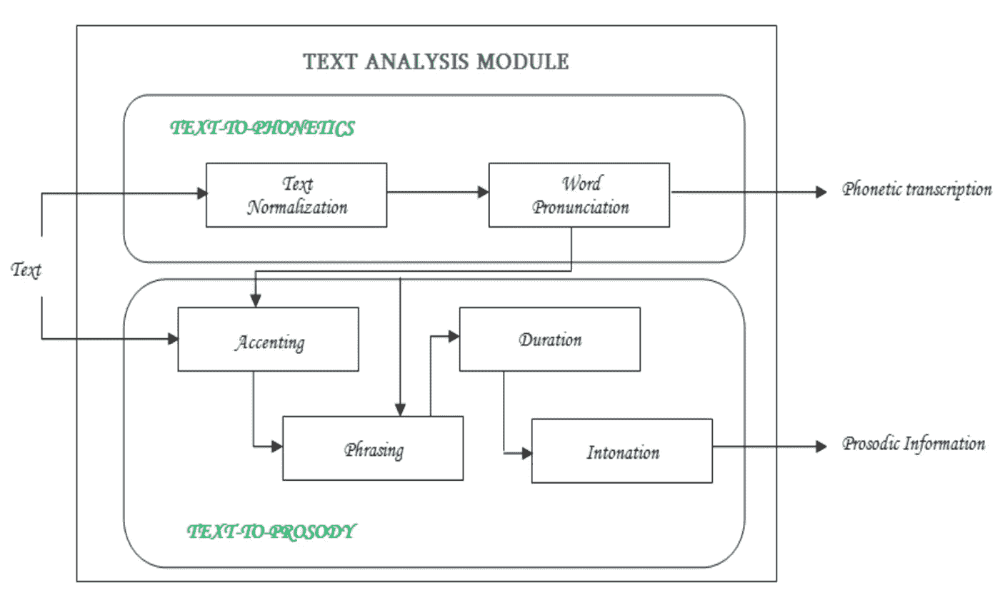
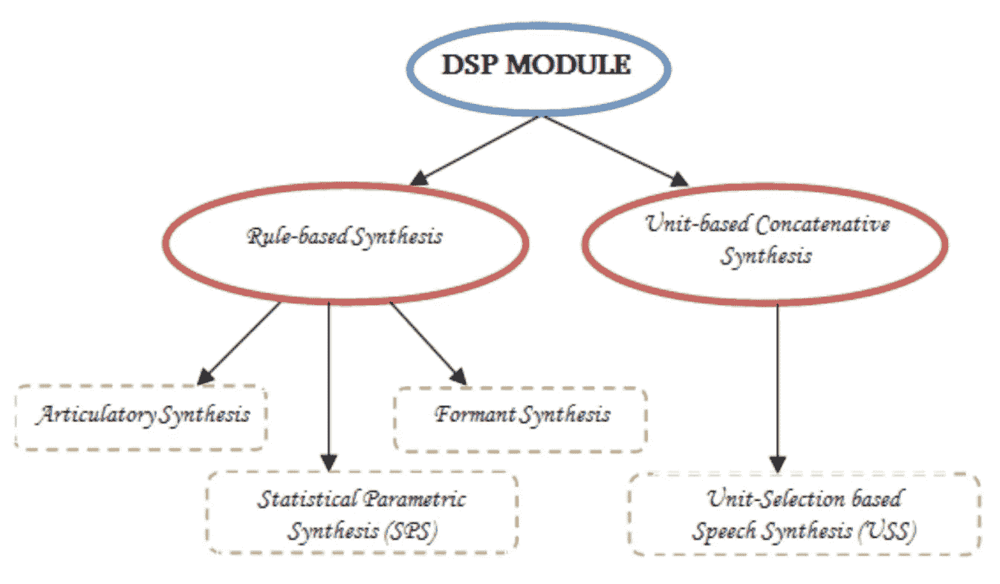

# 文本到语音(TTS)系统概述

> 原文：<https://medium.datadriveninvestor.com/overview-of-text-to-speech-tts-system-2d24cdc7f5e9?source=collection_archive---------4----------------------->

TTS 的目标是将书面文本自动转换成相应的语音。在过去的几十年里，语音合成领域取得了很大的进步。通用的 TTS 合成器包括文本分析模块和数字信号处理(DSP)模块。

图 1 显示了一个非常通用的 TTS 合成器的功能框图。文本分析模块产生所读文本的语音转录，以及期望的语调和节奏(即韵律)。DSP 模块产生与文本分析模块产生的转录相对应的合成语音。

General TTS system. Adapted from

**文本分析模块**

图 2 显示了一个通用文本分析模块的框架。文本分析阶段非常困难，因为该阶段需要仅从文本中产生 DSP 模块(用于产生语音)所需的所有信息。然而，一个简单的文本并不包含产生语音所需的所有信息。文本分析模块的第一个模块是文本到语音(T2P)模块，它将输入的文本转换成语音，第二个模块是文本到韵律模块，它产生韵律信息。

Text analysis module of a general Text-to-Speech (TTS) system

**文本到语音:-** 文本到语音模块可以进一步分解为文本标准化模块和单词发音模块。以下是对这两个模块的简要描述

**文本规范化:**文本规范化模块将输入文本组织成易于管理的单词列表。它识别数字，缩写，首字母缩略词和惯用法，并扩展到全文。这通常通过使用常规语法来完成。

**单词发音:**一旦使用文本规范化模块生成了单词序列，就可以确定它们的发音。可以应用简单的字母-声音(LTS)规则，其中单词在书写时发音。如果不是这种情况，可以使用形态句法分析器。词形句法分析器用各种身份标记语音，如前缀、词根和后缀，并将句子组织成句法相关的词组，如名词、动词和形容词。然后可以使用词典来确定这些单词的发音。

**文本到韵律**

术语韵律指的是语音信号的某些属性，例如音调(即语调)、响度、节奏、持续时间、重音和节奏的听觉变化。语音的自然度主要可以用韵律来描述。韵律事件也被称为超音段现象，因为这些事件看起来与音节或音节组在时间上对齐，而不是与音段(声音、音素)对齐

韵律的模式被用来传达句子的意思。文本到韵律块使用单词发音模块的文本和输出产生韵律信息。这个模块可以进一步分解成更小的过程，决定每个句子的重音、措辞、持续时间和语调。以下是对这四个过程的简要描述:

**重音**:重音或重音分配基于单词的类别。例如，实词(如名词、形容词和动词)倾向于重读，而虚词(如介词和助动词)通常不被接受。该信息用于预测语调和持续时间。

**语法**:句子被分解成短语单元，短语边界被分配给文本。这些边界表示停顿和语调轮廓的重置。

**语调**:语调阐明句子的类型和意义(中性、祈使句或疑问句)。此外，语调还传达了关于说话者特征(如性别和年龄)和情绪的信息。语调模块生成句子的音高轮廓。例如，句子“开门”和“开门？”有非常不同的韵律。就语调轮廓(定义为整个话语中音高的升降)而言，第一个句子是陈述性的，具有相对平坦的音高轮廓，而第二个句子是疑问性的，在短语结尾表现出音高的升高。

时长:音段时长是韵律的一个重要方面。它影响讲话的整体节奏、重音和强调、句子的句法结构以及语速。有许多因素影响一个语音片段的持续时间。其中一些是电话本身的身份、相邻电话的身份和特征、包含该电话的音节的重音状态、其短语位置以及说话者的语速和方言。

**数字信号处理(DSP)模块**

DSP 模块使用由文本分析模块产生的音标和韵律信息来产生语音。这可以通过两种方式实现，即。,

*通过使用正式描述一个音素对另一个音素的影响(即协同发音效应)的一系列规则。*

*通过存储每个语音单元的大量实例并按原样使用它们，作为最终的声学单元。*

基于以上两种方法，出现了两类主要的 TTS 系统，即规则合成和连接合成。图 3 显示了一个通用 DSP 模块。

Digital Signal Processing (DSP) module Adapted from

***合成技法的种类***

以前的语音合成技术分为发音、共振峰和拼接语音合成。拼接语音合成方法是最流行的方法。随着语音产生机制的统计建模的进步，在语音合成中使用基于隐马尔可夫模型(HMM)并进一步使用深度神经网络(DNN)的统计方法。接下来，我们简单描述一下之前开发的技术。

***发音合成***

发音合成试图尽可能完美地模拟产生语音的完整人类发音器官(即，人类发音器官和声带)。发音控制参数包括唇开度、唇突出度、舌尖位置、舌尖高度、舌位置和舌高度。它的优点是可以精确模拟由于连续声道运动引起的突然区域变化而产生的瞬变。因此，在理想情况下，它应该是产生高质量合成语音的最合适的方法。另一方面，这也是最难实现的方法之一。

第一个发音模型是基于每个语音段从喉到唇的声道面积函数表(Klatt 1987)。发音器官通常用声门和嘴之间的一组面积函数来建模。对于基于规则的合成，发音控制参数可以是例如唇开度、唇突出度、舌尖高度、舌尖位置、舌头高度、舌头位置和舌尖开度。发声或激发参数可以是声门孔径、声带张力和肺压。

在语音生成过程中，声道肌肉使发音器官运动，因此声道的形状发生变化，从而产生不同的声音。在说话期间，声道的力矩从用于发音模型的数据中获得，发音模型通常从自然语音的 X 射线分析中获得。然而，当真实声道自然地是 3d 时，该数据通常只是 2d 的，因此基于规则的发音合成非常难以优化，因为在语音产生期间发音器官的运动的足够数据不可用。此外，发音器官合成的另一个缺点是 X 射线数据不能描述关于发音器官的质量或自由度的信息。此外，舌头的运动非常复杂，几乎不可能精确建模。发音合成在当前系统中很少使用；然而，由于分析方法发展迅速，计算资源迅速增加，它可能是一个潜在的综合方法在未来。

**正弦波合成 **

正弦波合成是一种通过用纯音哨声代替共振峰(声道模型中的共振)来合成语音的方法。它基于这样的假设，即语音信号可以用具有变化的频率和变化的振幅的正弦波来表示。因此，语音信号(N)可以被建模为 N 个正弦波的总和，

其中 Ai、ωi 和φi 表示正弦分量的幅度、频率和相位。这些参数是从加窗信号帧的离散傅立叶变换(DFT)中估计的。从每一帧中选择频谱幅度的峰值。基本模型也称为麦考利/夸特里正弦模型。基本模型也有一些修改，如 ABS/OLA(综合/重叠相加分析)和混合/正弦噪声模型。然而，这种模型在表示周期性信号时工作良好，例如仅表示元音和浊音辅音，而在表示清音语音时不工作。

***共振峰合成***

共振峰合成基于语音的源滤波器模型。基于该模型，人类声道系统具有几个共振，并且系统中的这些共振导致语音的各种特征。在产生各种周期性声音的语音的情况下，声道可以被假设为几个共鸣器的级联。然而，对于鼻音化的声音，鼻腔进入画面，并且管道可以被建模为平行共振结构。因此，通常有两种基本结构，并行和级联，但为了获得更好的性能，通常使用这些结构的某种组合。共振峰合成还提供无限数量的声音，这使它比(例如，连接方法)更灵活。

已知较低的共振峰携带声音信息，而较高的共振峰携带说话者信息。通常需要至少三个共振峰来产生可理解的语音，并且需要多达五个共振峰来产生高质量的语音。每个共振峰通常由二阶数字带通谐振器模拟，其中复共轭极点对对应于一个共振峰频率。极角对应于角频率，极距单位圆的距离(在ᵶ平面内)对应于规定的-3 dB 带宽。

***串联合成***

拼接语音合成是当前使用的系统之一。它基于连接预先录制的语音来产生期望的话语。在拼接语音合成方法中，不需要确定语音产生规则。因此，串联合成比基于规则的合成更简单。拼接合成通过连接自然的、预先录制的语音单元来生成语音。这些声音单位可以是单词、音节、半音节、音素、半音素、双音素或三音素。自然语音话语的结合有助于获得听起来非常自然的语音。然而，语音单元的接合需要平滑，以避免合成语音信号中的突变或毛刺。这种方法的主要挑战是语音单元的韵律修改和解决单元边界或连接处的不连续性。韵律修改导致语音中的假象，从而使语音听起来不自然。基于单元选择的语音合成技术是一种级联合成，它通过存储具有不同韵律的每个单元的大量实例来解决这个问题。选择并连接与目标韵律最匹配的单元。根据所选单元的不同，需要标注较大的语音语料，非常繁琐耗时。这些类型的 TTS 系统听起来更自然。然而，这种合成技术的存储器需求非常大，因此可能难以移植到手持设备。

***基于 HMM 的语音合成系统***

在这种方法中，不是存储整个语音数据库，而是统计地存储有意义的模型参数并用于合成语音波形。在一个说话人数据上建立单元选择系统需要大约 8-10 小时的语音数据库。此外，数据库中的音节或音素覆盖率非常不均衡。除此之外，在串联方法中，系统将从我们记录的内容中重新创建单元。此外，在这种方法中，我们有效地记忆语音数据，而在统计方法中，我们试图学习语音数据的一般属性。基于隐马尔可夫模型的语音合成系统属于统计参数语音合成方法的范畴。基本思想是生成一些发音相似的语音片段的平均值。首先从语音数据库中提取频谱和激励参数。Mel 频率倒谱系数(MFCC)及其动态特征一般作为频谱(即声道系统)参数，log(F0)及其动态特征作为激励(即语音源)参数。然后，这些特征被上下文相关的 hmm 建模。这里，光谱、激发和持续时间将在一个统一的框架中建模。在合成时的训练之后，必须被合成的第一个给定句子，其相应的发音被转换成依赖于上下文的音素序列。然后，根据音素序列，通过级联上下文相关 HMM 来构建话语 HMM。然后确定 HMMs 的状态持续时间。然后利用语音参数生成算法，生成频谱和激励参数。最后，使用梅尔对数频谱近似(MLSA)滤波器生成语音波形。

***对 TTS 的评价***

需要适当地评估 TTS 系统，以便可以识别自然语音和合成语音的差距，并且应该通过在 TTS 系统的每个建模块中开发适当的方法来解决这一问题。TTS 系统评估包括发现 TTS 的单个构件的有效性以及最终结果-合成语音。TTS 模块的评估包括文本标准化、音调和持续时间建模、通过声码器的波形生成、语音参数生成算法以及系统的许多其他模块。合成语音的质量主要使用主观听力测试(例如，平均意见得分(MOS))来评估。还进行客观测试以进一步支持主观测试，并且可以给出人类听众可能无法捕捉到的语音质量的其他属性。关于 TTS 语音质量评估的详细描述在讲座模块“TTS 语音的评估”中给出。

***总结***

在本模块中，我们概述了文本到语音合成系统。数据收集的初始流程和数据收集所需的标签的详细信息将在接下来的模块中讨论。构建不同类型的 TTS 所涉及的技术，尤其是串联和统计参数。最后一个阶段包括评估 TTS 语音的质量。在评估 TTS 系统质量的过程中，涉及到主观和客观的衡量标准，其细节将在结论部分讨论。