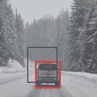
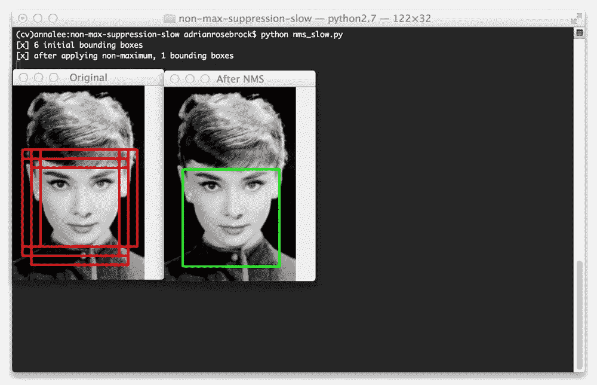
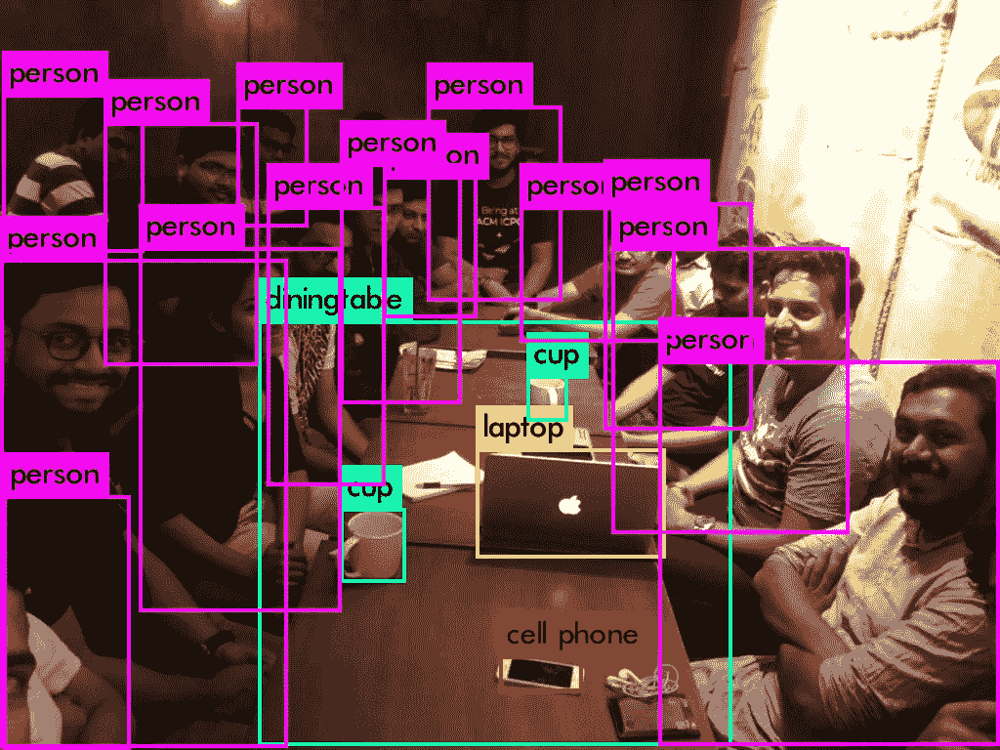

# YOLO 概况

> 原文：<https://medium.datadriveninvestor.com/overview-of-yolo-673f5019d0f2?source=collection_archive---------4----------------------->

YOLO(你只看一次)|物体检测，深度学习卷积神经网络(CNN)

对 YOLO 的一个简单解释就是赋予计算机视觉的能力。

现在，教一台机器如何“看”这个世界并不是一件容易的事情。这可不是把相机连上电脑那么简单。我们只需要几分之一秒的时间来观察、识别、分析、分类，并最终根据我们的视觉采取行动。例如，有人向你扔球，你识别球并分析它将去哪里，然后你接住它。但是对于一台机器来说，重建人类视觉不仅仅是一个动作，它实际上是一系列动作。计算机视觉(CV)是一个不断发展和不断变化的计算机科学领域，它专注于如何使计算机能够像地球上的生命体一样感知世界。

在这篇文章中，我将解释什么是 YOLO，它是如何工作的，以及我们如何在日常生活中实施 YOLO 教。

# 什么是 YOLO？

物体检测是计算机视觉中的经典问题之一，在这里你试图识别给定图像中的*什么*和*哪里*物体。

YOLO 非常受欢迎，因为它实现了高精度，同时还能够实时运行。该算法“只看一次”图像，因为它只需要图像或视频通过神经网络一次来进行预测。

有了 YOLO，单个 CNN 同时预测多个边界框和这些框的类别概率。这基本上意味着它们识别对象在哪里，并使用边界框来显示它在哪里，并使用类别概率来确定对象是什么。

# 它是如何工作的？

> *你只看一次(YOLO)是一个在*[*Pascal VOC*](http://host.robots.ox.ac.uk:8080/pascal/VOC/)*2012 数据集上检测物体的系统。它可以检测对象类别，如:*
> 
> *人、鸟、猫、牛、狗、马、羊、飞机、自行车、船、公共汽车、汽车、摩托车、火车、瓶子、椅子、餐桌、盆栽植物、沙发、电视/监视器*

很酷，对吧？但是什么？怎么会？

为了理解 YOLO 是如何工作的，我们必须后退几步，理解什么是神经网络及其层次。

## 神经网络

神经网络为 YOLO 提供动力，也是它工作的基础。它们是一种特殊类型的计算机算法，以我们的大脑命名，用于检测模式。

YOLO 本身就是一个**卷积神经网络**。这是一种神经网络，非常擅长检测图像中的模式。

## 神经网络层

神经网络由几层组成。和卷积神经网络几乎完全相同，除了它们由卷积层组成。现在我们可以更深入地了解 YOLO 是如何探测物体的。

让我们首先从 YOLO 如何创建这些边界框开始。这是一个很好的视觉效果。

简单来说，你拿一个图像输入，在 SxS 网格上分割它。然后图像被转换成灰度，这样计算机就可以把它作为 0 和 1 来处理。每个数字都代表像素的亮度。过滤器基本上是一个区域，在这里我们将一个数字乘以另一个数字，并将所有的乘积相加。在这个“图像”中，我们查看图像的一部分，应用过滤器，并对结果求和以获得卷积特征。有点像这样。

这使得计算机识别图像变得容易多了。现在，我们需要做的就是训练 YOLO 卷积神经网络，学习通过查看这些数字来确定最终的检测输出。然而，这不是创建这些边界框的唯一步骤。

YOLO 与其他对象检测算法的区别在于，YOLO 不是一点一点地扫描图像，而是取整幅图像，并将对象检测重新构建为单个回归问题，直接从图像像素到边界框坐标和类别概率。

 [## 论机器人权利:机器人可以被奴役吗？数据驱动的投资者

### 人们可以随心所欲地对待他们的机器人吗？一个人可以对他们的机器人“暴力”吗？机器人应该是…

www.datadriveninvestor.com](https://www.datadriveninvestor.com/2020/02/13/on-robot-rights-can-robots-be-enslaved/) 

计算边界框的下一步是使用 IoU 和 NMS。YOLO 实现了两个关键的后处理步骤:IoU(交集超过并集)和 NMS(非最大抑制)。

> IoU 是机器预测的边界框与实际对象的边界框匹配的程度。以下面的汽车图片为例:

> 紫色的框是计算机认为的汽车，而红色是汽车的实际边界框。两个盒子的重叠给了我们借据。

现在我们终于到了最后一步。NMS(非最大抑制)。对象检测算法通常存在过度识别某个对象的问题。这是一个很好的例子。

现在，对象检测检测一个人的多个包围盒。这就是 NMS 的用武之地。NMS 确保我们在所有的包围盒中识别出最佳的单元。NMS 没有确定图像中她的脸部有多种情况，而是选择确定同一物体的概率最高的方框。

利用 IoU 和 NMS，它可以极快地预测图像中的各种物体。这就是为什么 YOLO 比其他类型的计算机视觉更受青睐。然而，YOLO 的一个小缺点是无法检测多个太近或太小的物体。

# YOLO 有哪些实现？

这项技术如何在现实生活中实施的一个很好的例子就是自动驾驶汽车！通过实施 YOLO 算法，汽车将能够快速识别人或骑自行车的人。通过其他传感器来检测骑自行车的人有多远，汽车就能够采取必要的行动来阻止或避开骑自行车的人或其他汽车或物体，以避免碰撞！事实上，目前，YOLO 已经被用来检测汽车，人和交通灯！

另一个很好的例子是回收。YOLO 可以用于回收工厂，帮助控制机器人，将废物分类为垃圾，回收和堆肥！

我希望这个 YOLO 算法的概述已经激发了你建立自己的 YOLO 神经网络的兴趣。

*感谢您阅读我的文章，如果您学到了一些东西或对我有任何反馈，请随时对本文发表评论或鼓掌。* *如有任何问题，您也可以在* [*Linkedin*](https://www.linkedin.com/in/archie-shou-7488b3193/) *上给我发消息。*