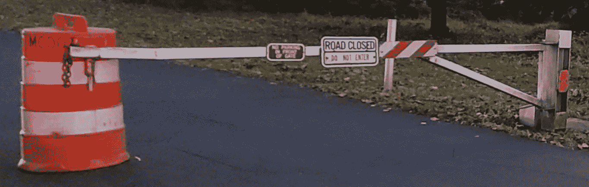
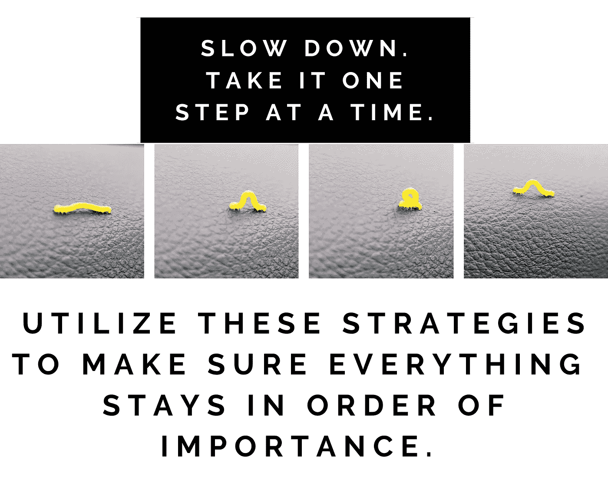

# 不知所措？优先级太多？你需要读一下这个

> 原文：<https://medium.datadriveninvestor.com/overwhelmed-too-many-priorities-you-need-to-read-this-ce02790eb9bc?source=collection_archive---------11----------------------->

## 你不应该这样继续下去。

Image by author

机会会消失。你面前的道路会关闭。如果你有太多的优先事项，你就不能继续下去。你的工作质量，以及你的身体和精神健康，都可能处于危险之中。如果一切都成了优先，你就无法维持。

> 优先次序(T1)——被认为比另一个更重要的事情(T3)。牛津

我们发现自己在处理相互竞争的优先事项，这并不罕见。最终，我们不得不选择一个。这可能会很艰难，让人不知所措。我们必须放慢脚步，一步一步来，让一切恢复正常。

如果有些事情你很难找到时间去做，试试这个练习:

> 不要说“我没有时间”，试着说“这不是当务之急”，看看感觉如何。劳拉·范德卡姆

你在健康、与孩子玩耍、给朋友打电话或看望祖母方面尝试过引用练习吗？如果你经常说，“我没有时间。”继续读。如果感觉不好…继续看！你的优先顺序有问题。

即使你现在没有感到不知所措，在某个时候你的优先事项也会改变，变得混乱。这是必然的。下面的策略会有所帮助！

(Especially if EVERYTHING has become a priority!) Image by author

## 战略 1:纸面上的优先事项

1.  头脑风暴列出一个月内花费你时间和精力的所有事情。
2.  写下你最终的 3-5 个生活优先事项。这些是大的。没有这些，你就不是你…或者至少不是一个快乐的你。
3.  将清单上的项目分开，把它们放在每个生活优先项下合适的地方。如果一件事不符合你生活的优先顺序，那就把它删掉！如果你不能，至少把它放在一个单独的清单上，当你有时间的时候(当它成为一个优先事项的时候)去处理它。如果你需要……去镜子前练习说——不！以防其中一个被偷的东西溜回来。(在从这一步开始之前，看看是否可以通过进一步剪切和组合来缩小列表)
4.  这是最难的部分。在每个类别中，按重要性顺序给项目编号。当你在列表上与他们斗争时……你正在收回控制权，并确保不是所有的事情都是优先的*。*
5.  现在，在清单上的每一项上标明你将付出的时间和时间——一天中的时间，一周中的某一天，等等。这是你保持你的优先次序的计划。
6.  最后，在指定的时间检查你自己，检查你的进步。你坚持计划吗？计划需要调整吗？
7.  放松…一切都井然有序。(不要在这个问题上睡着了，否则你的优先事项很容易滑回到一片混乱中。)

注意:这种策略可以用在像这样的大规模项目中，也可以用在优先级顺序混乱的任何规模的项目中。

> 关键是不要优先考虑你日程表上的事情，而是安排好你的优先事项。斯蒂芬·柯维

## 策略 2:必须、应该、想要

1.  在任何给定的时刻，列出所有在你脑海中优先考虑并给你带来压力的事情。
2.  用“必须”、“应该”或“不”来标记每一个。(我知道，很难说阅读不是必须的…但有时不是！)
3.  估计每个*必须*花费的时间。这会给你一个主意，如果你打算今天或几天内完成它们。它还会让你知道你什么时候有时间做*应该做的*和*想要做的*。
4.  按重要性顺序给*和*编号。
5.  将第一个*必须*分成 3-5 个步骤。
6.  选择你要开始的步骤，现在就去做。你的头脑应该清晰专注，因为你知道你的优先事项是什么，在你进入下一个之前，你将如何完成它。

## 策略 4:找到你的时间

一天中的哪几个小时，或者一周中的哪一天，对你来说最适合完成每一种任务。如果家庭是优先考虑的，但你的家庭包括一个少年，你可能不应该计划一起看日出！从生产力的角度来看，花些时间研究你的习惯是值得的。最大限度地利用你的精力将有助于你有更多的时间做其他优先事项。

## 策略 5:番茄工作法

番茄工作法使用一个计时器来确保在设定的时间内，你 100%的专注于一个给定的优先级。番茄工作法的发明者弗朗西斯科·西里洛说:“番茄工作法教你与时间一起工作，而不是与时间抗争。”如果你总是在和时间做斗争，就很难把事情按顺序排好。学习[番茄工作法](https://francescocirillo.com/pages/pomodoro-technique)。

## **策略六:拜访蔻驰**

有时候，我们不能像外界的人那样清楚地看待事物。对我们流程的反馈和一定程度的问责制非常重要。托尼·罗宾斯说，“一种‘非凡的生活质量’首先需要了解你个人的优先事项是什么。”有时候你需要一个教练来帮助你达到那个理解水平，并为你提供最适合你的策略。

> 有时生活中发生的事情让我们非常清楚地了解我们的优先事项。最终你会把这些视为礼物。m .哈格蒂

## 策略 7:快进

快进到未来，想象一下这个问题的答案:如果你现在不把注意力放在这个优先事项上，生活会怎样？有时候压力只是来自我们自己。当我们实践这个策略时，我们意识到我们可以暂时放下一些事情。或者我们可能看到我们真的不想面对我们想象的未来。无论哪种方式，我们都可以更清楚地看到某件事是否优先。

用甘地的话说，“不仅仅是文字。行动表达优先事项。”我希望你使用这些策略，忠于你的优先事项，每天都过上最好的生活！

谢谢！我很高兴阅读这是一个优先事项！

下面是一些鼓励的话，如果事情变得不可收拾，可以帮助你继续前进:

创意企业家:不要放弃，迅速恢复，变得更好