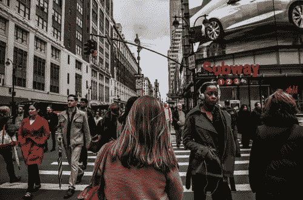

# 过度工作、过度工作和生活不足

> 原文：<https://medium.datadriveninvestor.com/overworking-overdoing-underliving-64d9bce6b61a?source=collection_archive---------15----------------------->

Photo by Christopher Burns on Unplash.com

他们说过去是外国。这当然适用于工作领域。过去朝九晚五的工作制和三杯马提尼酒的午餐似乎和已故罗马皇帝的生活一样颓废。如今，在空闲时间关掉已经够难的了，更别说在办公时间了！

从技术上来说，二十世纪中叶和现在相距几光年。

专业人士从未如此紧张和缺乏睡眠。他们不太开心，工作效率低，精力耗尽。

那么，我们不断增长的工作生活背后是什么呢？让我们倒回到 2008 年。经济一落千丈，公司争相适应严酷的新现实。大多数公司只能通过裁员和重组工作量来生存。结果是，承担过多责任的人越来越少。听起来熟悉吗？

进入智能手机。第一代 iPhone 于 2007 年推出。根据《麻省理工科技评论》的一项研究，iPhone 在短短几年内征服了 40%的美国手机市场。当你想到计算机花了 14 年时间才接近这个水平时，你会感到惊讶。

问题在于，智能手机不仅仅让生活变得更加便捷和有趣。这意味着你总是处于待机模式。您的工作只需点击一下鼠标。

根据美国心理协会的一项研究，2013 年，33%的美国人遭受了与工作相关的压力，而 48%的人声称他们的压力水平在过去五年中有所增加。

**我们去看医生的次数中，60%到 90%都与压力有关。**

我发现我们大多数人都接受压力是生活中的现实，并努力装出一副勇敢的样子。当我们最终筋疲力尽或严重生病时，我们就开始考虑改变。

**我们工作过度，生活过度，生活不足。那么你能做些什么来战胜压力呢？**

练习正念——一个快速的正念方法只需要专注于你的呼吸。深呼吸十次，然后停顿一下，你就会感觉好多了。

冥想——这需要更多的练习，但它是一个无价的减压工具。这不仅有益于你的精神健康，也有益于你的身体健康。哈佛医学院的一项研究表明，定期冥想实际上可以缩小杏仁核的大小，抵消压力。

 [## 各种类型的分布式分类帐技术|数据驱动的投资者

### 随着比特币和加密货币在全球的采用、使用和魅力增长，它们已经成为常见的流行语。这个新的…

www.datadriveninvestor.com](https://www.datadriveninvestor.com/2020/12/04/various-types-of-distributed-ledger-technology/) 

**计划好你的一天，尽量减少压力体验**

最小化压力的最好方法是制定一个长期的抗压计划。你可以从制定一个支持性的日常工作节奏开始。这可以包括早点起床，腾出时间来回顾一天的责任。这给了你思考你的任务的优势，而不会失去注意力或担心以后会发生什么。你不会总是实现你理想的工作节奏。你必须灵活应变，逆来顺受。

**锻炼是一种非常有效的压力疗法**

这并不一定意味着你必须加入健身房。简单的有节奏的重复性运动，如散步、慢跑、骑自行车、跳舞，甚至做一些瑜伽姿势，都可以显著减轻压力。

运动清除了你体内的压力荷尔蒙。它也有心理影响。花几分钟的时间关注你的身体是一种很好的方式，可以让你走出大脑，打破那些与压力相伴的强迫性想法。尝试不同类型的运动，看看什么适合你。

**视觉化是强大的压力克星**

开发一些认知策略来让你的头脑安静下来是个好主意。一是“活在当下”。因为压力就是担心过去或未来，所以我们需要学会欣赏现在。把那些引起焦虑的想法推到你的脑海深处。有意识地努力不要走神，而是把注意力集中到你正在做的事情上。最好的部分是，你可以开始练习这种正念，而不用对你的日常生活做任何改变。

想象无压力的成功。问问你自己你想要实现什么，然后专注于你需要做什么来实现它。这是一种将焦虑从你的脑海中驱走并真正专注于你能控制的事情的好方法——这是一种有保证的减压方法。

好消息！压力不是不可避免或无法逃避的。尝试一下这些缓解压力的策略，你会惊奇地发现几分钟的正念或在公园里快速散步会给你的生活带来多么大的变化。

## 获得专家观点— [订阅 DDI 英特尔](https://datadriveninvestor.com/ddi-intel)