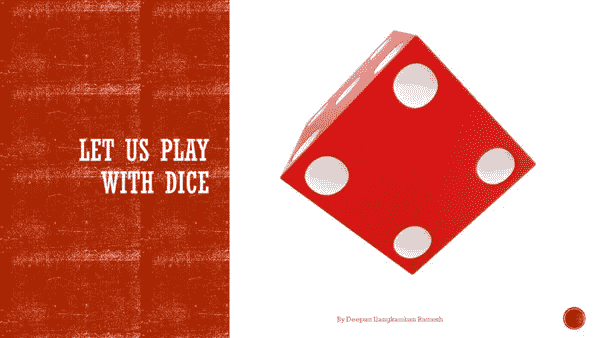
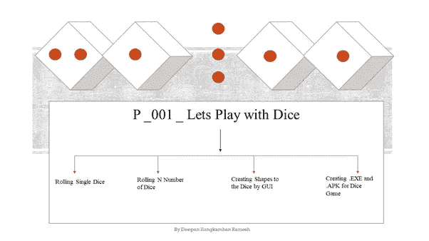
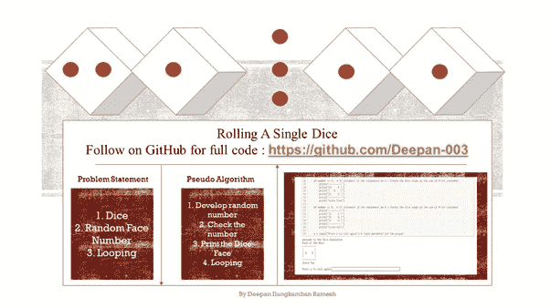
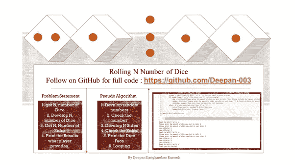
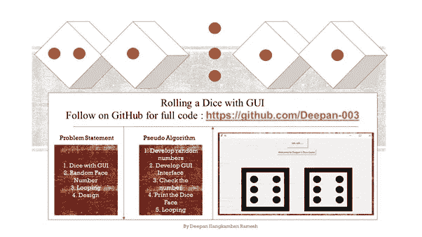
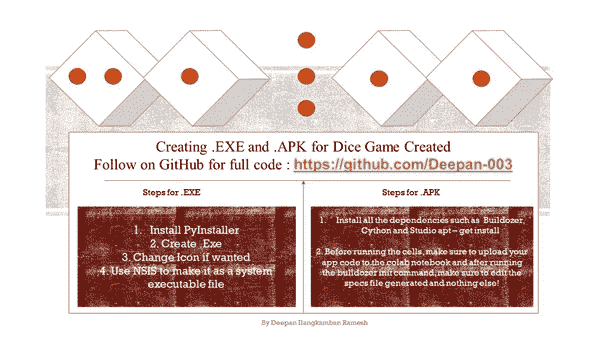
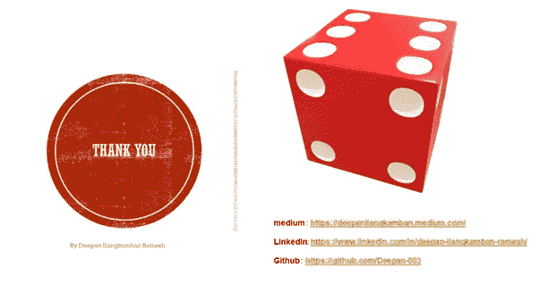

# 让我们玩骰子吧

> 原文：<https://medium.datadriveninvestor.com/p-001-lets-play-with-dice-bb23f5f4fbf0?source=collection_archive---------35----------------------->

Let Us Play with Dice

> 在这个博客里，我们将会看到一大堆让我们的童年变得无价的游戏。我们大多数人都遇到过蛇和梯子，路多，商业游戏等。在嬉戏(玩耍)中，我们等待着一个最有可能获胜的机会，我们打算把自己从蛇或跟踪我们的人手中救出来，或者逃离监狱。呀！我正在考虑掷骰子:
> 
> 我将从 4 个方面向您介绍 Python 的骰子游戏😊

P_001_Consists of :

***在每一个特征中我们都会看到问题陈述、算法和小编码***

> 在涉足之前，让我们想一想有些骰子有多少面？

**掷骰子**

Rolling A Single Dice

*随机:显示对功能的访问，支持不同类型的操作*

*从随机使用随机 Int:对于单个模具，将从单个面开始应用，即 1，并以第六个面 6 结束*

*While:将 While 循环用于玩家输入，同时通过在 print 语句中创建一个六个骰子，在循环中迭代多达六个面。*

*输入:播放器的输入参数*

**2。掷出 N 个骰子**

Rolling N Number of Dice

*随机:处理随机概率的骰子*

*掷骰:定义一个掷骰函数，并以所选骰子的 while 循环开始，将 r 迭代为和或等于 1，直到循环验证其为假。打印出所选的骰子点数。*

*为程序定义一个主函数，并在初始循环中设置测试真的变量。再次，我们的狮心王，而真正的条件循环。*

*玩家输入:接收输入开始程序或游戏。如果对输入变量不满意，跳转到 else 并通过一个热情的感谢中断程序。同时，不要忘记调用 main 函数。*

**3。带 GUI 的滚压模**

Rolling a Dice with GUI

让我们对上面的故事做同样的回应

Tkinter GUI:我们使用标准的 python GUI 工具包

*简单程序:根—标签—框架—按钮*

*骰子的 Unicode:[\ u 2680，\u2681，\u2682，\u2683，\u2684，\u2685]*

[**4。正在创建 App**](http://j)

Creating .Exe and .Apk for Dice Game Created

将 Python 应用程序转换为 APK 有三种方式

***1。设置虚拟 Linux***

**2*。Google Colab***

***3。Github 动作方式***

****在此我使用 Google Colab 方式***

## **感谢阅读**

**谢谢让我们赶上“P_002_？”**

> *参考*

[https://github.com/Deepan-003/Data-Science-Series-Projects](https://github.com/Deepan-003/Data-Science-Series-Projects)