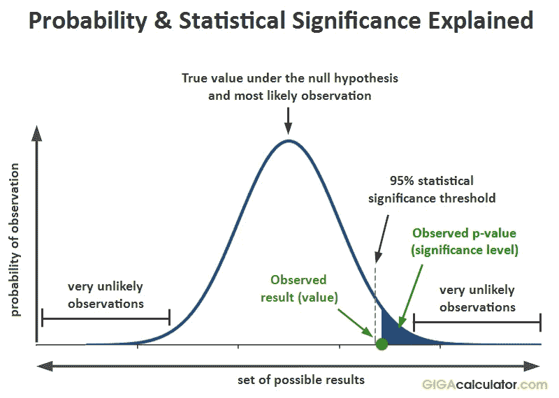
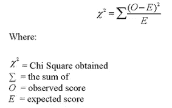
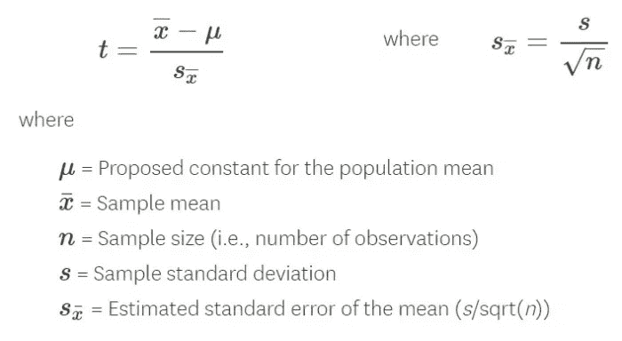
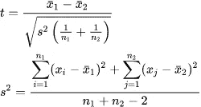

# p 值，T 检验，卡方检验，方差分析，什么时候用什么策略？

> 原文：<https://medium.datadriveninvestor.com/p-value-t-test-chi-square-test-anova-when-to-use-which-strategy-32907734aa0e?source=collection_archive---------0----------------------->

在我的[前一篇博客](https://medium.com/@2017167/understanding-hypothesis-testing-for-data-science-df952bbc1ef9)中，我已经概述了假设检验是什么，以及与之相关的错误。

在这个博客中，我们将讨论不同的假设检验技术，主要是理论上的，以及何时使用什么？

# 什么是 P 值？

p 值的作用是决定我们是接受还是拒绝我们的零假设。**p 值越低，证据越令人惊讶，我们的零假设看起来就越荒谬**。当我们对自己的无效假设感到可笑时，我们会简单地拒绝它，接受我们的替代假设。

如果我们发现 p 值低于预定的**显著性值**(通常称为α或阈值)，那么我们拒绝零假设。阿尔法应该总是在实验前设置，以避免偏见。

例如，我们通常认为一个大的人口数据是正态分布的，所以当选择α作为该分布时，我们选择它为 0.05(这意味着如果它位于我们分布的 95%，我们就接受它)。这意味着如果我们的 p 值小于 0.05，我们将拒绝零假设。

 [## 将定义 2020 年就业前景的五大数据科学和机器学习趋势|数据驱动…

### 数据科学和 ML 是 2019 年最受关注的趋势之一，毫无疑问，它们将继续发展…

www.datadriveninvestor.com](https://www.datadriveninvestor.com/2020/02/19/five-data-science-and-machine-learning-trends-that-will-define-job-prospects-in-2020/) 

但是等等，伙计们！！p 值的显著性是在执行统计测试后得出的，何时使用哪种技术是重要的。因此，现在我将列出何时进行假设检验的统计技术。

# 卡方检验

当我们对来自单个总体的两个分类变量进行**假设检验时，或者我们可以说对来自单个总体的**分类变量**进行比较时，使用卡方检验。由此我们发现这两个分类变量之间是否有任何显著的关联。**

卡方检验的假设是

**Null:** 变量 A 和变量 B 是独立的。

**备选项:**变量 A 和变量 B 不独立。

# t 检验

T 检验是一种推断统计，用于确定可能与某些特征相关的两组样本的差异或比较其平均值。它是对连续变量执行的。

t 检验有三种不同的版本:

→一个样本 t 检验，告诉**样本和总体的均值是否不同**。

**One Sample t-test**

→双样本 t 检验也称为独立 t 检验——它**比较两个独立组的平均值，并确定是否有统计证据表明相关总体平均值显著不同**。

**Two sample t-test**

→当您想要比较同一组不同样本的平均值时进行配对 t 检验，或者使用 ***w* 比较同一组不同时间的平均值** *。*

# 方差分析检验

它也被称为方差分析，并且**用于在一次测试中比较多个(三个或更多)样本。**分类特征有两个以上类别时使用。

方差分析测试的假设是

**空**:所有样本对相同，即所有样本均值相等

**替代**:至少有一对样本明显不同

我希望我已经报道过了。在那之前，祝你学习愉快！！