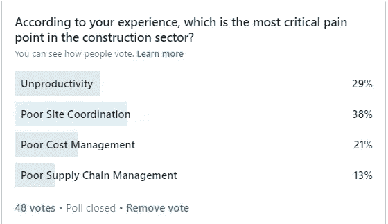

# 建设之痛

> 原文：<https://medium.datadriveninvestor.com/pain-of-construction-95a7f0324ff3?source=collection_archive---------12----------------------->

如果你与建筑专业人士交谈，你会听到该行业的许多严重问题。施工队用他们的经验解决了这些问题。此外，该部门的所有各方都相互指责。

> 我是一名建筑技术爱好者，也是建筑技术初创公司 Botmore 的首席执行官。我一直在努力寻找解决该部门日常问题的办法。

两周前，Botmore Technology 发起了一项关于建筑行业痛苦的调查。

Results of Two Week Pole

> 你可以看到我们的调查结果。正如你所看到的，来自世界各地的 48 名建筑专业人士被评为建筑行业的痛点。

根据我们的调查，**不良的现场协调**是该领域最重要的问题。虽然有很多有用的技术解决方案，但在建筑工地上，问题都是靠个人努力解决的。此外，网站上有许多不同的团体，这些团队不习惯集体工作。因此，站点团队花费超过**% 50%的时间**来满足协调。协调问题可以看作是其他问题的根本原因，直接影响生产。

 [## 使用谷歌搜索趋势预测首次申请失业救济人数|数据驱动的投资者

### 几年来，我的重点一直是使用多种替代数据来预测宏观经济统计数据…

www.datadriveninvestor.com](https://www.datadriveninvestor.com/2020/03/25/using-google-search-trends-to-predict-initial-jobless-claims/) 

票数第二高的是**【无效】**。建筑行业显然存在生产率问题。如果您将该部门与其他部门进行比较，您会发现可以测量到至少 20%的生产率损失。从设计管理到现场管理，生产力的根本原因有很多。但正如你预测的那样，生产率低下是该行业更普遍的痛苦。然而，更具体的问题施工现场协调似乎是一个重大挑战的部门，尊重生产力。这表明选民意识到了生产力低下的问题；此外，它们是协调的更具体的重点。

第三高的票数是由"**成本管理公司获得的。**“如果你在施工计划和成本控制部门工作，你会发现项目的成本管理系统不足以衡量现场的现状。因此，所有的建筑专业人士和项目业主都感受到了肩上的成本控制压力。这就是为什么很明显，有相当一部分人认为“成本管理”是一个关键问题。

 [## 良好的生活是习惯的形成|数据驱动的投资者

### 过度思考是过度紧张。仅仅几个简单的习惯就会在一天中产生巨大的影响。那是…

www.datadriveninvestor.com](https://www.datadriveninvestor.com/2020/01/17/a-good-life-is-habit-forming/) 

最低票由**供应链管理**获得。我觉得这太正常了。因为相对于其他问题，供应链处于更好的状态。材料制造商通常拥有更复杂的供应链管理系统，因此这些供应商能够有效地支持行业。当然，另一方面，该部门在供应链中存在重要问题，如采购计划、库存区域计划等。建筑公司使用 ERP 解决方案，该工具直接关注这些挑战。

**总而言之，**施工现场协调和生产率是建筑部门面临的挑战。

> **新技术竞赛的获胜者将是找到更好的解决方案来提高现场协调和生产率的人。**