# 熊猫 101:数据分析与处理

> 原文：<https://medium.datadriveninvestor.com/pandas-101-data-analysis-manipulation-fae8068beb2?source=collection_archive---------13----------------------->

## 10 分钟内你需要知道的一切！


Photo by [ev](https://unsplash.com/@ev?utm_source=medium&utm_medium=referral) on [Unsplash](https://unsplash.com?utm_source=medium&utm_medium=referral)

## 为什么要学熊猫？

真实世界的数据需要转换成我们的模型可以理解的格式来处理，并且在我们的数据集中可能存在一些泄漏，从而提高了对我们的数据进行预处理的需要。

Pandas 是数据处理中常用的工具。它是一个开源库，提供了高性能，是一个分析和处理数据的好工具。它也有许多易于使用的数据结构。

它是处理结构化数据的最重要的工具之一。结构化数据是一种标准化格式，用于提供关于页面的信息并对页面内容进行分类；例如，在食谱页面上，有哪些成分、烹饪时间和温度、卡路里等等。

[](https://www.datadriveninvestor.com/2019/09/19/rs-metrics-metalsignals-data-analysis/) [## 替代数据分析-遥感度量金属信号|数据驱动的投资者

### 替代数据现在被誉为新的石油。这些数据集提供了独特而及时的市场和…

www.datadriveninvestor.com](https://www.datadriveninvestor.com/2019/09/19/rs-metrics-metalsignals-data-analysis/) 

它是处理结构化数据的最重要的工具之一。结构化数据是一种标准化格式，用于提供关于页面的信息并对页面内容进行分类；例如，在食谱页面上，有哪些成分、烹饪时间和温度、卡路里等等。

它是处理结构化数据的最重要的工具之一。结构化数据是一种标准化格式，用于提供关于页面的信息并对页面内容进行分类；例如，在食谱页面上，有哪些成分、烹饪时间和温度、卡路里等等。

# 入门指南

要开始使用 pandas 库，首先需要在编程环境中导入这个库。

```
**import** pandas **as** pd  # *To import the pandas module into your code.*
```

> 上面的方法假设你已经安装了 pandas，如果没有安装，你可以下载 Anaconda[【https://www.anaconda.com/products/individual】T2]或者在你的终端输入下面的语法来下载 pandas 库，

```
pip install pandas
```

# 数据框架和系列

Pandas 中的数据结构是使用两个核心对象实现的:

`**DataFrame**` **，**这是一种表格，类似于电子表格，最适合将数据表示成单元格。它由命名的列和编号的行组成。

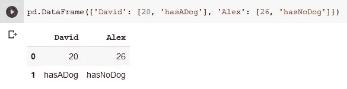

```
pd.DataFrame(*p*arameters) # *Generates a DataFrame*"""
**Parameters:****data:** ndarray (structured or homogeneous), Iterable, dict, or DataFrame
Dict can hold Series, arrays, constants, or list-like objects.
**index**: Index or array-like (*optional)* **columns**: Index or array-like (*optional)* **dtype:** dtype, the default value is None (*optional*)
**copy**: bool, the default values is False"""
```

创建 DataFrame 时，如果使用所有标量值，则必须传递一个索引。一个**标量**是一个可以有一个**值** *的类型，例如字符串，整数。*为避免任何错误，将行放在选择括号`[]`内。

`**Series**`、**、**是单列序列的数据值。`DataFrame`包含一个或多个`Series`和每个`Series.`的名称

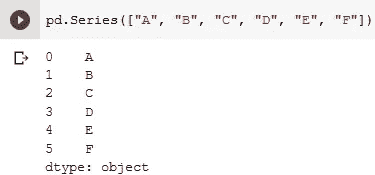

```
pd.Series(*parameter*s) # *Generates a Series*"""
**Parameters**:**data**: array-like, Iterable, dict, or scalar value
**index:** array-like or Index (1d)
**dtype**: str, numpy.dtype, or ExtensionDtype, (*optional*)
**name:** str, (*optional*)
**copy**: bool, default False"""
```

知道如何创建数据帧和数据系列是很重要的，但是，大多数时候你将使用预先存在的数据。因此，您需要使用以下代码将文件加载到一个`DataFrame`中

```
ourData = pd.read_csv(*your_file_path)*
```

对于这个例子，我们将使用在 [UCI 机器学习知识库中找到的](https://archive.ics.uci.edu/ml/datasets/Iris)[虹膜数据集](https://gist.githubusercontent.com/curran/a08a1080b88344b0c8a7/raw/639388c2cbc2120a14dcf466e85730eb8be498bb/iris.csv):虹膜数据集。

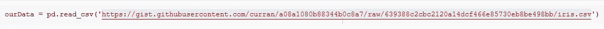

# 深入了解我们的数据

Pandas 有许多方法可以让我们了解数据集、列名、行数、缺失值等等。

## 头部()

`head()`方法显示数据集中出现的前五行，以及它们所属的列和它们的索引号。

```
ourData.head()
```

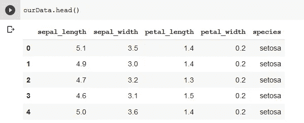

## 信息()

`info()`方法提供了行数(条目数)、列数和列名、它们的数据类型以及非缺失(非空)值的数量。

```
ourData.info()
```

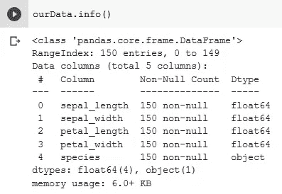

## 描述()

`describe()`方法将数据重组为统计摘要，如数据帧中各列的平均值、标准差、百分位数或一系列数值。

```
ourData.describe()
```

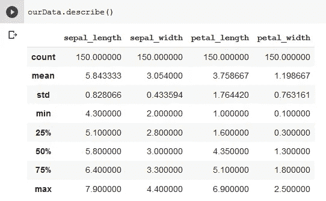

## 列

`columns`方法用于显示数据集中可用的不同列的列表。

```
ourData.columns
```

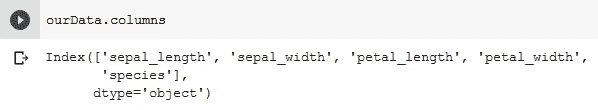

## 唯一()

`unique()`方法被附加到带有分类变量的列名中，以查找其中的唯一值。

```
ourData.column_name.unique() 
```

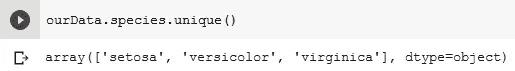

重要的是要知道可以使用选择括号`[]`来引用 column_name。如果列名之间有空格，唯一可能的引用方式是用引号将它括在选择括号内。

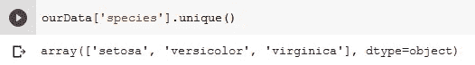

# 选择、索引、获取和操作我们的数据

在 Pandas 中选择列或使用其索引获取值类似于 Python 中使用选择括号`[]`的方法。索引或列名在选择括号`[]`之间传递以返回值。

`index`属性用于为 Series 和 DataFrame 分配标识符(索引)值。它还提供了关于数据帧索引的信息。

```
ourData.index
```

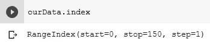

使用上面的方法，Pandas 会根据数据的排序自动为每个值赋予一个唯一的索引值。一旦索引被赋予一个值，当数据被重新排序时，它不会改变。

对数据行重新排序的一种方法是使用`reindex`属性

```
ourSeries.reindex([*ourNewOrder*])**'''
Example: Imagine ourSeries comprises of alphabets from A to E.**0  E
1  C
2  A
3  D
4  BTo manually reorder our data to our order of choice is by using the ***reindex*** method'''ourSeries.reindex([2, 4, 1, 3, 0])*ourSeries*2  A
4  B
1  C
3  D
0  E
```

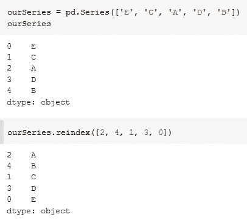

## 使用索引运算符访问

使用值的索引，我们可以为任何操作访问它。默认情况下，索引是数值。索引操作符`[]`通常用于通过索引访问数据。

```
ourSeries[0] # This will print the value E
```

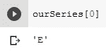

## loc[]和 iloc[]

Pandas 有自己的方法`loc`和`iloc`用于索引和访问数据。它们用于索引运算符无法执行的高级操作。

`iloc` 是基于整数位置的索引，用于按位置选择。数据是根据它们在数据中的数字位置来选择的，也就是说，为了选择数据中的第一行，我们将使用以下代码

```
ourData.iloc[2]
```

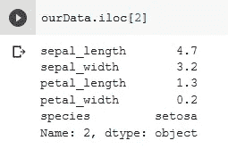

上面的语法给出了`ourData`中第三行的所有信息。

**使用 iloc[]访问列**

要访问一列中的所有行(例如第一列)，您可以使用以下代码

```
ourData.iloc[:, 0]
```

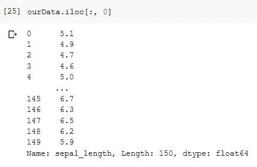

要访问一列中的前 5 行，可以使用以下方法

```
ourData.iloc[:4, 0]
```

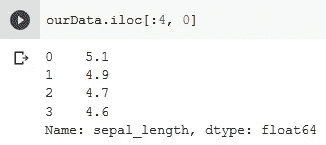

**loc[]**

`loc`是用于数据选择的基于标签的索引。在这个范例中，数据主要由标签访问，也可以由布尔数组访问。为了选择`ourData`中的第一个条目，我们将使用以下代码

```
ourData.loc[0, columnname]
```

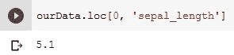

Panda 的`iloc`和`loc`是行优先、列第二，和 Python 中的列优先、行第二的索引方法相反。

## 重命名索引

索引可以从默认数值重命名为字符串或整数。Pandas 提供了一种`rename()`方法来使之成为可能。要重命名索引，我们使用以下语法

```
ourData.rename(index={0: 'firstValue', 1: 'secondValue'})
```

## 重命名列和行

`rename()`方法也可用于重命名列和行标签，只要字典提供了当前名称和要应用的新名称。

```
ourData.rename(columns={'columnname': 'ourNewColumnName'})
```

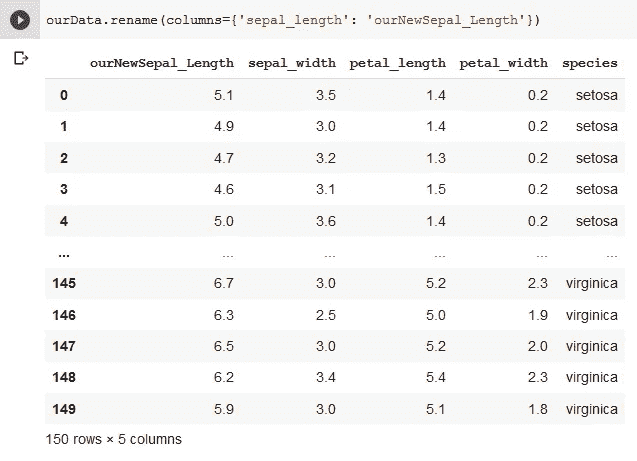

# 组合、分组和排序

## 结合

Pandas 有三种方法将数据帧或系列组合在一起。这些方法是`concat()`、`join()`和`merge()`。`concat()`方法是最简单的组合方法，而`join()`和`merge()`方法功能相似。

当我们不同的数据帧有相同的列或字段时,`concat()`方法很有用。它将来自每个数据帧的数据(行)合并在一起。

```
pd.concat([dataset1, dataset2])
```

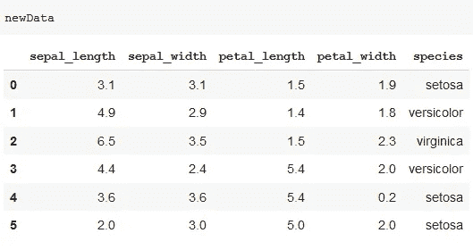

在这个例子中，我们将把`ourData`连接到一个名为`newData`的新数据集。

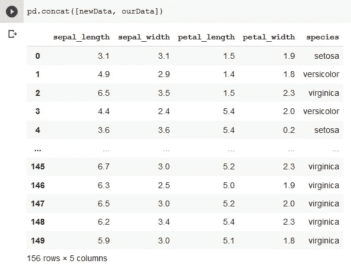

我们注意到数据集中的行数增加了 6，从 150 增加到 156。当调用`concat()`方法时，来自`ourData`的 150 行被添加到`newData`。

`join()`方法将多个 DataFrame 对象的列组合在一个公共索引或一个键列上。

```
DataFrame.join(*otherDataFrame,on=None, how='left', lsuffix='', rsuffix='', sort=False*)"""
**Parameters**:**otherDataFrame**: the different DataFrame to be joined
**on:** Column or index level name(s) in the caller to join on the index in other, otherwise joins index-on-index. (*optional*)
**how**: {‘left’, ‘right’, ‘outer’, ‘inner’}, default ‘left’ // How to handle the operation of the two objects.
**lsuffix:** Suffix to use from the left frame’s overlapping columns.
**rsuffix**: Suffix to use from the right frame’s overlapping columns.
**sort**: Determines the order of the join key depending on the join type (how keyword)."""
```

当数据在两个数据帧中具有相同的列名时，`lsuffix`和`rsuffix`参数是必需的。

## 分组

Pandas 有一个名为`groupby()`的方法，它通过一系列列对数据帧进行分组。这种方法可用于对大量数据和计算操作进行分组，这涉及拆分对象、应用函数和组合结果的某种组合。

```
ourData.groupby()
```

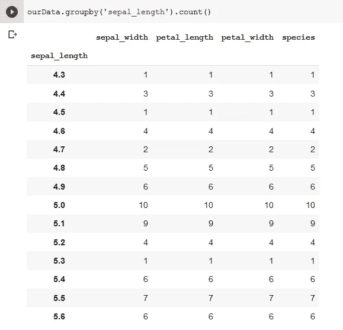

这个语法和`count()`方法一起对萼片长度值进行排序，并根据它们在我们的数据集中出现的次数进行分组。有很多其他方法可以加入到`groupby()`方法中。

## 整理

数据帧通常按索引排序，也可以按其中一列的值排序。`sort_values()`是 Pandas 提供的一种方法，通过列的值对数据进行排序。该方法对行进行重新排序，并将具有相似关键字的行组合在一起。

```
ourData.sort_values()
```

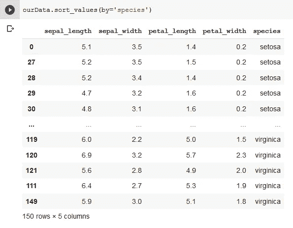

# 绘制值

分析我们的数据的一个很好的方法是以图形格式可视化它。Pandas 允许使用 Matplotlib 模块可视化我们的数据，以创建图表、图形或绘图来分析数据。为此，需要导入 Matplotlib 的 pyplot 模块。

```
import matplotlib.pyplot as plt
```

在 [Matplotlib 的文档](https://matplotlib.org/3.3.0/api/_as_gen/matplotlib.pyplot.plot.html)中提供了可视化数据的多个选项。

这里有许多不同手术的其他方法，包括上面讨论的熊猫手术。在本文中，我们研究了一些可以帮助您分析和操作数据的工具。Pandas 的更多函数和方法及其参数可以在 Pandas 的官方文档中找到。

**进入专家视角—** [**订阅 DDI 英特尔**](https://datadriveninvestor.com/ddi-intel)