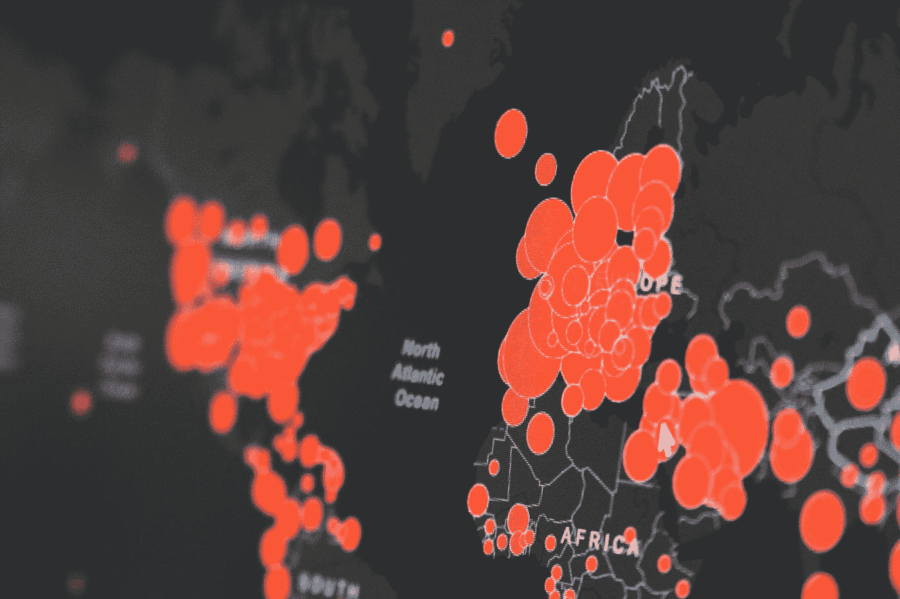
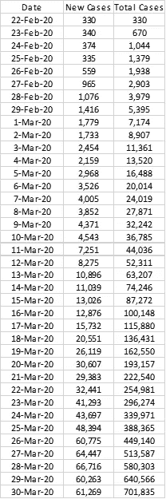
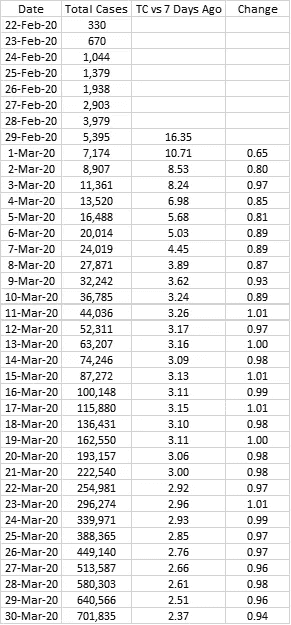
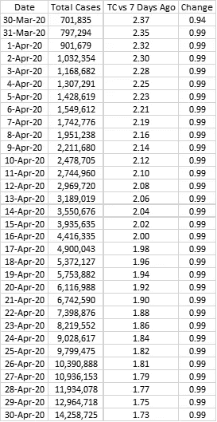
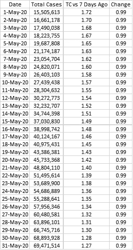
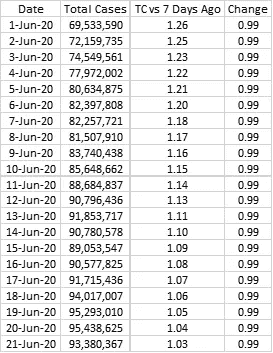
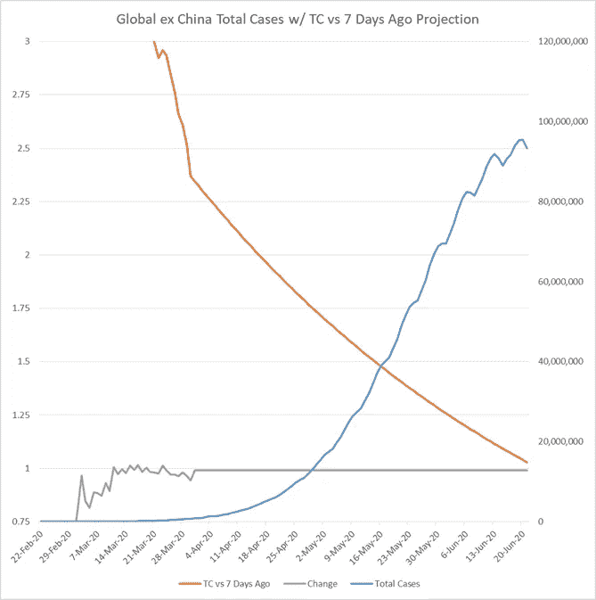
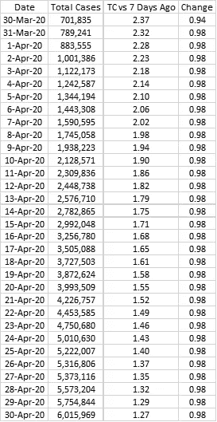
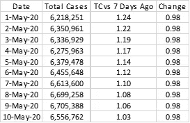
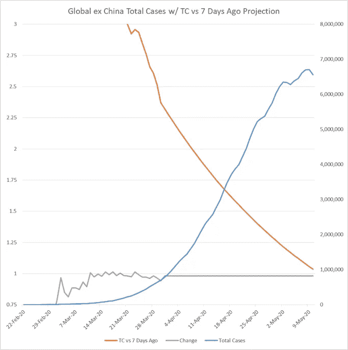

# 疫情峰值预测:基于简单工具的两种情况

> 原文：<https://medium.datadriveninvestor.com/pandemic-peak-projections-two-scenarios-based-on-a-simple-tool-1bc3019bccc2?source=collection_archive---------26----------------------->

Photo by [Martin Sanchez](https://unsplash.com/@martinsanchez?utm_source=medium&utm_medium=referral) on [Unsplash](https://unsplash.com?utm_source=medium&utm_medium=referral)

这是一篇简短的文章，提供了一个基本工具来预测冠状病毒感染高峰时间和疫情这一阶段的病例数。

它也出现在我的博客 https://notumignotum . blogspot . com/2020/04/疫情-peak-projections-two-scenarios . html 上。

 [## 冠状病毒；惊慌失措；字里行间的 z |数据驱动的投资者

### 围绕冠状病毒的话题；更准确地说，新冠肺炎几乎占据了整个新闻预报的头条…

www.datadriveninvestor.com](https://www.datadriveninvestor.com/2020/03/23/coronavirus-a-to-panic-z-between-the-lines/) 

下表基于 [Worldometer](https://www.worldometers.info/coronavirus/coronavirus-cases/#case-growth-outchina) 数据，显示了除中国以外的全球冠状病毒病例:

我使用了简单的跟踪方法，将某一天的总案例数与 7 天前的总案例数进行比较。该表如下所示:

随着 TC 与 7 天前的比率收敛到 1，周期的峰值将在这几天左右达到。考虑到充分的社会距离和某些隔离措施以及其他措施，极右翼的变化因素预计会进一步下降。简而言之，变化是指某一天的 TC 与 7 天前的 TC 与前一天的 TC 之比。

这个简单的比率分析为我们提供了各种峰值场景。让我们看看他们。

情景 1:缓慢下降

在这种情况下，变化系数为 0.99，比过去 10 天高出 0.01。6 月 20 日达到高峰，感染人数为 9540 万。

情景 2:适度下降

在这种情况下，变化系数为 0.98，这是过去 10 天的平均值。5 月 9 日达到高峰，感染人数为 670 万。

在这一点上，数字上的巨大差异表明，感染轨迹的微小变化可能会在几周内造成巨大差异。鉴于最近的数据，除非发生一些负面冲击，否则不太可能出现比情景 1 更糟糕的情况。从中国到意大利，尽管在某些情况下控制速度较慢，但还是可以实现的。

类似地，比场景 2 更好的事情(虽然比场景 1 更糟糕的事情似乎更合理)将是一个积极的惊喜，这是我所没有预料到的。如果控制措施达到了预期的效果，可能在 5 月中旬左右，情绪低落的感染高峰将持续到 6 月下旬，届时疫情的这一阶段将得到控制。目前，这似乎是最有可能的情况。即使在一个更糟糕的情况下，这个数字在时间上最多会被推迟 2 个月。然而，比时间更重要的是，即使恢复率提高，情景 1 也会与死亡率显著相关。

一些国家少报了没有计入全球数字的风险，严重缺乏测试使数字变得复杂，以及疫情在非洲一些准备不足以应对其影响的地区的影响。这些因素结合在一起可能会产生重大影响，但更引人注目的是，它们可能会导致感染集中在某些地区，而其他地区会迅速恢复。目前，这一分析没有考虑这些因素。

2020 年 3 月 31 日