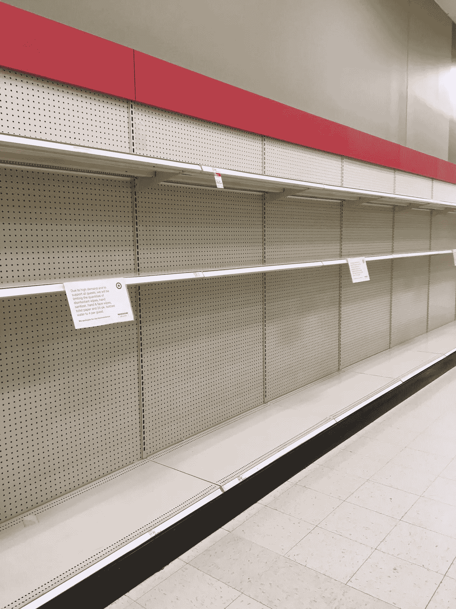

# 恐慌性购买是疫情预科最糟糕的部分

> 原文：<https://medium.datadriveninvestor.com/panic-buying-is-the-worst-part-of-pandemic-prep-edb025191c6e?source=collection_archive---------8----------------------->

Photo Credit: Missy Nolan

我整个星期都在跟踪目标应用程序，因为我需要卫生纸。经过几天的失望，我终于找到了一个有限库存的目标。我不知道那是什么意思，但我想我应该快点。我猛拉了一件连帽衫在我的背心上，懒得换下我的圣诞怪杰睡衣或刷我的头发。

我附近的道路通常是一个噩梦般的早晨，但今天它是空的。我很快意识到这是因为一半的城镇在目标。当我到达商店时，我停好车，看着人们朝入口跑去。这让我想起了我在黑色星期五当收银员的时候，人们在破晓时分冲进过道，抢走看到的一切。

 [## 为什么包容性财富指数比 GDP 更能衡量社会进步？|数据驱动…

### 你不需要成为一个经济奇才或金融大师就能知道 GDP 的定义。即使你从未拿过 ECON 奖…

www.datadriveninvestor.com](https://www.datadriveninvestor.com/2019/03/08/why-inclusive-wealth-index-is-a-better-measure-of-societal-progress-than-gdp/) 

我匆匆穿过停车场，紧张地看着人们带着满满一车卫生纸离开商店。废话。我就要错过施展魅力的机会了。

我抓起一辆手推车，向卫生纸通道走去。一个男人试图从药店跑过去阻止我，但是他已经太迟了。胜利是我的，我抢到了最后两包卫生纸。

它们是小包，但没关系。我没指望能找到什么，所以我对我的购买感到满意。从货架上拿面包卷让我感到内疚，但我并不只是在疯狂抢购。我真的需要卫生纸给我的家人。

我不是唯一一个。今天早上，我在推特上滚动，看着#恐慌购买和#冠状启示填充了我的订阅。全国人民花了几天时间寻找卫生纸，因为它在塔吉特、沃尔玛、好市多和杂货店都卖光了。他们也很难找到瓶装水、纸巾、面巾纸、洗手液、肥皂和尿布。

太恐怖了。

在这一点上，我更害怕围绕冠状病毒的歇斯底里，而不是病毒本身。我知道你们中的一些人在想，“嗯，当你年轻健康的时候说这些很容易。”很公平，但是我有反应性呼吸道疾病。我最不希望看到的就是病毒对我的呼吸系统造成严重破坏。

不过，我没时间担心这个。生命随时可能结束，我们在这里的时间永远无法保证。我计划至少在这个星球上再待几十年，但我无法控制病毒传播的速度。这就是为什么我更担心如果恐慌引发的购物继续下去，我们的国家会发生什么。

我不是经济专家，但如果我们的国家继续在焦虑影响的阴霾中清理货架，以下是一些可能发生的事情:

## 由于我们不良的卫生习惯，我们会得其他疾病

用肥皂洗手不仅能降低新冠肺炎病毒爆发的风险。它还降低了你传播肺炎、流感和其他常见传染病的几率。

卫生纸也有助于限制感染的传播。如果你省吃俭用卫生纸或使用自制湿巾，你的手上可能会有细菌。想想当你用比实际需要更少的纸擦拭或者使用便宜的单层纸擦拭时会发生什么。

你的内裤上也可能有更多条纹。这不会给你和你的另一半加分，不仅仅是因为它难看。在洗涤过程中，这些粪便污渍会将沙门氏菌和大肠杆菌等令人讨厌的微生物传播给所爱的人。你可以通过将洗衣水保持在华氏 104 度或更高的温度来帮助预防健康问题，并使用消毒衣物的东西，但如果疫情恐慌导致漂白剂短缺怎么办？

## 暴力会增加

你认为你生活在一个安全的社区吗？等到你在拥挤的商店里买了最后一包卫生纸。事实上，关于购物者在[争夺供应](https://www.perthnow.com.au/news/health/coronavirus-crisis-nsw-womens-brawl-over-toilet-paper-at-woolworths-caught-on-film-ng-b881482749z)的报道已经滚滚而来。

但我说的不仅仅是涉及陌生人的暴力行为。[研究表明](https://jamanetwork.com/journals/jamapsychiatry/fullarticle/2533653)紧张的环境往往会引发暴力，这对与施虐者生活在一起的伴侣或孩子来说听起来可不太妙。学校和工作场所的长期关闭意味着受害者不得不花更多的时间与施虐者在一起，这也于事无补。

也有可能发生抢劫和骚乱，因为基本供应变得稀缺，或者银行账户因停工而空空如也。为了生存，人们可能会抢劫商店，甚至偷邻居的东西。如果这听起来很疯狂，研究一下卡特里娜飓风之后发生了什么。

## 关系会结束

疫情预科让人们看到了最坏的一面。一些夫妇可能会在这段时间结合，但许多人可能会分道扬镳。恐慌引发的疯狂购物导致银行账户枯竭，这可能会给一些伴侣带来重大问题。你可能会注意到由于经济原因而分手或离婚。

当你不再有两种收入来源时，你会发现更容易获得食品券、医疗补助或其他政府福利。这可能会让人们在新冠肺炎疫情爆发期间无法在家工作的员工错过多份薪水。不幸的是，这对许多浪漫关系的未来不是好兆头。

柏拉图式的关系也可能会陷入困境。你会和一个一无所有的朋友分享你的卫生纸或罐头食品吗？你会原谅一个可能在不知情的情况下将冠状病毒传播给你年长的家人的朋友吗？你们的友谊能经受住自我隔离或疾病预防控制中心推荐的[社交距离](https://www.cdc.gov/coronavirus/2019-ncov/community/index.html)吗？当新冠肺炎穿过你的区域时，这些都是需要考虑的重要事情。

## 股票会暴跌

你可能听过卫生纸库存飙升的笑话。这可能是真的，但总的来说，经济正在衰退。事实上，2020 年 3 月 12 日，美国市场经历了[自 1987 年以来的最大跌幅](https://www.latimes.com/business/story/2020-03-12/stock-futures-plunge-with-coronavirus-fear-gripping-financial-markets)。道琼斯工业平均指数暴跌 2300 多点，纳斯达克下跌 9.4%。欧洲市场的趋势同样令人沮丧，最近下跌了 12%。

不幸的是，市场近期不太可能好转。航班限制和停工都在这场危机中扮演了关键角色，但你的消费习惯也会引发市场趋势。

MUFG Union 首席金融分析师克里斯鲁普基(Chris Rupkey)警告称，“如果国家停止工作并在接下来的 30 天休假，经济注定会衰退。”美联储试图通过 1.5 万亿美元的市场干预来解决这些问题，但是现在判断是否会有帮助还为时过早。

## 公司将减少工作时间或解雇员工

购物者经常评论说恐慌购买让商店受益，但他们没有意识到这只是一些公司的短期福利。随着供应的减少，工人可能会经历排班的改变，甚至是终止。毕竟，如果出现供应短缺，不需要一个完整的团队来进货或打电话给客户。由于购物者用了几个月的卫生纸和罐头食品隔离自己，公司也可能减少员工的工作时间。

工厂或配送中心的工人也可能暂时失业，经历裁员或计划削减。一些行业将从疫情恐慌中受益，而另一些则遭受损失。

恐慌引发的购物可能会在冠状病毒歇斯底里期间改善你的生活，但它会给我们国家的其他人带来问题。