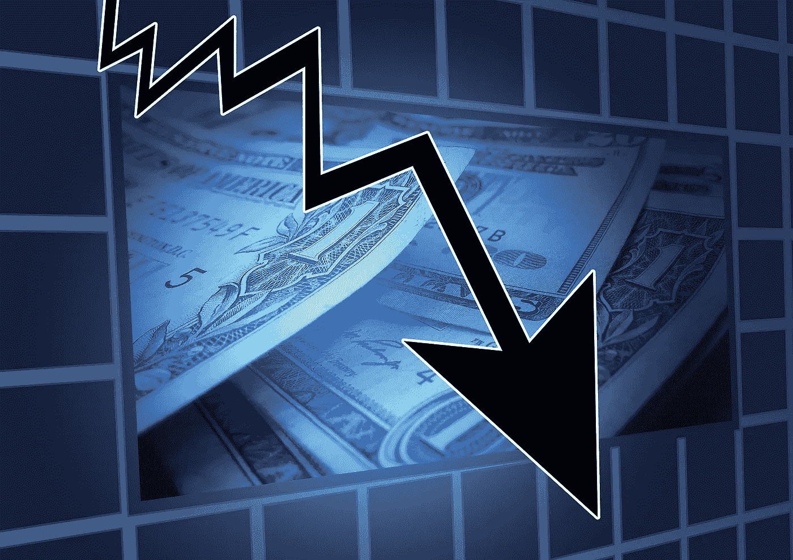
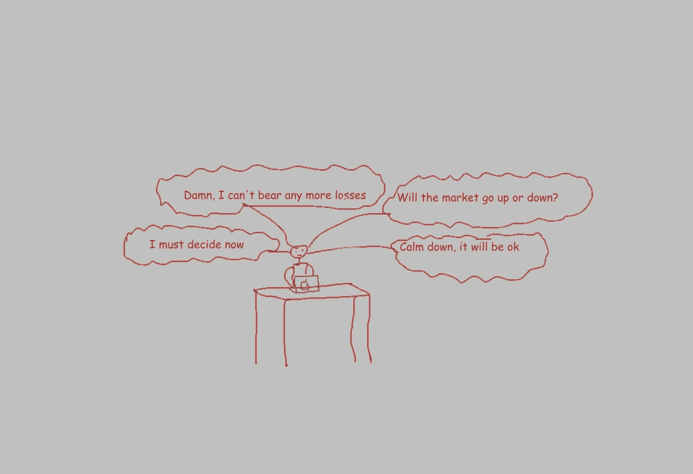
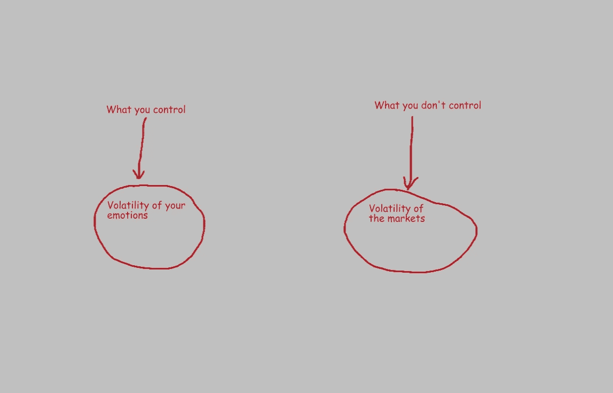
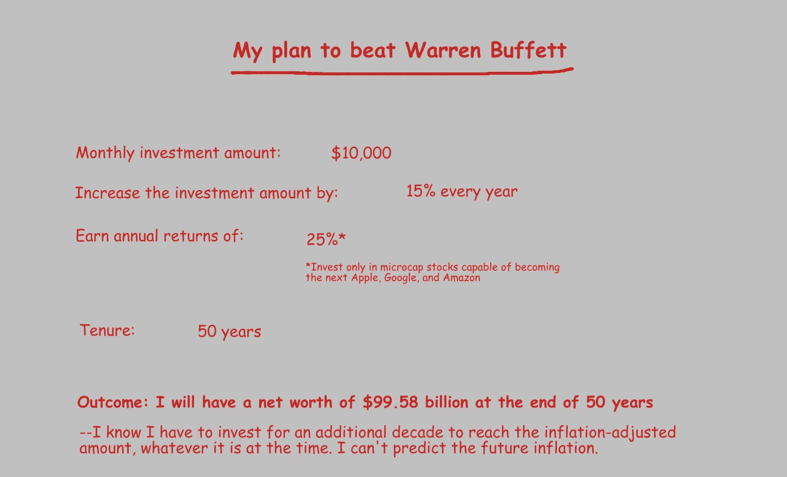

# 恐慌性抛售:是什么导致投资者恐慌，你能做些什么

> 原文：<https://medium.datadriveninvestor.com/panic-selling-what-causes-investors-to-panic-and-what-you-can-do-about-it-97be3977ce06?source=collection_archive---------10----------------------->

“那么，你想让我做什么？”“没什么。有时候什么都不是最难做的事。”

如果你正在读这篇文章，你很可能是一个人类。人类不像计算机那样被编程。我们是有情感的生物。我们的大部分决定都是由情绪驱动的，而不是逻辑。

想象一下，你现在 50 多岁，打算几年后退休……或者你已经投资了十多年，为你女儿的婚礼存钱。重要的一天即将来临。

某天早上你醒来，检查你的投资组合。下跌了 10%！你投资组合中的一只股票跌幅高达 35%。

你用智能手机查看商业新闻。发言人似乎很悲观。经济指标疲软。政府没有尽全力振兴经济。

 [## 算法交易的机器学习|数据驱动的投资者

### 当你的一个朋友在脸书上传你的新海滩照，平台建议给你的脸加上标签，这是…

www.datadriveninvestor.com](https://www.datadriveninvestor.com/2019/01/30/machine-learning-for-stock-market-investing/) 

你到达办公室，开始工作。但是你的思想停留在市场波动上。迄今为止，该投资组合仅下跌了 10%。*你告诉自己，“没事的。市场将会反弹。一切很快就会好的。”*

但是你的一部分也在想，*“市场会进一步下滑吗？”未来几天或几周，它可能会下跌 20%或 30%。专家们也在说同样的话:市场从此只能走一条路。下去。*

你应该卖掉你持有的股票吗？如果你现在卖出，你只会损失 10%。你仍然可以在两年内退休…或者支付你女儿的婚礼费用。如果投资组合再下跌 20%呢？这将对你的退休基金或女儿的结婚基金造成严重损害。

你一直在投资，这样你的钱可以随着时间的推移而增长，让你更容易实现你的财务目标。你从来不希望你的投资缩水。损失不是你所期望的。这本来就不应该发生…尤其是对你的投资。

现在你不知道市场是否会反弹，也不知道何时会反弹。最好现在就卖。至少你还有 90%的钱。你的大脑想要保存剩下的东西。

你知道规则是“低买高卖”但是现在你自己的钱岌岌可危。保住血汗钱比遵守规则、冒着损失更大金额的风险更重要。你想离开股票市场，而不在乎获得的价格。

这种恐慌性抛售让投资者损失惨重。当市场下跌时，普通人开始失去自律。我们很想卖掉我们的股票、交易所交易基金、指数基金和共同基金来退出市场。

我们大多数人都没有那么愚蠢……或者至少我们愿意相信。那么，为什么我们会恐慌并最终做了最愚蠢的事情呢？主要有两个原因。

## **1-无情绪弹性**

*情绪让人们在底部卖出……正如它让人们在顶部买入——霍华德·马克斯*

如果我们在市场中，管理我们情绪的波动比你无法管理的市场波动更重要。

我们的贪婪和恐惧让我们做出不理智的事情。行为心理学家发现，损失金钱的痛苦是获得相同金额的快乐的两倍。

诺贝尔奖获得者心理学家丹尼尔·卡内曼和认知心理学家阿莫斯·特沃斯基在 1979 年提出了前景理论。他们发现收益和损失对投资者的行为有不同的影响。失去的痛苦是得到的快乐的两倍。投资者根据收益和损失对他们头脑的影响做出他们的财务决策。

当市场上涨时，我们的贪婪不想让我们错过上涨。当我们听到别人讲述他们如何在短短几周内获得 30%或 40%的收益时，我们会感到嫉妒。我们被诱惑去追求高回报。它增加了我们投资错误资产或在错误时间投资的机会。

当市场下跌时，我们会感到恐慌，害怕损失更多的钱。我们采取行动保护我们投资的剩余部分。

我们的大脑不接受损失。因此，在市场低迷时期，我们对损失的自然反应是逃跑，而不是战斗。恐慌抛售是由恐惧、市场情绪和短期噪音驱动的。

*“无法控制自己情绪的人不适合从投资过程中获利”——本杰明·格拉哈姆*

对世界上所有信息的即时访问催化了我们的恐惧和贪婪。有数以千计的报纸，数百个新闻频道，数百个应用程序。他们都在全天候发布/广播新闻。有分析师报告、经纪见解、朋友和同事的建议、专家对彭博的评论、匿名消息提示等等。噪音太大！

这些信息中只有极小一部分会影响我们的生活。但它确实会影响我们的情绪、决定和行动。它增强了我们的反应机制，导致我们做出愚蠢的决定。

即使出现小规模抛售，新闻媒体也会陷入疯狂。当 NIFTY 指数下跌 400 点时，所有的发言人都在说:

*俏皮的撞车！*

*预算未能刺激市场*

这是下一次衰退的开始吗？

周一的崩盘抹去了投资者 600 亿美元的资金！

我们到处都能看到这种标题。你永远不会看到或听到他们说这样的话:

NIFTY 周二收于 9 天前的水平

那不令人兴奋。这不会吓到投资者。这不会刺激他们内容的消费。关掉美国消费者新闻与商业频道，把噪音关掉。这样，你就能保持冷静，保持你的气质，做出明智的决定。

大多数恐慌性抛售的受害者过于频繁地查看他们的报表和投资表现。你检查得越频繁，你就越想采取行动——一些行动，任何行动。

当然，你应该不时地回顾你的投资组合，但一年不要超过四次。你需要学会如何在动荡时期保持不动。

**2-对我们的投资缺乏信心**

我们这些对自己的投资没有坚定信念的人，在不确定性和波动性的时候，极有可能做出非理性的决定。借来的信念经不起时间的考验。

在进行投资之前，我们需要对业务、财务报表、增长机会、风险、管理质量和估值进行广泛的研究。在投资之前，我们必须知道为什么要投资一种特定的证券。

如果我们根据同事、朋友或 Twitter 的提示进行投资，市场波动会动摇我们的信心。除非你非常幸运，否则你最终会亏本出售投资。

仔细评估业务。永远不要在三件事上妥协——业务质量、管理层的质量和可信度，以及估值。

# **如何将恐慌性抛售的几率降至最低**

当市场下跌时，我们可能会恐慌性抛售。未来最大限度减少恐慌性抛售的最佳时机就是你开始投资的时候。

你开始时所做的将会对长期产生巨大的影响。所以，做好这些事情，把未来恐慌性抛售的几率降到最低。

**1-了解股票市场**

没有所谓的市场……只有一群交易的人——霍华德·马克斯

我们大多数人都不太了解股票市场。我们看了几篇博文，看了几个视频，看了一些关于长期投资的推文。然后我们认为我们足够聪明，可以投资股票市场并获得所有的回报！

很快我们开始想象自己是亿万富翁。我们中的一些人甚至计算过他们每个月应该投资多少钱，以及他们必须获得什么样的回报才能比沃伦·巴菲特更富有。这将是如此令人兴奋！直到你失去一些钱。

股票仅仅是账面资产。它们的价值存在于市场参与者的头脑中。有几十种不同类型的参与者…每个人都有自己的目标和时间范围。

投机者只关心短期价格变动。有些主要是为了分红。一些人几十年来一直持有他们最喜欢的股票。一些人即将退休，并相应地调整投资组合。一些人被迫出售以偿还贷款。一些人只专注于做空股票。有些是被动投资者。而且有天才想出了一个秘密策略，让二十三分钟内 10 倍回报！

所有这些参与者的行为都会影响我们的投资组合。他们对特定股票的操作由三个因素驱动——他们自己的计划、企业的基本面以及外部因素，如经济放缓、战争、贸易紧张局势等。

记住，战争的可能性总是存在的。总会有公司没有达到收益预期。总会有专家预测市场崩溃。总会有公司破产。尽管如此，从长期来看，股票还是上涨了。

我们无法控制的因素总是在起作用。在某种程度上，它们会影响我们的投资。还记得 2008 年美国金融危机吗？引发崩盘的是房地产市场。但与房地产或金融服务关系不大的企业股票也受到了冲击。

由于我们无法控制的因素，股票市场往往非常不稳定。我们不能把股票和波动分开。有高回报、低回报、无回报和负回报的时期。你必须接受所有这些阶段，才能获得长期的良好回报。

我们大多数人在投资股票时都会犯只看到上涨的错误。我们很少关注波动和下跌。在牛市中我们越乐观，当熊市抬起丑陋的头时，我们就越恐慌和失望。

市场调整是这一过程的一部分。在过去 100 年中，美国股市平均每 11 个月下跌 10%或更多。

[https://Twitter . com/themotleyfool/status/1223809406367870977](https://twitter.com/themotleyfool/status/1223809406367870977)

理解并拥抱市场周期不仅能让我们安心，还能帮助我们做出正确的决定。

事实上，如果你做好了准备，低迷可能是一个以有吸引力的价格买入优秀股票的绝佳机会，以提高你的长期回报。毫无准备的人会惊慌失措，错失从波动中获益的机会。

**2-建立财务基础**

大多数时候，人们被迫在不合适的时候卖出，因为他们在投资股票之前没有建立一个强大的基础。

他们没有足够的应急储蓄。他们为实现不到 3-5 年的目标所需的资金完全投入了股票。

理想情况下，你应该有足够的现金和现金等价物(高息储蓄、流动资金等)。)来支付至少六个月的家庭开支。你在不到五年的时间里为一个目标所需要的金额应该放在债券型基金中。股票是为了 5-50 年后的目标。

在你开始投资股票之前要有一个坚实的基础。它将帮助你忍受波动和崩溃，而不会恐慌。

**3-根据你的风险承受能力和时间表建立正确的投资组合**

我们希望我们的投资有高回报。而高收益的可能性伴随着更大的风险。你必须根据你的风险承受能力和你的目标有多远，在风险和回报之间找到正确的平衡。

如果你有减轻风险的流程和方法，从长远来看，你会将恐慌性抛售的可能性降到最低。

我们中的许多人认为我们可以自己完成所有的事情。我们认为我们完全了解自己的风险承受能力。但事实是——[我们大多数人都不知道](https://www.financialsamurai.com/risk-tolerance-is-difficult-to-measure/)！除非你经历过至少一次重大金融危机(2008 年或 2000 年互联网泡沫破裂)，否则你不了解自己的风险承受能力。

艰难地计算出你的风险承受能力可能会让你陷入财务困境。所以，帮你自己一个忙——寻求一个值得信赖的收费顾问的帮助，构建一个适合你的风险偏好和目标的投资组合。

财务顾问将根据您独特的风险状况和需求，制定一份由股票、债券和其他资产组成的资产分配计划。除非你是一个有经验的投资者，否则你还需要一个顾问的帮助，不时地重新平衡投资组合。

当你有一个适合你风险偏好的平衡投资组合时，股票市场的动荡不会像其他投资者那样让你感到恐慌。

当然，还有风险/回报权衡的问题。较低的风险意味着你将获得相对较低的回报。

但是请记住，最重要的是能够轻松实现你的财务目标。如果你月复一月地投入足够的资金来实现你的目标，那么相对低风险、低回报的方案是不错的。

**结论**

股市下跌和崩盘可能会造成精神上的毁灭性打击。在市场下跌时恐慌并在底部抛售是我们对投资所能做的最糟糕的事情。

我们大多数人不是沃伦·巴菲特或查理·芒格。我们的情绪会影响我们的决定。但如果我们已经建立了应急基金，并且我们的投资组合与我们的目标和时间表保持同步，那么当街上血流成河时，我们就不太可能恐慌性抛售。