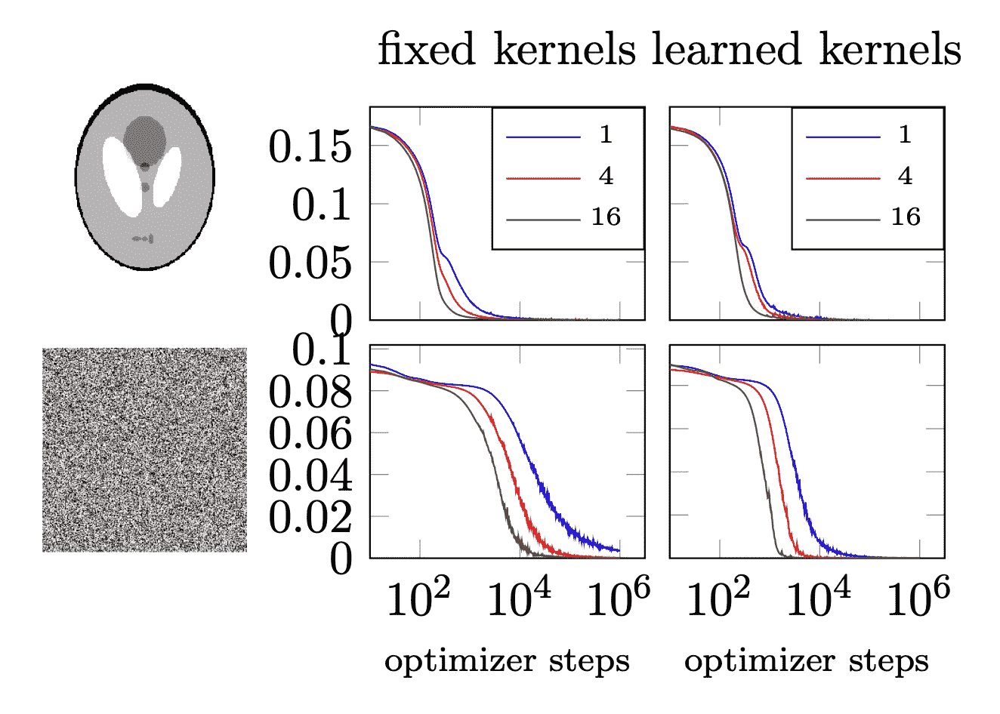
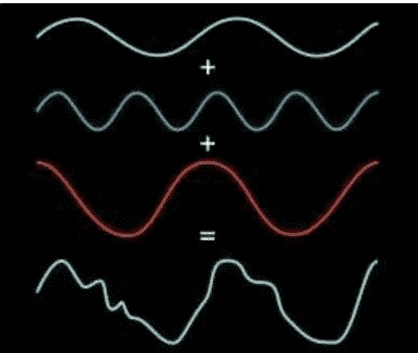
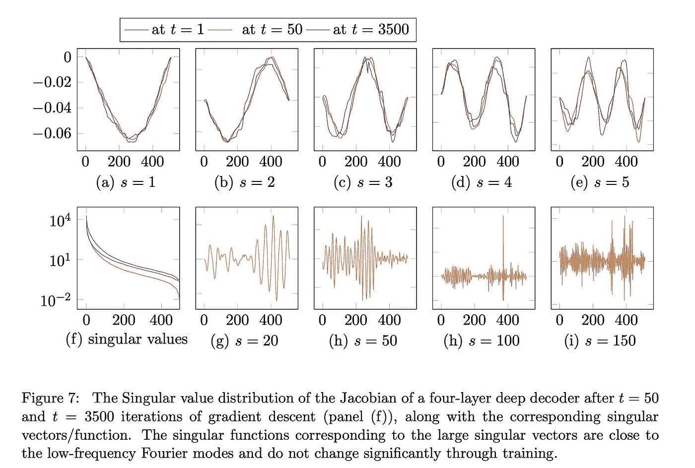
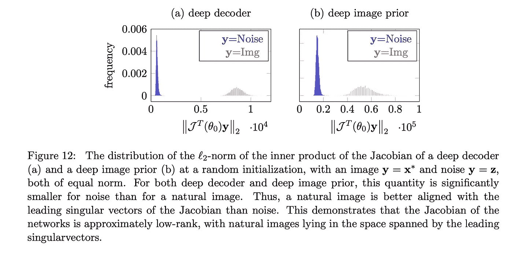
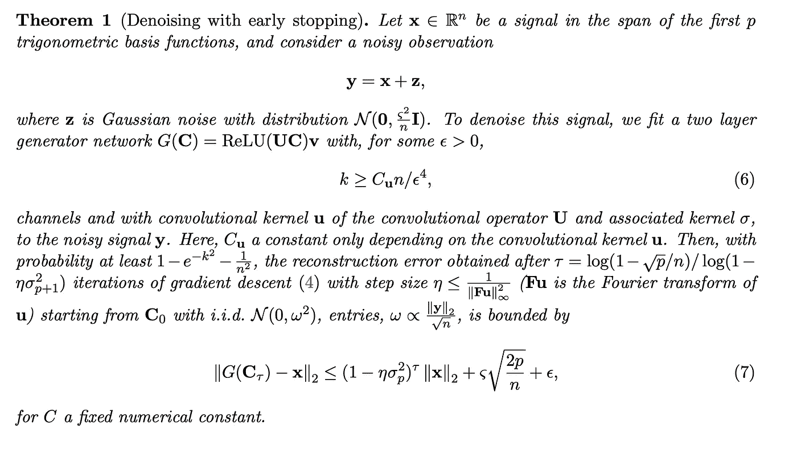
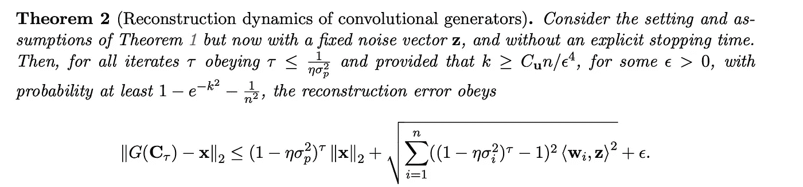

# 纸周刊—为什么神经网络可以比噪声更好地学习自然图像

> 原文：<https://medium.datadriveninvestor.com/paper-weekly-why-neural-network-can-learn-natural-images-much-better-than-noise-36f8d0abfafa?source=collection_archive---------3----------------------->

每周二，我都会强调我在研究或工作中遇到的一篇有趣的论文。希望我的评论能帮助你在 2 分钟内获得论文中最多汁的部分！

# 基本思想

上周我发表了一篇名为 [Deep Image Prior](https://medium.com/p/c2acdba1aa53/edit) 的论文，这是一种新颖的图像重建方法，可以在没有任何训练数据的情况下恢复图像。基本思想很简单，如果我们在一幅图像上拟合一个神经网络(学习一个身份映射函数，使得输入和输出是相同的)，那么噪声成分将最后被学习。因此，通过提前停止训练，图像的“自然”成分将被保留，但是像噪声或水印这样的伪像将被“过滤”。

from [Deep Image Prior](https://sites.skoltech.ru/app/data/uploads/sites/25/2018/04/deep_image_prior.pdf)

这是个不错的地方，不是吗？但是为什么 CNN 更抗噪呢？Heckel 和 Soltanolkotabi 在他们的论文*中提出了一些可靠的数学证明:通过利用卷积生成器的结构偏差进行去噪和正则化。*下面是链接:*[https://viterbi-web.usc.edu/~soltanol/DeepPrior.pdf](https://viterbi-web.usc.edu/~soltanol/DeepPrior.pdf)*

*他们发现，只有具有固定卷积核的神经网络(在大多数 CNN 卷积滤波器中学习)才能很好地对图像去噪，因为自然成分的学习速度比白噪声快得多*

**

*from the [paper](https://viterbi-web.usc.edu/~soltanol/DeepPrior.pdf)*

*自然图像和噪声的关键区别在于它们的频谱(它们的离散傅立叶变换是不同的，如果你有电气工程背景的话)。对于那些不太熟悉信号处理的人，请记住:任何信号都可以由一系列基本频率分量的总和来表示。*

**

*picture credit: [https://phys.org/news/2012-01-faster-than-fast-fourier.html](https://phys.org/news/2012-01-faster-than-fast-fourier.html)*

*研究人员已经表明，具有某些卷积滤波器(如深度解码器中的上采样核)的 CNN 的神经正切核的主要奇异向量是三角函数，可以将其视为图像的基本成分。*

**

*from the [paper](https://viterbi-web.usc.edu/~soltanol/DeepPrior.pdf)*

*因此，在梯度下降中，低频分量与梯度更一致，并且拟合得更快。下图显示了雅可比矩阵(输出(非损耗)w.r.t .对权重的导数)和图像/噪声的内积分布。*

**

*from the [paper](https://viterbi-web.usc.edu/~soltanol/DeepPrior.pdf)*

# ***结果***

*研究人员不仅解决了深度图像先验和深度解码器背后的神话(类似于深度图像先验，事实上，Heckel 是深度解码器的作者)，他们还提出了一些公式。*

**

*from the [paper](https://viterbi-web.usc.edu/~soltanol/DeepPrior.pdf)*

**

*from the [paper](https://viterbi-web.usc.edu/~soltanol/DeepPrior.pdf)*

# *一些想法*

*这篇论文非常、非常、非常数学化，即使在一位作者的直接指导下，我也花了一个学期才理解它。然而，我确实相信，每个人都可以在不经过三十页证明的情况下欣赏这篇论文。请记住这一点:CNN 的架构以某种方式强制实施了一种类似过滤的特性，这种特性会降低高频成分的学习速度。*

* [## 修复摄影|数据驱动的投资者

### 汤姆·津伯洛夫在转向摄影之前曾在南加州大学学习音乐。作为一个…

www.datadriveninvestor.com](https://www.datadriveninvestor.com/2019/03/22/fixing-photography/)*