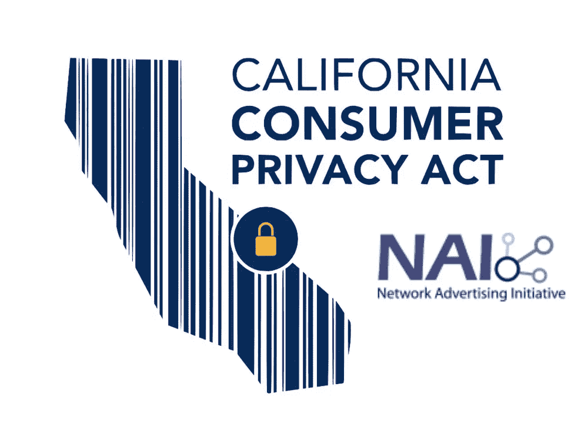

# 第二部分，奈对 CCPA“销售”概念的理解

> 原文：<https://medium.datadriveninvestor.com/part-ii-nais-approach-to-the-sale-concept-of-the-ccpa-1ca4ad12967f?source=collection_archive---------17----------------------->

以下是由 NAI(网络广告倡议组织)进行的分析的第二部分，在文件“*NAI 成员关于根据 CCPA 将广告技术数据流分类为“销售”的考虑:An NAI 分析*”，关于个人信息的“*销售*”的方法，这是今年 1 月 1 日生效的新加州消费者隐私法的主题。

我们已经看到，在本文档中,“销售”的定义本身是如何被三个元素丰富的，这三个元素一起帮助配置其定义。没有这三个要素的存在，就不配置“销售”！即使有两个例外，奈小心翼翼地指出。

但是我们留下了这样一个问题:“*选择退出“销售”的 CCPA 和选择退出“个性化广告*”的 NAI 有何不同？“ ***不卖*** ”条款的限制或扩展是什么？鉴于数字广告行业的几个主要参与者在数字广告是否是 ACFA 意义上的“销售”问题上采取了相互矛盾的立场，解决后一个疑问的方法有很多，而且各不相同，并且似乎仍然由公司的评估风险来决定。

在文件的第三部分，我们深入探讨这对 NAI 成员意味着什么，他们已经提供了退出个性化广告的选择。让我们后退一步，澄清“基于兴趣的广告”的含义:正是这种广告形式允许广告商根据数百种兴趣类别以及与这些用户之前的互动，并根据他们访问的网站类型来提供广告。

就是那些广告，利用“*侧写*”、“*数字足迹*”，锁定用户，为了锁定他们，“*兴趣广告*”！
分析和定位一直是 Alphabet 公司成功的关键工具，该公司通过人工智能和美国式拍卖的组合系统，催生了程序化广告，垄断了网络广告。在被称为**实时竞价(RTB)** 的实践中，广告根据用户配置文件进行语境化
NAI 的退出政策涵盖了广泛的广告技术活动，包括基于兴趣的广告、跨应用程序广告、观看内容广告和重定向。

NAI 选择退出的目的是让消费者能够限制使用关于他们在线和离线活动的某些信息，这些信息用于锁定他们看到的数字广告。相反，选择退出 CCPA“销售”的权利并不旨在解决广告技术使用的具体情况，而是使消费者能够选择退出在加利福尼亚州运营的任何“企业”的个人信息“销售”。

《CCPA》规定出于商业目的向第三方(不特别是服务提供商)转让“个人信息”，作为向第三方出售的一个独立类别。这是因为，当消费者向出于商业目的销售或披露“*”的公司提出请求时，该公司必须向提出请求的消费者提供两个单独的列表:
——该公司已销售的消费者的 PI 类别；
-出于商业目的披露的公司 PI 类别。*

*这一披露义务表明，根据 CCPA，至少有三类知识产权转让:销售、为商业目的向服务提供商披露以及为商业目的向第三方披露。
在关于数字广告是否可配置为 CCPA 意义上的“销售”的争论中，基本上有三个“方面”:
- ***根据*** 数字广告提供商不得销售，他们认为接受 Pis 是一种服务提供，而不是 CCPA 意义上的销售，因此在其网站上不提供选择退出按钮。
-**-*根据 CCPA 更新使用条款的其他人对服务产品的修改*** 。
-**-*承认*** 为“出售”并随之顺从的做法，为 CCPA 所要求。
-**-*承认为“销售”*-**并向消费者发出最后通牒，如果他希望继续使用该服务。
-**-*识别为“出售”*-**以及随之而来的对曲奇饼干的管理，在 GDPR 模式下，禁用广告追踪器，对放弃出售的访客。*

*NAI 更新了其行为准则，以涵盖更广泛的产品和技术，并符合 CCPA 的要求，适用于 13 至 16 岁的公众。*

*-在谷歌分析的情况下呢？–*

*统计分析提供商通常更有可能成为“服务提供商”，并被免除“销售”义务，前提是他们将个人信息用于其商业客户指定的目的受到合同限制。*

*总之，NAI 成员应考虑他们的商业使用案例是否符合“销售”CCPA 定义的例外情况，服务提供商或根据消费者自己的指示披露个人信息。*

*版权所有*

****拉斐尔·阿格莫，律师****