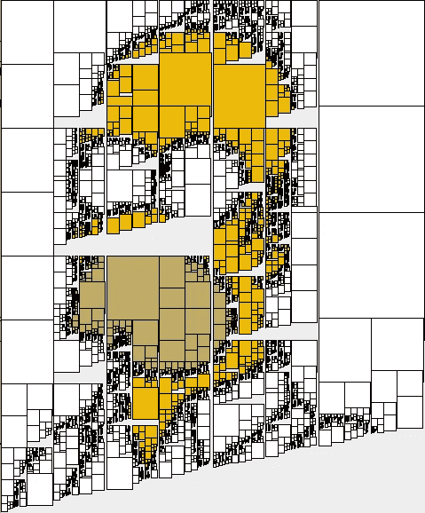
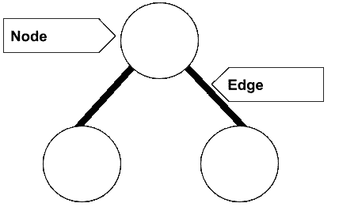
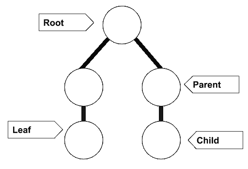
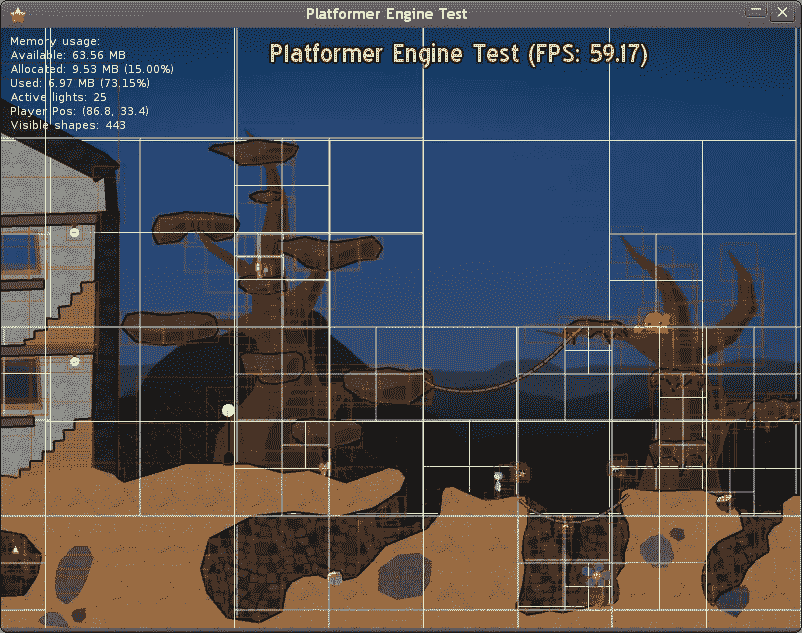
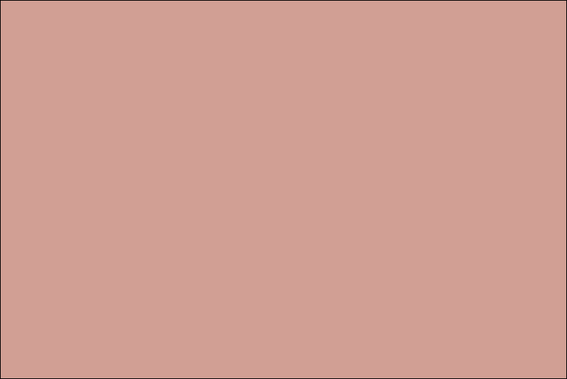
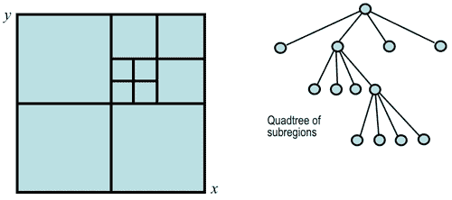
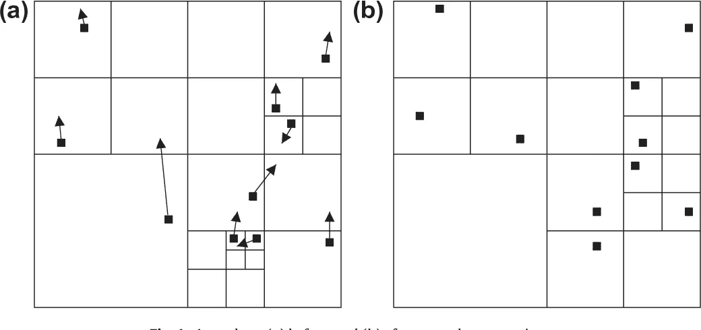
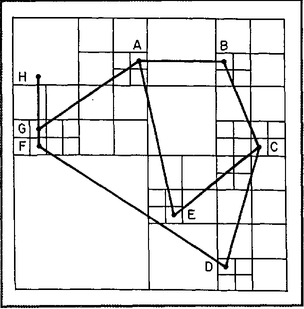
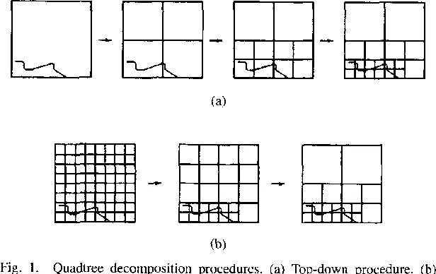
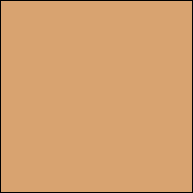

# 划分 2D 空间:四叉树导论

> 原文：<https://medium.datadriveninvestor.com/partitioning-2d-spaces-an-introduction-to-quadtrees-d95728856613?source=collection_archive---------4----------------------->

[digitalist-alex](http://digitalist-alex.blogspot.com/2011/03/quadtree-art.html)

四叉树可以在我们周围的游戏、艺术和许多日常应用程序中找到(比如地图、优步、Yelp 等)。).想想任何时候你看到的“探索你附近的餐馆”或“你离目的地 60 英尺”——这些都是四叉树的例子！四叉树的其他常见用例包括:图像表示和处理、网格生成、二维碰撞检测等等。

在本文中，我们将仔细研究四叉树:它们是什么，各种类型，以及如何使用它们。

# 快速回顾采油树基础知识

树是一种抽象的数据类型，传达它所提供的数据的逻辑和流程。相比之下，具体的数据类型通常被称为可以通过算法实现的东西。作为一种抽象的数据类型，树可以在具体的数据类型中实现，但是它们本身并不被认为是具体的。

例如，让我们拿一本书来说。就其本身而言，一本书是抽象的——有人会告诉你想象一本书，你可以想象任何种类的书(任何形状、颜色、流派等)。).在这个例子中，一本书是一个思想，一个想法，一个虚构的物体。对比一下放在你面前的电话簿。那个电话簿将是一本书的实现的例子。在这种情况下，电话簿将是一个具体的数据类型，因为它有物理和具体的存在。

## 树的一部分

编程中提到的任何树基本上都是由通过边链接在一起的节点集合组成的。

每个节点都包含一个可以访问、插入、删除等的值或数据。

边在节点之间创建一种关系，然后确定节点的类型(给定各种上下文)。

## 节点关系:节点类型

**根**一般是最顶层的节点。

*我说一般是因为前缀树(*[*trys*](https://www.educative.io/edpresso/what-is-a-prefix-tree)*)有一个例外，它的根不是一个节点，只是引用了所有第一级子节点。*

**父节点**是位于另一个节点(子节点)之前的节点。

**子节点**是另一个节点(父节点)之后的节点。

**叶**是没有子节点的节点。

这就是由边创建的关系发挥作用的地方。

> *例如，一个父节点可以有一个子节点，也可以是另一个父节点的子节点。类似于母亲既是父母也是别人的孩子。作为母亲的母亲将是其婴儿的父节点(叶节点)，在这种情况下，母亲将是祖母的子节点。*

# 潜入四叉树

既然我们已经复习了树，是时候更仔细地研究一种特殊的树，四叉树。四叉树区别于其他树的主要因素是每个内部节点都有*恰好*四个子节点。四叉树最常用于通过递归细分成四个象限或区域来划分二维空间。

在这个迷你图中，有一个单个正方形被分解成越来越小的块的插图:象限，它们一起构成了单个正方形。每个细分的区域可以根据其类型(我们将在本文后面讨论类型)形成正方形、矩形或任何任意形状。

[mhgames](http://www.mhgames.org/page/11/) quadtree

与叶像元相关联的数据可能会有所不同，但需要注意的是，叶像元代表一个“有趣的空间信息单元”*有趣的*意思是节点不是空的或者有值得注意的东西。

例如，看一下平台引擎测试屏幕，我们看到图像由多个正方形组成。在图像中有更多细节的区域(例如，房子里的楼梯、部分树木、人物和隧道)，每个方块被分解成更小的方块。从那里开始，每一个小方块为大图提供不同的细节分辨率。

[fogleman](https://github.com/fogleman/Quads) quadtree animation

另一个例子包括基于四叉树的计算机艺术。这个动画是通过获取一个输入图像，然后将其分成四个象限来创建的。然后，根据输入图像中的颜色，为每个象限分配一个平均颜色。包含最多信息的象限被分成四个子象限，以细化图像(即包含细节的较小正方形)。

# 四叉树的类型

四叉树有很多种类型，每种都有各自的不同和相似之处(毕竟它们都是四叉树)。在这里，我们将看看是什么使每种类型的四叉树特别，以及每种类型通常使用的情况。

## 区域四叉树

[image segmentation](https://www.cs.auckland.ac.nz/courses/compsci773s1c/lectures/ImageProcessing-html/topic3.htm)

如前所述，区域四叉树遵循一般方案或递归细分为正方形。对于区域四叉树，存储在叶节点中的数据是关于它所代表的单元的空间的信息。这些类型的四叉树通常用于图像处理。

## 点和点区域(PR)四叉树

[particle simulation](https://www.semanticscholar.org/paper/Dynamic-point-region-quadtrees-for-particle-Oguz-Durupinar/dcf568f28833046817bf713d1ff0096f7b89b412)

点四叉树是二叉树的一种改进，用于表示二维点数据，尽管 [k-d 树](http://www.cs.cornell.edu/courses/cs4780/2017sp/lectures/lecturenote16.html)作为广义二分搜索法的工具已经超越了二叉树，但仍然值得一提它们的意图。

点-区域(PR)四叉树非常类似于区域四叉树。主要区别在于存储在单元中的信息类型:区域四叉树存储应用于叶子单元的整个区域的相同值，而 PR 四叉树存储存在于叶子单元内的点的列表。

两者都用于有效地处理空间和点位置查询。

## 边和多边形图(PM)Q**u 树**

[edge quadtree](https://www.semanticscholar.org/paper/Hierarchical-data-structures-and-algorithms-for-I.-Samet-Webber/f9cf5ac4457393af1076924a1c8e51aa872e5e36)

边和 PM 四叉树用于存储线而不是点。人们通常在点位置查询中看到它们的应用。这可能导致树极不平衡，并可能违背索引的目的。

> 不平衡树是指左右子树的高度(从节点到叶子的最长向下路径上的边数)不匹配。

这些树很好地展示了如何使用四叉树以线的形式捕捉多边形数据。

这两棵树的工作原理通常是细分空间，直到每个单元只有一条线段。

边四叉树将继续分裂，直到它们达到最大分解级别。*分解*指的是将图像细分成比图像本身更同质的块的分析技术。

PM 四叉树的主要区别在于，如果线段在单元中的顶点相交，则所考虑的单元不会被细分。

 [## 如何用 Python |数据驱动投资者构建 Twitter 抓取应用

### 每秒发出约 6000 条推文，每天发布 5 亿条推文，普通人甚至不能…

www.datadriveninvestor.com](https://www.datadriveninvestor.com/2020/12/01/how-to-build-a-twitter-scraping-app-with-python/) 

## 压缩四叉树

[compressed quadtree](https://medium.com/r?url=https%3A%2F%2Fwww.semanticscholar.org%2Fpaper%2FImage-compression-via-improved-quadtree-algorithms-Shusterman-Feder%2F6e98b0fe653899d67c06049d940d34279146e287)

压缩四叉树的显著特点是，它们只存储有有趣和值得注意的数据的节点。这些类型的四叉树有助于通过只保留重要的子树来调整整个树的大小。需要注意的是，必须小心地根据需要重塑树的形状，根据需要创建和删除节点。

# 实现四叉树的步骤

我们可以使用以下步骤从二维区域构建一个四叉树:

1.  将当前二维空间分成四个区域
2.  如果一个区域包含一个或多个点，创建一个子对象，在其中存储该区域的二维空间
3.  如果区域不包含任何点，则不要为其创建子区域
4.  继续对每个子节点执行递归

## 阶级结构

## 插入方法

insert 方法用于将一个节点插入到现有的四叉树中。该方法首先检查给定节点是否在当前四边形的边界内。如果不是，那么我们停止插入。否则，如果它在边界内，我们就根据它的位置选择适当的子节点来包含这个节点。插入方法通常是 O(log(n))，其中 n 是距离的大小。

## 搜索方法

搜索功能用于在给定的四边形中定位节点。也可以对其进行修改，以返回到给定点的最近节点。这种方法是通过取给定点，与子四边形的边界比较并递归来实现的。搜索方法通常是 O(log(n))，其中 n 是距离的大小。

[fogleman](https://github.com/fogleman/Quads)

# 资源

伊福德尼克。*数字图像处理:Java 实用入门*。英国哈罗:艾迪森-韦斯利出版社，2000 年。打印。

芬克尔，r .和 j .本特利。"四叉树是一种用于组合键检索的数据结构."信息学报 2004 年第 4 期第 1-9 页。

粒子模拟的动态点区域四叉树。 *Inf。Sci。218 (2013 年):133–145。*

萨米特 h .和 r .韦伯。“计算机图形的分层数据结构和算法”。一、基本面。” *IEEE 计算机图形与应用*8(1988):48–68。

舒斯特曼 e .和 m .费德。"通过改进的四叉树分解算法进行图像压缩."IEEE 图像处理汇刊:IEEE 信号处理学会的出版物 32(1994):207–15。

## 访问专家视图— [订阅 DDI 英特尔](https://datadriveninvestor.com/ddi-intel)