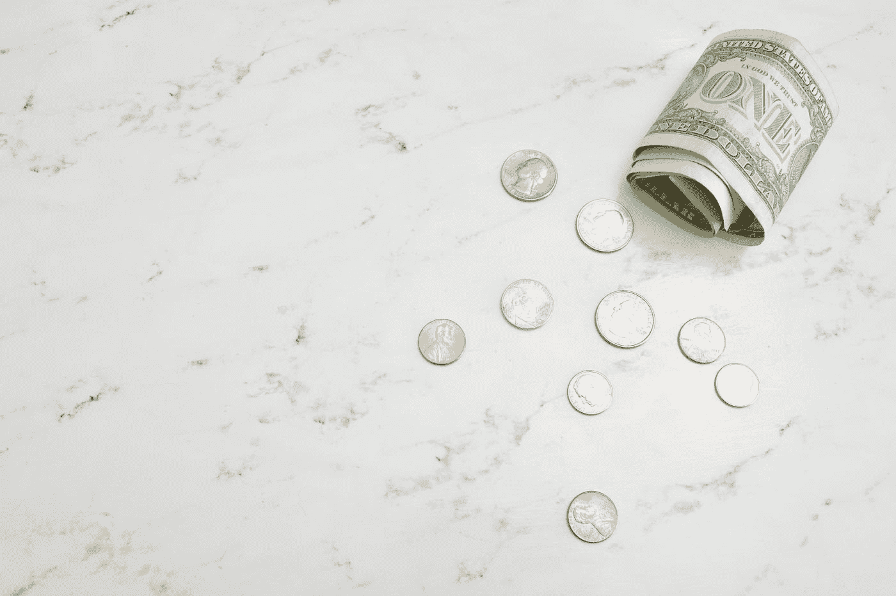
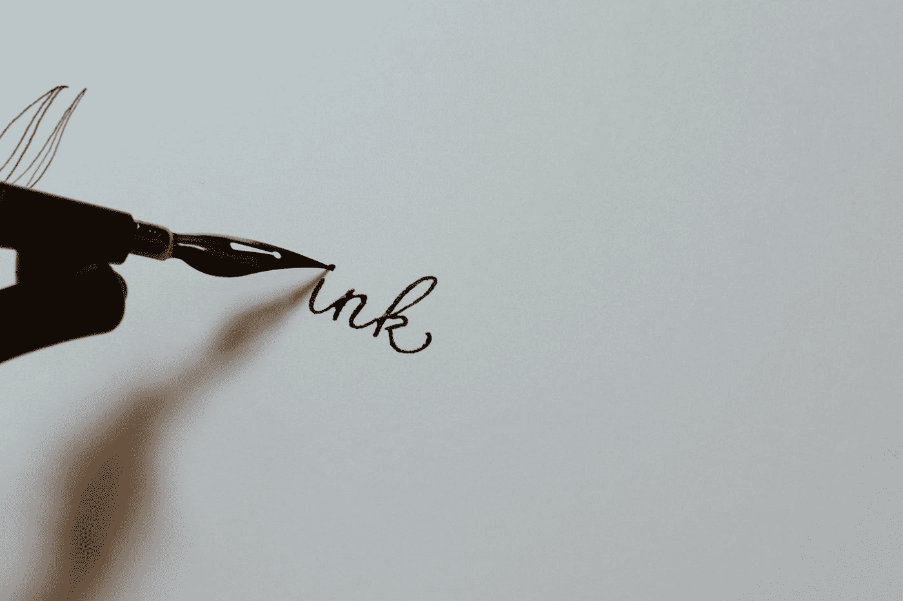

# 16 岁时的被动收入

> 原文：<https://medium.datadriveninvestor.com/passive-income-at-16-years-old-b228a7799035?source=collection_archive---------14----------------------->

Photo by [Katie Harp](https://unsplash.com/@kharp?utm_source=medium&utm_medium=referral) on [Unsplash](https://unsplash.com?utm_source=medium&utm_medium=referral)

*想象一下这个场景:*

*你坐在沙滩上心寒。你把笔记本电脑放在膝盖上，正在写博客。*

*你看了一下你课程的销售统计，是六位数。你已经坚持这样做了几年，现在你是一个百万富翁！你有一大堆粉丝的电子邮件，他们都渴望你的下一个产品。*

听起来像个骗局，对吧？

嗯，可悲的是，人们一直在利用这种“六位数博客”或“财务自由”和“快速致富计划”的梦想来欺骗不知情的人。

因为我们都被关在家里，我们都在互联网上花了更多的时间。因此，营销人员和公司不得不调整他们的销售计划。

可悲的是，对于所有合法的人来说，还有其他人试图骗取你的血汗钱。

 [## 以下是如何以低于 650 美元的价格拍摄出令人惊叹的产品照片

### 你不需要花费数千美元来获得像样的摄影器材

medium.com](https://medium.com/photo-dojo/heres-how-you-can-shoot-amazing-product-photography-for-under-650-30c451dcdabf) 

最近，你可能已经看到了宣传“997 美元直运课程”或通过制作几个“脸书广告”致富的广告。他们承诺在几周内得到结果，并使用截图来证明这一点。

嗯，尽管我很不愿意告诉你，这些计划行不通。

他们完全基于利用狡猾的销售策略赚快钱，这种策略今天可能奏效，但明天就会彻底失败。

这不是建立一个真正的企业的目的。建立一个真正的、可持续发展的企业需要时间和大量的工作。

但是，我并不是说这是不可能的。月入六位数，财务自由，过你想要的生活都是可能的。但是，你需要投入工作。

**这就是我的故事的由来……**

我今年 16 岁，在英国上最后一年的学。我把摄影作为一种爱好，我希望围绕它建立一个大型网站。

我想围绕我的博客和一些其他来源积累一些被动收入，这样我就可以财务自由，而不依赖于一份朝九晚五的工作。

这篇文章讲述了我通过博客获得被动收入的计划，以及我对未来几年的看法。

我还想说，我已经开始获得一些被动收入，主要是通过媒体，我有一篇链接如下的文章，详细介绍了我在第一个月的博客中赚了多少钱:

 [## 我在媒体上的第一个月:现实的回顾

### 我第一个月赚了 30 美元，你也可以！

medium.com](https://medium.com/joel-oughton/my-first-month-on-medium-a-realistic-review-72a63ca88a04) 

现在你已经读过了，让我们进入我的 2021 年及以后的被动收入计划:

# 被动收入来源 1: Photoaspire(我的摄影博客)

Photo by [Austin Distel](https://unsplash.com/@austindistel?utm_source=medium&utm_medium=referral) on [Unsplash](https://unsplash.com?utm_source=medium&utm_medium=referral)

首先说说我新发布的博客，**[**【Photoaspire.com】**](http://photoaspire.com)。如果你愿意，请随意查看，如果你是摄影新手，请报名参加我的 [**免费 7 天摄影训练营。**](http://photoaspire.com/free-course)**

**在这个网站上，我以摄影为基础写文章。我教人们摄影的理论和实践。**

**最近，我写了一些文章，围绕着买什么摄影器材，如何从你的摄影中获得灵感，作为一个新手应该关注什么，不久我将写一篇文章解释一些你在摄影界需要了解的基本术语。**

**为了实现这一点，我将使用一些收入流:**

*   ****广告收入(目前为 Google Adsense，当我达到 50，000 次/月时为 media vine)****
*   ****通过博客文章进行联盟营销****
*   ****销售昂贵附属产品的销售渠道****
*   ****赞助帖子****
*   ****摄影课程(从长远来看。这是大多数六位数博客作者赚钱和建立声誉的地方)****

**就我将从这一收入来源中获得多少收入而言，我预计我将在这几个月内达到这一数额:**

*   **2021 年 5 月:50/月**
*   **2021 年 8 月:300/月**
*   **2021 年 11 月:1000/月**
*   **2022 年 3 月:3000/月**

**我绝对认为这是可行的，我很高兴能朝着这些目标努力。**

**如果你想了解我是如何加班的，并跟踪我的旅程，请随时在这个中间页面上关注我，并定期访问我的网站，查看最新的收入报告。**

** [## 以下是 Aperture 对图像的确切影响

### 对于那些想拍出“朦胧”照片的人来说

medium.com](https://medium.com/photo-dojo/here-is-exactly-how-aperture-affects-your-images-ba133a059499) 

所以，澄清一下，这将是我的主要收入来源。我会花最多的时间和金钱在我的摄影博客上，因为这是我未来几年的收入来源，也是这个网站让我能够围绕我的摄影建立自己的品牌和声誉。

接下来，我们有中号…

# 被动收入来源 2:中等写作

Photo by [Kelly Sikkema](https://unsplash.com/@kellysikkema?utm_source=medium&utm_medium=referral) on [Unsplash](https://unsplash.com?utm_source=medium&utm_medium=referral)

这是我想努力积累的另一个主要收入来源。

我从去年 12 月开始在这个平台上写作，已经通过这个项目赚了一点现金。

我在写作的第一个月就赚了 30 美元(大约 20 美元)，这对我很有激励作用。

它给了我证据和信念，让我相信在网上赚钱是可能的，这不仅仅是天上掉馅饼。

我将利用这个平台作为一个机会，写摄影以外的其他利基。毕竟，对我来说，在一个我的观众想学习摄影的网站上写金融是没有意义的。

 [## 在疫情写作:我在媒体上的前 7 天

### 这是一次多么奇妙的旅行啊！

medium.com](https://medium.com/joel-oughton/writing-during-a-pandemic-my-first-7-days-on-medium-314070b7cbea) 

我将要写的一些话题包括摄影、创造力、科技公司、初创公司、生产力、个人理财和我的财务自由之旅。

我预测，通过撰写中型合作伙伴计划，我将达到这些财务里程碑:

*   2021 年 5 月:100 美元/月(估计 76 美元/月)
*   2021 年 8 月:200 美元/月(估计 163 美元/月)
*   2021 年 11 月:500 美元/月(估计 322 美元/月)
*   2021 年 3 月:750 美元/月(预计 578 美元/月)

总的来说，这将是我的主要收入来源之一，而且事实证明，这对于我建立一个追随者和一个会阅读我的内容的固定观众非常有帮助。

下一个收入来源将需要更长的时间来启动，只有当我从前两个收入来源中赚到一笔可观的钱时，我才会启动它…

# 收入来源 3:摄影 Youtube 频道

Photo by [Alexander Shatov](https://unsplash.com/@alexbemore?utm_source=medium&utm_medium=referral) on [Unsplash](https://unsplash.com?utm_source=medium&utm_medium=referral)

第三个也是最后一个主要收入来源是 youtube 上的一个摄影频道。

我打算这样做的原因是，我可以为我的观众提供实用的、动手操作的视频，向他们展示如何一步一步地改善他们的形象。

摄影频道在 Youtube 上的表现也相当不错，而且由于被推广产品的性质，CPM 率也很高。

 [## 你需要知道的 5 个关键照片编辑术语

### 了解轻松编辑照片的基础知识

medium.com](https://medium.com/photo-dojo/5-key-photo-editing-terms-you-need-to-know-faea16319239) 

我将利用这个频道提供教程、评论，并在 youtube 上与其他摄影师交流，建立一个网络。

就预计收入而言，我估计我可以通过 Google Adsense 赚取这些金额。请记住，我说的是月数，而不是实际的月份。这是因为我目前还没有一个具体的计划来启动一个频道:

*   第 3 个月:50/月
*   第 6 个月:300/月
*   第 9 个月:500/月
*   第 12 个月:1，000 英镑/月

我会达到这些目标吗？我不知道。我将不得不等待并找出答案。

在我结束这篇文章之前，我将快速列出一些我认为可以用来创造一些被动收入的其他快速想法:

*   个人博客
*   个人理财 Youtube 频道
*   摄影商业
*   白色标签摄影器材

让我知道你对我的想法的看法。

**最后，谢谢大家……**

**我知道这篇文章很长，但是我感谢你花时间阅读这篇文章。真的很感谢:)**

**如果你有兴趣跟随我的旅程，请随时关注我，并查看我的网站上的最新更新。**

如果你想阅读更多我在 Medium 上的最新文章，可以看看下面几篇:

 [## 摄影新手？这里有 3 种你应该掌握的摄影类型

### 3 种史诗般的摄影类型会让你融入摄影世界

medium.com](https://medium.com/joel-oughton/new-to-photography-here-are-3-types-of-photography-you-should-master-181282f05e7b)  [## 想成为更好的摄影师？试试这个项目

### 365 项目将改变你和你的摄影

medium.com](https://medium.com/photo-dojo/want-to-become-a-better-photographer-give-this-project-a-try-d8d7b2d133ea)  [## 购买翻新智能手机你需要知道什么

### 如果你正在考虑购买翻新手机，以下是你需要知道的

medium.com](https://medium.com/adventures-in-consumer-technology/what-you-need-to-know-about-buying-a-refurbished-smartphone-6c85c6b1c379)  [## 5 个令人惊叹的城市天际线，激发你的城市摄影灵感

### 给你们这些街头摄影师一些快速灵感

medium.com](https://medium.com/illumination/5-breathtaking-city-skylines-to-inspire-your-urban-ph-554254b2f109)**