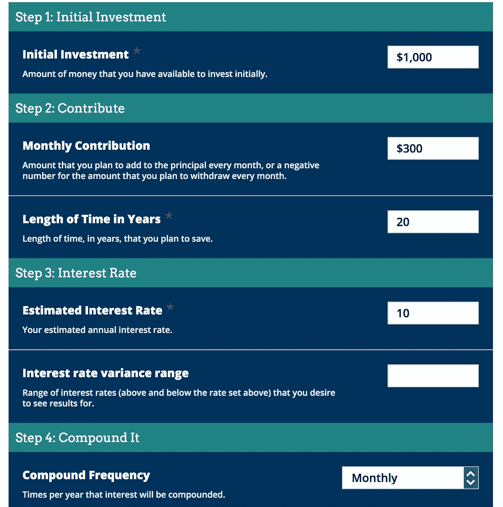
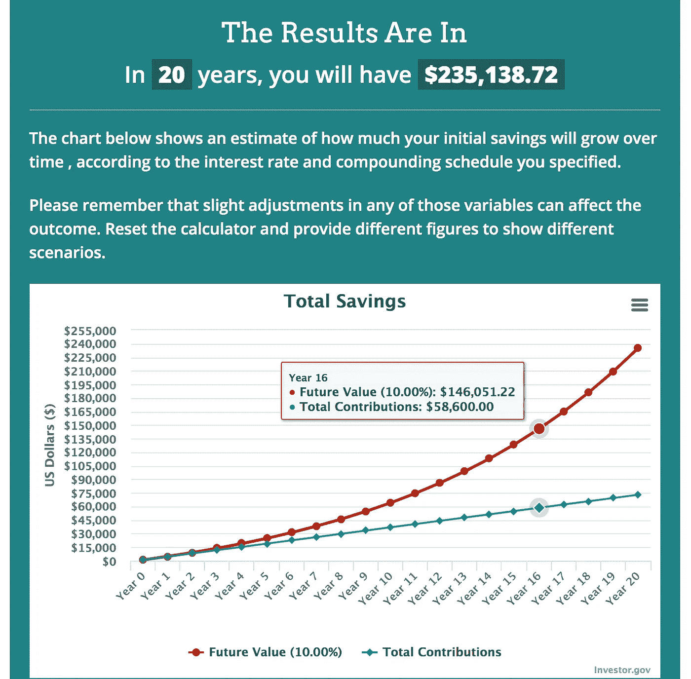

# 被动投资是一项职业运动

> 原文：<https://medium.datadriveninvestor.com/passive-investing-is-a-sport-and-i-dont-care-if-you-go-broke-trying-to-go-pro-well-i-do-e81478864169?source=collection_archive---------16----------------------->

## 职业体育如何教会我获得你想要的生活方式

Photo by [Jeremy Bishop](https://unsplash.com/@jeremybishop?utm_source=medium&utm_medium=referral) on [Unsplash](https://unsplash.com?utm_source=medium&utm_medium=referral)

我可能听起来很自大。或者自负。我可能是世界上最糟糕的生活、财务或生活方式教练，但职业体育教会了我一些你可能没有机会学到的东西。

败得快，败得小( ***)关键点布罗汗！*** )，要想成功就要经常失败。

现在，不要把整个农场都押在下一枪上，除非你已经打了 100 次没有失误。

体育不会让你为生活方式的建立或投资的所有复杂性做好准备，但体育和生活智慧的相似之处和模式是不可分割的。我喜欢体育语录。诗歌。智慧。我喜欢写生活洞察力的花絮，让你的头发向后吹，让你在这个季节(或你的生活)的第一次奔跑中冲出家门。

在投资、人际关系或运动中，成为最好的自己永远都不晚。

跌倒七次，爬起来八次。

成为一名职业运动员教会了我如何脱离群体——快速失败并从错误中吸取教训。

> 想象一下，如果我们的学校教授金融知识 101。想象一下，如果我们的政府每年给我们 3650 美元，让我们在 10 岁时开始投资理财知识 101 投资组合，而不是给我们刺激资金，让我们在 40 岁时随意花在自己身上？

具有讽刺意味的是，我们的美国领导层不希望你学习如何自由，过更好的生活方式，或者没有压力，否则他们会教你。我们双方的领导都希望游说你们:

保持束缚。

束缚。

契约。

消费。

朝九晚五的工作。

大多数美国公司希望你购买、消费、使用债务，并且每个月、每一天都循环利用——因为这就是他们如何从你身上赚取数十亿美元的。

> 他们让你认为买那个闪亮的新东西是你的主意。

但是，如果你(现在)或你的孩子学会了每天将 3650 美元中的 10 美元投资到一个资产组合中，这个资产组合每年以 10%的月分红回报，会怎么样呢？10 年后会发生什么？20 分钟后。如果你现在就为你的孩子设立一个基金会怎么样？

 [## 这么说一家大型风投基金正在投资你的初创公司？4 实际考虑|数据驱动的投资者

### 首先，恭喜你。融资总是需要努力的，一个大的风险投资基金当然是一个大的…

www.datadriveninvestor.com](https://www.datadriveninvestor.com/2020/08/09/so-a-big-vc-fund-is-investing-in-your-startup-4-practical-considerations/) 

当你接下来看到复利图表时，购买 7 美元的冰拿铁咖啡将会看起来不同，因为 20 年后，你将从 235，000 美元的投资中每月获得大约 1，958 美元的收入，收益率为 10%。

> "让你崩溃的不是负担，而是你背负负担的方式。"
> ― **卢霍尔茨**

The next passive income chart is next!

港口没有教会我如何投资，它教会了我如何勤奋。为了保持一致。去冒险，即使我不知道如何去做或为什么去做。它告诉我，被动收入比持有股票十年的回报更重要。

谁会在乎你的投资组合今天是否上涨了 100%，而明年市场崩盘时你将下跌 200%。

我不喜欢，因为我睡觉的时候一个月能挣将近 2000 美元。

我不是养老金投资者。太多爸爸的朋友不得不回去工作，因为他们的储蓄金变得残缺不全。

然而，你说，“我想要自由。”

65 岁退休却没有积蓄是什么感觉？

感觉不太好。

我想现在就开始建立我的年金。为什么要等？

为了达到非传统或生活方式目标的顶点，你必须开始重视不同的东西。你将不得不检查你的购买习惯。你的消费水平。你对闪亮事物的需求。你在投资下一只大型科技股。

> 你必须了解为什么人们朝九晚五地工作，为什么他们在职业生涯结束后还继续朝九晚五地工作。

我试图向各种消极的收入最低主义者学习，从钱胡子先生到我爸爸种植自己的农场和食物。

“基于投资的想法可以包括[、股息投资](https://tradebrains.in/dividend-investing-pros-and-cons/)、定期存款、房地产租金/租赁收入、[、点对点贷款](https://www.investopedia.com/terms/p/peer-to-peer-lending.asp)等。在大多数情况下，用于判断基于投资的收入来源的指标是利率或收益率。虽然看起来很容易执行，但投资基础收益策略需要根据对投资组合的风险和回报的定期审查来调整投资组合。”—交换大脑

波特斯教会我接受与众不同。它教会了我，如果有教训的话，赔钱也没关系。它教会我每天投资 10 美元，就像我小时候在早上 7 点开学前训练一样。当我还是个孩子的时候，每天午餐时间都会在走廊上流口水。我是个体育迷。通过阅读和观看视频，我对这项运动了如指掌。

保持一致。

这是上帝的喷气燃料。

无论你是滑板运动员、芭蕾舞演员、冰壶运动员还是拳击运动员，你都必须学会跌倒后爬起来。体育教给我们一些平常不运动的人可能永远没有机会学到的东西:

> 如何在团队中工作？
> 
> 如何叫出房间里的白象？
> 
> 如何反弹？
> 
> 如何从竞争(和竞争者)中创造喷气燃料？
> 
> 失败必然会在最高层取得成功。

我不是亿万富翁。我不是生活方式教练，但我确实想帮助你创造并实现你的梦想，而不仅仅是想想而已。是什么阻碍了你？是什么阻止你练出八块腹肌，阻止你跑超级马拉松，阻止你制定自己的时间表，阻止你做自己的工作，阻止你有更多的时间和你的孩子、朋友、爱好和爱人在一起？

具有讽刺意味的是，美国的领导层已经告诉你，成功会让你变得富有。磨什么？磨什么？

打磨就是工作。

被动投资是未来免于失业、养老金缩水和收入替代，所以继续投资并学习如何投资。

我 22 岁的时候买了 15 套出租屋中的第一套，当时没有任何经验。我学到了很多。我失败了太多。这是人类学习的方式。

然而，今天，失败被认为是可耻的。

为什么？

我们在为自由而奋斗吗？为了时间？为了平衡？有更多的时间和我们爱的人在一起？为了旅行？

典型的美国人努力获得更多的 T2 个人债务。

Photo by [Mirza Babic](https://unsplash.com/@mirzababic?utm_source=medium&utm_medium=referral) on [Unsplash](https://unsplash.com?utm_source=medium&utm_medium=referral)

## 难道我们现在不努力工作以便有一天停下来吗？

是什么阻止了你获得幸福？

你的生活价值观是什么？

地位？奢侈？越大越好？向你的邻居描绘和假装美好的生活？

你对美好生活的定义是什么？

在高中，我总是想和那个化妆后用山谷女孩口音说话的漂亮啦啦队员约会，这样很酷。我应该一直在找那个在图书馆看书的女孩。我应该一直在寻找那个写作和探索生命意义的女孩。

**学会被动投资是改变生活方式的关键之一，因为它能让你减少工作。**

> “有两种基本的动力:恐惧和爱。当我们害怕时，我们从生活中抽身。当我们坠入爱河时，我们会带着激情、兴奋和接纳去面对生活的一切。我们需要先学会爱自己，不管我们有多辉煌，有多不完美。如果我们不能爱自己，我们就不能充分发挥我们爱他人的能力和创造的潜力。进化和对更美好世界的所有希望都寄托在拥抱生命的人们的无畏和开放的视野中。”— [**约翰列侬**](https://www.goodreads.com/author/quotes/19968.John_Lennon)

如果我们不能足够爱自己去犯小错误并从中成长，我们将永远不会进化。

职业体育教会了我被动投资、承担小风险和快速失败将继续是我给所有 39 位 Medium.com 读者的信息。；)

上帝保佑。

事实上，不，慢慢来，想想你他妈的想从你的生活中得到什么。

## 获得专家视图— [订阅 DDI 英特尔](https://datadriveninvestor.com/ddi-intel)