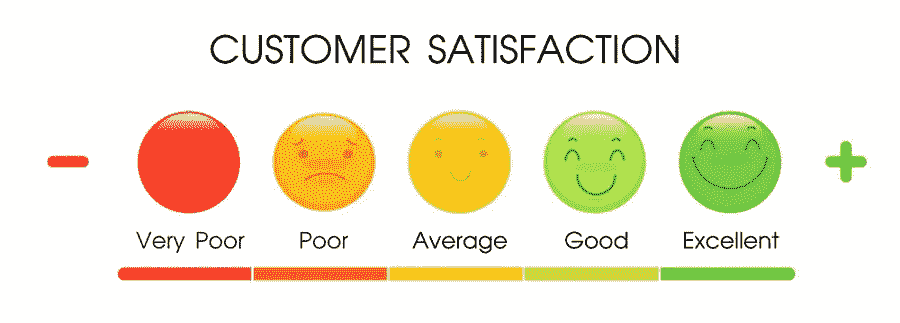

# 患者体验与卓越运营:我们把很多鸡蛋放在了错误的篮子里。

> 原文：<https://medium.datadriveninvestor.com/patient-experience-vs-operational-excellence-were-placing-a-lot-of-eggs-in-the-wrong-basket-5590d670ceea?source=collection_archive---------12----------------------->

在过去的几年中，消费产品，尤其是数字领域的消费产品，已经将主要重点放在了客户和用户体验上。当然，创造价值是重要的，但如果我们要让消费者的注意力持续足够长的时间，以看到价值，就需要尽量减少为获得价值而产生的摩擦。毕竟，[个人需要 50 毫秒来形成对一个网站的看法](https://www.tandfonline.com/doi/abs/10.1080/01449290500330448)来决定他们是否喜欢它。这对他们如何与公司打交道有着深远的影响。

根据[沃克的一项研究](https://www.walkerinfo.com/knowledge-center/featured-research-reports)，到 2020 年底，客户体验将超过价格和产品成为关键的品牌差异化因素。当然，人们可以假设产品不会很差(因为这肯定会影响客户体验)，但公司的整体体验将占据最大的主导地位；在某些情况下，它已经开始了。Siri 和 Alexa 有着不可思议和令人愤怒的能力，在 50%的情况下 100%地弄错我的请求，这很好地表明了这一点，事实上，这是真的。毕竟，我仍然使用它们(即使频率越来越低)…只是希望有一天它们会给我惊喜。到目前为止，他们还没有。

 [## 医疗保健的未来正在被一场大型技术入侵所塑造|数据驱动型投资者

### 过去十年，全球经济的所有部门都经历了大规模的数字颠覆，而卫生部门现在…

www.datadriveninvestor.com](https://www.datadriveninvestor.com/2018/11/02/the-future-of-healthcare-is-being-shaped-by-a-big-tech-invasion/) 

那么，这与医疗保健和患者体验有什么关系呢？作为一个行业，医疗保健几乎总是落后于“消费者空间”，这是有一些(尽管肯定不是全部)充分理由的。其中最主要的是众所周知的和记录良好的对风险和不确定性的容忍度。也就是说，医疗保健对两者的容忍度都非常低。但是，有了超过 15 年的 CX 和 UX 的使用案例、证据，坦率地说，还有消费者的期望，医疗保健几乎完全赶上了“体验”的潮流。

2019 年，风险投资公司向数字健康公司投资了[74 亿美元](https://rockhealth.com/reports/in-2019-digital-health-celebrated-six-ipos-as-venture-investment-edged-off-record-highs/)，其中[仅在 Q1 就为以消费者为中心的医疗保健投资了](https://www.healthcareitnews.com/news/where-digital-health-venture-capitalists-invested-2019)11 亿美元。这还不算苹果、谷歌、IBM 和其他企业玩家的持续[大规模]投资，它们希望在未来几年或几十年以这样或那样的方式影响患者的体验。事实上，似乎每次我打开我的电子邮件，都会有另一个关于一些惊人的以患者体验为中心、支持远程医疗、互联网连接的东西或其他东西刚刚推出、资助、收购或首次公开募股的公告。这很好。大部分是。

但我认为，我们在寻求患者支持和卓越患者体验的过程中，遗漏了一些关键的东西:对卓越运营的基本理解和绝对需求。换句话说，前端体验(阅读“患者参与”、“患者体验”、“患者支持”等。)只会让你到此为止；当这些体验依赖于后端基础设施(人员/流程/系统)时，该基础设施被降低优先级或更糟，完全被忽略，这将最终影响前端体验和患者判断您价值的方式。这将对医疗保健组织产生一系列的影响。哦，是的，这将对病人产生负面影响。

我想让我的病人记录触手可及吗？我当然知道。我是否希望将即将进行的膝关节置换手术的相关信息发送到我的手机上？你打赌。我需要一种简单的方法来遵守我的药物或物理治疗方案吗？绝对的。但是为了让这些发生作用:

*   EHR 需要互操作
*   数据标准需要存在、开放并被遵循
*   标准化数据需要通过现代协议提供
*   我护理的所有提供者都需要有完全相同的数据
*   系统的安全性需要以支持信息交换而不是抑制信息交换的方式进行管理、现代化和可扩展
*   价值链上的每个人都需要认同这些经验是优质护理的基础，然后理解这对他们的基础系统、实践、流程和政策的影响

当然，远程医疗很酷(也很实用)。当然，移动应用程序非常方便(也非常有效)。当然，优质护理需要患者的参与。但是，希望利用消费者对管理自己的医疗保健日益增长的兴趣的组织需要记住，过时的流程、低效的实践和衰退的企业系统不仅会使其更加困难，还会成倍增加失败的风险。这是双曲线吗？嗯，没有。

想象一下对患者体验的正面攻击，其中医疗保健提供商实现了所有最酷、最新、最智能的小部件和小工具。有管理护理的 apps 有提供知识的 apps 有一些应用程序可以将你的设备连接到你的医生；有门户网站可以实时查看健康记录。太好了。

现在想象一下，一个上了年纪的 EHR 没有真正有用的 API 来发送数据(或者更糟，根本不让你这么做)。

想象一下，需要手动添加所有的教育材料…并且只有在经过医生的审查和批准之后(医生显然有大量的额外时间)。

想象一下，需要手动检查从一个系统添加到另一个系统的所有东西，因为…嗯，当前的系统不能真正自动化任何东西。

想象一下，在一个超级光滑的供应商门户网站中获得所有这些伟大的患者数据，然后需要导出到一个电子表格中，然后导入，或者更糟，键入到你姐姐的侄子为你创建的系统中，因为，嗯，这对于你当时的需要来说已经足够好了。

哦，是的，想象一下你的团队中没有人真正知道谁会做这些事情，或者这些事情实际上是如何完成的，因为你没有适应这种事情的过程。听起来有点糟糕，不是吗？

但最糟糕的是什么？最糟糕的是，你和你的团队越难维护这些泡泡糖和胶带来支撑你那令人敬畏的病人体验装置，你就越有可能摔倒并带走你的病人体验。

毫无疑问，我们能够也应该利用新技术来参与和改善为患者提供的医疗服务。在未来十年，我们在这一领域的能力将会成倍增长。但是，除非我们想彻底失败，否则我们需要在不久的将来(阅读“现在”)花同样多的时间来了解我们超级不性感的运营系统和业务实践的当前状态。也就是说，如果我们希望在**的*和其他***项目上保持的卓越表现，我们就需要在*运营上做到*。

在挑选窗帘之前谈论浇注基础是陈词滥调；但这正是我们在这里谈论的。如果你的操作是手工的，落后的，充斥着劣质产品，在过去的 12 个月里没有经过严格的评估，或者更糟，与你的业务现实没有关系，那么你为改善病人的护理和体验所做的一切都不会持久。当然，它可能会在开始时得到一些点头，但没有实际操作优势的前端成功最终会削弱你；这将是快乐顾客/病人的终结。

那么，这对试图积极支持患者体验的医疗保健组织来说意味着什么呢？首先，这意味着这些组织需要花费一些重要的时间和精力来批判性地评估(并解决)他们现在在后端所做的事情将如何支持或颠覆前端的那些计划。如果您使用外部人员(供应商)来帮助进行评估，您需要确保这是他们的基本职责。听起来很简单，但是闪亮新玩具综合症是真实存在的。

如果你只打算做三件事，这些是我会考虑的事情:

1.  信息是任何患者体验的基础。了解您捕获的所有信息以及您是如何捕获的。这些系统是新的还是旧的？数字的还是手动的？开放还是封闭？可扩展与否？是由一个人管理这些信息，还是由许多人管理？是共享的还是重复的？谁拥有流程，谁拥有信息？您是否正在更新政策和流程以满足当前需求，还是一切都在自动运行？最重要的是，你在桌子上留下了什么信息，为什么？
2.  **批判性地评估该信息如何影响或有可能影响患者体验。**这是一个棘手的问题，因为一些你认为理所当然或完全忽视的信息，随着时间的推移，可能会成为价值传递的支柱。例如，如果您想要使用连接的设备来管理健康信息，您如何跟踪实际设备的生命周期？仅仅捕捉设备传递的数据是不够的；您还需要跟踪设备本身。它的使用寿命是多少？您如何管理召回和网络安全？您如何管理设备的寿命终止？你如何考虑使用和决定一种新的或替代产品是否对病人更好？
3.  为你打算如何影响患者体验设定一个明确的目标，然后开始为该目标的操作要求起草一份路线图。这基本上是橡胶与路面接触的地方。任何人都可以*希望*创造良好的患者体验。*每个人*都想要一个更投入的消费者/患者。但是，如果你不愿意批判性地评估你的业务定位如何支持这一点，然后做出实现这一点所需的改变，这一切都只会以眼泪告终。或者糟糕的 Yelp 评论。或者两者都有。

这真的不是火箭科学。或者任何科学。从一个技术专家的角度来看——一个有一点商业经验的人——这是很好的常识。我怀疑大多数人都知道这一点。我还怀疑这并不总是发生，因为它需要时间，花费金钱，没有乐趣，不会产生立即的回报，等等。我不能对那些观点中的大部分提出异议。很少有乐趣，总是要花时间，而且从来都不是免费的。但是卓越的运营*会带来回报，而且几乎是立竿见影。它减少浪费，最小化风险，提高道德，最大化效率，并使组织为实现其价值承诺做好准备；在许多情况下，价值比以前大了几个数量级。*

*因此，如果你跳过了中间的一大堆，去寻找笑点，这里是:**你绝对不能创造、支持和维持一个伟大的患者体验，除非你首先致力于在运营上做到卓越。**不客气地跟我争辩；你要知道，你永远不会改变我的想法。*