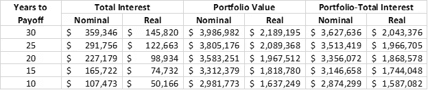

# 尽快还清你的抵押贷款，但话说回来，也许不是？

> 原文：<https://medium.datadriveninvestor.com/pay-off-your-mortgage-asap-but-then-again-maybe-not-3f6a7c83fef?source=collection_archive---------6----------------------->

## 心理与数字——哪个会推动你的决定？

## 对提前偿还抵押贷款的成本和收益的系统分析

Photo by [DJ Johnson](https://unsplash.com/@dj_johns1?utm_source=unsplash&utm_medium=referral&utm_content=creditCopyText) on [Unsplash](https://unsplash.com/s/photos/mortgage?utm_source=unsplash&utm_medium=referral&utm_content=creditCopyText)

像美国几乎所有的房主一样，我用抵押贷款购买了每套房子。

像许多人一样，我不得不决定是否要支付额外的本金，提前还清抵押贷款，或者将额外的现金用于储蓄和投资。

# 尽快还清抵押贷款的理由

许多人激烈地争辩说，你必须尽快还清你的抵押贷款。他们的情况可以归结为:

*   只要你的抵押贷款没有还清，如果你不能还款，你就会失去你的房子
*   尽快还清你的抵押贷款可以最大限度地降低你的利息成本
*   额外支付本金是一种储蓄，一旦你还清了贷款，你就可以将全部还款用于投资

 [## 关于金融大师的建议，你需要知道的 3 件事

### 他们不会告诉你…

medium.com](https://medium.com/makingofamillionaire/3-things-you-need-to-know-about-advice-from-financial-gurus-910fc5bb4620) 

# 评估早期回报的案例

第一点有两个要素。一个是财务，我们一会儿会用实际数字来分析。

另一个是心理上的，这意味着它取决于什么让你不那么不舒服——知道你最大限度地减少了时间，直到你自由和清晰地拥有自己的家，或者知道你正在做出最好的财务选择，客观地说，是更安全的选择(下文将详细介绍)。

第二点，最小化利息成本，只看贷款的负面财务方面。如果我们的分析显示，由于支付更高的利息，你最终会得到更少的钱，那么他们是对的。另一方面，如果数据显示，尽管利息更高，但你最终会更进一步，这一点就没有意义了。

 [## 数据分析如何为房地产金融提供信息|数据驱动的投资者

### 数据是 21 世纪的热门商品。因为它能够推动和通知几乎所有行业…

www.datadriveninvestor.com](https://www.datadriveninvestor.com/2020/07/02/how-data-analytics-can-inform-real-estate-finance/) 

最后一点当然是公平的。然而，如果你足够自律地支付额外的本金，你也应该足够自律地投资额外的现金。然后，你可以利用复合投资回报的力量，这比你将部分或全部额外现金用于加速偿还抵押贷款的时间要长得多。

同样，证据将在数字中。

公平的警告——将会有很多数字，所以请随意深入探究，或者直接跳到它们揭示的内容。

# 从数字上看，哪个选择更好

为了得出明确的结论，我计算了这些数字。下面显示结果，但首先，让我们看看一些假设。

## 我的假设

1.  抵押贷款的初始余额为 50 万美元
2.  抵押贷款的利率是 4%(这是保守的，因为目前的利率低了约 1%，这使得花更长时间还清贷款更便宜)
3.  通货膨胀率为每年 2%(这是保守的数字，因为更高的通货膨胀率会更快地侵蚀所欠美元的价值，使得尽可能缓慢地偿还贷款更好)
4.  股票回报率为每年 8%，比通货膨胀率高出约 6%(这比股票在过去一个世纪的回报率低约 1%)
5.  房屋的实际价值保持不变(这也比美国住宅房地产的长期实际回报低 1%左右)
6.  你没有详细列明，因此没有获得任何支付抵押贷款利息的税收优惠(这是保守的，特别是如果你是一个高收入者，并且生活在一个高所得税的州)

正如你所看到的，我有意将这些假设倾向于支持更快回报的案例。

## 第一个分析——你可以在 10 年内还清贷款

表 1 显示了 5 种情况，其中你每个月有 5062.26 美元可用，并在抵押贷款和投资之间分配该金额。

在第一种情况下，你要在 30 年内还清抵押贷款。

在第二种情况下，回报在 25 年后产生。

20 年后的第三次。

在第四年和第五年，分别过了 15 年和 10 年。

*Table 1\. Five cases, with payoff in 30, 25, 20, 15, or 10 years. In the first case, the monthly investment amount stays constant for the 30 years. In the other 4, the investment amount changes as soon as the mortgage is paid off.*

在表 2 中，我们看到了你在贷款期限内支付的总利息，你在 30 年内积累的投资组合的价值，以及两者之间的差异。对于这三个指标中的每一个，我们都看到了名义美元值和经通胀调整的实际值。

不出所料，你偿还贷款越快，你支付的利息就越少，无论是名义美元还是经通胀调整的美元。

然而，花尽可能多的时间还清贷款会给你带来更大的最终投资组合余额，甚至是投资组合余额和贷款期限内支付的利息之间的差额。

仅仅提前 5 年获得回报，你的最终投资组合价值就会减少约 5%。

加速 20 年的回报会导致投资组合余额减少 25%以上！

*Table 2\. The total interest, final portfolio value, and the difference between them, in nominal and inflation-adjusted dollars for the 5 cases.*

在表 3 中，我们查看了 5 种场景的相对安全性。显然，你偿还抵押贷款的速度越慢，假设你投资了剩余的可用现金，你就能越快达到安全，无论是从留出足够支付 6 个月付款的角度来看，还是从足够完全还清贷款的角度来看。

*Table 3\. The number of months needed to reach complete safety (i.e., portfolio value is higher than the remaining loan balance), or to have enough for making 6 months’ worth of the minimum payments, for the 5 cases.*

> 投资而不是提前偿还你的抵押贷款本金会让你更快地安全，无论是有足够支付 6 个月的付款，甚至能够完全还清你的贷款。

## 第二个分析——你可以在 20 年内还清贷款

然而，假设你不仅有足够的钱来支付抵押贷款，而且每个月还要留出 2675 美元是相当极端的。大多数人不可能从每月预算中拿出这么大一笔钱。

这就引出了我的第二个分析，你没有足够的钱在 10 年内还清贷款，但你有足够的钱在 20 年内还清。

表 4 显示了三种情况，每个月你有 3029.90 美元可用，并在抵押贷款和投资之间分配这笔金额。

在第一种情况下，你要在 30 年内还清抵押贷款。

在第二种情况下，回报在 25 年后产生。

20 年后的第三次。

*Table 4\. Three more cases, with payoff in 30, 25, or 20 years. In the first case, the monthly investment amount stays constant for the 30 years. In the other 2, the investment amount changes as soon as the mortgage is paid off.*

在表 5 中，我们看到了你在贷款期限内支付的总利息，你在 30 年内积累的投资组合的价值，以及两者之间的差异。对于这三个指标中的每一个，我们都看到了名义美元值和经通胀调整的实际值。

同样，毫不奇怪，你偿还贷款越快，你支付的利息就越少，无论是名义美元还是经通胀调整的美元。

然而，花尽可能多的时间再次还清贷款会给你带来更大的最终投资组合余额，甚至是投资组合余额和贷款期限内支付的利息之间的差额。

仅仅提前 5 年获得回报，你的最终投资组合价值就会减少约 19%。

加速 10 年的回报会导致投资组合余额减少 42%以上！

*Table 5\. The total interest, final portfolio value, and the difference between them, in nominal and inflation-adjusted dollars for the 5 cases.*

> 在这种情况下，提前 10 年偿还抵押贷款会导致投资组合余额减少 42%!

在表 6 中，我们查看了这三种新场景的相对安全性。再说一次，假设你投资了剩余的可用现金，你偿还抵押贷款越慢，你就越快达到完全安全，你就越快留出足够支付 6 个月的还款。

*Table 6\. The number of months needed to reach complete safety (i.e., portfolio value is higher than the remaining loan balance), or to have enough for making 6 months’ worth of the minimum payments, for the 3 new cases.*

 [## 为什么提前偿还房屋抵押贷款几乎总是一个糟糕的主意

### 这就是为什么越慢偿还抵押贷款越经济，也越安全的原因

medium.com](https://medium.com/financial-strategy/why-prepaying-your-mortgage-is-almost-always-a-terrible-idea-88fa87977d77) 

# 重要警告

上述分析假设通货膨胀和股票收益在假设的年度水平上保持不变。事实上，它们一点也不稳定。然而，除非你非常不幸，否则你应该看到一些与几十年来的平均数字相差不远的东西。

如果我们改变假设，使投资回报和抵押贷款利息之间的差异变小，数学将开始更倾向于投资而不是加速抵押贷款的偿还。

这里有两个主要的心理因素在起作用。首先，你需要对一个严重(甚至 100%)倾向于股票的投资组合的风险水平有足够的把握。例如，如果你的投资组合中有 60/40 的债券，你的投资回报将下降，结果将开始倾向于提前偿还抵押贷款。

> 你需要对以股票为主的投资组合的风险水平感到放心。60/40 投资组合的较低回报不会有优势。

 [## 百分之百投资于股票的理由

### 当它开始分解时…

medium.com](https://medium.com/makingofamillionaire/https-medium-com-opher-ganel-the-case-for-being-100-percent-invested-in-equities-651f7e4f32b7) 

第二，如果你对因为暂时无力支付抵押贷款而失去房子的短期风险感到更放心，而不是对背负抵押贷款多年的长期风险感到更放心，你可能会更喜欢提前还款选项，而不考虑上述分析。

# 底线

即使我们的假设倾向于支持提前偿还抵押贷款，结果表明，从理性的角度来看，投资股票比提前偿还抵押贷款本金更有可能成为财务上的首选。

然而，这意味着更高的投资风险，你必须坦然面对。你还必须背负贷款很多年，尽管这样做可以让你更快地安全地从投资中获得回报。

# 关于作者

Opher Ganel 已经建立了几个成功的小企业，包括支持 NASA 和政府承包商的咨询公司。他最近的冒险是为独立专业人士提供的[金融策略服务](https://www.opherganel.com/)。你可以在那里与他联系，或者关注他的媒体出版物[金融战略](https://medium.com/financial-strategy)。

# 放弃

*本文仅供参考，不应视为财务建议。在做出任何重大财务决定之前，你应该咨询财务专家。*

*最初发表于*[*https://wealthtender.com*](https://wealthtender.com/insights/money-management/pay-off-your-mortgage-asap-but-then-again-maybe-not/)*。*

**访问专家视图—** [**订阅 DDI 英特尔**](https://datadriveninvestor.com/ddi-intel)