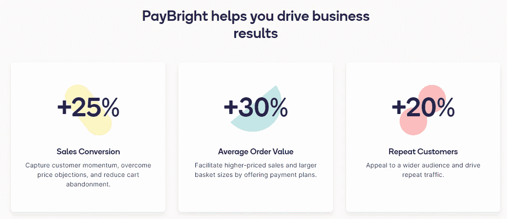
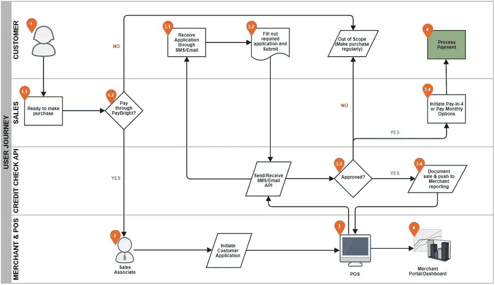
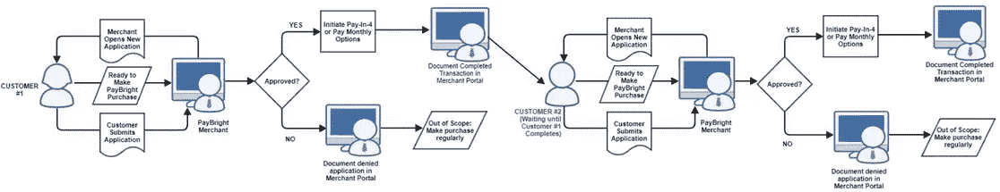
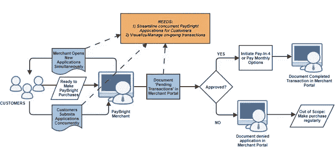
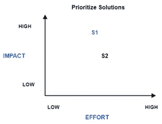
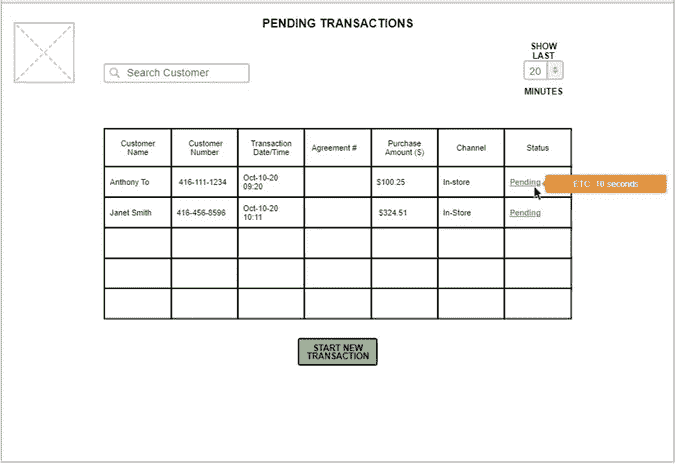
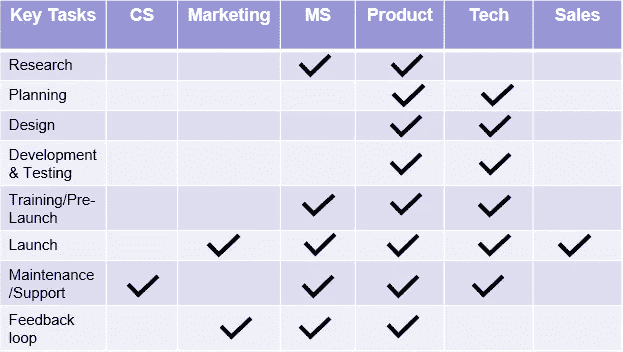
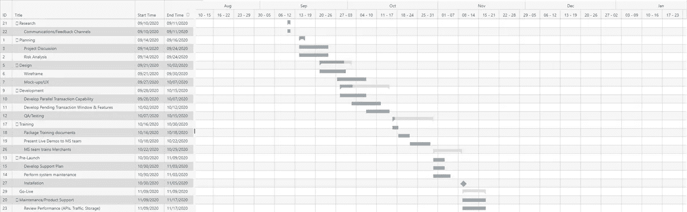

# PayBright.com—产品交付/UX 案例研究

> 原文：<https://medium.datadriveninvestor.com/paybright-com-product-delivery-ux-case-study-1a6bbfca4dc5?source=collection_archive---------7----------------------->

# 介绍

[**【PayBright.com】**](http://PayBright.com)，一家金融科技公司通过商家向零售客户提供现在购买/以后支付(BNPL)计划。他们在电子商务和实体零售领域与 7000 多家中小企业合作，如易贝、三星、Article、WayFair.ca 等。

**你可能会问，为什么商家会与 PayBright 合作？**

PayBright 向合作伙伴重点介绍了这些产品:

顾客怎么样？对他们有什么好处？

事实证明，我不是唯一一个在“我的购物车/购物篮”里放着我希望将来某一天购买的物品的人。此外，我并不是唯一一个希望灵活地分期付款购买商品的人——没有利息。

我并不觉得有必要使用这些产品，但这肯定有市场，因为像 PayBright、Affirm 和 Afterpay 这样的公司近年来已经取得了巨大的增长。

不用说，对于那些在某个时间点可能没有很多可支配收入的人来说，拥有选择权肯定是有帮助的。

BNPL 过程既快又简单。无论是网上还是店内；PayBright 收集客户的电话号码或电子邮件，并通过申请流程发送给他们，该流程可以在一分钟内批准/拒绝他们的交易购买申请！

# 个案研究

> 你是 PayBright 店内团队的产品经理。
> 
> 来自您的商户的最新研究和反馈表明，他们担心在等待每个客户完成申请时，无法同时处理交易。一个解决方案可以通过拥有一个商户可以查看的*【待定交易】*列表来实现，包括申请的状态*(“进行中”、“已完成”或“已拒绝”)*
> 
> **你将如何向商家提供这一特性？您将如何确定这次交付的范围？**

# 提议的解决方案细分

1.  **要求总结/进一步澄清**
2.  **当前用户旅程/建议的解决方案(图表)**
3.  **优先级、用户故事和线框**
4.  **产品交付:关键任务、时间表、风险&假设**

注意:下面是我为这个虚构的案例研究提出的解决方案。所提供的信息来自 PayBright 的文档页面 *以及我对其基础架构的了解。*

# 需求汇总

**问题**

*   PayBright 商户一次只能处理一笔交易
*   无法从现有门户网站直观显示客户的“待定交易”
*   影响每个新客户购买旅程的流动性

**目标**

*   能够简化并发事务，而不是让每个事务按顺序运行

**次要目标**

*   能够在“待定交易”窗口中管理和可视化客户申请进度/状态(“进行中”、“已完成”或“已拒绝”)

**要跟踪的指标:**

*   每小时交易量
*   客户端等待时间
*   商家满意度

## 进一步澄清:

*当面对任何情况时，在着手解决问题之前，获得视角和更高层次的理解是很有帮助的。以下是我对案例研究中出现的最少信息的一些担忧。*

**了解当前状态**

*   客户目前如何付款？
*   他们需要排队/等商家的 POS 吗？
*   商店可以有 1 个以上与 PayBright 集成的 POS 吗？
*   能否通过设备访问商家的 POS 机，以便销售人员能够传播服务的可用性/可扩展性？
*   其他地方有类似的做法吗？他们面临过哪些挑战？

**系统限制**

*   是什么阻碍了 PayBright 向客户提供这项服务？
*   最初有什么技术限制吗？
*   当前系统是否仅限于处理来自 1 个 POS 的请求？
*   当前用于确定客户状态的 API 是否太慢？

**进一步分析案例研究问题**

*   “待定交易”功能是商家真正想要的，还是只是案例研究中的一个建议？

# 当前用户旅程

**已有客户/商户序时交易**

Swim Lane diagram was derived from [PayBright’s Public API Documentation](https://developer.paybright.com/docs)

*通过* [*PayBright 的公共 API 文档*](https://developer.paybright.com/docs) 我对用户旅程的理解

1.  客户通过商户购买 PayBright 产品
2.  商户通过 POS 系统发起客户申请
3.  POS 系统向客户电话号码发送 API 调用，客户通过 SMS 接收申请并填写申请
4.  然后，客户的申请通过信用检查计算，以确定批准或拒绝
5.  获得批准后，它会将销售记录回 POS，同时向客户发送分期付款或按月分期付款的选项，以完成付款/交易

**下图显示了等待购买 PayBright 的下一位顾客的流程:**

每个新客户都必须等待第一个客户的申请完成*，然后商家才能处理下一笔交易*。

 [## 金融科技金融时报:危机中的创新|数据驱动的投资者

### 主持人 Dara Tarkowski 与来自 Abe.ai、Cross River 和 Envestnet Yodlee 的代表一起讨论金融技术…

www.datadriveninvestor.com](https://www.datadriveninvestor.com/2020/11/20/fintechs-ftw-innovation-in-the-midst-of-crisis/) 

# **提议的解决方案**

Instead of having users wait for the current customer’s application process to complete, the above needs to be achieved

蓝框表示我们的目标区域。首要的应该是**精简并发应用** *然后*提供进度的可视化 UI

# **功能开发的优先级:**

根据优先级绘制并比较两种解决方案。

Matrix to help Prioritize Solutions

1.  **创建启动并发事务的能力(按钮功能，“S1”)**
2.  **表格格式列出所有正在进行和最近完成的交易“待处理交易”窗口(“S2”)**

*   完成的申请将保持可见，直到客户旅程/购买完成
*   用于快速查找客户名称/编号的搜索栏
*   接近实时的所有交易状态的超链接
*   ETC 的工具提示，并链接到客户申请阶段的可视化表示

## **用户故事**

> 作为一名商户，我希望能够运行并发的 PayBright 应用程序流程，并从我们的商户门户网站可视化正在进行的交易进度，以便我能够简化客户流程，最大限度地减少停机时间，最大限度地提高销售额。

## **验收标准**

> 假设我有一个客户的 PayBright 应用程序处于“待批”状态，我应该能够同时接受并启动下一个客户的 PayBright 应用程序
> 
> 当我打开商家门户并切换到待处理交易窗口时，我应该能够以接近实时的方式轻松地看到正在进行的和最近完成的交易
> 
> 如果应用程序有错误，应该会有一条错误消息，让最终用户通过单击按钮重新提交，而不是再次填写应用程序
> 
> 如果加载事务时出现错误，应该会出现一条错误消息，指出加载数据时出现了问题

## 线框概念

# 产品交付

在进入时间表之前，我想先概述一下负责每个关键任务的团队，我们将根据此建议的解决方案来完成这些任务。

Product and Tech Team are mostly engaged throughout Product Delivery — note assumptions are provided prior to conclusion

**时间线:**

**关键日期:**

*   MS 团队收集商家反馈并添加到产品待办事项中:**2020 年 9 月 10 日**
*   优先处理待办事项(高影响/低努力):**2020 年 9 月 14 日**
*   设计开始，同时开发团队进入冲刺阶段:**2020 年 9 月 21 日-10 月 15 日**
*   培训从产品/技术团队传递到 MS，最终传递到商家:**2020 年 10 月 16 日至 30 日**
*   预发布(支持文档，执行系统维护):**2020 年 10 月 30 日—11 月 9 日**
*   上线:**2020 年 11 月 9 日**
*   维护/支持(监控指标；交易/小时，平均客户等待时间、流量等。):**2020 年 11 月 9 日至 17 日**

**风险:**

*   更新时潜在的系统停机时间？更新的预计时间是什么时候？有恢复的措施吗？
*   软件如何更新到系统？
*   是否需要商家端的努力(沟通协调)？
*   产品和 CS 团队之间是否有沟通渠道来提供产品支持？
*   如果需要，在设计、开发和测试中是否有浮动或松弛的空间？

**假设:**

*   MS 团队管理商户关系及其入职，销售团队管理销售线索和业务发展
*   甘特图提供了所涉及团队的端到端视图，以及依赖关系
*   然而，PayBright 在产品发布的敏捷方法下运作
*   产品开发团队将遵循 SCRUM 实践，并进行 MVP 概念化、冲刺规划和多次发布
*   计划的发布日期是在圣诞节/节假日之前，商家可以通过 PayBright 的商家门户利用多个客户
*   产品团队将遵循 SCRUM 最佳实践，在开发团队中有 3-9 名成员。

# 结论

由于时间限制，研究和随之而来的假设是基于他们的文件中提供的小细节。

需要进行深入的分析和更多的澄清，以完善和确认解决方案。

**感谢您的阅读！**

希望您喜欢这个案例研究。让我知道你的想法，以及你可能有的任何反馈。你也可以通过 [LinkedIn](https://www.linkedin.com/in/anthonyto1/) 联系我。

*我与*[***PayBright.com***](http://PayBright.com)*或他们最近与* [***肯定***](https://www.affirm.com/) *的合作没有任何关系，只是对这个金融科技领域感兴趣，我预见这个领域在未来会变得更加普遍！*

直到下一次，

安东尼

## 访问专家视图— [订阅 DDI 英特尔](https://datadriveninvestor.com/ddi-intel)