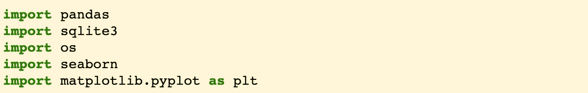
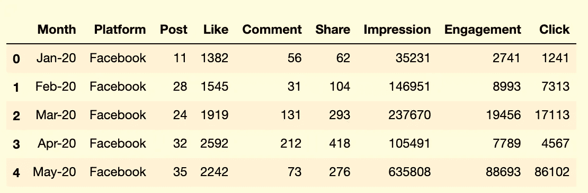
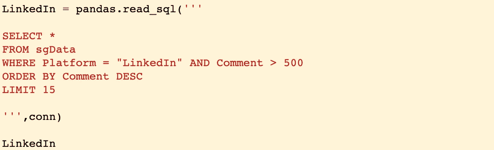
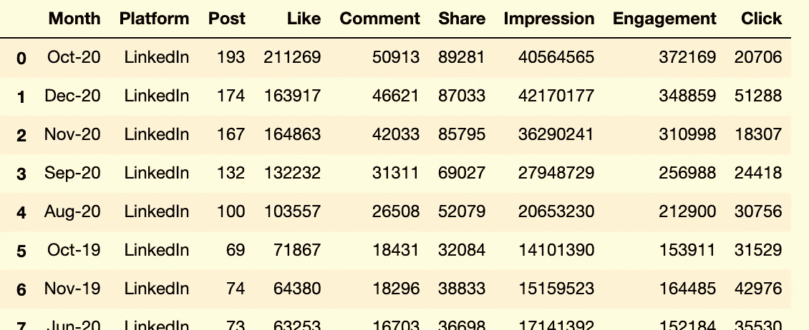
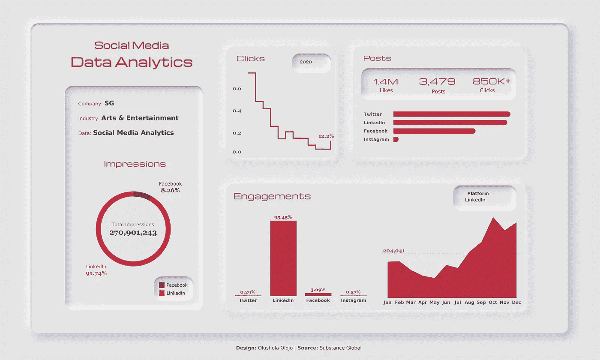

# PB & J，饼干和奶油——熊猫和巧克力

> 原文：<https://medium.datadriveninvestor.com/pb-j-cookies-n-cream-pandas-and-sqlite3-f685a96a9658?source=collection_archive---------23----------------------->

Photo by [Freddy G](https://unsplash.com/@freddygthatsme?utm_source=unsplash&utm_medium=referral&utm_content=creditCopyText) on [Unsplash](https://unsplash.com/s/photos/peanut-butter-and-jelly?utm_source=unsplash&utm_medium=referral&utm_content=creditCopyText)

作为一名数据科学家，你可能会认为我每天都渴望处理数据或编写关于*算法*、*机器学习*或*数据迁移的复杂技术内容。*

陈词滥调；

> **建立线性回归模型的五个步骤**

尽管如此，在由杰出作家支持的**关于数据科学**的出版物上有一些非常有见地的文章，我在处理我的数据项目时经常参考这些文章。

但对我来说，我并不觉得技术写作特别有魅力。

我宁愿纠结于一篇关于社会正义的文章，旨在打破社会对种族、性别和社会阶级的更大认知——或者更好的是，一篇关于悟空和超人之间谁会赢的文章！

在你跳到超人角之前，记住小悟空也会飞。

我不禁觉得，我不是被迫写技术内容，因为这让我害怕。也许，这可能会解开我不适合这个数据科学世界的根深蒂固的想法。

啊，我怀疑它是否有用。

废话。各方面的沟通对于成为不可或缺的数据科学家至关重要。

技术写作可以帮助开发您的能力，为不太懂数据的人简洁地将顽固的代码转换成可理解的块，并解决现实世界的业务挑战。

话虽如此，我还是决定采纳自己的建议。

> **“胆战心惊。”**

> “不要让你的行动背叛你的语言”
> 
> —因基·约翰逊

# 大数据

在我们开始破解之前，让我们先来探索一下**“大数据”的含义。将这个定义松散的术语输入谷歌会产生一大堆不同的定义。**

> **大数据**是一个处理方法的领域，用于分析、系统地从中提取信息，或者处理太大或太复杂而无法由传统数据处理应用软件处理的数据集。

> —维基百科

如今，利用数据获得洞察力似乎是寻求获得竞争优势的公司的首要任务。

数据科学家的任务是理解所有这些噪音，从复杂的数据集中生成可操作的见解。

耶，就是我！

# 这项任务

我从 300 多名申请者中脱颖而出，进入了一家媒体和娱乐公司高级数据分析师职位的最后阶段。

现在有四个了！

我们面对的是一个高度复杂的数据集，我们被要求设计一个策略，如何将这些数据扩展到现有的 Excel 表格之外。除了可扩展之外，该解决方案还应展示数据可以轻松访问、操作以及导出到 BI 工具中的方式(如果可能)。

起初，我感到慌乱，开始寻找各种方法，不仅要提供一个全面的解决方案，而且要特别针对公司的行业。

很好，这让我们跟上了这篇文章的前提。

我的答案是 **Python 的熊猫库**与 **SQLite3** 数据库结合使用，以提供既可伸缩又高度通用的东西。

# 活力二人组

熊猫和 SQLite3 的另一个快速定义。

Pandas 是一个非常受欢迎的 Python 库，它允许您将文件永久存储到数据帧中，然后可以很容易地对其进行操作。它还与多种可视化兼容，允许对大数据进行交互式探索。

SQLite3 是从 *Python 2.5* 开始就包含在 Python 库中的一个模块。它添加了一个温和的关系数据库元素，使您能够根据传统的 SQL 语法编写查询，并相对容易地获取数据。

自从弗罗多和山姆阻止了黑暗魔君索伦接管世界的企图后，他们组成了一个充满活力的二人组。

## 步骤 1:导入库

相当直接。打开 **Jupyter 笔记本** *，*我开始导入这个任务的所有相关库。咄，熊猫& SQLite3 是显而易见的选择。

然而，**“OS”**提供了一种在 Jupyter 上浏览文件夹的便捷方式，而**“Matplotlib”**则提供了一个动态执行一些基本数据可视化的机会。

## 步骤 2:加载数据

在加载之前，我已经在 Excel 上执行了一些基本的数据清理，以获得更精简的外观。然后，数据被转换成 CSV 格式，以便在 Jupyter 上更快地处理。

数据清理是战斗的 70%,你不想事先知道这个数据集是什么样子。

然而，Pandas 的强大之处在于，一行代码就足以加载一个大型数据集并将其保存到数据帧中。

这有多蠢？！

## 步骤 3:创建 SQLite3 连接。

下一步是建立 SQL 连接。运行上面的第一行代码会在默认目录中创建一个连接对象来存储数据。

第二行将 DataFrame 转换成 SQLite3 数据库。

这里有点免责声明，SQLite3 是一个无服务器的数据库引擎，不应该被认为是像 **MySQL** 或 **PostgreSQL** 这样更健壮的服务器的替代品——至少从数据仓库的角度来看是这样的。

## 步骤 4:用熊猫读 SQL

使用**“SQL _ read”**函数，我们现在可以读取数据并向数据库写入查询。

这是我们可以输入的最简单的 SQL 查询，用于返回表中的所有列，并测试代码是否成功运行。

## 步骤 6:编写更多的查询

现在，您可以真正地使用它并编写一些更复杂的查询。在这里，我的目标是返回*“LinkedIn”*帖子中获得超过*“500 条评论”的所有专栏。*然后，我将显示“前 15 名”结果，从大到小排序。

瞧啊。

## 第 7 步:转换回 CSV

你一定会喜欢这些俏皮话的。

这段代码将数据帧保存回 CSV 格式。现在，它已经准备好被输出，并被踢进一个类似于 **Tableau** 或 **Power BI 的 BI 平台。**

## 第八步:视觉化

作为一个自称的数据可视化极客，我知道使用 Matplotlib 的简单条形图在这里是不够的。使用导出的数据集，我通过使用 Tableau 和 **Figma** (UX/UI 设计)创建一个引人注目的社交媒体分析 viz，将这项任务提升了一个档次。

开始了。

Interactive link to the full version: [https://tabsoft.co/3rsgGBk](https://tabsoft.co/3rsgGBk)

# 摘要

性很酷，但是你曾经在完成一个项目后关闭所有的搜索标签吗？

玩笑归玩笑，我们已经成功地完成了任务，并通过结合 Pandas 和 SQLite3 探索了 Python 在数据科学能力方面的许多可能性之一。

请随时在**[**LinkedIn**](https://www.linkedin.com/in/olusholaolojo/)**或[**Twitter**](https://twitter.com/tbigsho_)**上与我联系，分享你在 Python 包中使用不太可能配对的一些有趣发现。******

> ******“不要寻求建议，要寻求反馈”******
> 
> ******导师 Nana Nyantekyi******

******Ayyy，对于第一次尝试技术写作来说还不错——也没有我预期的那么可怕。同样，任何建设性的反馈都将不胜感激。******

******在工作方面，我已经进入了最后两个候选人的名单。我会让你们知道结果的。******

******最后，我将留给你一句我最喜欢的关于恐惧的名言，以及为什么我们不能让它扼杀我们的进步。******

> ******恐惧是对逻辑的放弃，是对合理模式的自愿放弃..我们要么屈服于它，要么与之斗争，但我们不能半途而废。”******

> ******—史蒂夫·克莱恩******