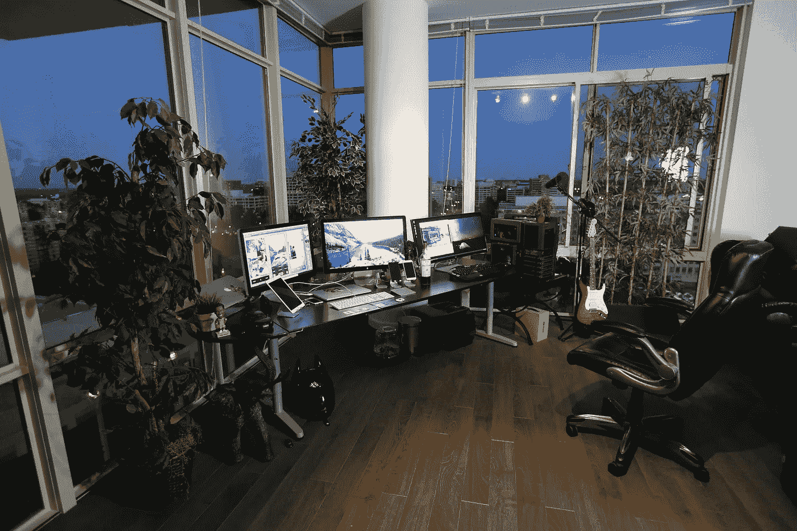

# 装有 Windows、Linux 或苹果电脑的个人电脑？

> 原文：<https://medium.datadriveninvestor.com/pc-with-windows-linux-or-just-an-apple-machine-c715afd1f720?source=collection_archive---------10----------------------->

## 软件开发的最佳硬件

这些宗教之间的战争令人难以置信。对于精通技术的人和软件工程师来说更是如此。

Photo by [Roberto Nickson](https://unsplash.com/@rpnickson?utm_source=unsplash&utm_medium=referral&utm_content=creditCopyText) on [Unsplash](https://unsplash.com/?utm_source=unsplash&utm_medium=referral&utm_content=creditCopyText)

## 现状

询问我周围的人，从软件工程师到开发运营人员，还有项目经理/高管，有几点非常清楚。

*   毫无疑问，90%的软件工程师使用基于 Linux 的系统
*   大公司分为新老两家，老公司更依赖和忠于 windows 机器，而新公司更开放，稍微倾向于苹果产品。显然，这与从 Windows 主导的市场继承的遗留系统和软件有很大关系。
*   管理层通常也更喜欢苹果产品
*   专注于网络开发(前端)、营销和广告的代理公司目前更加面向苹果。
*   大多数新公司或中小企业将选择权委托给新员工。
*   较大的公司，尤其是那些使用 Windows 的公司，似乎有专门的工程师团队，他们负责设置环境，在域级别上启用和/或禁用功能，每天运行防病毒程序等等。

 [## 了解和查看 Linux 文件权限|数据驱动投资者

### 我以为我理解了 Linux 文件权限——但结果发现有一些概念上的差距。这个话题，而…

www.datadriveninvestor.com](https://www.datadriveninvestor.com/2020/04/01/understanding-and-viewing-linux-file-permissions/) 

底线是有各种口味可供选择。

## 从商业角度来看

个人观点基于我的经验，从商业/公司的角度，为一个技术公司(软件开发)

*   同样规格的 MAC 电脑比 Windows 电脑的价格略高，如果不需要 Windows 许可证，价格甚至会更高。
*   就兼容硬件和电池寿命而言，Ubuntu 尤其令人头疼。
*   一些运行 Ubuntu 的笔记本电脑有不同的问题，包括键盘和鼠标垫的问题，以防笔记本电脑进入睡眠状态。解决办法是不让它进入睡眠状态，这意味着更快地消耗电池的寿命。
*   如今，Windows 笔记本电脑相当稳定，但会带来额外的成本；杀毒软件是需要的，支持也是需要的，尽管它通常不像听起来那么有效。
*   在大多数环境下，尤其是苹果电脑和 Windows 笔记本电脑上，安装速度非常快。
*   众所周知，苹果的客户服务更好。因为有这么多可能的个人电脑制造商，很难进行直接比较，但总的来说，苹果公司在备份他们的产品方面做得很好。
*   PC 最大的优势就是成本。因为有如此多的个人电脑制造商，所以有可能找到各种不同价位的设备。只有最强大和最昂贵的个人电脑接近苹果产品的价格点。
*   许多开发工具都是为基于*nix 的系统而开发的。
*   苹果金融服务公司为 MAC 电脑提供租赁计划，这样可以保证产品的价值。
*   MacOS 学起来很快，Windows 和其他操作系统也是如此。在建议转换到一个或另一个系统之前，考虑你的同事和他们的适应性。
*   部署基本软件。就像加密和恶意软件保护一样，苹果提供了一个内置于 macOS 的解决方案——被称为[苹果业务管理器](https://www.jamf.com/solutions/technologies/apple-business-manager/)。该计划允许组织订购 MAC(和 iOS/iPadOS 设备)并将其标记为公司所有。当该设备第一次启动时，它会检查苹果数据库中的序列号，并强制注册一个公司所有的设备。从那里，管理系统可以加载额外的应用程序和设置。与传统成像相比，这大大节省了时间和成本。

## 安全和稳定

这是另一个显而易见的。在最近的过去，Windows PCs 已经成为比 MAC 电脑更多的恶意软件的牺牲品，包括勒索软件、间谍软件、僵尸网络和老式病毒。但微软正在不断加强其安全性，推动 Windows Defender 更新，甚至推出反勒索软件措施。

MAC 电脑的记录要干净得多，但它们绝不可能对漏洞免疫。看看最近的[崩溃和 Spectre](https://meltdownattack.com/) 漏洞就知道了，它们影响了两个操作系统。

两种操作系统都提供内置的 VPN 支持。

然后还有稳定性的问题。MAC 在这一点上也赢了，主要是因为苹果控制了硬件生态系统(第三方驱动程序是 Windows PCs 不稳定的主要原因)。我们甚至在微软自己的 Surface 电脑上看到过蓝屏。

# 大型企业笔记本电脑使用情况概述

## Jamf 2019 报告

*   94%的人认为，他们更有可能选择/留在一家提供工作电脑或移动设备选择的公司
*   79%的人认为，如果不会使用 Mac，他们就无法有效地工作
*   74%以前在工作中使用 PC 的人现在使用 Mac 后遇到的问题更少了

## 让我们回顾一下这些惊人的发现

虽然 Mac 硬件本身就比 PC 贵，但在部署 Mac 时还需要考虑更多因素。由于大多数核心服务转移到了云端，并成为跨平台服务，现在 Mac 和 PC 之间的成本已经很低了。

任何认真管理和保护 Windows 的组织都需要在廉价 PC 的成本上增加额外的软件和工具，而不是将这些功能内置到 Mac 的操作系统中。最后，如果加上管理工具和支持的成本，总拥有成本差距对组织来说可能是巨大的。事实上，IBM 发现他们部署的每台 Mac 比 PC 节省了 273-543 美元。

## R 参考文献

 [## 总拥有成本:Mac 与 PC 在企业中的对比|博客

### 2020 年 1 月，微软结束了对 Windows 7 的扩展支持。这是一个关键点的组织和…

www.jamf.com](https://www.jamf.com/blog/total-cost-of-ownership-mac-versus-pc-in-the-enterprise/)  [## 为什么我总是推荐苹果电脑而不是个人电脑——尽管它们通常要贵得多

### 苹果电脑比一些个人电脑贵很多，但是当你考虑到你的价值时，它们值这个高价

商业内幕网](https://www.businessinsider.de/international/apple-mac-vs-windows-pc-why-i-chose-macbook-2018-3/?r=US&IR=T)  [## IBM 称 MAC 为每位用户节省了 543 美元

### IBM 已经拥有世界上最大的企业 Mac 足迹，并且每周增加 1300 台新 Mac。公司说…

www.cio.com](https://www.cio.com/article/3133945/ibm-says-macs-save-up-to-543-per-user.html) 

**进入专家视角—** [**订阅 DDI 英特尔**](https://datadriveninvestor.com/ddi-intel)