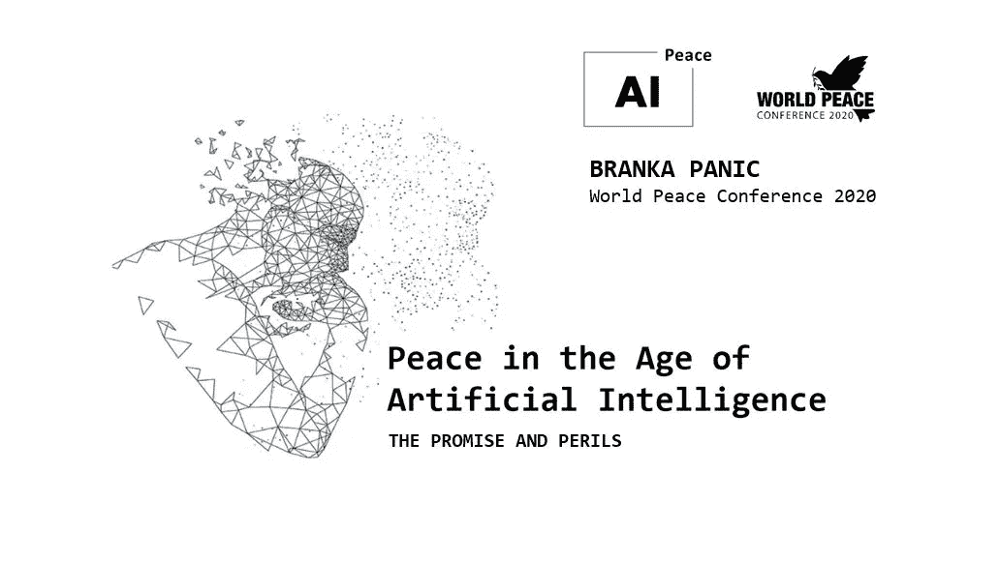
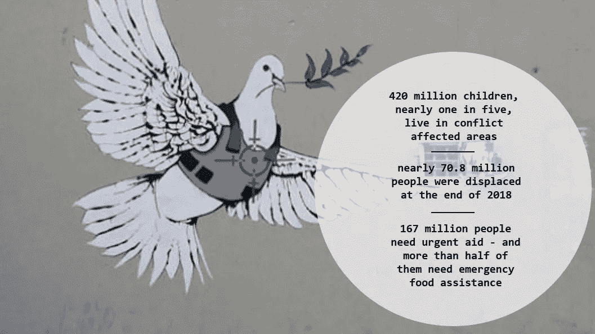
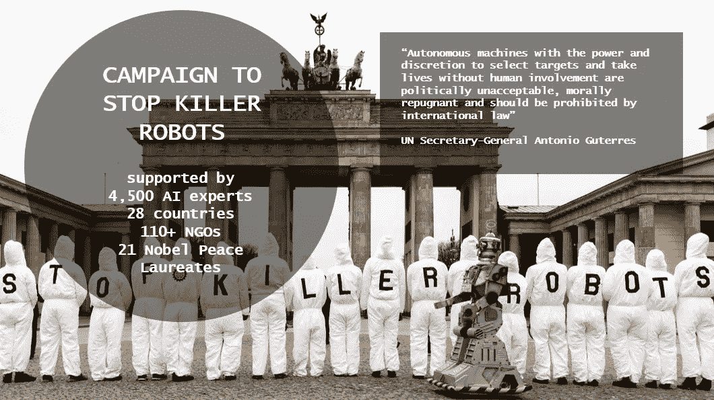
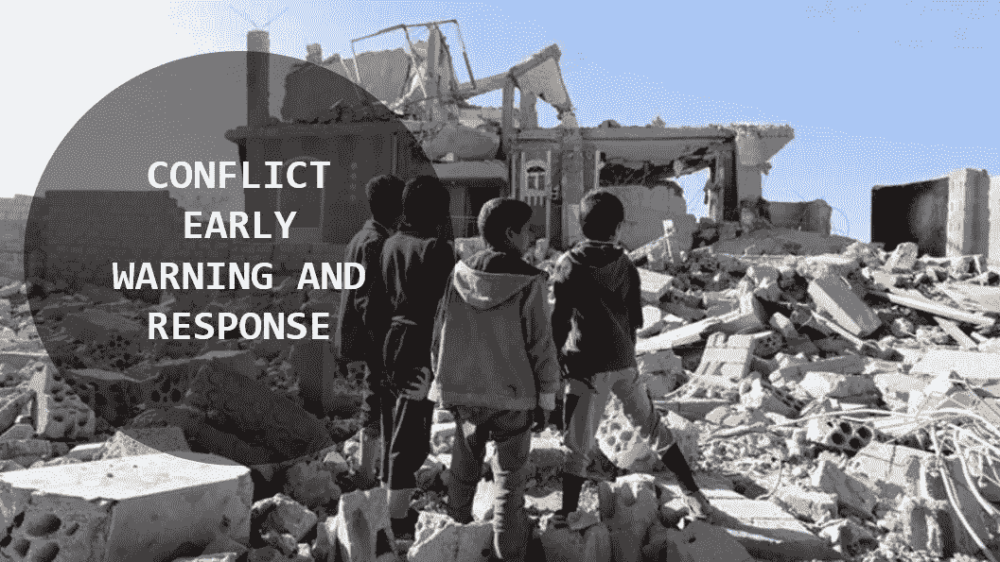

# 人工智能时代的和平——希望与危险

> 原文：<https://medium.datadriveninvestor.com/peace-in-the-age-of-artificial-intelligence-the-promise-and-perils-8634352cde29?source=collection_archive---------4----------------------->

## 在过去的十年里，我们是如何离开的？在新的十年里，我们将会期待什么？

1 月 17 日至 18 日，世界和平大会在加州安大略省举行。会议聚集了来自美国和世界各地的数百名专家，讨论在他们的地区、国家、社区和家园创造可持续和平的主要问题、挑战和解决方案。从诺贝尔和平奖获得者和被提名者、广岛和长崎的幸存者、大屠杀的幸存者，到民间社会领袖和变革者，所有人都分享了他们鼓舞人心的故事，并呼吁采取行动。

[*AI for Peace*](https://www.aiforpeace.org/) *创始人兼执行董事，*[*Branka Panic*](https://www.linkedin.com/in/brankapanic/)*，受邀作为演讲嘉宾加入大会，并以“人工智能时代的和平”为题进行演讲。这篇文章总结了她对人工智能在创造持久和平方面的主要危险和希望的陈述。*

## 新十年的开始

2020 年始于令人不安的消息，一架无人驾驶飞机杀害了伊朗将军卡西姆·索莱曼尼，随后伊朗对伊拉克军事基地的美军进行了反击。那天早上，推特上一片火热，人们对第三次世界大战感到好奇，并呼吁#nowarwithiran。这严肃地提醒我们，和平是脆弱的，需要时刻意识到另一场战争的可能性。这就是我们如何开始新的十年，当我们回顾我们如何离开 2019 年时，我们甚至有更多的理由感到担忧。

 [## 人工智能与创意:作为创意引擎的 BigGAN |数据驱动的投资者

### 的确，2018 年可以被视为人工智能创造的创造力全盛时期的开始。当然可以…

www.datadriveninvestor.com](https://www.datadriveninvestor.com/2019/02/13/ai-creativity-biggan-as-a-creative-engine/) 

## **2010 年的世界——战争、暴力、被迫移民、天气灾害**

世界正在经历另一场旷日持久的危机，人类安全和地球健康面临诸多挑战。2019 年全球和平指数显示，尽管全球和平程度五年来首次改善，但世界仍不如十年前和平。根据[救助儿童会](https://www.savethechildren.org/us/about-us/media-and-news/2019-press-releases/children-affected-armed-conflict)的数据，4 . 2 亿儿童，将近五分之一，生活在受冲突影响的地区，比过去 20 年的任何时候都多。2018 年，战争、暴力、迫害、饥荒和自然灾害导致全球被迫流离失所人数再创新高。联合国难民署 [2019 年全球趋势报告](https://www.unhcr.org/ph/figures-at-a-glance)显示，截至 2018 年底，近 7080 万人流离失所，比一年前多 230 万人被迫流离失所。2020 年的人道主义需求将是几十年来最高的，超过 1 . 67 亿人需要紧急援助，其中一半以上需要紧急食品援助。极端天气灾害、干旱和野火以及气候变化只会增加人们面对人道主义危机的脆弱性。

所有这些都告诉我们**和平在今天迫切需要盟友**。寻找那些盟友，我们在往人工智能方向看。我们正在分析它目前是如何和在哪里被应用的，以及人工智能对结束战争和创造持久和平的未来潜在影响。作为和平建设者，我们将人工智能视为一种承诺，但我们也意识到它的许多危险。

## **AI 在战争和军事上的用途**

之前十年我们看到的是战争中无数的 AI 应用。我们可以立即将人工智能与关于自主武器或所谓的“杀手机器人”的辩论联系起来。在过去十年中，人工智能发展迅速，并使完全自主的武器系统的发展成为可能，这些武器系统可以在没有有效人类控制的情况下选择、攻击、杀伤人类目标。完全自主武器系统的概念极具争议。虽然美国政府认为他们的部署是国家的当务之急，但反对他们的运动正在变得越来越大，越来越强。2019 年 3 月，联合国秘书长安东尼奥·古特雷斯[召集了一次人工智能专家会议](https://news.un.org/en/story/2019/03/1035381)，以推进对致命自主武器系统开发的限制。

> *他说*“拥有权力和自由选择目标并在没有人类参与的情况下杀人的自主机器在政治上是不可接受的，在道德上是令人厌恶的，应该被国际法所禁止”。

与此同时，人工智能和机器人研究人员发出了一封[公开信](https://futureoflife.org/open-letter-autonomous-weapons/)，倡导反对自主武器和人工智能军备竞赛，并声称人工智能可以让战场对人类更安全，特别是平民，而不会创造新的杀人工具。“正如大多数化学家和生物学家对制造化学或生物武器没有兴趣一样，大多数人工智能研究人员对制造人工智能武器也没有兴趣——也不希望其他人这样做玷污他们的领域，这可能会造成公众对人工智能的强烈反弹，从而削弱其未来的社会效益，”这封信说。人权组织、人权观察、大赦国际和其他组织强烈呼吁禁止开发和使用完全自主的武器。他们强调了自主武器在国际法，特别是国际人权法和标准方面的影响。这场运动最终创造了一个“[阻止杀手机器人](https://www.stopkillerrobots.org/learn/)的运动”，斯蒂芬·霍金和埃隆·马斯克等签名者，得到了 4500 名人工智能专家、28 个国家、110 多个非政府组织、21 名诺贝尔和平奖获得者等更多人的支持。

> “也许机器人技术和人工智能是不可避免的，但应用它们独自杀死人类不是不可避免的，除非你什么都不做，我们拒绝什么都不做” [*乔迪·威廉姆斯*](https://www.youtube.com/watch?v=GFD_Cgr2zho) *，1997 年诺贝尔和平奖得主，国际禁止地雷运动创始协调员。*

## 将人工智能从战争带到和平

技术的快速传播、“大数据”的可用性以及处理和存储成本的降低，使得人工智能不仅在战争中，而且在包括建设和平在内的许多其他领域中获得了更大的应用。一段时间以来，在建设和平中使用最广泛的技术是高分辨率的卫星、无人驾驶飞机和航空图像，使我们能够看到建筑物是否被损坏或摧毁，并使那些有迫切需要的人能够尽早采取行动。"**社交监听"**(对数字对话的监控)对于了解公民的声音、他们的需求和不满，以及帮助改善功能和获得服务变得非常重要和有价值。这一系列工具使和平建设者能够以更多的方式与更多的人沟通，收集更好的信息，并维持与当地利益攸关方和民众的关系。

更进一步，人工智能提供了分析收集的政治、社会、制度和经济变量、卫星和无人机图像数据的可能性，使我们能够尽早识别潜在冲突，并使早期预警和响应工作比以往任何时候都更有效。预测日益加剧的政治、民族、种族或宗教紧张局势在哪里可能发展成公开冲突是极其困难的。但研究人员认为，人工智能可能有助于分析来自潜在冲突地区的大量信息，以预测建设和平行动应该集中在哪里。来自奥斯陆和平研究所(PRIO)的研究人员对政治暴力预警系统 ViEWS 进行了试点，该系统可以在 36 个月内对非洲的国家冲突、非国家冲突和单边暴力进行月度预测。如今，数据和计算能力都可以用来创建更准确的预测并对其进行缩放。[嵌入式网络实验室](https://warwick.ac.uk/fac/sci/eng/staff/wg/research/)和华威大学将机器学习和传统建模结合起来，预测冲突的规模、可能发生的地点和发生的时间，并通知那些应该及时采取行动的人，如联合国维和部队。

## **道德框架和创新的全球治理**

同样的技术可以用来做好事，或者如果落入坏人之手，可以用作武器。任何技术都可能被黑客攻击、武器化，并以我们意想不到的方式使用。这就是为什么我们需要确保，即使我们有良好的意图，我们也不会造成意想不到的后果。我们需要一个框架，用于在冲突和维和环境中道德和安全地部署人工智能。我们需要定义什么构成了人工智能的道德使用，我们需要将这些道德标准嵌入到基于国际法的创新全球治理体系中。我们需要这些道德标准成为已经处于教育阶段的人工智能工程师的必修课程的一部分。我们还需要在人工智能领域知识渊博的社会科学家、活动家和政策制定者，能够在正确的时间提出正确的问题。通过这种方式，我们可以主动检测人工智能的非预期用途和后果，并及时采取行动。我们需要寻找并意识到负外部性，并设计防范措施。

我们有很多东西要害怕，并意识到所有可能的负面影响和人工智能的潜在滥用，从配备了可以作为复杂的大规模杀伤性武器的高级火炮的无人机群，到用于监控和侵犯人权的面部识别，以及人工智能实现了虚假视频、图像和文本的深度伪造。但是也有很多希望。研究已经证明了人工智能在一系列社会领域带来真正变化的巨大潜力，但要实现这种潜力，需要政府、国际人道主义和发展行为体、科技公司、非营利组织和公民本身采取果断行动。

我们在[人工智能促进和平](https://www.aiforpeace.org/)，相信未来几年将受到人工智能发展和部署的巨大影响，我们的使命是使这种影响和平并有益于全人类。我们的当务之急是确保人工智能技术只用于好的方面，只用于和平，这是我们在 2030 年回头看过去十年时希望看到的结果。

加利福尼亚州安大略省
2020 年 1 月 18 日