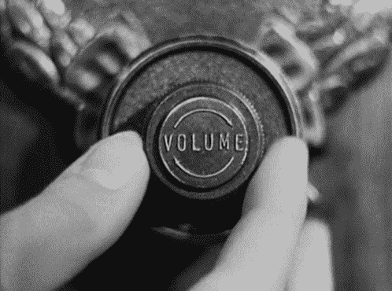

# 仙股 101:股票市场什么时候开门&更多

> 原文：<https://medium.datadriveninvestor.com/penny-stocks-101-what-time-does-the-stock-market-open-more-caa8731da1ea?source=collection_archive---------13----------------------->

# 细价股和股票市场的基础

我们偶尔会做一篇关于股票市场基础知识的文章，以及 T2 的低价股和 T3 的组合。虽然有些对更有经验的交易者来说似乎是显而易见的，但投资新手可能会寻找某些主题。

在这篇文章中，我们将回顾一些非常基本但重要的事情，不仅要了解细价股，还要了解整个股票市场。此外，如果你正在寻找关于细价股常见问题的信息，请查看我们的[细价股常见问题](https://pennystocks.com/featured/2019/10/19/penny-stock-basics-frequently-asked-questions-faq/)。

首先，让我们讨论一下市场时机。如果你是交易细价股或蓝筹股的新手，一般来说，你会想知道这个问题的答案:“**股市什么时候开盘和收盘**？”

# 股票市场什么时候开门？

无论你是交易细价股还是开始投资，知道股市何时开盘是很重要的。这似乎是显而易见的，但一些新的交易者可能不知道股票市场何时正式开盘。周一到周五，不包括节假日，股市同时敲响了开市钟。

**问题**:股市什么时候开盘？
**答案** : ***美国东部标准时间(EST)上午 9:30 股市开市钟声响起，标志着股市正式开盘。***

但是根据你的经纪人和你的交易内容，你可能在股市开盘前后有机会投资股票甚至期货。虽然大多数仙股通常不会在正常交易时间之外交易，但一些经纪人会在开盘铃声响起之前让投资者买卖仙股。这就是我们看到一些廉价股票创造“开盘钟缺口”的地方。

 [## 利用股市相关性的最佳方式|数据驱动的投资者

### 当阿尔弗雷德·温斯洛·琼斯开创了世界上第一个“对冲”基金(后来“d”被去掉了)时，他让其他投资者大吃一惊…

www.datadriveninvestor.com](https://www.datadriveninvestor.com/2020/02/02/the-best-way-to-use-stock-market-correlations/) 

本质上，拥有“盘前交易”权限的交易者可以在美国东部时间早上 4 点交易细价股。如果你提到一些顶级的细价股网上经纪人，你会想询问他们是否提供延长交易时间的服务。

# 股票市场什么时候关门？

现在，你也想了解股票市场的另一端。为什么？好吧，假设你买了细价股，知道股市周末休市。由于某些市场活动和全球头条新闻，你决定不想在周末持有某些低价股。

不仅要知道股票市场每天的收盘时间，还要知道周五的收盘时间。这似乎很简单，但如果你是交易新手，你可能实际上不知道股市关闭的时间。周一至周五，不包括节假日，股市同时敲响收盘钟。

**问题**:股市什么时候收盘？
**答案** : ***美国东部标准时间(EST)下午 4 点，股市收盘钟声响起，标志着股市正式收盘。***

类似于股票市场开盘时，收盘钟声只标志着正常市场时间的结束。一些券商将允许散户投资者进入“盘后交易”。虽然许多细价股在正常交易时间后不会交易，但有些会。交易这些股票的权限可能是有限的，但尽管如此，你也许可以使用这个功能。股市实际开市多晚？本质上，拥有“盘后交易”权限的交易者可以在美国东部时间晚 8 点交易某些细价股。

# 股票市场交易时间:摘要

因此，让我们在这里总结一下，然后我们可以继续讨论其他一些市场基础知识:

## 股票市场什么时候开门？

根据正常的市场时间，股票市场在周一至周五美国东部时间上午 9:30 至下午 4:00 开放，除非有特定的假期要考虑。

## 什么是盘后交易？

虽然股市的正常时间是美国东部时间上午 9:30-下午 4 点，但一些交易员可以在盘后交易。这实质上意味着股票市场从美国东部时间早上 4 点到晚上 8 点开放。但是一些经纪人可能会根据你的账户类型来限制访问。

# 细价股的基础

我不会在这篇文章中过于详细地介绍细价股的基础知识。我们实际上已经为订阅者准备了一本 60 多页的书，供他们免费阅读。但我确实认为，如果你是细价股的新手，一般来说，重温一些非常基本的概念是很重要的。所以，让我们回顾一下细价股的一些基本情况:

# 问题 1:什么是仙股/什么是仙股？

这是交易者经常讨论的话题。虽然你可能会认为，根据定义，一个细价股交易“便士”，这是一个更广泛的定义，基于证券交易委员会的定义细价股。

根据美国证券交易委员会的说法，T2 对低价股的定义是:

因此，按照传统， ***细价股是一家公司的股票，交易价格低于 5 美元*** 。纯粹主义者可能会说，但就普遍接受的定义而言，这是股票市场监管机构的标准定义。

# 问题 2:股票中成交量是什么意思？

如果有一件事是细价股众所周知的，那就是高度波动的突破。但是，总的来说，股票的总量会起到很大的作用。简单来说，**股票的成交量**是指有人在买卖某一只股票的股票。你可能已经猜到了， ***成交量是在指定时期内*** 交易的股票数量。一些交易者看交易量，每分钟。其他人可能会每天查看，而某些交易者会查看股票的周成交量。

成交量较高的股票是那些有更多投资者有兴趣交易的股票。这有时可能是由新闻事件引起的，也证实了某些价格趋势。成交量的峰值或不规则的成交量可以给潜在的反转、催化剂、谣言等等一个提示。

作为一个一般的经验法则，当谈到细价股时，人们应该把重点放在总的美元量上，而不是股票量上。如果一只次级股交易了 100 万股，可能就没什么人感兴趣了。即使根据以前的交易，100 万股低于 0.01 美元的股票可能是“不规则的”，也不太可能提供足够大的流动性来真正用细价股赚钱。话说回来，这都是基于你个人的喜好。

**【了解更多】** [什么是仙股，值得买吗？](https://pennystocks.com/featured/2019/10/27/what-are-penny-stocks-worth-buying/)

如果你有一个较小的账户，可以交易较低交易量的细价股，因为你没有投资数千美元，那么“次级股的例子”可以提供机会。但是，如果你交易一个非常大的账户，考虑平均美元交易量需要高得多，以便你有足够的流动性来轻松地进入和退出交易。

# 问题 3:细价股值得吗？

这是我们看到的另一个基本问题。仙股值得吗？这完全取决于你今天的交易策略和对股市的态度。我们知道细价股具有更高的风险和波动性。这些低于 5 美元的股票几乎可以在一眨眼的时间内飙升或跌至新低。

如果你认为新闻对股票市场影响很大，那么众所周知，细价股新闻会加剧这种影响。要真正了解这些便宜的股票值不值，你要看看自己投资股票的计划。包括一点风险吗？ ***如果你能把你投资组合中的一小部分分配给更高的风险，并且不介意更高的波动性，那么细价股可能值得*** 至少看一看。

*原载于 2020 年 5 月 31 日 https://pennystocks.com**[*。*](https://pennystocks.com/featured/2020/05/31/penny-stock-market-basics-time-open-close-faq/)*