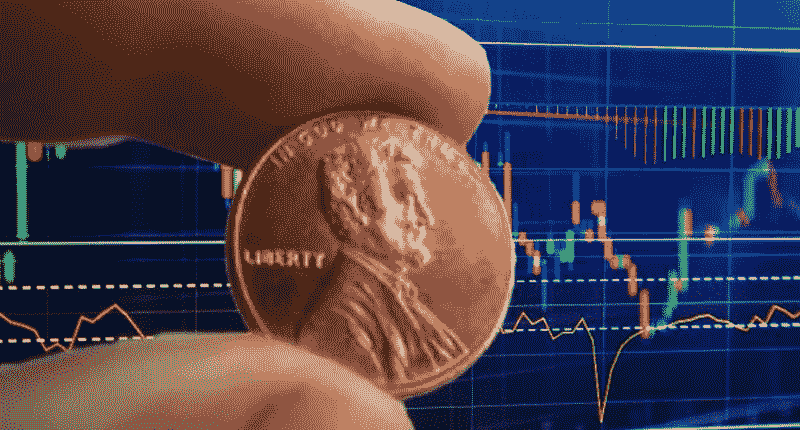
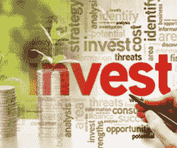

# 细价股的定义和常见问题

> 原文：<https://medium.datadriveninvestor.com/penny-stocks-definition-frequently-asked-questions-f8c8b377f317?source=collection_archive---------27----------------------->

1.  **什么是仙股？**
2.  **细价股值得吗？**
3.  **仙股&日交易**
4.  **为什么细价股有风险？**
5.  股票市场什么时候开门？
6.  **股市什么时候收盘？**

# 什么是仙股？

细价股是一家公司的股票，其交易价格低于每股 5 美元。虽然大多数人认为这些公司规模较小，但也有许多公司的市值高达数十亿美元。许多股票也在纳斯达克和纽约证券交易所等主要交易所交易。

对于 Robinhood & Webull 这样的廉价股票经纪公司的客户来说，这是一个受欢迎的信号，这些公司将他们的用户限制在主要上市公司(在很大程度上)。对许多新手来说，一般的理解是，细价股只在柜台交易或“场外交易”。这是不正确的，当你想到低价股的定义时，你应该关注价格，而不是交易。

# 细价股值得吗？

要了解细价股是否值得，你需要分析你自己进入股市的方法。你喜欢高风险交易吗？此外，你能处理高风险的情况吗？如果你更倾向于买入并持有，或者投资股票，那么细价股可能会有点吓人。

事实上，交易者可以在眨眼之间赚钱或赔钱，这是几十年来投资者两极分化的原因。这里的区别是，有很多方法可以用细价股赚钱。但重要的是要明白，把细价股(或任何股票)当作彩票肯定会在市场上赔钱。

所以在你问自己“细价股值不值”之前，最好先问问自己是否明白如何日内交易。有很多工具可以帮助你理解在市场中获得持续盈利的策略。说到底，细价股是利用小额资金从股市波动中获利的一个很好的方式。它只是归结为学习如何日内交易，以成为持续盈利。

# 细价股票和日间交易

这并不是说，当涉及到日交易细价股甚至投资细价股时，你不应该考虑交易所。所有交易所对公司都有一定的要求，以保持上市。有时它与最低股价有关，有时则与公开信息有关。当涉及到场外交易细价股，特别是，上市要求不那么严格相比，纳斯达克和纽约证券交易所。

**了解更多信息**

*   [你能在个人退休账户中购买细价股吗？答案可能会让你大吃一惊](https://pennystocks.com/featured/2020/12/04/can-you-buy-penny-stocks-in-an-ira/)
*   [如何在线投资细价股](https://pennystocks.com/featured/2020/10/31/how-to-invest-in-penny-stocks-online/)

让我们面对它，日交易细价股是一个简单的任务，但不是一件容易的事。仅仅简单地认为你会在一个价格买入，在另一个价格卖出，这就过分简化了交易本身。分析技术水平，剖析新闻，阅读文档等。甚至在按下“购买”键之前，这一切都进入了一个交易论题。除了上市的要求，那些寻找日间交易细价股也应该知道某些细价股的流动性。这是指在给定的时段内有多少股票被交易以及股票交易的频率。

一般来说，日内交易者寻找的普通细价股交易量相对较低。这意味着它们不是每天都在活跃地交易。有些日子可能有高水平的活动，而其他日子可能有较低的水平。为什么流动性很重要？一个简单的事实是，当要从交易中获利时，流动性较差的股票可能更难退出。

由于流动性降低，你可能还会看到更大的利差。股票的价差是什么？这是指最高出价(“出价”价格)和最低出价(“要价”)之间的价格差异。“价差”的一个例子是一只股票的出价为 0.05 美元，要价为 0.10 美元。这是 100%的差价。如果一个交易者以这样的价差买入细价股，风险是在买入后有人立即卖出，从而将你的头寸价值减半。

 [## 这么说一家大型风投基金正在投资你的初创公司？4 实际考虑|数据驱动的投资者

### 首先，恭喜你。融资总是需要努力的，一个大的风险投资基金当然是一个大的…

www.datadriveninvestor.com](https://www.datadriveninvestor.com/2020/08/09/so-a-big-vc-fund-is-investing-in-your-startup-4-practical-considerations/) 

# 为什么细价股有风险？

我们讨论了价格风险、流动性风险和市场汇率风险。但是细价股还有很多其他的风险。很多事情都与有效的、最近的信息以及谁参与了这些公司有关。内部人士可以多次成为细价股暴跌的原因。

当你谈论像这样的小公司，以及流动性较低的公司时，很难筹集到资金。很多时候，我们会看到这些公司筹集数百万美元来维持运营。但是钱可能是“昂贵的”。

这可能包括大幅折扣和某些转换权。举例来说，当你谈论 OTC 细价股时，一些公司可能会以比当前市价低 50%的价格筹集资金。在这种情况下，我们会看到一只给定的细价股票的价格急剧下跌。这仅仅是因为交易者看到了公司基于当前发行金额对其股票的估价。

此外，由于宽松的报告要求，场外交易通常是你看到泵和转储活动。这些公司不需要披露与纳斯达克和纽约证券交易所公司几乎相同数量的信息。此外，由于这些交易通常很少，它们容易受到市场操纵。如果你，作为一个交易者，在油泵和泵的卸载端，会导致难以想象的损失。其他交易所也有欺诈的例子。无论如何，这只是另一个在交易前做研究的理由。

# 股票市场什么时候开门？

如果你已经很好地把握了风险，并且知道如何用低价股赚钱，那么是时候进入市场了。但是股票市场什么时候开门？股票市场在美国东部标准时间每天上午 9:30 开盘。

这标志着“正常市场时间”的正式开放但是，交易时间会延长。根据你的经纪人，你可以在美国东部时间早上 4 点进入一些股票的盘前交易。您需要咨询您的经纪人，以获得有关访问售前交易选项的具体信息。

# 股票市场什么时候关闭？

很明显，这个问题的另一面是股市什么时候收盘？美国东部时间下午 4 点股市收盘。这标志着常会的结束。就像盘前交易一样，也有盘后交易。再说一遍，这是问你自己的经纪人。但是，一般来说，盘后交易在美国东部时间晚上 8 点结束。

# 摘要

1.  **什么是仙股？** *仙股是一家公司的股票，交易价格低于每股 5 美元*。
2.  仙股值得吗？根据你的交易风格和风险承受能力，对于一个受过良好教育的交易者来说，细价股是值得的。
3.  **细价股&日内交易** : *当谈到日内交易细价股时，了解你的风险/回报是关键，在购买任何股票之前进行研究是重要的*。
4.  **为什么细价股有风险？** *低价股风险很大，原因有很多，包括市场、价格、资金和欺诈风险*。
5.  **股票市场什么时候开门？** *美国东部时间上午 9:30 股市开盘*。
6.  股票市场什么时候关闭？ *美国东部时间下午 4 点股市收盘*。
7.  **奖金** : **什么是延长时间(盘前交易时间/盘后交易时间)？** *盘前交易最早可在美国东部时间凌晨 4:00 开始。盘后交易在美国东部时间晚上 8:00 结束。*

*原载于 2020 年 12 月 15 日 https://pennystocks.com**T21*[。](https://pennystocks.com/featured/2020/12/15/penny-stocks-definition-frequently-asked-questions/)

## 访问专家视图— [订阅 DDI 英特尔](https://datadriveninvestor.com/ddi-intel)